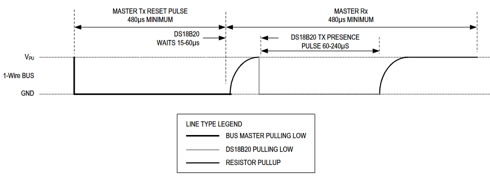
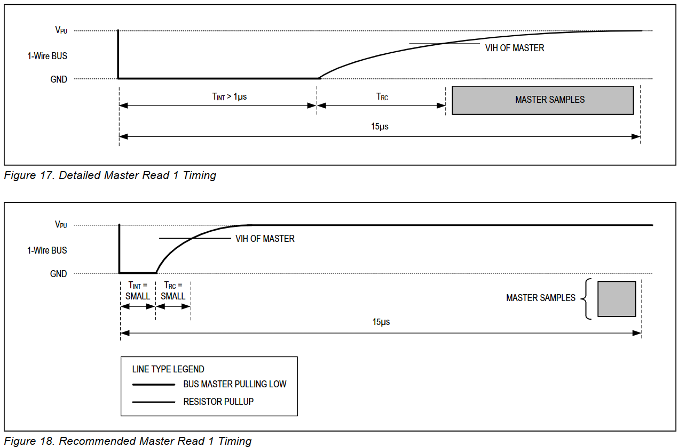
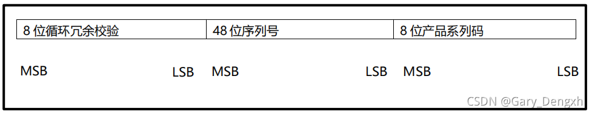

# 1-Wire总线
## 1-Wire总线介绍
1. 简介
 1-Wire总线系统即一个总线主设备控制一个或多个从设备。DS18B20始终是一个从设备。当总线上只有一个从设备时，此系统被称为“单节点”系统；当总线上有多个从设备连接时，此系统被称之为“多节点”系统。
 1-Wire总线上所有的命令或者数据的发送送都是遵循低位先发送的原则
 1-Wire总线系统的描述将会分成三个部分：硬件配置，事件序列和1-Wire总线信号（信号定义和时序）
2. 硬件配置
   - 1-Wire总线被定义为仅有一根数据线。每个设备（主设备或从设备）通过一个漏极开路或3态门引脚连接至数据线上。这就允许每个设备“释放”数据线，当设备没有传递数据的时其他设备可以有效地使用数据线。DS18B20的1-Wire总线接口（DQ引脚）是其内部电路组成的漏极开路（如图所示）
   - 1-Wire总线需要一个5kΩ左右的外部上拉电阻；因此，1-Wire总线在闲置情况下是高电平。如果因为任何原因一个事件需要被取消，且该事件要重新开始则该总线必须先进入闲置状态。`如果总线被拉低超过480uS，则该总线上的所有设备都会复位`
   - <br>
3. 事件序列
   - 访问DS18B20的事件序列如下所示：
    - 第一步：初始化
    - 第二步：ROM命令（紧跟任何数据交换请求）
    - 第三步：DS18B20功能命令（紧跟任何数据交换请求）
   - 每次对DS18B20的访问都必须遵循这样的步骤来进行，如果这些步骤中的任何一个丢失或者没有执行，则DS18B20将不会响应。除了ROM搜索命令[F0h]和报警搜索命令[ECh]之外。当执行完这些ROM命令之后，主设备必须回到上述步骤中的第一步。 
4. ROM命令 
   - 当总线上的主设备检测到了存在脉冲后，就可以执行ROM命令。这些命令是对每个设备独一无二的64位ROM编码进行操作的，当总线上连接有多个设备时，可以通过这些命令识别各个设备。这些命令同时也可以使主设备确定该总线上有多少个什么类型的设备或者有温度报警信号的设备。总共包含有5种ROM命令，每个命令的长度都是8 Bit。主设备在执行DS18B20功能命令之前必须先执行一个适当的ROM命令.ROM命令的执行流程图见[DS18B20](DS18B20.pdf)中的"Figure 13"
   - 搜索ROM[F0h]
      - 用于确定接在总线上DS18B20的个数和识别所有的64位ROM序列号。当系统开始工作，总线主机可能不知道总线上的器件个数或者不知道其64位ROM序列号，搜索命令用于识别所有连接于总线上的64位ROM序列号。如果仅有一个从设备在该总线上，更加简单的读取ROM命令（33H）可以代替搜索ROM的过程。
   - 读取ROM[33h]
     - 该命令在总线上仅有一个从设备时才能使用。该命令使得总线上的主设备不需要搜索ROM命令过程就可以读取从设备的64位ROM编码。当总线上有超过一个从设备时，若再发送该命令，则当所有从设备都会回应时，将会引起数据冲突。
   - 匹配ROM[55h]
     - 该匹配ROM命令之后跟随发送64位的ROM编码使得总线上的主设备能够匹配特定的从设备。只有完全匹配该64位ROM编码的从设备才会响应总线上的主设备发出的功能命令；总线上的其他从设备将会等待下下一个复位脉冲。
   - 跳过ROM[CCh]
     - 主设备可以使用该命令来同时向总线上的所有从设备发送不要发送任何的ROM编码命令。例如，主设备通过向总线上所有的DS18B20发送跳过ROM命令后再发送温度转换[44h]命令，则所有设备将会同时执行温度转。
     - 需要注意的是，当总线上仅有一个从设备时，读取暂存寄存器[BEh]命令后面可以跟随跳过ROM命令。在这种情况下，主设备可以读取从设备中的数据而不发送64位ROM编码。当总线上有多个从设备时，若在跳过ROM命令后再发送读取暂存寄存器命令，则所有的从设备将会同时开始传送数据而导致总线上的数据冲突。
   - 警报搜索[ECh]
     - 该命令的操作与跳过ROM命令基本相同，但是不同的是只有警报标志置位的从设备才会响应。该命令使得主设备确定在最近一次温度转换期间是否有DS18B20有温度报警。当所有的报警搜索命令循环执行后，总线上的主设备必须回到事件序列中的第一步（初始化）。详见“操作报警信号”章节。
5. DS18B20功能命令
   - 当总线上的主设备通过ROM命令确定了哪个DS18B20能够进行通信时，主设备可以向其中一个DS18B20发送功能命令。这些命令使得主设备可以向DS18B20的暂存寄存器写入或者读出数据，初始化温度转换及定义供电模式。DS18B20的功能命令在下面详细描述，下图中总结及流程图见[DS18B20](DS18B20.pdf)中的"Figure 14"。<br>
   - 温度转换[44h]
     - 该命令为初始化单次温度转换。温度转换完后，温度转换的数据存储在暂存寄存器的2个字节长度的温度寄存器中，之后DS18B20恢复到低功耗的闲置状态。如果该设备是采用的“寄生电源”供电模式，在该命令执行10uS（最大）后主设备在温度转换期间必须强制拉高数据线（“DS18B20的供电”章节所描述）。如果该设备是采用的外部供电模式，主设备在温度转换命令之后可以执行读取数据时序，若DS18B20正在进行温度转换则会响应0电平，温度转换完成则响应1电平。在“寄生电源”供电模式下，因为在整个温度转换期间总线都是强制拉高的状态，故不会有上述响应。
   - 写入暂存寄存器[4Eh]
     - 该命令使得主设备向DS18B20的暂存寄存器写入3个字节的数据。第一个字节的数据写入TH寄存器（暂存寄存器的 Byte 2），第二个字节的数据写入TL寄存器（Byte 3），第三个字节的数据写入配置寄存器（Byte 4）。所有的数据必须是以低位先发的原则。所有的三个字节的数据在写入之前主设备必须先对从设备复位，否则数据将会损坏。
   - 读取暂存寄存器[BEh]
     - 该命令使得主设备可以读取暂存寄存器中存储的值。数据从Byte 0的低位开始传送直到第9个字节（Byte 8 - CRC）读取完毕。主设备若只需要暂存寄存器中的部分数据，则可以在读取数据中通过复位来终止。
   - 拷贝暂存寄存器[48h]
     - 该命令为将暂存寄存器中的TH、TL及配置寄存器（Byte 2，Byte 3和Byte 4）的值拷贝至EEPROM中。如果该设备采用的“寄生电源”供电模式，在该命令发送后10us（最大）内主设备必须强制拉高1-Wire总线超过10ms。如“DS18B20的供电”章节中详述。
   - 召回EEPROM[B8h]
     - 该命令将温度报警触发值（TH和TL）及配置寄存器的数据从EEPROM中召回至暂存寄存器中的Byte 2，Byte 3和Byte4中。主设备可以在召回EEPROM命令之后执行读取数据时序，若DS18B20正在进行召回EEPROM则会响应0电平，召回EEPROM完成则响应1电平。召回数据操作在上电初始化后会自动执行一次，所以设备在上电期间暂存寄存器中一直会有有效的数据。
   - 读取供电模式[B4h]
     - 主设备通过执行该命令之后再执行读取数据时序来确定总线上的DS18B20是否是由“寄生电源”供电。在读取数据时序中，“寄生电源”供电的DS18B20将会拉低总线，外部电源独立供电模式的DS18B20则会释放总线让其保持在高电平。更多详细请参阅“DS18B20的供电”章节
## 1-Wire总线信号
 DS18B20采用严谨的1-Wire总线通信协议来保证数据的完整性。该协议定义多个信号形式：复位脉冲，存在脉冲，写0，写1，读0，读1。主设备执行除了存在脉冲外的所有其他信号
1. 初始化程序—复位和存在脉冲
   - 与DS18B20所有的通信都是由初始化序列开始的，该序列包括从主设备发出的复位脉冲及从DS18B20响应的存在脉冲组成。如图所示。当DS18B20响应复位信号的存在脉冲后，则其向主设备表明其在该总线上，并且已经做好操作命令。
   - 在初始化序列期间，总线上的主设备通过拉低1-Wire总线超过480us来发送（TX）复位脉冲。之后主设备释放总线而进入接收模式（RX）。当总线释放后，5kΩ左右的上拉电阻将1-Wire总线拉至高电平。当DS18B20检测到该上升边沿信号后，其等待15us至60us后通过将1-Wire总线拉低60us至240us来实现发送一个存在脉冲
   - 
2. 读/写时段
   - 主设备通过写时段向DS18B20中写入数据，通过读时段从DS18B20中读取数据。1-Wire总线上每一个读写时段只能传送一个位的数
   - 写时段:
     - 写时段有两种情况：“写1”时段和“写0”时段。主设备通过写1时段来向DS18B20中写入逻辑1以及通过写0时段来向DS18B20中写入逻辑0。每个写时段最小必须有60us的持续时间且独立的写时段间至少有1us的恢复时间。两个写时段都是由主设备通过将1-Wire总线拉低来进行初始化.如下图
     - 为了形成写1时段，在将1-Wire总线拉低后，主设备必须在15us之内释放总线。当总线释放后，5kΩ的上拉电阻将总线拉至高。
     - 为了形成写0时段，在将1-Wire总线拉低后，在整个时段期间主设备必须一直拉低总线（至少60us）
     - 
   - 读时段
     - 仅在读时段期间DS18B20才能向主设备传送数据。因此，主设备在执行完读暂存寄存器[BEh]或读取供电模式[B4h]后，必须及时地生成读时段，这样DS18B20才能提供所需的数据。此外，主设备可以在执行完转换温度[44h]或拷贝EEPROM[B8h]命令后生成读时段，以便获得在“DS18B20功能命令”章节中提到的操作信息
     - 每个读时段最小必须有60us的持续时间且独立的写时段间至少有1us的恢复时间。
     - 读时段通过主设备将总线拉低超过1us再释放总线来实现初始化（见下图）。当主设备初始化完读时段后，DS18B20将会向总线发送0或者1。DS18B20通过将总线拉至高来发送逻辑1，将总线拉至低来发送逻辑0。当发送完0后，DS18B20将会释放总线，则通过上拉电阻该总线将会恢复到高电平的闲置状态。从DS18B20中输出的数据在初始化读时序后仅有15us的有效时间。因此，主设备在开始改读时段后的15us之内必须释放总线，并且对总线进行采样
     - 
     - 读时段中的Tint，Trc及Tsample必须小于15us。主设备必须在读时段开始15us时间内采样

## 18B20
 DS18B20是一款高精度单总线温度测量芯片，温度测量范围-55℃到+125℃。相比于了LM35和PT100等温度传感器使用更方便，硬件更简单。用户可自主选择电源供电模式和寄生供电模式。单总线接口允许多个设备挂在同一总线，该特性使得DS18B20非常便于不是分布型温度采集系统。

 每一个DS18B20器件都有一个唯一的64位编码。在一些要求具有唯一设备ID的应用中，我们可以采用该编码作为设备的唯一ID用于对相同的设备进行区别。
 <br><br>
 <br>PS：特别注意图中的4.7k电阻，硬件中一定要将DQ引脚通过4.7k电阻上拉到VDD。
 <br>
 <br><br>
 DS18B20两种供电模式（注意4.7k上拉电阻）

## 主要指令介绍
 DS18B20的指令分为ROM操作指令和功能指令，具体指令见DS18B20数据手册，在此主要对本文涉及到的指令进行见到介绍。
 1. ROM操作指令
    1. Read ROM[33h]
     - 这个指令允许总线主机读到 DS18B20 的 64 位 ROM 编码。只有在总线上存在单只 DS18B20 的时候才能使用这个指令。如果总线上有不止一个从机，当所有从机试图同时响应时就会发生数据冲突。
    2. Skip ROM[CCh]
     - 主机通过该指令同时寻址总线上所有设备而无需发送任何 ROM 编码。例如，主机可以 令总线上所有 DS18B20 同时执行温度转换，只需 发布 Skip ROM 指令跟随一个 Convert T [44h]指令。需要注意Read Scratchpad [BEh] 指令只能 在单一从设备挂在总线上时才能跟随 Skip ROM 指令。这种情况下，通过允许主机无需发送 64 位设备ROM 编码而读取从设备，可以节约时间。如果总线上有超过一个从设备，一个 Skip ROM指令跟随一个 Read Scratchpad 指令会导致数据冲突，因为多个设备会试图同时传送数据。
 2. 功能指令 
    1. CONVERT T[44h]
     - 该指令启动一次温度转换，转换之后，采集的热数据存储在暂存器中的 前2 字节中，然后DS18B20 返回低功耗空闲状态。如果设备使用于寄生电源模式下，本指令发布后最多10us之内，主机必须在整个温度转换期间（tCONV）启动单总线的强上拉，如给 DS18B20 供电章节所述。如果 DS18B20 由外部电源供电，主机可以在 Convert T 指令后发布读时隙，然后DS18B20会回复0或者1表示温度转换正在进行中或者已完成。在寄生电源模式这个通知技术不能应用，因为总线在整个转换过程中被强上拉到高电平。
    2. READ SCRATCHPAD [BEh]
     - 该指令允许主机读取暂存器中的内容。数据传输始于字节 0 的最低位并延续遍历暂存器直到第9个字节（字节 8-循环冗余验证码）被读取。如果只需要暂存器中的部分数据，主机可以随时发布一个复位信号终止读取。
## 器件操作时序
 访问DS18B20的传输序列如下：
 - 步骤1：初始化
   - 通过单总线的所有执行都是从一个初始化序列开始，初始化序列包括一个由总线控制器发出的复位脉冲和跟随其后由从机发出的存在脉冲。 存在脉冲让总线主机知道从设备在总线上且已经准备好运行
   - 
   - ```c
       uint8_t init_DS18(void)
       {
           unsigned int init_state = 0;
           DQ_OUT_MODE;
           DQ_LOW;
           ets_delay_us(480);
           DQ_HIGH;
        
           DQ_IN_MODE;//设置输入模式，就是高阻态，此时上拉电阻提供高电平
           ets_delay_us(70);
           init_state = (gpio_get_level(DQ_PIN) == 0);
        
           ets_delay_us(410);
           INFO("init_state:%d", init_state);
           return init_state;
       }
     ```
 - 步骤2：ROM指令（33H,读取器件ID编码）
   -  
   - ```c
      uint64_t ds18b20_get_id(void)
      {
          unsigned char check;
          uint64_t ser_id = 0;
          uint8_t serial_id[8];
          check = init_DS18();  // DS18B20初始化
          if (check == 1) {
              DS18_Write_byte(0x33);  // Read ROM指令

              serial_id[0] = DS18_Read_byte();
              serial_id[1] = DS18_Read_byte();
              serial_id[2] = DS18_Read_byte();
              serial_id[3] = DS18_Read_byte();
              serial_id[4] = DS18_Read_byte();
              serial_id[5] = DS18_Read_byte();
              serial_id[6] = DS18_Read_byte();
              serial_id[7] = DS18_Read_byte();
              // 转换为64位
              ser_id = (serial_id[7] * 256) + serial_id[6];
              ser_id = (ser_id * 256) + serial_id[5];
              ser_id = (ser_id * 256) + serial_id[4];
              ser_id = (ser_id * 256) + serial_id[3];
              ser_id = (ser_id * 256) + serial_id[2];
              ser_id = (ser_id * 256) + serial_id[1];
              ser_id = (ser_id * 256) + serial_id[0];
              return ser_id;
          } else {
              return 0;
          }
      }
     ```
 - 步骤3：读取温度值,一般读温度需要先转换温度
   - DS18B20存储器的结构
   - 
   - 由图可知我们想要获取温度只需要对暂存器的第一和第二字节进行读取就可以了
   - ```c
       init_DS18()
       DS18_Write_byte(SKIP_ROM);
       DS18_Write_byte(READ_temp);
       tempLow = DS18_Read_byte();
       tempHigh = DS18_Read_byte();
     ```
 - PS：每次访问DS18B20都必须确保这个顺序，任何步骤缺失或者顺序不对都会导致器件不响应。
## DS18B20的控制流程
 - 根据DS18B20的通信协议，DS18B20只能作为从机，而单片机系统作为主机，单片机控制DS18B20完成一次温度转换必须经过3个步骤：复位、发送ROM指令、发送RAM指令。
 - 每次对DS18B20的操作都要进行以上三个步骤:复位、发送ROM指令、发送RAM指令
 - 复位：单片机将数据线拉低至少480uS，然后释放数据线，等待15-60uS让DS18B20接收信号，DS18B20接收到信号后，会把数据线拉低60-240uS，主机检测到数据线被拉低后标识复位成功；
 - 发送ROM指令：ROM指令表示主机对系统上所接的全部DS18B20进行寻址，以确定对那一个DS18B20进行操作，或者是读取某个DS18B20的ROM序列号。
 - 发送RAM指令：RAM指令用于单片机对DS18B20内部RAM进行操作，如读取寄存器的值，或者设置寄存器的值。
 1. ROM操作命令：DS18B20采用一线通信接口。因为一线通信接口，必须在先完成ROM设定，否则记忆和控制功能将无法使用。一旦总线检测到从属器件的存在，它便可以发出器件ROM操作指令，所有ROM操作指令均为8位长度，主要提供以下功能命令：
    1. 读ROM（0X33H）：当总线上只有一个节点（器件）时，读此节点的64位序列号。如果总线上存在多于一个的节点，则此指令不能使用。
    2. ROM匹配（0X55H）：此命令后跟64位的ROM序列号，总线上只有与此序列号相同的DS18B20才会做出反应；该指令用于选中某个DS18B20，然后对该DS18B20进行读写操作。
    3. 搜索ROM（0XF0H）： 用于确定接在总线上DS18B20的个数和识别所有的64位ROM序列号。当系统开始工作，总线主机可能不知道总线上的器件个数或者不知道其64位ROM序列号，搜索命令用于识别所有连接于总线上的64位ROM序列号。
    4. 跳过ROM（0XCCH）： 此指令只适合于总线上只有一个节点；该命令通过允许总线主机不提供64位ROM序列号而直接访问RAM，以节省操作时间。
    5. 报警检查（0XECH）：此指令与搜索ROM指令基本相同，差别在于只有温度超过设定的上限或者下限值的DS18B20才会作出响应。只要DS18B20一上电，告警条件就保持在设置状态，直到另一次温度测量显示出非告警值，或者改变TH或TL的设置使得测量值再一次位于允许的范围之内。储存在EEPROM内的触发器用于告警。
2. RAM指令
   1. 温度转换（指令码0X44H）:启动DS18B20进行温度转换，结果存入内部RAM。
   2. 读暂存器（指令码0XBEH）：读暂存器9个字节内容，此指令从RAM的第1个字节（字节0）开始读取，直到九个字节（字节8，CRC值）被读出为止。如果不需要读出所有字节的内容，那么主机可以在任何时候发出复位信号以中止读操作。
   3. 写暂存器（指令码0X4EH）： 将上下限温度报警值和配置数据写入到RAM的2、3、4字节，此命令后跟需要些入到这三个字节的数据。
   4. 复制暂存器（指令码0X48H）：把暂存器的2、3、4字节复制到EEPROM中，用以掉电保存。
   5. 重新调E2RAM（指令码0XB8H）：把EEROM中的温度上下限及配置字节恢复到RAM的2、3、4字节，用以上电后恢复以前保存的报警值及配置字节。
   6. 读电源供电方式（指令码0XB4H）：启动DS18B20发送电源供电方式的信号给主CPU。对于在此命令送至DS18B20后所发出的第一次读出数据的时间片，器件都会给出其电源方式的信号。“0”表示寄生电源供电。“1”表示外部电源供电。

## 示例程序
```c
#include "string.h"

#define LOG_COLOR_BLACK   "30"
#define LOG_COLOR_RED     "31"
#define LOG_COLOR_GREEN   "32"
#define LOG_COLOR_BROWN   "33"
#define LOG_COLOR_BLUE    "34"
#define LOG_COLOR_PURPLE  "35"
#define LOG_COLOR_CYAN    "36"
#define LOG_COLOR(COLOR)  "\033[0;" COLOR "m"
#define LOG_RESET_COLOR   "\033[0m"

#define FILE_NAME(x) (strrchr(x,'/')?strrchr(x,'/')+1:x)  //获取文件名                      
#define INFO(format,...) do{ \
                        printf("%s:%s() " format "\n",FILE_NAME(__FILE__),__func__,##__VA_ARGS__); \
                        }while(0);
#define INFOI(format,...) do{ \
                        printf(LOG_COLOR(LOG_COLOR_GREEN) "%s:%s() " format"\n" LOG_RESET_COLOR ,FILE_NAME(__FILE__),__func__,##__VA_ARGS__); \
                        }while(0);


#define DQ_PIN 16    //定义引脚
#define DQ_HIGH gpio_set_level(DQ_PIN, 1)    //设置高电平
#define DQ_LOW gpio_set_level(DQ_PIN, 0)    //设置低电平
#define DQ_GET gpio_get_level(DQ_PIN)    //读取电平
#define DQ_OUT_MODE gpio_set_direction(DQ_PIN, GPIO_MODE_OUTPUT)    //设置输出模式
#define DQ_IN_MODE gpio_set_direction(DQ_PIN, GPIO_MODE_INPUT)    //设置输入模式
 
#define SKIP_ROM 0xCC    //跳过ROM操作
#define TRANSFORMATION_TEMP 0x44    //转换温度操作
#define READ_temp 0xBE    //读数据操作


/*************************初始化操作*************************/
uint8_t init_DS18(void)
{
    unsigned int init_state = 0;
    DQ_OUT_MODE;
    DQ_LOW;
    ets_delay_us(480);
    DQ_HIGH;
 
    DQ_IN_MODE;//设置输入模式，就是高阻态，此时上拉电阻提供高电平
    ets_delay_us(70);
    init_state = (gpio_get_level(DQ_PIN) == 0);
 
    ets_delay_us(410);
    INFO("init_state:%d", init_state);
    return init_state;
}
/*************************写位操作*************************/
void DS18_Write_bit(uint8_t bit)
{

    if (bit & 1)/*******写1操作********/
    {
        DQ_OUT_MODE;
        DQ_LOW;
        ets_delay_us(6);
        DQ_IN_MODE;//设置输入模式，就是高阻态，此时上拉电阻提供高电平
        ets_delay_us(64);
    }else{/*******写0操作********/
        DQ_OUT_MODE;
        DQ_LOW;
        ets_delay_us(60);
        DQ_IN_MODE;//设置输入模式，就是高阻态，此时上拉电阻提供高电平
        ets_delay_us(10);
    }
}
/*************************读位操作*************************/
uint8_t DS18_Read_bit(void)
{
    uint8_t bit = 0;
    DQ_OUT_MODE;
    // 拉低电平，开始读取数据 
    DQ_LOW;
    ets_delay_us(6);
    DQ_IN_MODE;//设置输入数据
    ets_delay_us(9);
    bit = DQ_GET;
    ets_delay_us(55);
 
    return bit;
}
/*************************写数据操作*************************/
void DS18_Write_byte(const uint8_t data)
{
    uint8_t i;
    uint8_t tmp = data;
    DQ_OUT_MODE;
    for (i = 0; i < 8; i++)/*******写8次，一次为一位********/
    {
        DS18_Write_bit(tmp & 0x01);//写入一位数据
        tmp >>= 1; //每写一位数据，就向右移一位，保证8位数据都能写入
    }
    //ets_delay_us(100);
}
/*************************读数据操作*************************/
uint8_t DS18_Read_byte(void)
{
    uint8_t i;
    uint8_t data = 0;
/*******读取8次，一次为一位********/
    for (i = 0; i < 8; i++)
    {
        if (DS18_Read_bit())
            data |= 0x01 << i;//读取到1就会向左移相应的位数
        ets_delay_us(15);
    }
    return data;
}
// Returns serial id from sensor
/*
8bit CRC  48bit serial id   8bit product number
MSB  LSB  MSB         LSB   MSB             LSB
*/
uint64_t ds18b20_get_id(void)
{
    uint64_t ser_id = 0;
    uint8_t serial_id[8];
    serial_id[0] = DS18_Read_byte();
    serial_id[1] = DS18_Read_byte();
    serial_id[2] = DS18_Read_byte();
    serial_id[3] = DS18_Read_byte();
    serial_id[4] = DS18_Read_byte();
    serial_id[5] = DS18_Read_byte();
    serial_id[6] = DS18_Read_byte();
    serial_id[7] = DS18_Read_byte();
    // 转换为64位
    ser_id = (serial_id[7] * 256) + serial_id[6];
    ser_id = (ser_id * 256) + serial_id[5];
    ser_id = (ser_id * 256) + serial_id[4];
    ser_id = (ser_id * 256) + serial_id[3];
    ser_id = (ser_id * 256) + serial_id[2];
    ser_id = (ser_id * 256) + serial_id[1];
    ser_id = (ser_id * 256) + serial_id[0];
    return ser_id;
}
void app_main(void)
{
    gpio_set_direction(DQ_PIN, GPIO_MODE_OUTPUT);

    while (1) {
        uint8_t tempLow, tempHigh;
        float temp = 0;
        /*****读取ID*/
        if (init_DS18()){
            DS18_Write_byte(0x33);  // Read ROM指令
            INFO("id:%lld", ds18b20_get_id());
        }
        /*****温度转换********/
        if (init_DS18()) {
            DS18_Write_byte(SKIP_ROM);
            DS18_Write_byte(TRANSFORMATION_TEMP);
            vTaskDelay(pdMS_TO_TICKS(10));
        }
        /*******读取温度******/
        if (init_DS18()) {
            DS18_Write_byte(SKIP_ROM);
            DS18_Write_byte(READ_temp);
            tempLow = DS18_Read_byte();
            tempHigh = DS18_Read_byte();

            /*****把数据转换成十进制***/
            temp = (float)(tempLow + (tempHigh * 256)) / 16;
            INFOI("temp=%.2f", temp); 
        }
        vTaskDelay(2000 / portTICK_PERIOD_MS);
    }
}
```