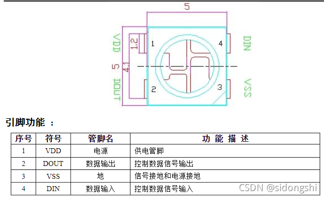
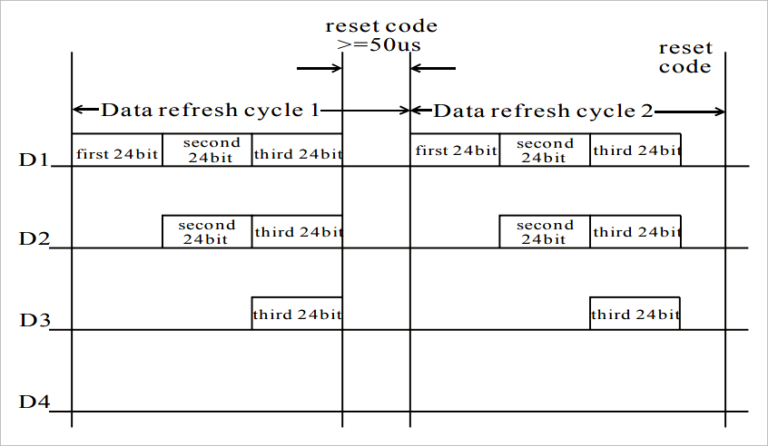

# ESP32-C3物联网工程开发实战
 01 准备篇
第1章 浅谈物联网
1.1 物联网的体系结构
1.2 物联网应用之智能家居
第2章 物联网工程项目的介绍和实战
2.1 典型的物联网工程项目介绍
2.2 实战：智能照明工程
2.3 本章总结
第3章 ESP RainMaker介绍
3.1 什么是ESP RainMaker
3.2 ESP RainMaker的实现原理
3.3 实战：ESP RainMaker开发要点
3.4 ESP RainMaker功能摘要
3.5 本章总结
第4章 开发环境的搭建与详解
4.1 ESP-IDF概述
4.2 ESP-IDF开发环境安装详解
4.3 ESP-IDF编译系统详解
4.4 实战：Blink 示例程序编译
4.5 本章总结
02 硬件与驱动开发篇
第5章 ESP32-C3的智能照明产品的硬件设计
5.1 智能照明产品的功能及组成
5.2 ESP32-C3最小硬件系统设计
5.3 实战：使用ESP32-C3构建智能照明系统
5.4 本章总结
第6章 驱动开发
6.1 驱动开发过程
6.2 ESP32-C3外设应用
6.3 LED驱动基础
6.4 LED调光驱动开发
6.5 实战：智能照明工程中的驱动开发
6.6 本章总结
03 无线通信与控制篇
第7章 Wi-Fi网络配置和连接
7.1 Wi-Fi基础知识
7.2 蓝牙基础知识
7.3 Wi-Fi配网
7.4 Wi-Fi编程
7.5 实战：智能照明工程中实现Wi-Fi配置
7.6 本章总结
第8章 设备的本地控制
8.1 本地控制的介绍
8.2 常见的本地发现方法
8.3 常见的本地数据通信协议
8.4 数据安全性的保证
8.5 实战：基于ESP-IDF组件快速实现智能灯本地控制模块
8.6 本章总结
第9章 设备的云端控制
9.1 远程控制的介绍
9.2 常见的云端数据通信协议
9.3 保证MQTT数据安全性
9.4 实战：通过ESP RainMaker实现智能照明工程的远程控制
9.5 本章总结
第10章 智能手机App开发
10.1 智能手机App开发技术介绍
10.2 新建智能手机App项目
10.3 App功能需求分析
10.4 用户登录注册功能的开发
10.5 设备配网功能的开发
10.6 设备控制功能的开发
10.7 定时功能和用户中心功能的开发
10.8 本章总结
第11章 固件更新与版本管理
11.1 固件更新
11.2 固件版本管理
11.3 实战：OTA升级使用示例
11.4 本章总结
04 优化与量产篇
第12章 电源管理和低功耗优化
12.1 ESP32-C3电源管理
12.2 ESP32-C3低功耗模式
12.3 电源管理和低功耗调试
12.4 实战：在智能照明工程中添加电源管理
12.5 本章总结
第13章 增强设备的安全功能
13.1 物联网设备数据安全概述
13.2 数据完整性保护
13.3 数据机密性保护
13.4 数据合法性的保护
13.5 实战：在量产中批量使用安全功能
13.6 本章总结
第14章 量产的固件烧录和测试
14.1 量产固件烧录
14.2 量产测试
14.3 实战：智能照明工程中的量产数据
14.4 本章总结
第15章 ESP Insights远程监察平台
15.1 ESP Insights组件的简介
15.2 ESP Insights组件的使用
15.3 实战：基于智能灯示例使用ESP Insights组件
15.4 本章总结

# ESP32-C3入门教程(https://zhuanlan.zhihu.com/p/549291665)
## 一.环境篇
 1. 简单介绍及硬件准备
    * 一、ESP32-C3简单介绍
        2.4 GHz Wi-Fi
        低功耗蓝牙
        高性能 32 位 RISC-V 单核处理器
        多种外设
        内置安全硬件
    * 二、开发板
        ESP32-C3-DevKitM-1(https://docs.espressif.com/projects/esp-idf/zh_CN/latest/esp32c3/hw-reference/esp32c3/user-guide-devkitm-1.html)
    * 三、开发板主要组件
    * 四、开发板原理图
    * 五、必备硬件
        ESP32-C3-DevKitM-1
        USB 2.0 数据线（标准 A 型转 Micro-B 型）
        电脑 （Windows、Linux 或 macOS）
    * 六、参考
 2. Windows开发环境准备
    * 一、注意事项
        请注意 ESP-IDF和ESP-IDF工具的安装路径不能超过90个字符。
        Python或ESP-IDF的安装路径中一定不能包含空格或括号。
        除非操作系统配置为支持 Unicode UTF-8，否则 Python或ESP-IDF的安装路径中也不能包括特殊字符（非 ASCII 码字符、中文字符）
    * 二、下载安装包
        ESP-IDF Windows Installer Download(https://dl.espressif.cn/dl/esp-idf/?idf=4.4)
    * 三、安装步骤
        下载离线安装工具 esp-idf-tools-setup-offline-2.5.exe
        根据官方公告，离线安装包自带ESP-IDF-V4.2和ESP-IDF-V4.11版本，大部分数据(python,git,esp-id,tool-chain )可离线安装，最后部分软件还是需要联网安装，因此安装时还是要有网络连接才能完成安装。
        运行 esp-idf-tools-setup-ofline-2.5.exe
    * 四、构建工程
        1. 用idf.py create-project filename创建工程
        2. 进入刚刚创建好的工程下，配置目标芯片，
                idf.py set-target esp32
        3. 使用idf.py menuconfig
        4. 接着就可以写代码然后用idf.py build 编译
    * 五、报错处理
 3. VS Code 快速入门 
 4. Flash Download Tools的使用
    * 一、前文
        开发人员使用VS Code IDE就够了，没毛病。
        但如果是测试、客户等其他人员，他们需要更新固件，总不能让他们安装VS Code IDE吧！
        所以这就需要使用乐鑫科技提供的Flash下载工具
    * 二、烧录下载
        https://www.espressif.com.cn/zh-hans/support/download/other-tools
    * 三、下载
        选择对应芯片，ESP32C3
        选择对应bin文件，并输入这个bin文件需要烧录的地址
 5. ESP-IDF构建系统(https://docs.espressif.com/projects/esp-idf/zh_CN/latest/esp32/api-guides/build-system.html)
    * 概述
        一个 ESP-IDF 项目可以看作是多个不同组件的集合，例如一个显示当前湿度的网页服务器会包含以下组件：
            ESP-IDF 基础库，包括 libc、ROM bindings 等
            Wi-Fi 驱动
            TCP/IP 协议栈
            FreeRTOS 操作系统
            网页服务器
            湿度传感器的驱动
            负责将上述组件整合到一起的主程序
        ESP-IDF 可以显式地指定和配置每个组件。在构建项目的时候，构建系统会前往 ESP-IDF 目录、项目目录和用户自定义组件目录（可选）中查找所有组件，允许用户通过文本菜单系统配置 ESP-IDF 项目中用到的每个组件。在所有组件配置结束后，构建系统开始编译整个项目
    * 概念
        1. 项目： 特指一个目录，其中包含了构建可执行应用程序所需的全部文件和配置，以及其他支持型文件，例如分区表、数据/文件系统分区和引导程序。
        2. 项目配置： 保存在项目根目录下名为 sdkconfig 的文件中，可以通过 idf.py menuconfig 进行修改，且一个项目只能包含一个项目配置。
        3. 应用程序： 是由 ESP-IDF 构建得到的可执行文件。一个项目通常会构建两个应用程序：项目应用程序（可执行的主文件，即用户自定义的固件）和引导程序（启动并初始化项目应用程序）。
        4. 组件： 是模块化且独立的代码，会被编译成静态库（.a 文件）并链接到应用程序。部分组件由 ESP-IDF 官方提供，其他组件则来源于其它开源项目。
        5. 目标： 特指运行构建后应用程序的硬件设备。运行 idf.py –list-targets 可以查看当前 ESP-IDF 版本中支持目标的完整列表。
    * 使用构建系统
        idf.py 命令行工具提供了一个前端，可以帮助您轻松管理项目的构建过程，它管理了以下工具：
            CMake，配置待构建的项目
            Ninja，用于构建项目
            esptool.py，烧录目标硬件设备
 6. ESP-IDF构建自定义组件模板(components/CMakeLists)
    * 工程结构
        myProject/
             - CMakeLists.txt
             - sdkconfig
             - components/ - component1/ - CMakeLists.txt
                                         - Kconfig
                                         - src1.c
                           - component2/ - CMakeLists.txt
                                         - Kconfig
                                         - src1.c
                                         - include/ - component2.h
             - main/       - CMakeLists.txt
                           - src1.c
                           - src2.c

             - build/
    * esp32标准树结构如上所示，只需按照类似结构创建我们的工程即可。
        “components” 目录中包含了项目的部分自定义组件，并不是每个项目都需要这种自定义组件，但它有助于构建可复用的代码或者导入第三方（不属于 ESP-IDF）的组件，或者也可以在顶层 CMakeLists.txt 中设置 EXTRA_COMPONENT_DIRS 变量以查找其他指定位置处的组件。
        “main” 目录是一个特殊的组件，它包含项目本身的源代码。”main” 是默认名称，CMake 变量 COMPONENT_DIRS 默认包含此组件，但您可以修改此变量。
    * 创建组件：
        ①idf.py create-compoent name:在当前目录下创建一个组件。
        ②idf.py -C components create-component my_component：在组件下创建组件。
        具体参考ESP32官网，API指南，构建系统章节。
    * 创建自己的组件
        ①在工程创建一个文件夹用于存放自己的组件,例如，我的存放组件的文件夹是my_com
            my_com\bsp
                include
                src
                CMakeLists.txt
                componens.mk
        ②创建一个bsp的组件，在组件中，include用于存放.h头文件，src用于存放.c文件
        ③创建一个components.mk文件用于指明路径
            COMPONENT_ADD_INCLUDEDIRS := include
            COMPONENT_SRCDIRS := src
        ④在CMakeLists.txt文件中注册头文件路径和.c文件
            set(my_com "src/lp5018.c" "led.c")
            idf_componet_register(SRC "${my_com}" INCLUDE_DIRS "include")
    * 模块化文件处理：
        ①在main目录下创建inc、src文件分别存放.h、.c文件
            然后在main目录下的CMakeLists.txt文件夹中
                idf_component_register(SRCS "./src/mygpio.c"
                                "./src/mytimer.c"
                        INCLUDE_DIRS "."
                                    "./inc")
            在SRCS “加入自己的路径下的.c文件”
            在INCLUDE_DIRS “加入.h文件”
            注：…/标识上一级目录下，./表示本级目录
        ②在main目录外创建一个目录专门存放inc、src目录，以test目录为例子
            test
                inc
                    mygpio.h
                src
                    mypgio.c
                CMakeLists.txt
            CMakeLists.txt
            在test目录下CMakeLists.txt内容：
                idf_component_register(SRCS "./src/mygpio.c"
                            "./src/mytimer.c"
                    INCLUDE_DIRS "."
                                 "./inc")
            同时还需要更改在最外一层的CMakeLists.txt文件中添加一句话
                set(EXTRA_COMPONENT_DIRS ./test)：设置额外的组件导向，将CMake指向到test目录下寻找我们定义的.c、.h文件。（注意这个语句一定要加，不然CMake找不到路径）
 7. 固件大小优化Optimization Level及Log output
    * Optimization Level 编译器的优化程度   
        比较早期的时候，硬件资源是比较缺乏的。为了提高性能，开发编译器的大师们，都会对编译器(从c到汇编的编译过程)加上一定的优化策略。优化后的代码效率比较高，但是可读性比较差，且编译时间更长。 
        优化是指编译器一级的措施，与机器指令比较接近，所以很可能会导致硬件不兼容，与你代码理论上不相关的
    * 查看程序的占用情况：idf.py size-components
        Total sizes:
        DRAM .data size:   13012 bytes
        DRAM .bss  size:   17872 bytes
        Used static DRAM:   30884 bytes ( 149852 available, 17.1% used)
        Used static IRAM:   87397 bytes (  43675 available, 66.7% used)
            Flash code:  459267 bytes
            Flash rodata:   93000 bytes
        Total image size:~ 652676 bytes (.bin may be padded larger)
    * 优化 IRAM 内存方法,解决iram0_0_seg' overflowed
        (https://docs.espressif.com/projects/esp-idf/zh_CN/release-v4.4/esp32/api-guides/performance/ram-usage.html#minimizing-ram-usage)
        启用 menuconfig -> Compiler option -> Optimization Level -> Optimize for size (-Os) 选项
        禁用 mencuofnig -> Component config -> LWIP -> Enable LWIP IRAM optimization 选项
        禁用 menuconfig -> Component config -> Wi-Fi -> WiFi IRAM speed optimization 与 menuconfig -> Component config -> Wi-Fi -> WiFi RX IRAM speed optimization 选项
        使用以上几个优化后,以下程序的占用情况
        Total sizes:
        DRAM .data size:   12848 bytes
        DRAM .bss  size:   17856 bytes
        Used static DRAM:   30704 bytes ( 150032 available, 17.0% used)
        Used static IRAM:   51463 bytes (  79609 available, 39.3% used)
            Flash code:  455419 bytes
            Flash rodata:   87856 bytes
        Total image size:~ 607586 bytes (.bin may be padded larger)
        IRAM 空间由 87397 bytes 降低到了 51463 bytes。节约了 30 KB 的 IRAM
    * Log
        ESP32默认预留了一个串口0用于调试和下载用途，通常该串口会输出大量日志信息：包括“Bootloader日志”和“Logging库的输出日志”两个部分。
        实际开发过程中我们有时希望关闭该串口0的日志输出，并将串口0复用为其它功能
        关闭Bootloader日志：idf.py menuconfig ->Bootloader config->Bootloader log verbosity
        关闭Logging日志：idf.py menuconfig->Component config->Log output->Default log verbosity
## 二.基础篇
 0. 应用程序的启动流程
    * 本文将会介绍 ESP32-C3 从上电到运行 app_main 函数中间所经历的步骤（即启动流程）。
    宏观上，该启动流程可以分为如下 3 个步骤：
      1. 一级引导程序 被固化在了 ESP32-C3 内部的 ROM 中，它会从 flash 的 0x0 偏移地址处加载二级引导程序至 RAM (IRAM & DRAM) 中。
      2. 二级引导程序 从 flash 中加载分区表和主程序镜像至内存中，主程序中包含了 RAM 段和通过 flash 高速缓存映射的只读段。
      3. 应用程序启动阶段 运行，这时CPU 和 RTOS 的调度器启动。
    * 一级引导程序
      SoC 复位后，CPU 会立即开始运行，执行所有的初始化操作。复位向量代码位于 ESP32-C3 芯片掩膜 ROM 处，且不能被修改。
      复位向量调用的启动代码会根据 GPIO_STRAP_REG 寄存器的值来确定 ESP32-C3 的启动模式，该寄存器保存着复位后 bootstrap 引脚的电平状态
    * 二级引导程序
      1. 在 ESP-IDF 中，存放在 flash 的 0x0 偏移地址处的二进制镜像就是二级引导程序。二级引导程序的源码可以在 ESP-IDF 的 components/bootloader 目录下找到。ESP-IDF 使用二级引导程序可以增加 flash 分区的灵活性（使用分区表），并且方便实现 flash 加密，安全引导和空中升级（OTA）等功能。
      2. 当一级引导程序校验并加载完二级引导程序后，它会从二进制镜像的头部找到二级引导程序的入口点，并跳转过去运行。
      3. 二级引导程序默认从 flash 的 0x8000 偏移地址处（可配置的值）读取分区表。请参考 分区表 获取详细信息。引导程序会寻找工厂分区和 OTA 应用程序分区。如果在分区表中找到了 OTA 应用程序分区，引导程序将查询 otadata 分区以确定应引导哪个分区。更多信息请参考 空中升级 (OTA)
      4. 对于选定的分区，二级引导程序将从 flash 逐段读取二进制镜像：
    * 应用程序启动阶段
      应用程序启动包含了从应用程序开始执行到 app_main 函数在主任务内部运行前的所有过程。可分为三个阶段：
        1. 硬件和基本 C 语言运行环境的端口初始化。
        2. 软件服务和 FreeRTOS 的系统初始化。
        3. 运行主任务并调用 app_main
    * 运行主任务
        在所有其他组件都初始化后，主任务会被创建，FreeRTOS 调度器开始运行。
        做完一些初始化任务后（需要启动调度器），主任务在固件中运行应用程序提供的函数 app_main。
        运行 app_main 的主任务有一个固定的 RTOS 优先级（比最小值高）和一个 可配置的堆栈大小。
        与普通的 FreeRTOS 任务（或嵌入式 C 的 main 函数）不同，app_main 任务可以返回。如果``app_main`` 函数返回，那么主任务将会被删除。系统将继续运行其他的 RTOS 任务。因此可以将 app_main 实现为一个创建其他应用任务然后返回的函数，或主应用任务本身
 1. Hello World
    1. 配置芯片型号: idf.py set-target esp32
    2. 配置:        idf.py menuconfig
    3. 编译:        idf.py build
    4. 烧写:        idf.py -p PORT [-b BAUD] flash
    5. 查看串口信息: idf.py -p PORT monitor 
 2. GPIO 输出/输入
    * GPIO基础
        1. ESP32-C3 一共22个GPIO口，其中 GPIO2、GPIO8、GPIO9决定着芯片的启动模式
        2. GPIO12-17 用于 SPI flash 和 PSRAM，不建议用作其他功能
        3. GPIO18 和 GPIO19 默认作为 USB-JTAG. 要把他们当做普通 GPIO，需要进行设置；
        4. 在深度睡眠模式下可以使用的GPIO口有 GPIO0-5
    * GPIO函数
        5. GPIO的函数:
            https://docs.espressif.com/projects/esp-idf/zh_CN/latest/esp32c3/api-reference/peripherals/gpio.html
        6. 头文件：#include "driver/gpio.h"
        7. 配置IO：
            * 方式1:esp_err_t gpio_config(const gpio_config_t *pGPIOConfig)
            配置GPIO的模式，上拉，下拉，中断触发类型
            ```示例
                gpio_config_t ioConfig = {
                    .pin_bit_mask = (1ull << 18)|(1ull << 19),
                    .mode = GPIO_MODE_OUTPUT,
                }
                //传入gpio_config_t指针
                gpio_config(&ioConfig);
            ```
            * 方式2:
                设置GPIO方向:gpio_set_direction(gpio_num_tgpio_num, gpio_mode_tmode)
                设置电平：gpio_set_level(gpio_num_t gpio_num, uint32_t level)
                读取电平：gpio_get_level(16);
                配置GPIO内部上下拉电阻：
                    gpio_set_pull_mode()
                    gpio_pullup_en()
                    gpio_pullup_dis()
                    gpio_pulldown_en()
                    gpio_pulldown_dis()
                恢复 GPIO 默认值：gpio_reset_pin()
        8. 简单使用:
           ```c
            gpio_reset_pin(4);
            gpio_set_direction(4, GPIO_MODE_OUTPUT);//GPIO作为输出
            gpio_set_level(4, 0);//输出低电平
           ```
    * 具体输入/输出/简单按键,详细见:"gpio.md"
 3. 实用的按键:按键的长按和短按
    * 具体见 "key.md"
 4. 基于LEDC(LED Control)实现PWM调光(占空比切换/渐变/频率切换)
    1. LED PWM控制器基础介绍
        1. 基本介绍(https://docs.espressif.com/projects/esp-idf/zh_CN/v4.3.2/esp32c3/api-reference/peripherals/ledc.html)
            LED PWM 控制器主要用于控制 LED，也可产生 PWM 信号用于其他设备的控制。该控制器有 8 路高速通道和 8 路低速通道，可以产生独立的波形来驱动 RGB LED 设备等。

            LED PWM 控制器的高速通道和低速通道均支持硬件渐变功能，可在无需 CPU 干预的情况下自动改变 PWM 信号的占空比，也可由软件改变 PWM 信号的占空比，实现亮度和颜色渐变。此外，低速通道在 Sleep 模式下仍可运行。
        2. PWM的基础知识
            <br><br>
           关于PWM的渐变，是通过改变Lpointn的值，开启了占空比渐变，Lpointn的值会在计数器溢出固定次数后（可配置）递增或递减（可配置），渐变值也可以配置：
           <br>
    2. 使用步骤
        1. 要让指定 LED PWM 控制器 高速模式或低速模式 通道运行，需进行如下配置：
            1. 配置定时器,指定PWM信号的频率和占空比分辨率。
               使用ledc_timer_config函数,主要是ledc_timer_config_t结构体
               ```c
               typedef struct {
                    ledc_mode_t speed_mode;                /*!< LEDC speed speed_mode, high-speed mode or low-speed mode */
                    ledc_timer_bit_t duty_resolution;      /*!< LEDC channel duty resolution */
                    ledc_timer_t  timer_num;               /*!< The timer source of channel (0 - 3) */
                    uint32_t freq_hz;                      /*!< LEDC timer frequency (Hz) */
                    ledc_clk_cfg_t clk_cfg;                /*!< Configure LEDC source clock.
                                                                For low speed channels and high speed channels, you can specify the source clock using LEDC_USE_REF_TICK, LEDC_USE_APB_CLK or LEDC_AUTO_CLK.
                                                                For low speed channels, you can also specify the source clock using LEDC_USE_RTC8M_CLK, in this case, all low speed channel's source clock must be RTC8M_CLK*/
                } ledc_timer_config_t;
               ```
               注意：PWM 频率越高，占空比分辨率越低，反之则越高。
               ```c
                ledc_timer_config_t ledc_timer;
                ledc_timer.duty_resolution = LEDC_TIMER_13_BIT;
                ledc_timer.freq_hz = 5000; // PWM信号频率,5kHz,占空比分辨率最大为13位
                ledc_timer.speed_mode = LEDC_LOW_SPEED_MODE;    // 定时器模式
                ledc_timer.timer_num = LEDC_HS_TIMER;            // 定时器序号
                ledc_timer.clk_cfg = LEDC_AUTO_CLK;

                ledc_timer_config(&ledc_timer);
               ```
            2. 配置通道 绑定定时器和输出 PWM 信号的 GPIO。
               使用ledc_channel_config，参数为ledc_channel_config_t结构体
                ```c
                typedef struct {
                    int gpio_num;                   /*!< the LEDC output gpio_num, if you want to use gpio16, gpio_num = 16 */
                    ledc_mode_t speed_mode;         /*!< LEDC speed speed_mode, high-speed mode or low-speed mode */
                    ledc_channel_t channel;         /*!< LEDC channel (0 - 7) */
                    ledc_intr_type_t intr_type;     /*!< configure interrupt, Fade interrupt enable  or Fade interrupt disable */
                    ledc_timer_t timer_sel;         /*!< Select the timer source of channel (0 - 3) */
                    uint32_t duty;                  /*!< LEDC channel duty, range is [0, (2**duty_resolution)] */
                    int hpoint;                     /*!< LEDC channel hpoint value, the max value is 0xfffff */
                } ledc_channel_config_t;

                ```
                ```c
                    ledc_channel_config_t ledc_channel[2] = {
                        {
                            .channel    = 1,
                            .duty       = 0,
                            .gpio_num   = 3,
                            .speed_mode = LEDC_LOW_SPEED_MODE,
                            .hpoint     = 0,
                            .timer_sel  = LEDC_TIMER_0
                        },
                        {
                            .channel    = 2,
                            .duty       = 0,
                            .gpio_num   = 4,
                            .speed_mode = LEDC_LOW_SPEED_MODE,
                            .hpoint     = 0,
                            .timer_sel  = LEDC_TIMER_0
                        }
                    };
                    ledc_channel_config(&ledc_channel[0]);
                    ledc_channel_config(&ledc_channel[1]);
                ```
               注意：ESP32-C3只有(0-5)6个通道
            3. 改变 PWM 信号 输出 PWM 信号来驱动 LED。可通过软件控制或使用硬件渐变功能来改变 LED 的亮度。
                ledc_set_duty(ledc_mode_t speed_mode, ledc_channel_t channel, uint32_t duty);  设置占空比
                ledc_update_duty(ledc_mode_t speed_mode, ledc_channel_t channel); 配置生效
                ledc_get_duty();    查看当前占空比
                硬件渐变：
                    ledc_fade_func_install(0);使能硬件渐变
                    ledc_set_fade_with_time()
                    ledc_set_fade_with_step()
                    ledc_set_fade();
                    ledc_fade_start(); 开启渐变
    3. PWM基础测试
        ```测试代码
            void app_main(void)
            {
                ledc_timer_config_t ledc_timer;
                ledc_timer.duty_resolution = LEDC_TIMER_13_BIT;
                ledc_timer.freq_hz = 5000; // PWM信号频率,5kHz,占空比分辨率最大为13位
                ledc_timer.speed_mode = LEDC_LOW_SPEED_MODE;    // 定时器模式
                ledc_timer.timer_num = LEDC_HS_TIMER;            // 定时器序号
                ledc_timer.clk_cfg = LEDC_AUTO_CLK;
                ledc_timer_config(&ledc_timer);

                ledc_channel_config_t ledc_channel[1] = {
                    {
                        .channel    = 1,
                        .duty       = 0,
                        .gpio_num   = 3,
                        .speed_mode = LEDC_LOW_SPEED_MODE,
                        .hpoint     = 0,
                        .timer_sel  = LEDC_TIMER_0
                    },
                };
                ledc_channel_config(&ledc_channel[0]);
                ledc_set_duty(LEDC_LOW_SPEED_MODE,1,4000);
                ledc_update_duty(LEDC_LOW_SPEED_MODE,1);

                while(1) vTaskDelay(1000 / portTICK_PERIOD_MS);
            }
        ```
       * 效果
        上面的例子是一个通道输出，一个LED灯，初始化的时候占空比为0，通过ledc_set_duty函数把占空比设4000.
    4. PWM渐变测试
       * 上面的例子是简单的PWM控制,如果需要实现渐变的效果,则需要使用以下几个函数
       ```c
            ledc_fade_func_install(0);    // 启用ledc fade功能
            ledc_set_fade_with_time(speed_mode, channel, target_duty, max_fade_time_ms);
            ledc_fade_start(speed_mode, channel, ledc_fade_mode_t fade_mode);
       ``` 
       ```c 下面实例GPIO3的pwm由0渐变到4000,用时3秒
            ledc_timer_config_t ledc_timer;
            ledc_timer.duty_resolution = LEDC_TIMER_13_BIT;
            ledc_timer.freq_hz = 5000; // PWM信号频率,5kHz,占空比分辨率最大为13位
            ledc_timer.speed_mode = LEDC_LOW_SPEED_MODE;    // 定时器模式
            ledc_timer.timer_num = LEDC_HS_TIMER;            // 定时器序号
            ledc_timer.clk_cfg = LEDC_AUTO_CLK;
            ledc_timer_config(&ledc_timer);

            ledc_channel_config_t ledc_channel[1] = {
                {
                    .channel    = 1,
                    .duty       = 0,
                    .gpio_num   = 3,
                    .speed_mode = LEDC_LOW_SPEED_MODE,
                    .hpoint     = 0,
                    .timer_sel  = LEDC_TIMER_0
                },
            };
            ledc_channel_config(&ledc_channel[0]);
            // ledc_set_duty(LEDC_LOW_SPEED_MODE,1,4000);
            // ledc_update_duty(LEDC_LOW_SPEED_MODE,1);

            //渐变控制器
            ledc_fade_func_install(0);    // 注册LEDC服务，在调用前使用，参数是作为是否允许中断
            ledc_set_fade_with_time(LEDC_LOW_SPEED_MODE, 1, 4000, 3000); //3000,3秒
            ledc_fade_start(LEDC_LOW_SPEED_MODE, 1, LEDC_FADE_NO_WAIT);
       ```
    5. 练习1：完成的一个呼吸灯程序(LED 灯在5s内由亮变暗,再由暗变亮,一直重复)
    6. 练习2: 完成一个函数,rgb(u8 r,u8 g,u8 b),实现输入RGB值,可以得到对应的颜色
       ```c 参考代码
            ledc_timer_config_t ledc_timer;
            ledc_timer.duty_resolution = LEDC_TIMER_13_BIT;
            ledc_timer.freq_hz = 5000; // PWM信号频率,5kHz,占空比分辨率最大为13位
            ledc_timer.speed_mode = LEDC_LOW_SPEED_MODE;    // 定时器模式
            ledc_timer.timer_num = LEDC_HS_TIMER;            // 定时器序号
            ledc_timer.clk_cfg = LEDC_AUTO_CLK;
            ledc_timer_config(&ledc_timer);

            ledc_channel_config_t ledc_channel[3] = {
                {
                    .channel    = 1,
                    .duty       = 0,
                    .gpio_num   = 3,
                    .speed_mode = LEDC_LOW_SPEED_MODE,
                    .hpoint     = 0,
                    .timer_sel  = LEDC_TIMER_0
                },
                {
                    .channel    = 2,
                    .duty       = 0,
                    .gpio_num   = 4,
                    .speed_mode = LEDC_LOW_SPEED_MODE,
                    .hpoint     = 0,
                    .timer_sel  = LEDC_TIMER_0
                },
                {
                    .channel    = 3,
                    .duty       = 0,
                    .gpio_num   = 5,
                    .speed_mode = LEDC_LOW_SPEED_MODE,
                    .hpoint     = 0,
                    .timer_sel  = LEDC_TIMER_0
                },
            };
            ledc_channel_config(&ledc_channel[0]);
            ledc_channel_config(&ledc_channel[1]);
            ledc_channel_config(&ledc_channel[2]);
            
            // ledc_set_duty(LEDC_LOW_SPEED_MODE, 1, 0);
            // ledc_update_duty(LEDC_LOW_SPEED_MODE, 1);

            uint8_t r=255,g=255,b=10;
            {
                ledc_set_duty(LEDC_LOW_SPEED_MODE, 1, 0x1FFF * r / 255);
                ledc_set_duty(LEDC_LOW_SPEED_MODE, 2, 0x1FFF * g / 255);
                ledc_set_duty(LEDC_LOW_SPEED_MODE, 3, 0x1FFF * b / 255);
                ledc_update_duty(LEDC_LOW_SPEED_MODE, 1);
                ledc_update_duty(LEDC_LOW_SPEED_MODE, 2);
                ledc_update_duty(LEDC_LOW_SPEED_MODE, 3);
            }

            while(1) vTaskDelay(1000 / portTICK_PERIOD_MS);
       ```
 5. ADC
    1. 概述
       * ESP32 集成了 2 个 12-bit SAR ADC，共支持 18 个模拟通道输入
            * 2个模数转换器指的是 ADC1 和 ADC2，12 bit 即为 ADC 的最高精度 2^12 = 4096。精度可配置 12 位、11 位、10 位、9 位多种分辨率，参见 《ESP32 技术参考手册》 的第 583 页
    2. ADC 精度和通道:18个通道,最高精度:12位,4096 
        * ADC1：8 个通道，GPIO32~GPIO39
        * ADC2：10 个通道，GPIO0、GPIO2、GPIO4、GPIO12-GPIO15、GPIO25-GPIO27.(Wi-Fi驱动程序使用 ADC2)
        * ADC1 通道定义
         ```c
            typedef enum {
                ADC1_CHANNEL_0 = 0, /*!< ADC1 channel 0 is GPIO36 */
                ADC1_CHANNEL_1,     /*!< ADC1 channel 1 is GPIO37 */
                ADC1_CHANNEL_2,     /*!< ADC1 channel 2 is GPIO38 */
                ADC1_CHANNEL_3,     /*!< ADC1 channel 3 is GPIO39 */
                ADC1_CHANNEL_4,     /*!< ADC1 channel 4 is GPIO32 */
                ADC1_CHANNEL_5,     /*!< ADC1 channel 5 is GPIO33 */
                ADC1_CHANNEL_6,     /*!< ADC1 channel 6 is GPIO34 */
                ADC1_CHANNEL_7,     /*!< ADC1 channel 7 is GPIO35 */
                ADC1_CHANNEL_MAX,
            } adc1_channel_t;
         ```
    3. ADC 工作模式:
            * ADC 单次读取模式：适用于低频采样，采样频率要求 1 kHz
            * ADC 连续（DMA）模式：适用于高频连续采样，以 mKz 为单位的频率
    4. ADC 衰减配置
         ```c
            typedef enum {
                ADC_ATTEN_DB_0   = 0,  /*!<No input attenumation, ADC can measure up to approx. 800 mV. */
                ADC_ATTEN_DB_2_5 = 1,  /*!< extending the range of measurement to up to approx. 1100 mV. */
                ADC_ATTEN_DB_6   = 2,  /*!< extending the range of measurement to up to  approx. 1350 mV. */
                ADC_ATTEN_DB_11  = 3,  /*!< extending the range of measurement to up to  approx. 2600 mV. */
                ADC_ATTEN_MAX,
            } adc_atten_t
         ```
    5. ADC编程步骤
       1. adc1_config_width(ADC_WIDTH_BIT_12); //配置所需的精度
       2. adc1_config_channel_atten(ADC_CHANNEL_6, ADC_ATTEN_DB_0); //配置所需的衰减
       3. adc1_get_raw(ADC_CHANNEL_6);  //读取adc
       4. 示例
          ```c
            adc1_config_width(ADC_WIDTH_BIT_12);
            adc1_config_channel_atten(ADC_CHANNEL_6, ADC_ATTEN_DB_11);//GPIO34

            while(1){
                int rawVal = adc1_get_raw(ADC_CHANNEL_6);
                printf("%d ",rawVal);
            }
          ``` 
        5. 实际电压的计算
            * 对于实际电压的计算，有如下计算公式：
                Vout = Dout * Vmax / Dmax 
        6. 练习:实现从GPIO35上读取电压值.如下:
        ```
            rawVal:0 realVal:0.00V
            rawVal:0 realVal:0.00V
            rawVal:571 realVal:0.36V
            rawVal:902 realVal:0.57V
            rawVal:656 realVal:0.42V
            rawVal:4095 realVal:2.60V
            rawVal:4095 realVal:2.60V
        ```
    7. 练习：用ADC去测试声音传感器的输出电压。当超过某一个电压时，点连一个LED,超时10秒后灭掉LED
 6. UART通信
    1. UART概览：(https://docs.espressif.com/projects/esp-idf/zh_CN/latest/esp32/api-reference/peripherals/uart.html)
    2. 简介
       * ESP32芯片有三个UART控制器(UART0、UART1和UART2)，具有一组功能相同的寄存器，便于编程和灵活性。每个UART控制器可独立配置波特率、数据位长、位序、停止位数、奇偶校验位等参数。所有的控制器都兼容 UART 支持的设备从各种制造商，也可以支持红外数据关联协议(IrDA)
    3. UART使用步骤
        1. 设置通信参数 - 设置波特率、数据位、停止位等
           1. 一次性配置所有参数
                使用uart_config_t结构体可以统一设置
                ```c
                    typedef struct {
                        int 				  baud_rate;      //波特率
                        uart_word_length_t    data_bits;      /*!< UART byte size*/
                        uart_parity_t 		  parity;         //奇偶校验方式
                        uart_stop_bits_t 	  stop_bits;      //停止位数
                        uart_hw_flowcontrol_t flow_ctrl;    //硬件流控方式
                        uint8_t 			  rx_flow_ctrl_thresh;        //硬件流控阈值
                        uart_sclk_t 	    source_clk;     //时钟源
                    } uart_config_t;
                ```
                ```c
                    uart_config_t uartConfig = {
                        .baud_rate   = 115200,
                        .data_bits   = UART_DATA_8_BITS,
                        .flow_ctrl   = UART_HW_FLOWCTRL_DISABLE,
                        .parity 	 = UART_PARITY_DISABLE,
                        .stop_bits   = UART_STOP_BITS_1,
                        .source_clk  = UART_SCLK_APB,
                    };
                    uart_param_config(UART_NUM_2, &uartConfig);
                ```
           2. 分步依次配置每个参数
                调用下表中的专用函数，能够单独配置特定参数。如需重新配置某个参数，也可使用这些函数
                    配置参数        设置函数                    获取函数
                    波特率          uart_set_baudrate()     uart_get_baudrate()
                    传输位          uart_set_word_length()  uart_get_word_length()
                    奇偶控制        uart_set_parity()       uart_get_parity()
                    停止位          uart_set_stop_bits()    uart_get_stop_bits() 
                    硬件流控模式    uart_set_hw_flow_ctrl()  uart_get_hw_flow_ctrl()
                    通信模式        uart_set_mode()          uart_get_mode()
        2. 设置通信管脚
            通信参数设置完成后，可以配置其他 UART 设备连接的 GPIO 管脚。调用函数 uart_set_pin()，指定配置 Tx、Rx、RTS 和 CTS 信号的 GPIO 管脚编号
            ```c
            // Set UART pins(TX: IO4, RX: IO5, RTS: IO18, CTS: IO19)
            ESP_ERROR_CHECK(uart_set_pin(UART_NUM_2, 4, 5, 18, 19));
            ```
        3. 安装驱动程序
           通信管脚设置完成后，请调用 uart_driver_install() 安装驱动程序并指定以下参数：
            1. Tx 环形缓冲区的大小
            2. Rx 环形缓冲区的大小
            3. 事件队列句柄和大小
            4. 分配中断的标志
            该函数将为 UART 驱动程序分配所需的内部资源。
            ```c
            // Setup UART buffered IO with event queue
            const int uart_buffer_size = (1024 * 2);
            QueueHandle_t uart_queue;
            // Install UART driver using an event queue here
            //uart_driver_install(uart_port_t uart_num, int rx_buffer_size, int tx_buffer_size, 
            //                    int event_queue_size, QueueHandle_t *uart_queue, int intr_alloc_flags)
            ESP_ERROR_CHECK(uart_driver_install(UART_NUM_2, uart_buffer_size, \
                                                    uart_buffer_size, 10, &uart_queue, 0));
            ```
        5. 发数据
            使用uart write bytes()往Tx FIFO buffer里面写数据，就可以发送数据
        4. 收数据
           1. 方式一:轮询
              * 使用uart read bytes()从Rx FIFO buffer里读数据，就是接收数据
              * ```c
                #include "driver/uart.h"
                void uartTest()
                {
                    #define BUF_SIZE (1024)

                    uart_config_t uartConfig = {
                        .baud_rate   = 115200,
                        .data_bits   = UART_DATA_8_BITS,
                        .flow_ctrl   = UART_HW_FLOWCTRL_DISABLE,
                        .parity 	 = UART_PARITY_DISABLE,
                        .stop_bits   = UART_STOP_BITS_1,
                        .source_clk  = UART_SCLK_APB,
                    };
                    uart_param_config(UART_NUM_2, &uartConfig);
                    uart_driver_install(UART_NUM_2, BUF_SIZE * 2, 0, 0, NULL, 0);
                    uart_set_pin(UART_NUM_2,18, 19,  0, 0);

                    uint8_t *data = (uint8_t *) malloc(BUF_SIZE);
                    while (1) {
                        // Read data from the UART
                        int len = uart_read_bytes(UART_NUM_2, data, BUF_SIZE, 20 / portTICK_RATE_MS);
                        if(len > 0)
                        printf("rx:%s\n",data);
                        // Write data back to the UART
                        uart_write_bytes(UART_NUM_2, (const char *) data, len);
                        vTaskDelay(pdMS_TO_TICKS(1000));
                    }
                }
               ```
           2. 方式二:队列信号
              * 当安装驱动的时候uart_driver_install()函数有一个参数*uart_queue和queue_size。该函数会利用这两个参数创建一个UART 事件的队列。此队列即 FreeRTOS 的 Queue。
              * 该队列使用一个uart_event_t类型的结构体,这个结构体包含了事件类型和UART_DATA事件携带的数据
              ```c
                typedef struct {
                    uart_event_type_t	type; // 事件类型,主要是UART_DATA事件
                    size_t 				size; //UART 数据长度
                    ...
                } uart_event_t;
              ```
              * ```c示例程序
                #include "driver/uart.h"
                QueueHandle_t uart_queue;    
                void uartInit()
                {
                    #define BUF_SIZE (100)

                    uart_config_t uartConfig = {
                        .baud_rate   = 115200,
                        .data_bits   = UART_DATA_8_BITS,
                        .flow_ctrl   = UART_HW_FLOWCTRL_DISABLE,
                        .parity 	 = UART_PARITY_DISABLE,
                        .stop_bits   = UART_STOP_BITS_1,
                        .source_clk  = UART_SCLK_APB,
                    };
                    uart_param_config(UART_NUM_2, &uartConfig);
                    uart_driver_install(UART_NUM_2, BUF_SIZE * 2, 0, 10, &uart_queue, 0);
                    uart_set_pin(UART_NUM_2,18, 19,  0, 0);

                    uint8_t *data = (uint8_t *) malloc(BUF_SIZE);
                    uart_write_bytes(UART_NUM_2, (const char *) "hello", 5);
                    while (1) {
                        uart_event_t event;
                        if(xQueueReceive(uart_queue,&event,portMAX_DELAY)){
                            switch (event.type)
                            {
                            case UART_DATA:
                                printf("rx:%d\n",event.size);
                                int len = uart_read_bytes(UART_NUM_2, data, BUF_SIZE, 20 / portTICK_RATE_MS);
                                printf("rx:%d,%s\n",len,data);
                                break;
                            
                            default:
                                break;
                            }
                        }
                    }
                }
              ```
   
 7. SPI通信(点亮LCD屏幕)
 8. I2C通信（AT24Cxx)
 9. WS2812全彩色RGB LED灯带
    1.  WS2812特点与优势
        * 在5050封装内集成有控制电路和RGB芯片，形成完整像素点控制；
        * 内置扫执行好整形电路，传递到级联下一节点时，不会产生信号失真累积效应；
        * 内置复位电路与掉电复位电路；
        * 每个RGB灯都有256亮度级别，可以形成中颜色，刷新频率不低于400Hz；
        * 通过信号线完成端口级联；
        * 传输距离在5米之内，无需增加额外电路；
        * 在刷新频率30帧/秒中，低速模式下可以控制不少于512颗灯，高速模式下则超过1024颗灯；
        * 数据传输速率为800kbps；
        * 颜色一致性强，价格低；
    2.  WS2812介绍
        * ws2812b是一种能显示RGB三原色组合成的颜色显示灯，封装为5050，有四个引脚，分别是VCC、VSS、DIN、DOUT。引脚如图
        <br><br>
        * 电源供电范围规格书上描述为3.5-5.3V，但是实测3.3V也能驱动，逻辑电平为-0.5V-VDD-0.5V；这里DIN是通信接口的输入，RGB的数据就是从这里输入，而WS2812b具有级联功能，主要是通过DOUT实现，DIN输入的数据会被第一级WS2812截取24位，后面的数据会通过DOUT传输给下一个WS2812B，从而实现级联。如图
        <br><br>
    3. WS2812软件驱动
        * 上面是WS2812b的硬件接口，相对比较简单，只有一个数据口，逻辑也相对简单易懂，但是在时序方面则是相对比较严格。WS2812传输因为只有一跟数据线，所以只能传输0或1，因此在时序控制方面需要区分开1和0的时序。根据规格书，时序要求为图
        <br><br>
        <br><br>
        * 因此软件上可以通过IO口，输出高低电平来模拟时序。按照标准控制时序，传输一个位时间为1.25us，一个WS2812需要24位，即30us，假设100个WS2812组成矩阵，则一帧的时间为3ms，即可以实现333HZ的刷新率，对于30HZ刷新率最大可以控制1000个WS2812，即33*33
        * 下面是三个WS2812级联发送过程对应的波形。可以看到通过发送三组24bit的编码，可以控制三个级联的WS2812灯的颜色。数据D1是直接由MCU数据端口控制，D2,D3,D4则是WS8212内部整形放大后再进行传输。
        * 使用RESET编码，也就是超过50us的低电平形成WS2812输出锁定
        <br><br>
        * 每组24bit对应的的GRB编码如下所示。发送颜色顺序为GRB，字节的高位在前<br><br>
        * 驱动二个WS8212:
        ```c
            #define LED_PIN 2
            void delay400ns(){ //417~500ns
                volatile int j=0;
            }
            void delay800ns(){ //792~815ns
                volatile int j=0;
                for(int i=0;i<4;i++)j++;
            }
            void ws2812_0(){
                gpio_set_level(LED_PIN, 1);
                delay400ns();
                gpio_set_level(LED_PIN, 0);
                delay800ns();
            }
            void ws2812_1(){
                gpio_set_level(LED_PIN, 1);
                delay800ns();
                gpio_set_level(LED_PIN, 0);
                delay400ns();
            }
            void ws2812_reset(){
                gpio_set_level(LED_PIN, 1);
                gpio_set_level(LED_PIN, 0);
                for(int i=0;i<500;i++)
                delay400ns();
            }

            void ws2812_word(int grb)
            {
                for(int i=0;i<24;i++){
                    if(grb & 0x800000)
                    ws2812_1(); 
                    else
                    ws2812_0(); 
                    grb <<= 1;
                }
            }
            void app_main()
            {
                gpio_reset_pin(LED_PIN);
                gpio_set_direction(LED_PIN, GPIO_MODE_OUTPUT);  
                gpio_set_level(LED_PIN, 1);    
                while(1){
                    ws2812_word(0xAA0055);
                    ws2812_word(0xAA0055);
                    ws2812_reset();
                    vTaskDelay(10 / portTICK_RATE_MS);
                }                
            }
        ```
    4. RMT驱动WS2812
       1. rmt是什么
          * RMT（远程控制）模块驱动程序可用于发送和接收红外遥控信号。由于RMT灵活性，驱动程序还可用于生成或接收许多其他类型的信号。由一系列脉冲组成的信号由RMT的发射器根据值列表生成。这些值定义脉冲持续时间和二进制级别。发射器还可以提供载波并用提供的脉冲对其进行调制；总的来说它就是一个中间件，就是通过 RMT模块可以生成解码成包含脉冲持续时间和二进制电平的值的高低电平，从而实现发送和接收我们想要的信号
          * 官方说明:(https://docs.espressif.com/projects/esp-idf/en/latest/esp32/api-reference/peripherals/rmt.html)
       2. 驱动:ws2812.rar

 10. RTC实时时钟/系统时钟 time/settimeofday/gettimeofday
 11. SNTP
 12. NVS 读写
 13. NVS partition分区
 ## 三.系统(FreeRTOS)
1. 系统Tick
2. 定时器Timer
3. 堆栈和内存管理 Heap Memory Allocation内存监视
4. cJson
5. 任务创建和销毁的内存开销/任务运行之间的动静态内存分配
## 四.WIFI
1. WIFI 扫描附近AP/阻塞等待扫描结果/回调通知扫描结果
2. Station模式连接到AP
3. Soft AP
4. Smart Config(EspTouchForAndroid)
5. Smart Config(AirKiss)
## 五.蓝牙
## 六.网络
1. udp
2. tcp client
3. tcp server
4. mqtt
5. ip地址的设置和获取
6. esp_http_client实现http请求服务器
7. esp_https_ota
## 七.IOT