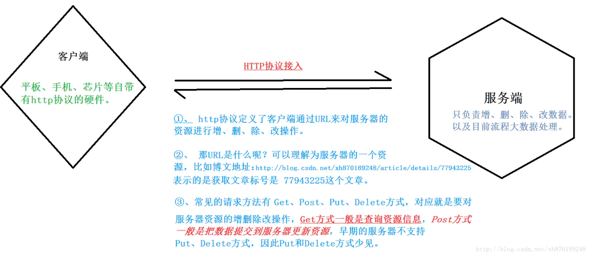
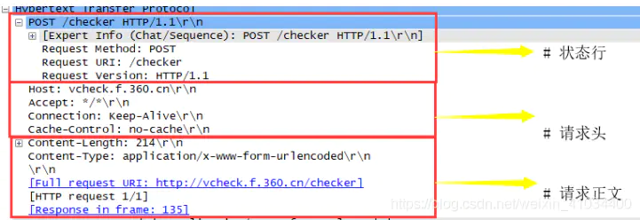
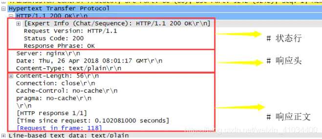

# ESP32-C3物联网工程开发实战
 01 准备篇
第1章 浅谈物联网
1.1 物联网的体系结构
1.2 物联网应用之智能家居
第2章 物联网工程项目的介绍和实战
2.1 典型的物联网工程项目介绍
2.2 实战：智能照明工程
2.3 本章总结
第3章 ESP RainMaker介绍
3.1 什么是ESP RainMaker
3.2 ESP RainMaker的实现原理
3.3 实战：ESP RainMaker开发要点
3.4 ESP RainMaker功能摘要
3.5 本章总结
第4章 开发环境的搭建与详解
4.1 ESP-IDF概述
4.2 ESP-IDF开发环境安装详解
4.3 ESP-IDF编译系统详解
4.4 实战：Blink 示例程序编译
4.5 本章总结
02 硬件与驱动开发篇
第5章 ESP32-C3的智能照明产品的硬件设计
5.1 智能照明产品的功能及组成
5.2 ESP32-C3最小硬件系统设计
5.3 实战：使用ESP32-C3构建智能照明系统
5.4 本章总结
第6章 驱动开发
6.1 驱动开发过程
6.2 ESP32-C3外设应用
6.3 LED驱动基础
6.4 LED调光驱动开发
6.5 实战：智能照明工程中的驱动开发
6.6 本章总结
03 无线通信与控制篇
第7章 Wi-Fi网络配置和连接
7.1 Wi-Fi基础知识
7.2 蓝牙基础知识
7.3 Wi-Fi配网
7.4 Wi-Fi编程
7.5 实战：智能照明工程中实现Wi-Fi配置
7.6 本章总结
第8章 设备的本地控制
8.1 本地控制的介绍
8.2 常见的本地发现方法
8.3 常见的本地数据通信协议
8.4 数据安全性的保证
8.5 实战：基于ESP-IDF组件快速实现智能灯本地控制模块
8.6 本章总结
第9章 设备的云端控制
9.1 远程控制的介绍
9.2 常见的云端数据通信协议
9.3 保证MQTT数据安全性
9.4 实战：通过ESP RainMaker实现智能照明工程的远程控制
9.5 本章总结
第10章 智能手机App开发
10.1 智能手机App开发技术介绍
10.2 新建智能手机App项目
10.3 App功能需求分析
10.4 用户登录注册功能的开发
10.5 设备配网功能的开发
10.6 设备控制功能的开发
10.7 定时功能和用户中心功能的开发
10.8 本章总结
第11章 固件更新与版本管理
11.1 固件更新
11.2 固件版本管理
11.3 实战：OTA升级使用示例
11.4 本章总结
04 优化与量产篇
第12章 电源管理和低功耗优化
12.1 ESP32-C3电源管理
12.2 ESP32-C3低功耗模式
12.3 电源管理和低功耗调试
12.4 实战：在智能照明工程中添加电源管理
12.5 本章总结
第13章 增强设备的安全功能
13.1 物联网设备数据安全概述
13.2 数据完整性保护
13.3 数据机密性保护
13.4 数据合法性的保护
13.5 实战：在量产中批量使用安全功能
13.6 本章总结
第14章 量产的固件烧录和测试
14.1 量产固件烧录
14.2 量产测试
14.3 实战：智能照明工程中的量产数据
14.4 本章总结
第15章 ESP Insights远程监察平台
15.1 ESP Insights组件的简介
15.2 ESP Insights组件的使用
15.3 实战：基于智能灯示例使用ESP Insights组件
15.4 本章总结
# 授课要点（嵌入式技术原理与应用）
学生学习本课程必备的知识和技能：
  本课程是物联网工程技术专业的一门专业核心课程，课程主要介绍ESP32微控制器在工程应用中所需的基础知识、硬件外设的工作原理及其编程开发的相关技术。
  本课程的前导课程为《电工电子技术》和《C语言程序设计》，上述课程为本课程奠定了常用电子电路、基本的C语言程序设计语法与规范等知识技能基础，在具有上述基础知识之后可顺利开展本课程所设置的学习内容。

为后续课程提供的知识：本课程可提供后续如物联网技术综合应用、毕业设计等知识支撑。
为后续课程提供的技能：本课程可提供后续如物联网技术综合应用、毕业设计等技能支撑。
知识目标：
1.了解嵌入式系统的基本概念、ESP32微控制器的主要特性、内部结构和最小系统组成；
2.了解VS code、idf等软件的菜单功能；
3.掌握ESP32微控制器GPIO的控制原理和用法编程；
4.掌握ESP32微控制器NVIC中断优先级管理的原理和用法编程；
5.掌握ESP32微控制器定时器的工作模式和用法编程；
6.掌握ESP32微控制器USART RS232串口通信总线、SPI总线、IIC总线、控制原理和用法编程；
7.掌握常用的温湿度传感器的工作原理；
8.掌握ESP32微控制器常用的显示模块的原理和用法编程；
9.掌握ESP32微控制器ADC控制器的工作原理和用法编程。
能力目标：
1.能正确安装与使用VS code、idf、串口调试助手等软件；
2.能熟练建立ESP32标准库函数工程并完成配置；
3.能实现ESP32输入输出模块的应用开发；
4.能实现ESP32定时器模块各种工作模式的应用开发；
5.能熟练实现ESP32各种通信总线模块的应用开发；
6.会编写常用的直流电机驱动芯片的驱动程序；
7.能完成ESP32信号ADC转换的应用开发；
8.会编写DHT11温湿度传感器的驱动程序；
9.能完成OLED屏幕显示的驱动程序编写，并实现多级菜单；
10.能根据简单的嵌入式系统项目需求进行分析，搭建其应用的系统构造，并完成应用程序开发。
素质目标：
1.具有良好的职业道德、规范操作意识；
2.具备良好的团队合作精神；
3.具备良好的组织协调能力；
4.具有求真务实的工作作风；
5.具有开拓创新的学习精神；
6.具有良好的语言文字表达能力；
7.具有分析问题解决问题的能力。
考核办法：
实操作业70%
平时表现30%

中国慕课大学(www.icourse163.org/) 嵌入式系统及应用 王宜怀 苏州大学 64  4
# 授课计划表
303(校内（职教中心）职教1号楼)
1.	2023-02-18  简单介绍及硬件准备/Windows开发环境准备/VS Code 快速入门
                        /Flash Download Tools的使用/ESP32应用程序的启动流程 Hello World	    
                作业：1.搭建开发环境并测试
                        2.编写hello world并观察结果
2.	2023-03-04  esp32应用程序的启动流程讲解/GPIO 输出讲解
                练习1：GPIO输出: 用GPIO16驱动一个LED。
                作业2：完成流水灯功能
                    让LED1~LED8，间隔1秒亮过去
                    即：LED1亮，1秒后，LED1灭，LED2亮，。。。。
                    同时提交代码和效果图
3.	2023-03-11  GPIO输入及按键 1.简单的GPIO输入(简易扫描按键) 2.按键消抖	 
                    作业：GPIO输入练习1(简易扫描按键)
                        //按下按键,灯亮,放开按键,灯灭
                        //GP16 -> key
                        //GP17 -> LED 
                        GPIO输入练习2(完善扫描按键)
                        按一下按键，LED灯亮，再按一下，LED灯灭
4.	2023-03-18	LED PWM控制器基础介绍/PWM的基础知识及呼吸灯的实现(ledc.md)     
                作业1：用LEDC，驱动一个LED灯，初始化的时候占空比为0，通过ledc_set_duty函数把占空比为10%，让LED微微亮
                作业2：根据上课内容，完成呼吸灯，让LED1从0开始变到最亮，一直循环 提交代码及效果  1班
                作业3：在作业1的基础上：
                    试着用二个按键控制灯渐变的速度。按键1，加快渐变速度，按键2，减慢渐变的速度
                    提交代码及效果图
                作业4: 完成一个函数,rgb(u8 r,u8 g,u8 b),实现输入RGB值,可以得到对应的颜色

6	2023-03-25  UART通信：UART概览/简介/UART使用步骤/UART发送/UART轮询接收 
                 串口练习1：向串品发送hello,I am xx(xx为学号) 
                 串口练习2：轮询(uart_read_bytes())
7	2023-04-01  UART接收方式二：队列信号(xQueueReceive()->UART_DATA事件->uart_read_bytes()) 2班
                 UART命令解析及远程控制
                 串口练习3：用队列方式接收数据改写练习2
                     提示：队列信号(xQueueReceive()->UART_DATA事件->uart_read_bytes())
                 串口练习4：实现通过串口发送命令，去控制LED的亮度。比如：发送：10%，则灯的亮度变成10%
8	2023-04-08
9	2023-04-15	
10	2023-04-22
11	2023-04-29*	
12	2023-05-06*	
13	2023-05-13	
14	2023-05-20	
15	2023-05-27

# ESP32入门教程
## 一.环境篇
 1. 简单介绍及硬件准备
    * 一、ESP32-C3简单介绍
        2.4 GHz Wi-Fi
        低功耗蓝牙
        高性能 32 位 RISC-V 单核处理器
        多种外设
        内置安全硬件
    * 二、开发板
        ESP32-C3-DevKitM-1(https://docs.espressif.com/projects/esp-idf/zh_CN/latest/esp32c3/hw-reference/esp32c3/user-guide-devkitm-1.html)
    * 三、开发板主要组件
        E:\WorkSpace\px\esp32\ESP32-Pico 传感器实验套件\1.学前先看\\ESP32-Pico管脚映射图.png
    * 四、开发板原理图
        E:\WorkSpace\px\esp32\ESP32-Pico 传感器实验套件\1.学前先看\ESP32-Pico 原理图 2021-7-26.pdf
    * 五、必备硬件
        ESP32-C3-DevKitM-1
        USB 2.0 数据线（标准 A 型转 Micro-B 型）
        电脑 （Windows、Linux 或 macOS）
    * 六、参考
        E:\WorkSpace\px\esp32\ESP32-Pico 传感器实验套件\7.ESP32电子资料
 2. Windows开发环境准备
    * 一、注意事项
        请注意 ESP-IDF和ESP-IDF工具的安装路径不能超过90个字符。
        Python或ESP-IDF的安装路径中一定不能包含空格或括号。
        除非操作系统配置为支持 Unicode UTF-8，否则 Python或ESP-IDF的安装路径中也不能包括特殊字符（非 ASCII 码字符、中文字符）
    * 二、下载安装包
        ESP-IDF Windows Installer Download(https://dl.espressif.cn/dl/esp-idf/?idf=4.4)
    * 三、安装步骤
        下载离线安装工具 esp-idf-tools-setup-offline-2.5.exe
        根据官方公告，离线安装包自带ESP-IDF-V4.2和ESP-IDF-V4.11版本，大部分数据(python,git,esp-id,tool-chain )可离线安装，最后部分软件还是需要联网安装，因此安装时还是要有网络连接才能完成安装。
        运行 esp-idf-tools-setup-ofline-2.5.exe
    * 四、构建工程
        1. 用idf.py create-project filename创建工程
        2. 进入刚刚创建好的工程下，配置目标芯片，
                idf.py set-target esp32
        3. 使用idf.py menuconfig
        4. 接着就可以写代码然后用idf.py build 编译
    * 五、报错处理
 3. VS Code 快速入门 
    ```添加默认终端
    ctrl+, 打开设置面板，输入 terminal.integrated.profiles.windows
    在打开的settting.json中添加
            "terminal.integrated.profiles.windows": {
            ...
                "Git Bash": {
                    "source": "Git Bash"
                },
                "idf Shell": {
                    "path": [
                        "D:\\esp32\\idf.bat"
                    ],
                    "args": [],
                },
            },
            "terminal.integrated.defaultProfile.windows": "idf Shell",
    ```
 4. Flash Download Tools的使用
    * 一、前文
        开发人员使用idf就够了
        但如果是测试、客户等其他人员，他们需要更新固件，总不能让他们安装VS Code IDE吧！
        所以这就需要使用乐鑫科技提供的Flash下载工具
    * 二、烧录下载
        https://www.espressif.com.cn/zh-hans/support/download/other-tools
    * 三、下载
        选择对应芯片，ESP32C3
        选择对应bin文件，并输入这个bin文件需要烧录的地址
 5. ESP-IDF构建系统(https://docs.espressif.com/projects/esp-idf/zh_CN/latest/esp32/api-guides/build-system.html)
    * 概述
        一个 ESP-IDF 项目可以看作是多个不同组件的集合，例如一个显示当前湿度的网页服务器会包含以下组件：
            ESP-IDF 基础库，包括 libc、ROM bindings 等
            Wi-Fi 驱动
            TCP/IP 协议栈
            FreeRTOS 操作系统
            网页服务器
            湿度传感器的驱动
            负责将上述组件整合到一起的主程序
        ESP-IDF 可以显式地指定和配置每个组件。在构建项目的时候，构建系统会前往 ESP-IDF 目录、项目目录和用户自定义组件目录（可选）中查找所有组件，允许用户通过文本菜单系统配置 ESP-IDF 项目中用到的每个组件。在所有组件配置结束后，构建系统开始编译整个项目
    * 概念
        1. 项目： 特指一个目录，其中包含了构建可执行应用程序所需的全部文件和配置，以及其他支持型文件，例如分区表、数据/文件系统分区和引导程序。
        2. 项目配置： 保存在项目根目录下名为 sdkconfig 的文件中，可以通过 idf.py menuconfig 进行修改，且一个项目只能包含一个项目配置。
        3. 应用程序： 是由 ESP-IDF 构建得到的可执行文件。一个项目通常会构建两个应用程序：项目应用程序（可执行的主文件，即用户自定义的固件）和引导程序（启动并初始化项目应用程序）。
        4. 组件： 是模块化且独立的代码，会被编译成静态库（.a 文件）并链接到应用程序。部分组件由 ESP-IDF 官方提供，其他组件则来源于其它开源项目。
        5. 目标： 特指运行构建后应用程序的硬件设备。运行 idf.py –list-targets 可以查看当前 ESP-IDF 版本中支持目标的完整列表。
    * 使用构建系统
        idf.py 命令行工具提供了一个前端，可以帮助您轻松管理项目的构建过程，它管理了以下工具：
            CMake，配置待构建的项目
            Ninja，用于构建项目
            esptool.py，烧录目标硬件设备
 6. ESP-IDF构建自定义组件模板(components/CMakeLists)
    * 工程结构
        myProject/
             - CMakeLists.txt
             - sdkconfig
             - components/ - component1/ - CMakeLists.txt
                                         - Kconfig
                                         - src1.c
                           - component2/ - CMakeLists.txt
                                         - Kconfig
                                         - src1.c
                                         - include/ - component2.h
             - main/       - CMakeLists.txt
                           - src1.c
                           - src2.c

             - build/
    * esp32标准树结构如上所示，只需按照类似结构创建我们的工程即可。
        “components” 目录中包含了项目的部分自定义组件，并不是每个项目都需要这种自定义组件，但它有助于构建可复用的代码或者导入第三方（不属于 ESP-IDF）的组件，或者也可以在顶层 CMakeLists.txt 中设置 EXTRA_COMPONENT_DIRS 变量以查找其他指定位置处的组件。
        “main” 目录是一个特殊的组件，它包含项目本身的源代码。”main” 是默认名称，CMake 变量 COMPONENT_DIRS 默认包含此组件，但您可以修改此变量。
    * 创建组件：
        ①idf.py create-compoent name:在当前目录下创建一个组件。
        ②idf.py -C components create-component my_component：在组件下创建组件。
        具体参考ESP32官网，API指南，构建系统章节。
    * 创建自己的组件
        ①在工程创建一个文件夹用于存放自己的组件,例如，我的存放组件的文件夹是my_com
            my_com\bsp
                include
                src
                CMakeLists.txt
                componens.mk
        ②创建一个bsp的组件，在组件中，include用于存放.h头文件，src用于存放.c文件
        ③创建一个components.mk文件用于指明路径
            COMPONENT_ADD_INCLUDEDIRS := include
            COMPONENT_SRCDIRS := src
        ④在CMakeLists.txt文件中注册头文件路径和.c文件
            set(my_com "src/lp5018.c" "led.c")
            idf_componet_register(SRC "${my_com}" INCLUDE_DIRS "include")
    * 模块化文件处理：
        ①在main目录下创建inc、src文件分别存放.h、.c文件
            然后在main目录下的CMakeLists.txt文件夹中
                idf_component_register(SRCS "./src/mygpio.c"
                                "./src/mytimer.c"
                        INCLUDE_DIRS "."
                                    "./inc")
            在SRCS “加入自己的路径下的.c文件”
            在INCLUDE_DIRS “加入.h文件”
            注：…/标识上一级目录下，./表示本级目录
        ②在main目录外创建一个目录专门存放inc、src目录，以test目录为例子
            test
                inc
                    mygpio.h
                src
                    mypgio.c
                CMakeLists.txt
            CMakeLists.txt
            在test目录下CMakeLists.txt内容：
                idf_component_register(SRCS "./src/mygpio.c"
                            "./src/mytimer.c"
                    INCLUDE_DIRS "."
                                 "./inc")
            同时还需要更改在最外一层的CMakeLists.txt文件中添加一句话
                set(EXTRA_COMPONENT_DIRS ./test)：设置额外的组件导向，将CMake指向到test目录下寻找我们定义的.c、.h文件。（注意这个语句一定要加，不然CMake找不到路径）
 7. 固件大小优化Optimization Level及Log output
    * Optimization Level 编译器的优化程度   
        比较早期的时候，硬件资源是比较缺乏的。为了提高性能，开发编译器的大师们，都会对编译器(从c到汇编的编译过程)加上一定的优化策略。优化后的代码效率比较高，但是可读性比较差，且编译时间更长。 
        优化是指编译器一级的措施，与机器指令比较接近，所以很可能会导致硬件不兼容，与你代码理论上不相关的
    * 查看程序的占用情况：idf.py size-components
        Total sizes:
        DRAM .data size:   13012 bytes
        DRAM .bss  size:   17872 bytes
        Used static DRAM:   30884 bytes ( 149852 available, 17.1% used)
        Used static IRAM:   87397 bytes (  43675 available, 66.7% used)
            Flash code:  459267 bytes
            Flash rodata:   93000 bytes
        Total image size:~ 652676 bytes (.bin may be padded larger)
    * 优化 IRAM 内存方法,解决iram0_0_seg' overflowed
        (https://docs.espressif.com/projects/esp-idf/zh_CN/release-v4.4/esp32/api-guides/performance/ram-usage.html#minimizing-ram-usage)
        启用 menuconfig -> Compiler option -> Optimization Level -> Optimize for size (-Os) 选项
        禁用 mencuofnig -> Component config -> LWIP -> Enable LWIP IRAM optimization 选项
        禁用 menuconfig -> Component config -> Wi-Fi -> WiFi IRAM speed optimization 与 menuconfig -> Component config -> Wi-Fi -> WiFi RX IRAM speed optimization 选项
        使用以上几个优化后,以下程序的占用情况
        Total sizes:
        DRAM .data size:   12848 bytes
        DRAM .bss  size:   17856 bytes
        Used static DRAM:   30704 bytes ( 150032 available, 17.0% used)
        Used static IRAM:   51463 bytes (  79609 available, 39.3% used)
            Flash code:  455419 bytes
            Flash rodata:   87856 bytes
        Total image size:~ 607586 bytes (.bin may be padded larger)
        IRAM 空间由 87397 bytes 降低到了 51463 bytes。节约了 30 KB 的 IRAM
    * Log
        ESP32默认预留了一个串口0用于调试和下载用途，通常该串口会输出大量日志信息：包括“Bootloader日志”和“Logging库的输出日志”两个部分。
        实际开发过程中我们有时希望关闭该串口0的日志输出，并将串口0复用为其它功能
        关闭Bootloader日志：idf.py menuconfig ->Bootloader config->Bootloader log verbosity
        关闭Logging日志：idf.py menuconfig->Component config->Log output->Default log verbosity
 8. [日志](esp_log.md)
## 二.基础篇
 0. 应用程序的启动流程
    * 本文将会介绍 ESP32-C3 从上电到运行 app_main 函数中间所经历的步骤（即启动流程）。
    宏观上，该启动流程可以分为如下 3 个步骤：
      1. 一级引导程序 被固化在了 ESP32-C3 内部的 ROM 中，它会从 flash 的 0x0 偏移地址处加载二级引导程序至 RAM (IRAM & DRAM) 中。
      2. 二级引导程序 从 flash 中加载分区表和主程序镜像至内存中，主程序中包含了 RAM 段和通过 flash 高速缓存映射的只读段。
      3. 应用程序启动阶段 运行，这时CPU 和 RTOS 的调度器启动。
    * 一级引导程序
      SoC 复位后，CPU 会立即开始运行，执行所有的初始化操作。复位向量代码位于 ESP32-C3 芯片掩膜 ROM 处，且不能被修改。
      复位向量调用的启动代码会根据 GPIO_STRAP_REG 寄存器的值来确定 ESP32-C3 的启动模式，该寄存器保存着复位后 bootstrap 引脚的电平状态
    * 二级引导程序
      1. 在 ESP-IDF 中，存放在 flash 的 0x0 偏移地址处的二进制镜像就是二级引导程序。二级引导程序的源码可以在 ESP-IDF 的 components/bootloader 目录下找到。ESP-IDF 使用二级引导程序可以增加 flash 分区的灵活性（使用分区表），并且方便实现 flash 加密，安全引导和空中升级（OTA）等功能。
      2. 当一级引导程序校验并加载完二级引导程序后，它会从二进制镜像的头部找到二级引导程序的入口点，并跳转过去运行。
      3. 二级引导程序默认从 flash 的 0x8000 偏移地址处（可配置的值）读取分区表。请参考 分区表 获取详细信息。引导程序会寻找工厂分区和 OTA 应用程序分区。如果在分区表中找到了 OTA 应用程序分区，引导程序将查询 otadata 分区以确定应引导哪个分区。更多信息请参考 空中升级 (OTA)
      4. 对于选定的分区，二级引导程序将从 flash 逐段读取二进制镜像：
    * 应用程序启动阶段
      应用程序启动包含了从应用程序开始执行到 app_main 函数在主任务内部运行前的所有过程。可分为三个阶段：
        1. 硬件和基本 C 语言运行环境的端口初始化。
        2. 软件服务和 FreeRTOS 的系统初始化。
        3. 运行主任务并调用 app_main
    * 运行主任务
        在所有其他组件都初始化后，主任务会被创建，FreeRTOS 调度器开始运行。
        做完一些初始化任务后（需要启动调度器），主任务在固件中运行应用程序提供的函数 app_main。
        运行 app_main 的主任务有一个固定的 RTOS 优先级（比最小值高）和一个 可配置的堆栈大小。
        与普通的 FreeRTOS 任务（或嵌入式 C 的 main 函数）不同，app_main 任务可以返回。如果``app_main`` 函数返回，那么主任务将会被删除。系统将继续运行其他的 RTOS 任务。因此可以将 app_main 实现为一个创建其他应用任务然后返回的函数，或主应用任务本身
 1. 常用函数
    1. 延时:ets_delay_us(); 
    2. 自定义printf
        ```c
        #include "string.h"

        #define LOG_COLOR_BLACK   "30"
        #define LOG_COLOR_RED     "31"
        #define LOG_COLOR_GREEN   "32"
        #define LOG_COLOR_BROWN   "33"
        #define LOG_COLOR_BLUE    "34"
        #define LOG_COLOR_PURPLE  "35"
        #define LOG_COLOR_CYAN    "36"
        #define LOG_COLOR(COLOR)  "\033[0;" COLOR "m"
        #define LOG_RESET_COLOR   "\033[0m"

        #define FILE_NAME(x) (strrchr(x,'/')?strrchr(x,'/')+1:x)  //获取文件名                      
        #define INFO(format,...) do{ \
                                printf("[%s:%s()] " format "\n",FILE_NAME(__FILE__),__func__,##__VA_ARGS__); \
                                }while(0);
        #define INFOE(format,...) do{ \
                                printf(LOG_COLOR(LOG_COLOR_RED) "[%s:%s()" format"\n" LOG_RESET_COLOR ,FILE_NAME(__FILE__),__func__,##__VA_ARGS__); \
                                }while(0);
        ```
 2. Hello World
    1. 配置芯片型号: idf.py set-target esp32
    2. 配置:        idf.py menuconfig
    3. 编译:        idf.py build
    4. 烧写:        idf.py -p PORT [-b BAUD] flash
    5. 查看串口信息: idf.py -p PORT monitor 
 3. GPIO 输出/输入
    * GPIO基础
        1. ESP32 芯片具有 34 个物理 GPIO 管脚（GPIO0 ~ GPIO19、GPIO21 ~ GPIO23、GPIO25 ~ GPIO27 和 GPIO32 ~ GPIO39）
        2. Strapping 管脚：GPIO0、GPIO2、GPIO5、GPIO12 (MTDI) 和 GPIO15 (MTDO) 是 Strapping 管脚，不建议用作其他功能
        3. SPI0/1：GPIO6-11 和 GPIO16-17 通常连接到模组内集成的 SPI flash 和 PSRAM，因此不能用于其他用途；
        4. 在深度睡眠模式下可以使用的GPIO口有 GPIO0-5
        5. JTAG：GPIO12-15 通常用于在线调试
        6. GPIO34-39 只能设置为输入模式，不具备软件使能的上拉或下拉功能。
        7. TXD & RXD 通常用于烧录和调试
    * GPIO函数
        8. GPIO的函数:
            https://docs.espressif.com/projects/esp-idf/zh_CN/latest/esp32c3/api-reference/peripherals/gpio.html
        9. 头文件：#include "driver/gpio.h"
        10. 配置IO：
            * 方式1:esp_err_t gpio_config(const gpio_config_t *pGPIOConfig)
            配置GPIO的模式，上拉，下拉，中断触发类型
            ```示例
                gpio_config_t ioConfig = {
                    .pin_bit_mask = (1ull << 18)|(1ull << 19),
                    .mode = GPIO_MODE_OUTPUT,
                }
                //传入gpio_config_t指针
                gpio_config(&ioConfig);
            ```
            * 方式2:
                设置GPIO方向:gpio_set_direction(gpio_num_tgpio_num, gpio_mode_tmode)
                设置电平：gpio_set_level(gpio_num_t gpio_num, uint32_t level)
                读取电平：gpio_get_level(16);
                配置GPIO内部上下拉电阻：
                    gpio_set_pull_mode()
                    gpio_pullup_en()
                    gpio_pullup_dis()
                    gpio_pulldown_en()
                    gpio_pulldown_dis()
                恢复 GPIO 默认值：gpio_reset_pin()
        11. 简单使用:
           ```c
            gpio_reset_pin(4);
            gpio_set_direction(4, GPIO_MODE_OUTPUT);//GPIO作为输出
            gpio_set_level(4, 0);//输出低电平
           ```
    * 具体输入/输出/简单按键,详细见:[](gpio.md)
 4. 实用的按键:按键的长按和短按 [](gpio.md) [](key.md)
 5. [PWM/LEDC](ledc.md)
 6. [UART](uart.md)
 7. [ADC:](adc.md)
 8. [DAC:](dac.md)
 9.  [Motor Control Pulse Width Modulator (MCPWM)]  
 10. [I2C通信](i2c.md) / tm1637驱动数码管
    1. [ssd1306驱动](ssd1306.md)
    2. [收音机驱动](TEA5767.c)
    2. [类I2C驱动]tm1637驱动数码管
      - datasheet:(https://w.electrodragon.com/w/images/2/2c/TM1637.pdf)
      - TM1637 不是 I2C 从设备，连常规的“I2C 从设备地址”都没有.
      - 驱动见"esp_tm1637.c"
      - 练习:修改驱动,使的可以在数码管上显示时间,如"12:34"
        - 1.先找出":"是由哪个段码驱动的,用tm1637_set_segment_raw()
        - 2.找出":"是由显示数据中的哪一个位驱动
        - 3.修改驱动
 11. 设置及获得系统时间
     1.  头文件: "sys/time.h" "time.h"
     2.  获得时间
        ```c
        time_t t;
        setenv("TZ", "GMT-8", 1);  // 将时区TZ设置为中国所在的东八区
        tzset();                   // 把c库的运行数据更改位新时区时间
        t = time(NULL);            /*获取系统时间*/
        struct tm *now;
        now = localtime(&t);       // 使用 timer 的值来填充 tm 结构
        INFO("%s", asctime(now));  // 转成可读格式的日期和时间信息
        ```
     3.  设置时间
         ```c
            void __setTime(unsigned long epoch, int ms)
            {
                struct timeval tv;
                tv.tv_sec = epoch;  // epoch time (seconds)
                tv.tv_usec = ms;    // microseconds
                settimeofday(&tv, NULL);
            }
            void setTime(int yr, int mt, int hr, int mn, int dy, int sc )
            {
                setenv("TZ", "GMT-8", 1);  // 将时区TZ设置为中国所在的东八区
                tzset();                   // 把c库的运行数据更改位新时区时间

                struct tm t = {0};      // Initalize to all 0's
                t.tm_year = yr - 1900;  // This is year-1900, so 121 = 2021
                t.tm_mon = mt - 1;
                t.tm_mday = dy;
                t.tm_hour = hr;
                t.tm_min = mn;
                t.tm_sec = sc;
                time_t timeSinceEpoch = mktime(&t);
                __setTime(timeSinceEpoch, 0);
            }
         ```
     4.  用4位数码管用一个时钟,可以显示: 小时和分钟,中间":"1秒闪一次
 12. NTP
     ```c
         #include "esp_sntp.h"

        static const char *TAG = "NTP";

        void ntpReport(void);

        static void obtain_time(void);
        static void initialize_sntp(void);

        void time_sync_notification_cb(struct timeval *tv)
        {
            ESP_LOGI(TAG, "sntp_stop");
            sntp_stop();
        }

        void ntp_set(void)
        {
            time_t now;
            struct tm timeinfo;
            time(&now);
            localtime_r(&now, &timeinfo);
            // Is time set? If not, tm_year will be (1970 - 1900).
            //if (timeinfo.tm_year < (2021 - 1900)) 
            sntp_stop();
            {
                ESP_LOGI(TAG, "Time is not set yet. Connecting to WiFi and getting time over NTP.");
                obtain_time();
                // update 'now' variable with current time
                time(&now);
            }

            //char strftime_buf[64];
            //ntpReport();
            //while (1)
            // {
            //     // update 'now' variable with current time
            //     time(&now);

            //     // Set timezone to China Standard Time
            //     setenv("TZ", "CST-8", 1);
            //     tzset();
            //     localtime_r(&now, &timeinfo);
            //     // strftime(strftime_buf, sizeof(strftime_buf), "%c", &timeinfo);
            //     // ESP_LOGI(TAG, "The current date/time in Shanghai is: %s", strftime_buf);
            //     ESP_LOGI(TAG,"%d-%d-%d %d:%d:%d\n",timeinfo.tm_year+1900,timeinfo.tm_mon+1,timeinfo.tm_mday,
            //                                         timeinfo.tm_hour,timeinfo.tm_min,timeinfo.tm_sec);
            //     //vTaskDelay(10000 / portTICK_PERIOD_MS);
            // }
        }

        static void obtain_time(void)
        {
            
            initialize_sntp();

            // wait for time to be set
            time_t now = 0;
            struct tm timeinfo = { 0 };
            int retry = 0;
            const int retry_count = 10;
            while (sntp_get_sync_status() == SNTP_SYNC_STATUS_RESET && ++retry < retry_count) {
                ESP_LOGI(TAG, "Waiting for system time to be set... (%d/%d)", retry, retry_count);
                vTaskDelay(2000 / portTICK_PERIOD_MS);
            }
            time(&now);
            localtime_r(&now, &timeinfo);
        }

        static void initialize_sntp(void)
        {
            ESP_LOGI(TAG, "Initializing SNTP");
            sntp_setoperatingmode(SNTP_OPMODE_POLL);
            sntp_setservername(1, "pool.ntp.org");
            sntp_setservername(0,"ntp1.aliyun.com");
            sntp_setservername(2,"210.72.145.44");
            sntp_set_time_sync_notification_cb(time_sync_notification_cb);
            sntp_init();
        }
     ```
 14. [游戏摇杆JOYStick](joystick.md)
     1. 练习:配合4位数码码,用摇杆设置时间
 15. [1-Wire总线](18b20.md)
 16. [超声波测距](ultraSonic.md)(timer_HD.md)
 17. [RMT](rmt.md)
 18. [ws2812](ws2812.md)
 19. NVS 读写
     1. 简介
        1. 非易失性存储 (NVS) 库主要用于在 flash 中存储键值格式的数据。
            NVS适合存储一些小数据，如果对象占用空间比较大，使用负载均衡的FAT文件系统。
            如果NVS分区被截断，比如更改分区表布局的时候，应该擦除分区内容。可以使用 idf.py erase_flash 命令擦除flash上全部的内容
        2. NVS 的操作对象为键值对，其中键是 ASCII 字符串，当前支持最大键长为 15 个字符，值可以为以下几种类型：
           1. 整数型： uint8_t、int8_t、uint16_t、int16_t、uint32_t、int32_t、uint64_t 和 int64_t；\
           2. 字符型： 以 \0 结尾的字符串；
           3. 二进制数据： 可变长度的二进制数据 (BLOB)
     2. API说明:NVS 接口位于 nvs_flash/include/nvs_flash.h
        1. nvs_flash_init,如果失败可调用“nvs_flash_erase()”擦除NVS，然后再次初始化
        2. nvs_open("List", NVS_READWRITE, &my_handle);
           - 第一个形参为一个字符串，可称为表名。第二个是读写模式，可选读写或者只读，第三个是当前打开的表的句柄
        3. nvs_open
        4. 读取函数
           ```c
            esp_err_t nvs_get_i8  (nvs_handle_t handle, const char* key, int8_t* out_value);
            esp_err_t nvs_get_u8  (nvs_handle_t handle, const char* key, uint8_t* out_value);
            esp_err_t nvs_get_i16 (nvs_handle_t handle, const char* key, int16_t* out_value);
            esp_err_t nvs_get_u16 (nvs_handle_t handle, const char* key, uint16_t* out_value);
            esp_err_t nvs_get_i32 (nvs_handle_t handle, const char* key, int32_t* out_value);
            esp_err_t nvs_get_u32 (nvs_handle_t handle, const char* key, uint32_t* out_value);
            esp_err_t nvs_get_i64 (nvs_handle_t handle, const char* key, int64_t* out_value);
            esp_err_t nvs_get_u64 (nvs_handle_t handle, const char* key, uint64_t* out_value);
            //这两个的长度需要特殊操作
            esp_err_t nvs_get_str (nvs_handle_t handle, const char* key, char* out_value, size_t* length);
            esp_err_t nvs_get_blob(nvs_handle_t handle, const char* key, void* out_value, size_t* length);
           ```
        5. 写入函数
            ```c
            esp_err_t nvs_set_i8  (nvs_handle_t handle, const char* key, int8_t value);
            esp_err_t nvs_set_u8  (nvs_handle_t handle, const char* key, uint8_t value);
            esp_err_t nvs_set_i16 (nvs_handle_t handle, const char* key, int16_t value);
            esp_err_t nvs_set_u16 (nvs_handle_t handle, const char* key, uint16_t value);
            esp_err_t nvs_set_i32 (nvs_handle_t handle, const char* key, int32_t value);
            esp_err_t nvs_set_u32 (nvs_handle_t handle, const char* key, uint32_t value);
            esp_err_t nvs_set_i64 (nvs_handle_t handle, const char* key, int64_t value);
            esp_err_t nvs_set_u64 (nvs_handle_t handle, const char* key, uint64_t value);
            esp_err_t nvs_set_str (nvs_handle_t handle, const char* key, const char* value);
            //用来存储大二进制数据的函数（比如说结构体）
            esp_err_t nvs_set_blob(nvs_handle_t handle, const char* key, const void* value, size_t length); 
            ```
        6. nvs_commit
        7. nvs_close
     3. 编程流程
        1. 配置分区表
            配置分区表: 我们也可以使用默认的分区表。默认分区表中nvs大小是24k(0x6000),可以根据自己需要对nvs空间进行修改。
        2. 初始化NVS Flash
            使用 nvs_flash_init()，如果 Flash 满了或者希望清空原来的数据，就使用 nvs_flash_erase() 清空
        3. 打开NVS，配置句柄
            对NVS空间进行操作的时候，是使用句柄实现的。
            同时，为了尽可能减少键值对的冲突，NVS引入了命名空间的概念，不同命名空间下的key捕获产生冲突。
            同时也要在这里配置对NVS空间进行操作的权限，分为读和读写两种
            ```c
            nvs_handle_t handle;
            nvs_open("namespace1", NVS_READWRITE, &handle);
            ```
        4. 读写操作
            按照不同的数据类型，对数据进行get和set操作
            调用中使用nvs_get_*，nvs_set_*和nvs_commit()功能函数
        5. 关闭NVS
            nvs_close(handle);
     4. 示例
        ```c 简单数据
        #include <stdio.h>
        #include "freertos/FreeRTOS.h"
        #include "freertos/task.h"
        #include "esp_system.h"
        #include "nvs_flash.h"
        #include "nvs.h"

        void app_main(void)
        {
            // Initialize NVS
            esp_err_t err = nvs_flash_init();
            if (err == ESP_ERR_NVS_NO_FREE_PAGES || err == ESP_ERR_NVS_NEW_VERSION_FOUND) {
                // NVS partition was truncated and needs to be erased
                // Retry nvs_flash_init
                ESP_ERROR_CHECK(nvs_flash_erase());
                err = nvs_flash_init();
            }
            ESP_ERROR_CHECK( err );

            // Open
            printf("\n");
            printf("Opening Non-Volatile Storage (NVS) handle... ");
            nvs_handle_t my_handle;
            err = nvs_open("storage", NVS_READWRITE, &my_handle);
            if (err != ESP_OK) {
                printf("Error (%s) opening NVS handle!\n", esp_err_to_name(err));
            } else {
                printf("Done\n");

                // Read
                printf("Reading restart counter from NVS ... ");
                int32_t restart_counter = 0; // value will default to 0, if not set yet in NVS
                err = nvs_get_i32(my_handle, "restart_counter", &restart_counter);
                switch (err) {
                    case ESP_OK:
                        printf("Done\n");
                        printf("Restart counter = %d\n", restart_counter);
                        break;
                    case ESP_ERR_NVS_NOT_FOUND:
                        printf("The value is not initialized yet!\n");
                        break;
                    default :
                        printf("Error (%s) reading!\n", esp_err_to_name(err));
                }

                // Write
                printf("Updating restart counter in NVS ... ");
                restart_counter++;
                err = nvs_set_i32(my_handle, "restart_counter", restart_counter);
                printf((err != ESP_OK) ? "Failed!\n" : "Done\n");

                // Commit written value.
                // After setting any values, nvs_commit() must be called to ensure changes are written
                // to flash storage. Implementations may write to storage at other times,
                // but this is not guaranteed.
                printf("Committing updates in NVS ... ");
                err = nvs_commit(my_handle);
                printf((err != ESP_OK) ? "Failed!\n" : "Done\n");

                // Close
                nvs_close(my_handle);
            }

            printf("\n");

            // Restart module
            for (int i = 10; i >= 0; i--) {
                printf("Restarting in %d seconds...\n", i);
                vTaskDelay(1000 / portTICK_PERIOD_MS);
            }
            printf("Restarting now.\n");
            fflush(stdout);
            esp_restart();
        }
        ```
        ```c 复杂数据
        void NvsWriteDataToFlash(void)
        {
            nvs_handle handle;
            // 写入一个整形数据，一个字符串，WIFI信息以及版本信息
            static const char *NVS_CUSTOMER = "customer data";
            static const char *DATA2 = "String";
            static const char *DATA3 = "blob_wifi";
            static const char *DATA4 = "blob_version";

            // 要写入的字符串
            char str_for_store[32] = "i am a string.";
            // 要写入的WIFI信息
            wifi_config_t wifi_config_to_store = {
                .sta = {
                    .ssid = "store_ssid:hello_kitty",
                    .password = "store_password:1234567890",
                },
            };
            // 要写入的版本号
            uint8_t version_for_store[4] = {0x01, 0x01, 0x01, 0x00};
            
            printf("set size:%u\r\n", sizeof(wifi_config_to_store));
            ESP_ERROR_CHECK( nvs_open( NVS_CUSTOMER, NVS_READWRITE, &handle) );
            ESP_ERROR_CHECK( nvs_set_str( handle, DATA2, str_for_store) );
            ESP_ERROR_CHECK( nvs_set_blob( handle, DATA3, &wifi_config_to_store, sizeof(wifi_config_to_store)) );
            ESP_ERROR_CHECK( nvs_set_blob( handle, DATA4, version_for_store, 4) );

            ESP_ERROR_CHECK( nvs_commit(handle) );
            nvs_close(handle);

        }
        void NvsReadDataFromFlash(void)
        {
            esp_err_t err;

            nvs_handle handle;
            static const char *NVS_CUSTOMER = "customer data";
            static const char *DATA2 = "String";
            static const char *DATA3 = "blob_wifi";
            static const char *DATA4 = "blob_version";

            uint32_t str_length = 32;
            char str_data[32] = {0};
            wifi_config_t wifi_config_stored;
            uint8_t version[4] = {0};
            uint32_t version_len = 4;
            
            memset(&wifi_config_stored, 0x0, sizeof(wifi_config_stored));
            uint32_t wifi_len = sizeof(wifi_config_stored);

            ESP_ERROR_CHECK( nvs_open(NVS_CUSTOMER, NVS_READWRITE, &handle) );

            ESP_ERROR_CHECK ( nvs_get_str(handle, DATA2, str_data, &str_length) );
            ESP_ERROR_CHECK ( nvs_get_blob(handle, DATA3, &wifi_config_stored, &wifi_len) );
            ESP_ERROR_CHECK ( nvs_get_blob(handle, DATA4, version, &version_len) );

            printf("[data1]: %s len:%u\r\n", str_data, str_length);
            printf("[data2]: %d\r\n", value);
            printf("[data3]: ssid:%s passwd:%s\r\n", wifi_config_stored.sta.ssid, wifi_config_stored.sta.password);

            nvs_close(handle);
        }
        ```
## 三.系统(FreeRTOS)
1. 系统Tick
   1. FreeRTOS 的时钟节拍
    任何操作系统都需要提供一个时钟节拍，以供系统处理诸如延时、 超时等与时间相关的事件。
    时钟节拍是特定的周期性中断，这个中断可以看做是系统心跳。 中断之间的时间间隔取决于不同的应
    用，一般是 1ms – 100ms。时钟的节拍中断使得内核可以将任务延迟若干个时钟节拍，以及当任务等待
    事件发生时，提供等待超时等依据。时钟节拍率越快，系统的额外开销就越大。
   2. FreeRTOS 的系统时钟节拍可以在配置文件 FreeRTOSConfig.h 里面设置：
    #define configTICK_RATE_HZ ( ( TickType_t ) 1000 )
    如上所示的宏定义配置表示系统时钟节拍是 1KHz，即 1ms。 
   3. 时间延迟
      + FreeRTOS 中的时间延迟函数主要有以下两个作用：
        - 为周期性执行的任务提供延迟。
        - 对于抢占式调度器，让高优先级任务可以通过时间延迟函数释放 CPU 使用权，从而让低优先级任务可以得到执行。
   4. FreeRTOS 的时间相关函数
      + FreeRTOS 时间相关的函数主要有以下 4 个：
        - vTaskDelay () 相对延时
            ```c
            vTaskDelay(1000 / portTICK_PERIOD_MS);
            ```
        - vTaskDelayUntil () 绝对延时,宏INCLUDE_vTaskDelayUntil 必须设置成1，此函数才有效
            ```c
            TickType_t xLastWakeTime;
            const TickType_t xDelay1S = pdMS_TO_TICKS(1000);
            xLastWakeTime = xTaskGetTickCount();
            while (1) {
                vTaskDelayUntil(&xLastWakeTime,xDelay1S);
                printf("%d\n",xLastWakeTime);
            }
            ```
        - xTaskGetTickCount()   用于获取系统当前运行的时钟节拍数
        - xTaskGetTickCountFromISR()  在ISR中用于获取系统当前运行的时钟节拍数
   5. 常用的时间常量及函数
      + portMAX_DELAY
      + portTICK_PERIOD_MS
      + pdMS_TO_TICKS()
      + pdTICKS_TO_MS()
2. [任务](task.md)
3. [同步概念](concept.md)
4. [任务通知](tasknotify.md)
5. [队列](queue.md)
6. [信号量](semaphore.md)
7. [互斥量](mutex.md)
8. [事件组](eventGroup.md)
9. [软件定时器](timer.md)
10. [cJson](cjson.md)
## 四.WIFI
1. [WIFI 扫描附近AP/阻塞等待扫描结果/回调通知扫描结果](wifi_scan.md)
2. [Station模式连接到AP](wifi_station.md)
3. [Soft AP](wifi_softAp.md)
   1. WIFI_softap
4. [Smart Config(EspTouchForAndroid)](smartConfig.md)
5. Smart Config(AirKiss)
## 五.蓝牙 
1. [简介](bt.md)
2. [Gatt Server](gatt_Server.md)
## 六.网络
1. udp
   1. TCP与UDP优缺点
      1. TCP面向连接（如打电话要先拨号建立连接）;UDP是无连接的，即发送数据之前不需要建立连接。
      2. TCP提供可靠的服务。也就是说，通过TCP连接传送的数据，无差错，不丢失，不重复，且按序到达
      3. UDP尽最大努力交付，即不保证可靠交付。
      4. TCP通过校验和，重传控制，序号标识，滑动窗口、确认应答实现可靠传输。如丢包时的重发控制，还可以对次序乱掉的分包进行顺序控制
      5. UDP具有较好的实时性，工作效率比TCP高，适用于对高速传输和实时性有较高的通信或广播通信。
      6. 每一条TCP连接只能是点到点的;UDP支持一对一，一对多，多对一和多对多的交互通信。
      7. TCP对系统资源要求较多，UDP对系统资源要求较少
   2. API说明
      * 以下 BSD Socket 接口位于 lwip/lwip/src/include/lwip/sockets.h。
      * socket()
        * https://www.man7.org/linux/man-pages/man7/socket.7.html
        * int sockfd = socket(int socket_family, int socket_type, int protocol);
      * bind()
      * accept()
      * shutdown()
      * getpeername()
      * getsockopt()＆setsockopt()（请参阅套接字选项）
      * close()（通过虚拟文件系统组件）
      * read()，readv()，write()，writev()（经由虚拟文件系统部件）
      * recv()，recvmsg()，recvfrom()
      * send()，sendmsg()，sendto()
      * select()（通过虚拟文件系统组件）
      * poll()（注意：在ESP-IDF上，poll()是通过内部调用select来实现的，因此，select()如果有可用的方法选择，建议直接使用。）
      * fcntl()（请参阅fcntl）
      * ioctl()（请参阅ioctls）
   3. 流程:<br> 
   4. udp客户端步骤
      1. 新建socket
         * 
         ```c
            int addr_family = 0;
            int ip_protocol = 0;

            addr_family = AF_INET;
            ip_protocol = IPPROTO_IP;

            int sock =  socket(addr_family, SOCK_DGRAM, ip_protocol);
            if(sock < 0) 
            {
                ESP_LOGE(TAG, "Unable to create socket: errno %d", errno);
            }
                    
         ```
      2. 配置将要连接的服务器信息（端口和IP）
         ```c
            #define HOST_IP_ADDR    "255.255.255.255"    // 要连接UDP服务器地址，默认使用广播
            #define UDP_PORT        3333                 // 要连接UDP服务器端口号

            struct sockaddr_in dest_addr;
            dest_addr.sin_family = AF_INET;
            dest_addr.sin_addr.s_addr = inet_addr(HOST_IP_ADDR);
            dest_addr.sin_port = htons(UDP_PORT);
         ```
      3. 发送数据
         ```c
            static const char *payload = "Message from ESP32 ";

            int err = sendto(sock, payload, strlen(payload), 0, (struct sockaddr *)&dest_addr, sizeof(dest_addr));
            if(err < 0) 
            {
                ESP_LOGE(TAG, "Error occurred during sending: errno %d", errno);
                close(sock);
            }
         
         ```
      4. 接收数据
         ```c
            char rx_buffer[128];
            char host_ip[] = HOST_IP_ADDR;

            while(1)
            {
                ······
                // 清空缓存
                memset(rx_buffer, 0, sizeof(rx_buffer));

                struct sockaddr_in source_addr; // Large enough for both IPv4 or IPv6
                socklen_t socklen = sizeof(source_addr);
                int len = recvfrom(sock, rx_buffer, sizeof(rx_buffer), 0, (struct sockaddr *)&source_addr, &socklen);

                // Error occurred during receiving
                if(len < 0) 
                {
                    ESP_LOGE(TAG, "recvfrom failed: errno %d", errno);
                    break;
                }
                // Data received
                else 
                {
                    ESP_LOGI(TAG, "Received %d bytes from %s:", len, host_ip);
                    ESP_LOGI(TAG, "%s", rx_buffer);
                }
            }
            close(sock);
         
         ```
   5. udp服务器步骤
      1. 新建socket
            ```c
                int addr_family = 0;
                int ip_protocol = 0;

                addr_family = AF_INET;
                ip_protocol = IPPROTO_IP;

                int sock =  socket(addr_family, SOCK_DGRAM, ip_protocol);
                if(sock < 0) 
                {
                    ESP_LOGE(TAG, "Unable to create socket: errno %d", errno);
                }
            ```
       2. 配置服务器信息
            ```c
                #define UDP_PORT        3333                 // UDP服务器端口号

                struct sockaddr_in dest_addr;
                dest_addr.sin_family = AF_INET;
                dest_addr.sin_addr.s_addr = htonl(INADDR_ANY);
                dest_addr.sin_port = htons(UDP_PORT);
            ```
       3. 绑定地址
            ```c
                int err = bind(sock, (struct sockaddr *)&dest_addr, sizeof(dest_addr));
                if(err < 0)
                {
                    ESP_LOGE(TAG, "Socket unable to bind: errno %d", errno);
                    close(sock);
                }
                ESP_LOGI(TAG, "Socket bound, port %d", PORT);
            ```
       4. 接收数据
            ```c
                char rx_buffer[128];
                char host_ip[] = HOST_IP_ADDR;

                while(1)
                {
                    ······
                    // 清空缓存
                    memset(rx_buffer, 0, sizeof(rx_buffer));

                    struct sockaddr_in source_addr; // Large enough for both IPv4 or IPv6
                    socklen_t socklen = sizeof(source_addr);
                    int len = recvfrom(sock, rx_buffer, sizeof(rx_buffer), 0, (struct sockaddr *)&source_addr, &socklen);

                    // Error occurred during receiving
                    if(len < 0) 
                    {
                        ESP_LOGE(TAG, "recvfrom failed: errno %d", errno);
                        break;
                    }
                    // Data received
                    else 
                    {
                        ESP_LOGI(TAG, "Received %d bytes from %s:", len, host_ip);
                        ESP_LOGI(TAG, "%s", rx_buffer);
                    }
                }
                close(sock);
            ```
       5. 发送数据
            ```c
                static const char *payload = "Message from ESP32 ";

                int err = sendto(sock, payload, strlen(payload), 0, (struct sockaddr *)&dest_addr, sizeof(dest_addr));
                if(err < 0) 
                {
                    ESP_LOGE(TAG, "Error occurred during sending: errno %d", errno);
                    close(sock);
                }
            ```
2. tcp client
   1. 主要流程<br>
   2. 新建socket
        ```c
            int addr_family = 0;
            int ip_protocol = 0;

            addr_family = AF_INET;
            ip_protocol = IPPROTO_IP;

            int sock =  socket(addr_family, SOCK_STREAM, ip_protocol);
            if(sock < 0) 
            {
                ESP_LOGE(TAG, "Unable to create socket: errno %d", errno);
                // 新建失败后，关闭新建的socket，等待下次新建
                close(sock);
            }
        ```
   3. 配置将要连接的服务器信息（端口和IP）
        ```c
            #define TCP_SERVER_ADRESS    "192.168.61.217"    // 要连接TCP服务器地址
            #define TCP_PORT             3333                // 要连接TCP服务器端口号

            struct sockaddr_in dest_addr;
            dest_addr.sin_family = AF_INET;
            dest_addr.sin_addr.s_addr = inet_addr(TCP_SERVER_ADRESS);
            dest_addr.sin_port = htons(TCP_PORT);
        ```
   4. 连接服务器
        ```c
            int err = connect(sock, (struct sockaddr *)&dest_addr, sizeof(dest_addr);
            if(err != 0) 
            {
                ESP_LOGE(TAG, "Socket unable to connect: errno %d", errno);
                // 连接失败后，关闭之前新建的socket，等待下次新建
                close(sock);
            }

        ```
   5. 接收数据
        ```c
            char rx_buffer[128];

            while (1) 
            {
                ······
                int len = recv(sock, rx_buffer, sizeof(rx_buffer), 0);
                // Error occurred during receiving
                if (len < 0) 
                {
                    ESP_LOGE(TAG, "recv failed: errno %d", errno);
                    break;
                }
                // Data received
                else 
                {
                    memset(rx_buffer, 0, sizeof(rx_buffer));
                    ESP_LOGI(TAG, "Received %d bytes from %s:", len, TCP_SERVER_ADRESS);
                    ESP_LOGI(TAG, "%s", rx_buffer);
                }
            }

        ```
   6. 发送数据
        ```c
            static const char *payload = "Message from ESP32 ";

            int err = send(sock, payload, strlen(payload), 0);
            if (err < 0) 
            {
                ESP_LOGE(TAG, "Error occurred during sending: errno %d", errno);
            }

        ```
3. tcp server
   1. 主要流程<br>
   2. 新建socket
    ```c
        int addr_family = 0;
        int ip_protocol = 0;

        addr_family = AF_INET;
        ip_protocol = IPPROTO_IP;

        int listen_sock =  socket(addr_family, SOCK_STREAM, ip_protocol);
        if(listen_sock < 0) 
        {
            ESP_LOGE(TAG, "Unable to create socket: errno %d", errno);
        }
    ```
   3. 配置服务器信息
    ```c
        #define TCP_PORT             3333                // TCP服务器端口号

        struct sockaddr_in dest_addr;
        dest_addr.sin_family = AF_INET;
        dest_addr.sin_addr.s_addr = htonl(INADDR_ANY);
        dest_addr.sin_port = htons(TCP_PORT);
    ```
   4. 绑定地址
    ```c
        int err = bind(listen_sock, (struct sockaddr *)&dest_addr, sizeof(dest_addr));
        if(err != 0) 
        {
            ESP_LOGE(TAG, "Socket unable to bind: errno %d", errno);
            ESP_LOGE(TAG, "IPPROTO: %d", addr_family);
            close(listen_sock);
        }
        ESP_LOGI(TAG, "Socket bound, port %d", PORT);
    ```
   5. 开始监听
    ```c
        err = listen(listen_sock, 1);    // 这里为啥是1，网上大多数是5
        if(err != 0) 
        {
            ESP_LOGE(TAG, "Error occurred during listen: errno %d", errno);
            close(listen_sock);
        }
    ```
   6.  等待客户端连接
    ```c
        while(1)
        {
            struct sockaddr_in6 source_addr; // Large enough for both IPv4 or IPv6
            uint addr_len = sizeof(source_addr);
            int connect_sock = accept(listen_sock, (struct sockaddr *)&source_addr, &addr_len);
            if(connect_sock < 0) 
            {
                ESP_LOGE(TAG, "Unable to accept connection: errno %d", errno);
                close(listen_sock);
            }    
        }
    ```
   7.  接收数据
    ```c
        int len;
        char rx_buffer[128];

        while(1)
        {
            memset(rx_buffer, 0, sizeof(rx_buffer));    // 清空缓存        
            len = recv(connect_sock, rx_buffer, sizeof(rx_buffer), 0);  // 读取接收数据
            if(len < 0) 
            {
                ESP_LOGE(TAG, "Error occurred during receiving: errno %d", errno);
            } 
            else if (len == 0) 
            {
                ESP_LOGW(TAG, "Connection closed");
            } 
            else 
            {
                ESP_LOGI(TAG, "Received %d bytes: %s", len, rx_buffer);
            }
        }
    ```
   8.  发送数据
    ```c
        send(connect_socket, rx_buffer, sizeof(rx_buffer, 0);
    ```
4. [mqtt](mqtt.md)
5. ip地址的设置和获取
6. esp_http_client实现http请求服务器
   1. HTTP简介
        HTTP（Hyper Text Transfer Protocol）超文本传输协议，是一种建立在 TCP 上的无状态连接，整个基本的工作流程是客户端发送一个 HTTP 请求，说明客户端想要访问的资源和请求的动作，服务端收到请求之后，服务端开始处理请求，并根据请求做出相应的动作访问服务器资源，最后通过发送 HTTP 响应把结果返回给客户端。其中一个请求的开始到一个响应的结束称为事务，当一个事务结束后还会在服务端添加一条日志条目
        <br>
      1. HTTP请求
            * HTTP 请求是客户端往服务端发送请求动作，告知服务器自己的要求。其中信息由三部分组成：
            <br>    
            * 请求方法（状态行）：一般有 GET、POST、PUT、DELETE，含义分别是获取、修改、上传、删除，其中 GET 方式仅仅为获取服务器资源，方式较为简单，因此在请求方式为 GET 的 HTTP 请求数据中，请求正文部分可以省略，直接将想要获取的资源添加到 URL 中。
            * 请求头：包括一些访问的域名、用户代理、Cookie等信息。
            * 请求正文：就是HTTP请求的数据
      2. HTTP响应
            * 服务器收到了客户端发来的 HTTP 请求后，根据 HTTP 请求中的动作要求，服务端做出具体的动作，将结果回应给客户端，称为 HTTP 响应。数据主要由三部分组成：
            * <br>
            * 协议状态（状态行）：包括协议版本 Version、状态码 Status Code、回应短语。
                常见状态码的含义：
                200—OK/请求已经正常处理完毕
                301—/请求永久重定向
                302—/请求临时重定向
                304—/请求被重定向到客户端本地缓存
                400—/客户端请求存在语法错误
                401—/客户端请求没有经过授权
                403—/客户端的请求被服务器拒绝，一般为客户端没有访问权限
                404—/客户端请求的URL在服务端不存在
                500—/服务端永久错误
                503—/服务端发生临时错误
            * 响应头：包括搭建服务器的软件，发送响应的时间，回应数据的格式等信息。
            * 响应正文：就是响应的具体数据。
   2. API说明
      1. https://docs.espressif.com/projects/esp-idf/en/latest/esp32/api-reference/protocols/esp_http_client.html?highlight=http
      2. 以下 HTTP 客户端接口位于 esp_http_client/include/esp_http_client.h
      3. esp_http_client_init
      4. esp_http_client_perform 
      5. esp_http_client_set_url
      6. esp_http_client_set_method
      7. esp_http_client_set_header
      8. esp_http_client_set_post_field
      9. esp_http_client_get_content_length
      10. esp_http_client_get_status_code
      11. esp_http_client_cleanup
   3. 核心代码
      1.  HTTP事件回调函数
        ```c
            esp_err_t _http_event_handler(esp_http_client_event_t *evt)
            {
                switch(evt->event_id) {
                    case HTTP_EVENT_ERROR:    //错误事件
                        ESP_LOGI(TAG, "HTTP_EVENT_ERROR");
                        break;
                    case HTTP_EVENT_ON_CONNECTED:    //连接成功事件
                        ESP_LOGI(TAG, "HTTP_EVENT_ON_CONNECTED");
                        break;
                    case HTTP_EVENT_HEADER_SENT:    //发送头事件
                        ESP_LOGI(TAG, "HTTP_EVENT_HEADER_SENT");
                        break;
                    case HTTP_EVENT_ON_HEADER:    //接收头事件
                        ESP_LOGI(TAG, "HTTP_EVENT_ON_HEADER");
                        printf("%.*s", evt->data_len, (char*)evt->data);
                        break;
                    case HTTP_EVENT_ON_DATA:    //接收数据事件
                        ESP_LOGI(TAG, "HTTP_EVENT_ON_DATA, len=%d", evt->data_len);
                        if (!esp_http_client_is_chunked_response(evt->client)) {
                            printf("%.*s", evt->data_len, (char*)evt->data);
                        }

                        break;
                    case HTTP_EVENT_ON_FINISH:    //会话完成事件
                        ESP_LOGI(TAG, "HTTP_EVENT_ON_FINISH");
                        break;
                    case HTTP_EVENT_DISCONNECTED:    //断开事件
                        ESP_LOGI(TAG, "HTTP_EVENT_DISCONNECTED");
                        break;
                }
                return ESP_OK;
            }
        ```
      2. Get请求
         1. esp_http_client_init()：要使用HTTP客户端，我们必须做的第一件事就是esp_http_client通过esp_http_client_config_t配置在此函数中创建一个pass 。我们未定义哪些配置值，该库将使用默认值。
         2. esp_http_client_perform()：esp_http_client需要使用init函数创建的参数。此函数执行esp_http_client的所有操作，从打开连接，发送数据，下载数据和关闭连接（如有必要）。所有相关事件都将在event_handle（由定义esp_http_client_config_t）中调用。此功能执行其工作并阻止当前任务，直到完成
         3. esp_http_client_cleanup()：完成esp_http_client的任务后，这是最后一个要调用的函数。它将关闭连接（如果有）并释放分配给HTTP客户端的所有内存
         4. ```c
            #define MAX_HTTP_OUTPUT_BUFFER 2048

            static void http_rest_with_url(void)
            {
                char local_response_buffer[MAX_HTTP_OUTPUT_BUFFER] = {0};

                esp_http_client_config_t config = {
                    .host = "httpbin.org",
                    .path = "/get",
                    .query = "esp",
                    .event_handler = _http_event_handler,
                    .user_data = local_response_buffer,        // Pass address of local buffer to get response
                };
                esp_http_client_handle_t client = esp_http_client_init(&config);

                // GET
                esp_err_t err = esp_http_client_perform(client);
                if (err == ESP_OK) {
                    ESP_LOGI(TAG, "HTTP GET Status = %d, content_length = %d",
                            esp_http_client_get_status_code(client),
                            esp_http_client_get_content_length(client));
                } else {
                    ESP_LOGE(TAG, "HTTP GET request failed: %s", esp_err_to_name(err));
                }
                ESP_LOG_BUFFER_HEX(TAG, local_response_buffer, strlen(local_response_buffer));

                esp_http_client_cleanup(client);
            }
            ```
      3. Post请求  
         1. esp_http_client_perform()：esp_http_client需要使用init函数创建的参数。此函数执行esp_http_client的所有操作，从打开连接，发送数据，下载数据和关闭连接（如有必要）。所有相关事件都将在event_handle（由定义esp_http_client_config_t）中调用。此功能执行其工作并阻止当前任务，直到完成
         2. esp_http_client_cleanup()：完成esp_http_client的任务后，这是最后一个要调用的函数。它将关闭连接（如果有）并释放分配给HTTP客户端的所有内存
         3. ```c
            static void http_rest_with_url(void)
            {
                /**
                * NOTE: All the configuration parameters for http_client must be spefied either in URL or as host and path parameters.
                * If host and path parameters are not set, query parameter will be ignored. In such cases,
                * query parameter should be specified in URL.
                *
                * If URL as well as host and path parameters are specified, values of host and path will be considered.
                */
                esp_http_client_config_t config = {
                    .event_handler = _http_event_handler,
                };
                esp_http_client_handle_t client = esp_http_client_init(&config);

                // POST
                const char *post_data = "{\"field1\":\"value1\"}";
                esp_http_client_set_url(client, "http://httpbin.org/post");
                esp_http_client_set_method(client, HTTP_METHOD_POST);
                esp_http_client_set_header(client, "Content-Type", "application/json");
                esp_http_client_set_post_field(client, post_data, strlen(post_data));
                err = esp_http_client_perform(client);
                if (err == ESP_OK) {
                    ESP_LOGI(TAG, "HTTP POST Status = %d, content_length = %d",
                            esp_http_client_get_status_code(client),
                            esp_http_client_get_content_length(client));
                } else {
                    ESP_LOGE(TAG, "HTTP POST request failed: %s", esp_err_to_name(err));
                }

                esp_http_client_cleanup(client);
            }
            ```
        1. 例子：
           ```c
            static void http_rest_with_url(void)
            {
                char local_response_buffer[MAX_HTTP_OUTPUT_BUFFER] = {0};
                esp_http_client_config_t config = {//http://httpbin.org/get?esp
                    .host = "httpbin.org",
                    .path = "/get",
                    .query = "esp",
                    .event_handler = _http_event_handler,
                    .user_data = local_response_buffer,        // Pass address of local buffer to get response
                    .disable_auto_redirect = true,
                };
                esp_http_client_handle_t client = esp_http_client_init(&config);

                // GET
                esp_err_t err = esp_http_client_perform(client);
                if (err == ESP_OK) {
                    ESP_LOGI(TAG, "HTTP GET Status = %d, content_length = %d",
                            esp_http_client_get_status_code(client),
                            esp_http_client_get_content_length(client));
                } else {
                    ESP_LOGE(TAG, "HTTP GET request failed: %s", esp_err_to_name(err));
                }
                ESP_LOG_BUFFER_HEX(TAG, local_response_buffer, strlen(local_response_buffer));


                esp_http_client_cleanup(client);

                vTaskDelete(NULL);
            }
           ```
## 七.IOT
1. 智能门铃](https://growing.openharmony.cn/mainPlay/detail?sampleId=3728) | 该样例人感配合按键监测入户门前状态“无人”，“不明人员逗留”，“访客按门铃”。将这些信息实时同步到室内屏幕上，并且在监测到门前有人时，蜂鸣器会报警，提醒室内用户。如果设备联网的情况下，这些信息也会同步到数字管家，并且数字管家还可以远程一键开锁
2. 智能保险柜](https://growing.openharmony.cn/mainPlay/detail?sampleId=3731) | 该样例利用碰一碰配网接入数字管家，并外接震动传感器，实现保险柜实时监控、报警功能。如果保险柜被震动，则手机会收到告警
3. 智能烟感系统](https://growing.openharmony.cn/mainPlay/detail?sampleId=3703) | 智能烟感系统通过实时监测环境中烟雾浓度，当烟雾浓度超标时，及时向用户发出警报。在连接网络后，配合数字管家应用，用户可以远程配置智能烟感系统的报警阈值，远程接收智能烟感系统报警信息。实现对危险及时报警，及时处理，守护居家安全。
4. 智慧窗帘](https://growing.openharmony.cn/mainPlay/detail?sampleId=3706) | 智能窗帘设备不仅接收数字管家应用下发的指令来控制窗帘开启的时间，而且还可以加入到数字管家的日程管理中。通过日程可以设定窗帘开关的时间段，使其在特定的时间段内，窗帘自动打开或者关闭
5. 智能垃圾桶](https://growing.openharmony.cn/mainPlay/detail?sampleId=3709) | 智能垃圾桶可以通过数字管家应用来监测垃圾桶当前可用容量，提醒主人及时处理垃圾；通过日程管家可以实现和其他智能设备联动
6. 智能风扇](https://growing.openharmony.cn/mainPlay/detail?sampleId=3711) | 智能风扇设备不仅接收数字管家应用下发的指令来控制风扇开启的时间，调节风扇挡位，更改风扇定时时间，而且还可以加入到数字管家的日程管理中。通过日程可以设定风扇相关的任务，使其在特定的时间段内，风扇自动打开或者关闭，调节挡位大小和定时时间；通过日程管家还可以实现风扇和其他的智能设备联动
7. 智能台灯（BearPi-HM Nano）](https://growing.openharmony.cn/mainPlay/detail?sampleId=3713) | 智能台灯设备不仅接收数字管家应用下发的指令来控制台灯的开关及亮度，而且还可以加入到数字管家的日程管理中。通过日程可以设定台灯开关的时间段，使其在特定的时间段内，台灯自动打开或者熄灭，并能自动调节相应时间段台灯的亮度；通过日程管家还可以实现台灯和其他的智能设备联动。此样例演示如何在BearPi-HM Nano开发板上实现智能台灯
8. 蓝牙键盘](https://growing.openharmony.cn/mainPlay/detail?sampleId=3700) | 此样例是基于润和Neptune开发板开发的蓝牙键盘开发样例，搭配USB转串口模块，实现有线键盘转成蓝牙键盘的功能

