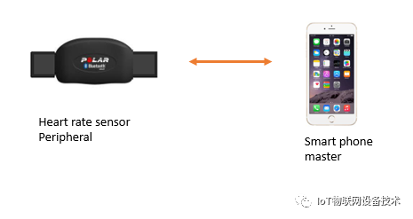
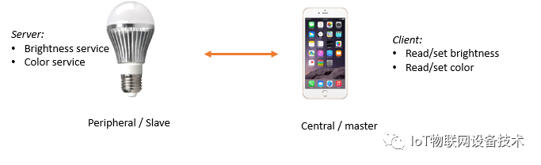
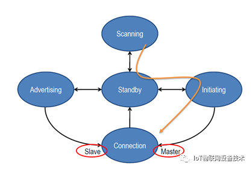

## 概述
https://docs.espressif.com/projects/esp-idf/zh_CN/latest/esp32/api-reference/bluetooth/index.html

蓝牙是一种短距离通信系统，蓝牙系统分为两种不同的技术：经典蓝牙(Classic Bluetooth)和蓝牙低功耗(Bluetooth Low Energy)。
从整体结构上，蓝牙可分为控制器(Controller)和主机(Host)两大部分 

## ESP32应用的三种场景：
1. 场景一(ESP-IDF默认)：在 ESP32 的系统上，选择 BLUEDROID 为蓝⽛牙主机，并通过 VHCI（软件实现的虚拟 HCI 接⼝）接⼝，访问控制器。
2. 场景⼆：在 ESP32 上运⾏控制器器（此时设备将单纯作为蓝⽛控制器使⽤），外接⼀个运⾏蓝⽛主机的设备（如运⾏ BlueZ 的 Linux PC、运⾏BLUEDROID 的 Android等）。
3. 场景三：此场景与场景二类似，特别之处在于，在 BQB（或其它认证）的控制器测试下，可以将 ESP32 作为 DUT，用 UART 作为 IO 接口，接上认证测试的 PC 机，即可完成认证。

## 蓝牙运行环境
ESP-IDF的默认运行环境为双核FreeRTOS，ESP32的蓝牙可按照功能分为多个任务(task)运行，不同任务的优先级也有不同，其中优先级最高的为运行控制器的任务。控制器任务对实时性的要求较高，在FreeRTOS系统中的优先级仅次于IPC任务(IPC任务用于双核CPU的进程通信)。BLUEDROID(ESP-IDF默认蓝牙主机)共包含4个任务，分别运行BTC、BTU、HCI UPWARD以及HCI DOWNWARD
 

## 主机架构
在 ESP-IDF 中，使用经过大量修改后的 BLUEDROID 作为蓝牙主机 (Classic BT + BLE)。

BLUEDROID内部大致分为2层：BTU层和BTC层(除去HCI)；BTU层主要负责蓝牙主机底层协议栈的处理，包括L2CAP、GATT/ATT、SMP、GAP以及部分规范等，并向上提供以“bta”为前缀的接口；BTC层主要负责向应用层提供接口支持、处理给予GATT的规范、处理杂项等，并向应用层提供以“esp”为前缀的接口。所有的API都在ESP_API层，开发者应当使用“esp”为前缀的蓝牙API(特殊的除外)

## 经典蓝牙
主机协议栈支持的经典蓝牙协议规范和协议如下：

规范：GAP、A2DP(SNK)、AVRCP(CT)
协议：L2CAP、SDP、AVDTP、AVCTP
 

### 协议和规范
1. L2CAP (蓝牙逻辑链路控制和适配协议)
    L2CAP信道共支持6种模式：基本L2CAP模式、流量控制模式、重传模式、加强重传模式、流模式、基于LE Credit的流量控制模式
2. SDP(服务发现协议)
    允许应用程序发现其他对等蓝牙设备提供的服务，并确定可用服务的特征。
3. GAP(通用访问规范)
    可提供有关设备可发现性、可连接性和安全性的模式和过程描述。
4. A2DP和AVRCP(高级音频分发规范、音频/视频远程控制规范)

## 蓝牙低功耗(BLE)
 GAP协议层定义了 BLE 设备的发现流程，设备管理理和设备连接的建立。
### BLE角色
对于一个BLE设备，当和其他蓝牙设备通信或者加入一个BLE网络时，其可能有四个角色：
1. Broadcaster: 又称为Advertiser，周期性的向周围设备广播数据，
2. Observer：又称为Scanner，可以监听广播数据或者搜索周围设备,
3. Central: 又称为master，负责扫描设备并发起建立请求，在建立连接后变成master
4. Peripheral: 可称为slave,  负责广播的并接收连接请求的设备在建立连接后称为slave

这些角色是链路层定义的，是根据设备是否建立连接来划分分的，可以将这四个类型的设备逻辑的划分为两组：
1. advertiser和scanner 
2. master和slave
advertiser 和 scanner属于广播阶段的概念，即在建立连接之前设备角色。master 和slave属于建立连接之后的概念，一旦建立连接，scanner角色变为master，advertiser变为slave

如一个心率感应器(Heart rate sensor)和手机连接 
心率感应器HRS(Heart rate sensor)发送广播数据，当手机扫描时，能发现心率感应器，并与其建立连接，那么建立连接后，心率感应器的角色是slave，而手机的角色是maser

### Server 和client
根据应用场景的需求,一个设备可以是master，也可以是slave或者二者兼备。初始化建立连接的设备称为master，负责广播的并接收连接请求的设备称为slave

通过上面的例子可以看到，在建立连接后，支持HRS的手环提供了检测心率的功能，称其为server，因为其提供了某种服务，而手机仅仅是将server端的功能获取并展现出来，称其为client。于是对于BLE设备，依据是否提供服务，可以将这个设备分为是server还是client。

Server 和client是ATT/GATT层定义的概念，ATT采用的是client/server模式的交互方式，Client从server端请求数据，server将数据发送给client。

Master和slaver是相对连接而言，client和server是独立于master和slave的概念，每个BLE设备有可能是client或者server或者二者兼备。

举例:  
一个支持BLE的灯可以使用手机APP通过BLE协议来控制，手机负责发现灯并主动发起建立连接，灯的角色是Peripheral，手机的角色是Central。

而灯提供了亮度和色彩控制服务，可以使用手机来调节，因此灯是一个服务的提供者(Server)角色，而手机是响应的client

### 状态转换
BLE定义的角色，可以相互转换，于是有一个或者多个状态机(BLE4.0仅支持一个状态机)，每个状态机可能有五种状态
  

1. Standby：没有任何活动，即不发送数据也不接收数据，
2. Advertising：发送广播数据
3. Scanning：监听广播数据或者主动扫描周围设备
4. Initiating：接到广播数据后，主动发起连接(CONNECT_REQ)，由Scanning的角色发起。
5. Connection：master和slave建立连接，而后两个设备在数据通道上通信，而不再使用广播和扫描的方式。