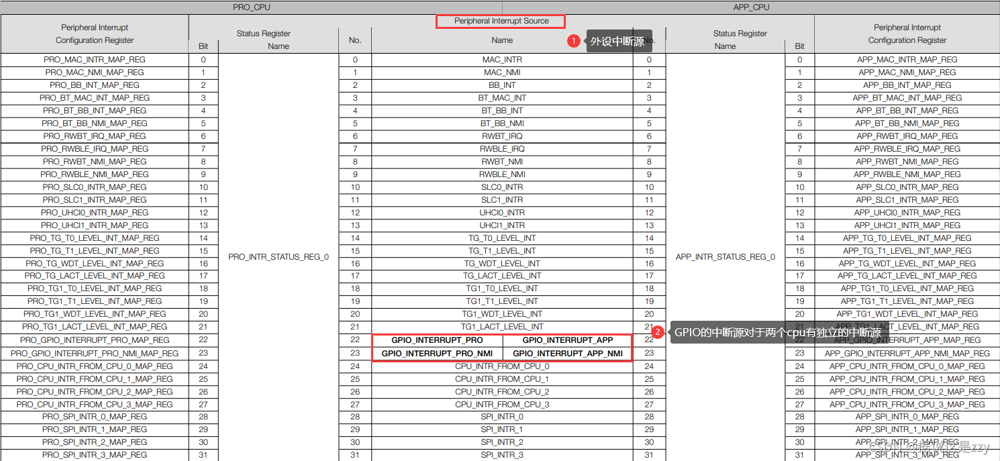

# ESP32 外部中断原理分析 & GPIO外部中断实战
1. 预备知识:
   * IO输出/队列/任务
2. 外部中断原理
   1. ESP32-GPIO
       * ESP32 共有 34 个 GPIO 管脚，通过配置对应的寄存器，可以为这些管脚分配不同的功能，包括如下几类 GPIO：只有数字功能的 GPIO、带模拟功能的 GPIO、带电容触摸功能的 GPIO 等。
       * 带模拟功能的 GPIO 和带电容触摸功能的 GPIO 可以被配置为数字 GPIO。大部分带数字功能的 GPIO 都可以被配置为内部上拉/下拉，或者被设置为高阻。当被配置为输入时，可通过读取寄存器获取输入值。输入管脚也可以被设置为通过边缘触发或电平触发来产生 CPU 中断。大部分数字 IO 管脚都是双向、非反相和三态的，包括带有三态控制的输入和输出缓冲器。这些管脚可以复用作其他功能，例如SDIO、UART、SPI 等（更多信息请参考附录 IO_MUX）。当芯片低功耗运行时，GPIO 可被设定为保持状态。
   2. ESP32-INTERRUPT
       * ESP32 中断矩阵将任一外部中断源单独分配到每个 CPU 的任一外部中断上。这提供了强大的灵活性，能适应不同的应用需求。这和Cortex-m架构的外部中断并不相同并不是通过NVIC向量表的方式而是中断矩阵来设置
       * 图1： 中断矩阵结构图 
       * 主要特性
          1. 接受 71 个外部中断源作为输入
          2. 为两个 CPU 分别生成 26 个外部中断（总共 52 个） 作为输出
          3. 屏蔽 CPU 的 NMI 类型中断
          4. 查询外部中断源当前的中断状态
       * 值得注意的是这里分出了两个概念：外部中断源、 CPU的外部中断 ，这是理解ESP32中断的核心
   3. ESP32-外部中断源
       * ESP32 总共有 71 个外部中断源。图2列出了所有外部中断源。ESP32 中的 71 个外部中断源中有 67 个可以分配给两个 CPU。其余的 4 个外部中断源只能分配给特定的 CPU，每个 CPU 2 个。GPIO_INTERRUPT_PRO和GPIO_INTERRUPT_PRO_NMI 只可以分配PRO _CPU，GPIO_INTERRUPT_APP 和GPIO_INTERRUPT_APP_NMI 只可以分配给 APP_CPU。因此，PRO_CPU 与 APP_CPU 各可以分配到 69 个外部中断源。
       * 图2： 外部中断源 
       * 图3： 外部GPIO中断源 
   4. ESP32-CPU的外部中断
       * 两个 CPU（PRO_CPU 和 APP_CPU）各有 32 个中断，其中 26 个为外部中断。图4列出了每个 CPU 所有的中断  
       * 图4： CPU的外部中断 
   5. ESP32-CPU的外部中断 & 外部中断源
       * 每一个外设的中断对应着一个中断源，每一个中断源对应着一个中断源重定向寄存器，如图3所示，GPIO_INTERRUPT_PRO中断源就对应着PRO_GPIO_INTERRUPT_PRO_MAP_REG寄存器通过设置这个寄存器就可以映射到对应的CPU的外部中断如图4所示。每当中断发生时，就可以通过对应CPU的外部中断的回调函数实现中断处理与服务。
       * 值得注意的是：CPU的一个外部中断可以由多个中断源触发，只要在对应的寄存器中写入对应的外部中断号即可。（将各个寄存器 PRO_Xn_MAP_REG (APP_Xn_MAP_REG) 都配成同样的 中断号。这些外设中断都会触发CPU Interrupt_P）

3. 外部中断实战
   1. 配置GPIO
      * ESP-IDF提供了一个结构体方便对其进行初始化，结构体如下
       ```c
        typedef struct {
            uint64_t pin_bit_mask;          /*!< GPIO pin: set with bit mask, each bit maps to a GPIO */
            gpio_mode_t mode;               /*!< GPIO mode: set input/output mode                     */
            gpio_pullup_t pull_up_en;       /*!< GPIO pull-up                                         */
            gpio_pulldown_t pull_down_en;   /*!< GPIO pull-down                                       */
            gpio_int_type_t intr_type;      /*!< GPIO interrupt type                                  */
        } gpio_config_t;

       ```
      * 这结构体中的五个成员都需要初始化，其中第一个通过设置对应位就可以开启对应号码的GPIO，剩下的就是模式设置和中断管理成员
      * 初始化的示例
        ```c
            #define GPIO(n) (1ULL<<n)
            #define K1      0
            gpio_config_t   cfg;
            cfg.pin_bit_mask = GPIO(K1);
            cfg.mode = GPIO_MODE_INPUT;
            cfg.pull_up_en = GPIO_PULLUP_ENABLE;
            cfg.pull_down_en = GPIO_PULLDOWN_DISABLE;
            cfg.intr_type = GPIO_INTR_NEGEDGE;
        ```
      * 这个例子通过宏定义 #define GPIO(n) (1ULL<<n) 来设定对应GPIO的位，这里就是设置 GPIO0，模式因为是外部中断所以设定为输入模式，同时因为是低电平触发，需要将IO口先拉高，所以这里使能了EXTI_config.pull_up_en = 1;将其拉高，最后一个是中断模式的设定，官方一共给出了6种中断模式.如下:
        ```c
            typedef enum {
                GPIO_INTR_DISABLE = 0,     /*!< Disable GPIO interrupt                             */
                GPIO_INTR_POSEDGE = 1,     /*!< GPIO interrupt type : rising edge                  */
                GPIO_INTR_NEGEDGE = 2,     /*!< GPIO interrupt type : falling edge                 */
                GPIO_INTR_ANYEDGE = 3,     /*!< GPIO interrupt type : both rising and falling edge */
                GPIO_INTR_LOW_LEVEL = 4,   /*!< GPIO interrupt type : input low level trigger      */
                GPIO_INTR_HIGH_LEVEL = 5,  /*!< GPIO interrupt type : input high level trigger     */
                GPIO_INTR_MAX,
            } gpio_int_type_t;
        ```
      *  从上向下分别是不使能中断，上下沿触发中断，高低电平触发中断，这里使用的是下降沿触发中断
      *  最后通过gpio_config函数来将结构体的设置导入到对应寄存器
         ```
            gpio_config(&cfg);
         ```
   2. 接下来就是对应中断的设定。
      *  首先开启GPIO中断，注意这个函数并不是需要每一个GPIO中断都要使用一次，而是开启整个gpio的中断，并向当前运行的核心注册GPIO中断，也就是说你调用这个函数在哪个核心，中断处理函数就在哪个核心进行运行。函数如下：
        ```
            gpio_install_isr_service(ESP_INTR_FLAG_LEVEL1);//!!!优先级设太高,有可能会崩溃
        ```
      *  最后是注册中断回调函数开启中断：
        ```
            gpio_isr_handler_add(K1,EXIT_Handelr,NULL);
        ```
      *  到这里一个外中断就初始化完成了。
   3. 对外部中断的处理
      * 首先,定义外部中断处理函数
        ```
            void EXIT_Handelr(void *arg)
            {
                printf("EXIT_Handelr");
            }
        ```
   4. 编译,烧写之后,接下按键,会发现CPU崩溃了.
      ```
        I (384) gpio: GPIO[0]| InputEn: 1| OutputEn: 0| OpenDrain: 0| Pullup: 1| Pulldown: 0| Intr:2
        Guru Meditation Error: Core  0 panic'ed (Instruction access fault). Exception was unhandled.

        Stack dump detected
        Core  0 register dump:
        MEPC    : 0x80000008  RA      : 0x4038cbc4  SP      : 0x3fc93800  GP      : 0x3fc8e488
        0x4038cbc4: _global_interrupt_handler at E:/esp/esp-idf-v4.3.2/components/riscv/interrupt.c:66
      ```
   5. 这是因为中断函数中不能调用printf.所以需要做个修改,如下:
      1. 定义一个队列,并在适当的地方初始化队列
      ```
        static xQueueHandle gpio_int_queue = NULL;

        gpio_int_queue = xQueueCreate(10, sizeof(uint32_t));//在适当的地方初始化队列
      ```
      2. 把中断函数改造成发送队列
      ```
        void EXIT_Handelr(void *arg)
        {
            uint32_t gpio_num = (uint32_t) arg;
            xQueueSendFromISR(gpio_int_queue, &gpio_num, NULL);
        }
      ```
      3. 开启一个任务,在任务中接受
      ```
        static void gpio_task(void *arg)
        {
            printf("gpio_task\n");
            for (;;) {
                uint32_t io_num;
                if (xQueueReceive(gpio_int_queue, &io_num, portMAX_DELAY)) {
                    printf("GPIO[%d] intr, val: %d\n", io_num, gpio_get_level(io_num));
                    vTaskDelay(100);
                }
            }
        }

        xTaskCreate(gpio_task, "gpio_task", 2048, NULL, 10, NULL);
      ```
   6. 完整代码
   ```c
    #include <stdio.h>
    #include <stdlib.h>

    #include "driver/gpio.h"
    #include "freertos/FreeRTOS.h"
    #include "freertos/queue.h"
    #include "freertos/task.h"

    static xQueueHandle gpio_int_queue = NULL;

    void EXIT_Handelr(void *arg)
    {
        uint32_t gpio_num = (uint32_t)arg;
        xQueueSendFromISR(gpio_int_queue, &gpio_num, NULL);
    }
    static void gpio_task(void *arg)
    {
        printf("gpio_task\n");
        for (;;) {
            uint32_t io_num;
            if (xQueueReceive(gpio_int_queue, &io_num, portMAX_DELAY)) {
                printf("GPIO[%d] intr, val: %d\n", io_num, gpio_get_level(io_num));
                vTaskDelay(100);
            }
        }
    }
    void int_init()
    {
    #define GPIO(n) (1ULL << n)
    #define K1 0
        gpio_config_t cfg;
        cfg.pin_bit_mask = GPIO(K1);
        cfg.mode = GPIO_MODE_INPUT;
        cfg.pull_up_en = GPIO_PULLUP_ENABLE;
        cfg.pull_down_en = GPIO_PULLDOWN_DISABLE;
        cfg.intr_type = GPIO_INTR_NEGEDGE;

        gpio_config(&cfg);
        gpio_install_isr_service(ESP_INTR_FLAG_LEVEL1);
        gpio_isr_handler_add(K1, EXIT_Handelr, (void *)K1);

        gpio_int_queue = xQueueCreate(10, sizeof(uint32_t));
        xTaskCreate(gpio_task, "gpio_task", 2048, NULL, 10, NULL);
    }

    void app_main(void)
    {
        int_init();

        while (1) {
            vTaskDelay(500 / portTICK_RATE_MS);
        }
    }
   ```


