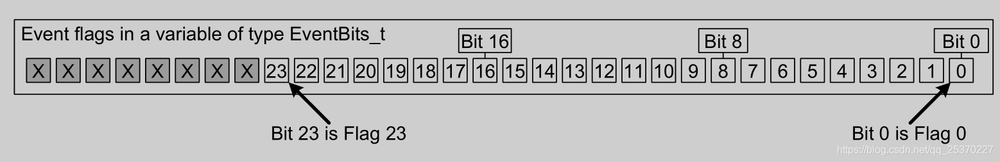

# eventGroup(事件组)https://www.freertos.org/zh-cn-cmn-s/xEventGroupSync.html
## 事件组概念与操作
  + 嵌入式实时操作系统必须实时响应事件，前面介绍了几种将事件传递给任务的方法，如信号量，队列。它们都具有一下特性：
    - 允许在阻塞态下等待单个事件的发送。
    - 在事件发送时可以取消阻塞的单个任务(取消的是等待事件优先级最高的任务)。
  + 事件组是FreeRTOS提供另一种事件传递的方法，它与队列和信号量的不同点：
    - 时间组允许任务在阻塞态下等待一个或多个事件。
    - 事件发生时，事件将取消阻塞等待同一事件或事件组合的所有任务。
  + 事件组的这些特性可以用于多个任务同步，将事件广播到多个任务，允许任务在阻塞态下等待一组事件中的任何一个发生，并允许任务在阻塞态等待多个事件以完成多个操作。有时也可以用单个时间组替代多个二值信号量，以减少RAM的使用。
  + 事件组功能是可选的，要使用事件组的功能，需要将event_groups.c添加到项目中
  + 一个生活中的例子
    + 学校组织秋游，组长在等待：
        - 张三：我到了
        - 李四：我到了
        - 王五：我到了
        - 组长说：好，大家都到齐了，出发！
    + 秋游回来第二天就要提交一篇心得报告，组长在焦急等待：张三、李四、王五谁先写好就交谁的。
    + 在这个日常生活场景中：
        - 出发：要等待这3个人都到齐，他们是"与"的关系
        - 交报告：只需等待这3人中的任何一个，他们是"或"的关系
    + 在FreeRTOS中，可以使用事件组(event group)来解决这些问题。
### 事件标志
  + 事件标志是一个布尔值(1或0)，用于指示事件是否发生。事件组是一组事件标志，事件标志只能是1或0，允许事件标志存储在一个位中，事件组中的所有事件标志的状态存储在单个变量中，其中每个事件标志由EvenBits_t类型的变量中的一个位表示，因此，事件标志也成为事件位。如果EvenBits_t变量中的某个位为1，则表示该位表示的事件以发生。如果EvenBits_t变量中的某个位为0，则表示该位表示的事件未发生。下图显示了各个事件标志位如何映射到EvenBits_t变量中的各个位。<br>
  + 例如：事件组的值为0x92，即事件位1、4、7为1，因此仅发生由位1、4、7表示的事件，如下图<br>
  + 其中，每位的具体意义由应用程序定义，例如：
    - 位0定义为“已接受到网络消息”。
    - 位1定义为“已将消息发送到网络”。
    - 位2定义为“网络中断”。
    - 等等。
  + 事件组用一个整数来表示，其中的高8位留给内核使用，可表示的位数由FreeRTOSConfig.h中的configUSE_16_BIT_TICKS配置：
    - configUSE_16_BIT_TICKS为1，则每个事件组可以包含8个可用事件位。
    - configUSE_16_BIT_TICKS为0，则每个事件组可以包含24个可用事件位。
    - 通常来说,configUSE_16_BIT_TICKS取决于CPU位数.16位CPU用使用16位更高效,32位CPU使用32位跟高效
### 事件组的操作
  + 事件组和队列、信号量等不太一样，主要集中在2个地方：
    + 唤醒谁？
        - 队列、信号量：事件发生时，只会唤醒一个任务
        - 事件组：事件发生时，会唤醒所有符号条件的任务，简单地说它有"广播"的作用
    + 是否清除事件？
        - 队列、信号量：是消耗型的资源，队列的数据被读走就没了；信号量被获取后就减少了
        - 事件组：被唤醒的任务有两个选择，可以让事件保留不动，也可以清除事件
    + 事件组的常规操作如下：
        - 先创建事件组
        - 任务C、D等待事件：
            - 等待什么事件？可以等待某一位、某些位中的任意一个，也可以等待多位。简单地说就是"或"、"与"的关系。
            - 得到事件时，要不要清除？可选择清除、不清除。
        - 任务A、B产生事件：设置事件组里的某一位、某些位
## 事件组函数
### 创建:xEventGroupCreate
   + 使用事件组之前，要先创建，得到一个句柄；使用事件组时，要使用句柄来表明使用哪个事件组
   + xEventGroupCreate(void) 
   ```c
   /* 创建一个事件组，返回它的句柄。
    * 此函数内部会分配事件组结构体 
    * 返回值: 返回句柄，非NULL表示成功
    */
    EventGroupHandle_t xEventGroupCreate( void );

    /* 创建一个事件组，返回它的句柄。
    * 此函数无需动态分配内存，所以需要先有一个StaticEventGroup_t结构体，并传入它的指针
    * 返回值: 返回句柄，非NULL表示成功
    */
    EventGroupHandle_t xEventGroupCreateStatic( StaticEventGroup_t * pxEventGroupBuffer );
   ```  
### 删除:vEventGroupDelete
   + 对于动态创建的事件组，不再需要它们时，可以删除它们以回收内存。
   + ```c
        /*
        * xEventGroup: 事件组句柄，你要删除哪个事件组
        */
        void vEventGroupDelete( EventGroupHandle_t xEventGroup )
    ``` 
### 设置事件:xEventGroupSetBits()
   + 可以设置事件组的某个位、某些位，使用的函数有2个：
     - 在任务中使用xEventGroupSetBits()
     - 在ISR中使用xEventGroupSetBitsFromISR()
   + 有一个或多个任务在等待事件，如果这些事件符合这些任务的期望，那么任务还会被唤醒。 
   + ```c
        /* 设置事件组中的位
        * xEventGroup: 哪个事件组
        * uxBitsToSet: 设置哪些位? 
        *              如果uxBitsToSet的bitX, bitY为1, 那么事件组中的bitX, bitY被设置为1
        *               可以用来设置多个位，比如 0x15 就表示设置bit4, bit2, bit0
        * 返回值: 返回原来的事件值(没什么意义, 因为很可能已经被其他任务修改了)
        */
        EventBits_t xEventGroupSetBits( EventGroupHandle_t xEventGroup,const EventBits_t uxBitsToSet );


        /* 设置事件组中的位
        * xEventGroup: 哪个事件组
        * uxBitsToSet: 设置哪些位? 
        *              如果uxBitsToSet的bitX, bitY为1, 那么事件组中的bitX, bitY被设置为1
        *               可以用来设置多个位，比如 0x15 就表示设置bit4, bit2, bit0
        * pxHigherPriorityTaskWoken: 有没有导致更高优先级的任务进入就绪态? pdTRUE-有, pdFALSE-没有
        * 返回值: pdPASS-成功, pdFALSE-失败
        */
        BaseType_t xEventGroupSetBitsFromISR( EventGroupHandle_t xEventGroup,const EventBits_t uxBitsToSet,
                                            BaseType_t * pxHigherPriorityTaskWoken );
     ```
 + 值得注意的是，ISR中的函数，比如队列函数xQueueSendToBackFromISR、信号量函数xSemaphoreGiveFromISR，它们会唤醒某个任务，最多只会唤醒1个任务。
    但是设置事件组时，有可能导致多个任务被唤醒，这会带来很大的不确定性。所以xEventGroupSetBitsFromISR函数不是直接去设置事件组，而是给一个FreeRTOS后台任务(daemon task)发送队列数据，由这个任务来设置事件组。
    如果后台任务的优先级比当前被中断的任务优先级高，xEventGroupSetBitsFromISR会设置*pxHigherPriorityTaskWoken为pdTRUE。
    如果daemon task成功地把队列数据发送给了后台任务，那么xEventGroupSetBitsFromISR的返回值就是pdPASS。
### 等待事件:xEventGroupWaitBits
  + 使用xEventGroupWaitBits来等待事件，可以等待某一位、某些位中的任意一个，也可以等待多位；等到期望的事件后，还可以清除某些位。
  + ```c
        EventBits_t xEventGroupWaitBits( EventGroupHandle_t xEventGroup,    //等待哪个事件组？
                                 const EventBits_t uxBitsToWaitFor,         //等待哪些位？哪些位要被测试？
                                 const BaseType_t xClearOnExit,             /*怎么测试？是"AND"还是"OR"？
                                                                            pdTRUE: 等待的位，全部为1;
                                                                            pdFALSE: 等待的位，某一个为1即可*/
                                 const BaseType_t xWaitForAllBits,          /*函数提出前是否要清除事件？
                                                                            pdTRUE: 清除uxBitsToWaitFor指定的位
                                                                            pdFALSE: 不清除*/
                                 TickType_t xTicksToWait );
       //返回值:返回的是事件值，如果期待的事件发生了，返回的是"非阻塞条件成立"时的事件值；如果是超时退出，返回的是超时时刻的事件值。
    ```
 +  举例如下：
    | 事件组的值  |uxBitsToWaitFor |xWaitForAllBits|   说明  |
    |------------|----------------|---------------|---------|
    |  0100      |	0101	      |   pdTRUE      |任务期望bit0,bit2都为1<br>当前值只有bit2满足，任务进入阻塞态<br>当事件组中bit0,bit2都为1时退出阻塞态|
    |  0100	     |   0110	      |   pdFALSE	  |任务期望bit0,bit2某一个为1<br>当前值满足，所以任务成功退出|
    |  0100	     |   0110         |   pdTRUE      |任务期望bit1,bit2都为1<br>当前值不满足，任务进入阻塞态<br>当事件组中bit1,bit2都为1时退出阻塞态|
 + 以使用xEventGroupWaitBits()等待期望的事件，它发生之后再使用xEventGroupClearBits()来清除。但是这两个函数之间，有可能被其他任务或中断抢占，它们可能会修改事件组。
 + 可以使用设置xClearOnExit为pdTRUE，使得对事件组的测试、清零都在xEventGroupWaitBits()函数内部完成，这是一个原子操作
### 同步事件:xEventGroupSync
 + xEventGroupSync()提供了一种使用事件组使得两个或多个任务同步的方法。该函数允许置位一个或多个事件位，然后等待所需事件位置位。当所需事件位置位后该函数返回，并在返回前将相关位复位
 + 有一个事情需要多个任务协同，比如：
    - 任务A：炒菜
    - 任务B：买酒
    - 任务C：摆台
    - A、B、C做好自己的事后，还要等别人做完；大家一起做完，才可开饭
 + 使用xEventGroupSync()函数可以同步多个任务：
   - 可以设置某位、某些位，表示自己做了什么事
   - 可以等待某位、某些位，表示要等等其他任务
   - 期望的时间发生后，xEventGroupSync()才会成功返回。
   - xEventGroupSync成功返回后，会清除事件 
   - ```c
        EventBits_t xEventGroupSync(EventGroupHandle_t xEventGroup,
                                const EventBits_t uxBitsToSet,      //要设置哪些事件？我完成了哪些事件？
                                                                    //比如0x05(0101)会导致事件组的bit0,bit2被设置为1
                                const EventBits_t uxBitsToWaitFor,  //等待那个位、哪些位？
                                                                    //比如0x15(10101)，表示要等待bit0,bit2,bit4都为1
                                TickType_t xTicksToWait );
        //返回的是事件值，如果期待的事件发生了，返回的是"非阻塞条件成立"时的事件值；如果是超时退出，返回的是超时时刻的事件值。
     ```
## 示例20: 等待多个事件 (xEventGroupWaitBits/xEventGroupSetBits)
  + 头文件: #include "freertos/event_groups.h"
  + 假设大厨要等手下做完这些事才可以炒菜：洗菜、生火。
    + 创建3个任务：
        - 任务1：洗菜
        - 任务2：生火
        - 任务3：炒菜
  + 执行流程如下
     - A："炒菜任务"优先级最高，先执行。它要等待的2个事件未发生：洗菜、生火，进入阻塞状态
     - B："生火任务"接着执行，它要等待的1个事件未发生：洗菜，进入阻塞状态
     - C："洗菜任务"接着执行，它洗好菜，发出事件：洗菜，然后调用F等待"炒菜"事件
     - D："生火任务"等待的事件满足了，从B处继续执行，开始生火、发出"生火"事件
     - E："炒菜任务"等待的事件满足了，从A出继续执行，开始炒菜、发出"炒菜"事件
     - F："洗菜任务"等待的事件满足了，退出F、继续执行C
     - 要注意的是，代码B处等待到"洗菜任务"后并不清除该事件，如果清除的话会导致"炒菜任务"无法执行。
 + ```c
    #define WASHING 0x01
    #define FIRING  0x02
    #define COOKING 0x04

    #define INFO(msg) ESP_LOGI("info",msg)

    EventGroupHandle_t eventGroup;

    void vTask1(void *arg)
    {
        while(1){
            INFO("wait for washing and firing");
            xEventGroupWaitBits(eventGroup, WASHING | FIRING, pdTRUE, pdTRUE, portMAX_DELAY);
            INFO("cooking ...");
            xEventGroupSetBits(eventGroup, COOKING);
            INFO("cook done");
        }
    }
    void vTask2(void *arg)
    {
        while(1){
            INFO("wait for washing");
            xEventGroupWaitBits(eventGroup, WASHING , pdFAIL, pdTRUE, portMAX_DELAY);
            INFO("firing ...");
            xEventGroupSetBits(eventGroup, FIRING);
            INFO("fire done");
        }
    }

    void vTask3(void *arg)
    {
        while(1){
            INFO("Washing ...");
            xEventGroupSetBits(eventGroup, WASHING);
            INFO("wash done");
            vTaskDelay(1000 * 10);
            INFO("wake up.prepare washing");
        }
    }
    void app_main(void)
    {
        eventGroup = xEventGroupCreate();
        xTaskCreate(vTask1, "cooking", 1024 * 2, NULL, 5, NULL);
        xTaskCreate(vTask2, "firing", 1024 * 2, NULL, 3, NULL);
        xTaskCreate(vTask3, "washing", 1024 * 2, NULL, 2, NULL);
    }
    ```
## 示例21: 任务同步 (xEventGroupSync)
  + 假设ABC三人要吃饭，各司其职：
    - A：炒菜
    - B：买酒
    - C：摆台
    - 三人都做完后，才可以开饭。
  + ```c
        #define BEER    (1ul << 0ul)
        #define TABLE   (1ul << 1ul)
        #define COOKING (1ul << 2ul)

        #define INFO(msg) ESP_LOGI("info",msg)

        EventGroupHandle_t eventGroup;

        void vTask1(void *arg)
        {
            while(1){
                INFO("cook ...");
                vTaskDelay(1000 * 1);
                INFO("cook reay");
                xEventGroupSync(eventGroup, COOKING, BEER | TABLE | COOKING, portMAX_DELAY );
                INFO("cook done");
                vTaskDelay(1000 * 5);
            }
        }
        void vTask2(void *arg)
        {
            while(1){
                INFO("beer ...");
                vTaskDelay(1000 * 2);
                INFO("beer reay");
                xEventGroupSync(eventGroup, BEER, BEER | TABLE | COOKING, portMAX_DELAY );
                INFO("beer done");
                vTaskDelay(1000 * 5);
            }
        }

        void vTask3(void *arg)
        {
            while(1){
                INFO("table ...");
                vTaskDelay(1000 * 1);
                INFO("table reay");
                xEventGroupSync(eventGroup, TABLE, BEER | TABLE | COOKING, portMAX_DELAY );
                INFO("table done");
                vTaskDelay(1000 * 5);
            }
        }
        void app_main(void)
        {
            eventGroup = xEventGroupCreate();
            xTaskCreate(vTask1, "cook", 1024 * 2, NULL, 5, NULL);
            xTaskCreate(vTask2, "beer", 1024 * 2, NULL, 3, NULL);
            xTaskCreate(vTask3, "table", 1024 * 2, NULL, 2, NULL);
        }
    ```