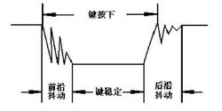

# ESP32C3的GPIO引脚
   * 官方文档:(https://docs.espressif.com/projects/esp-idf/zh_CN/latest/esp32/api-reference/peripherals/gpio.html)
   * ESP32C3 芯片具有 22 个物理 GPIO 管脚（GPIO0 ~ GPIO21）。每个管脚都可用作一个通用 IO，或连接一个内部的外设信号。通过 GPIO 交换矩阵和 IO MUX，可配置外设模块的输入信号来源于任何的 IO 管脚，并且外设模块的输出信号也可连接到任意 IO 管脚。这些模块共同组成了芯片的 IO 控制。
   * 更多详细信息，请参阅 ESP32 技术参考手册 > IO MUX 和 GPIO 矩阵（GPIO、IO_MUX）
   * 下表提供了各管脚的详细信息，部分 GPIO 具有特殊的使用限制
    <br>
   * Strapping 管脚
    <br>
# 常用GPIO-API介绍
   1. 头文件:#include "driver/gpio.h"
   2. 方式一:整体法
      * 通过调用gpio_config(const gpio_config_t *pGPIOConfig)函数配置GPIO
        * 函数gpio_config简介:GPIO通用配置,配置GPIO的模式，上拉，下拉，中断触发类型
        * 结构体gpio_config_t简介:
          ```c
          typedef struct {
            uint64_t pin_bit_mask;          /*!< GPIO pin: set with bit mask, each bit maps to a GPIO */
            gpio_mode_t mode;               /*!< GPIO mode: set input/output mode                     */
            gpio_pullup_t pull_up_en;       /*!< GPIO pull-up                                         */
            gpio_pulldown_t pull_down_en;   /*!< GPIO pull-down                                       */
            gpio_int_type_t intr_type;      /*!< GPIO interrupt type                                  */
          } gpio_config_t;

          ```
            <br>
          ```c 示例
            gpio_config_t   cfg;
            cfg.pin_bit_mask = (1ull<<1);
            cfg.mode = GPIO_MODE_OUTPUT;
            cfg.intr_type = GPIO_INTR_DISABLE;
            gpio_config(&cfg);
          ```
        * 重点:pin_bit_mask,是一个uint64_t类型的变量，有64个二进制位，其中部分位对应这个配置对哪些 GPIO 生效
          ```
            // 表示此配置对 GPIO2生效，因为这个64位数的第2位（从零开始）为1
            pin_bit_mask = 0b0100

            // 表示此配置对 GPIO0 和 GPIO5 生效，因为第0位和第5位为1
            pin_bit_mask = 0b100001

            // 表示此配置对 GPIO16 和 GPIO 18 生效，采用位运算
            pin_bit_mask = (1ull << 16) | (1ull << 18)

          ```
   3. 方式二:单个法
      * 涉及到的函数比较多，功能与结构体法基本一致，只不过是把结构体法拆成了函数
      * 设置GPIO方向: gpio_set_direction(gpio_num, mode)
      * 输出:gpio_set_level
        ```c
        // GPIO16置为输出
        gpio_set_direction(GPIO_NUM_16, GPIO_MODE_OUTPUT);
        gpio_set_level(GPIO_NUM_16, 0);//输出低电平
        ```
      * 输入:gpio_get_level
        ```c
        // GPIO16置为输出
        gpio_set_direction(16, GPIO_MODE_INPUT);
        //读取GPIO16
        gpio_get_level(16); 
        ```
      * 配置GPIO内部上下拉电阻 
        * gpio_reset_pin():  恢复默认设置
        * gpio_set_pull_mode(): 设置上下拉方式,共有4种
            ① GPIO_PULLUP_ONLY —— 仅上拉
            ② GPIO_PULLDOWN_ONLY —— 仅下拉
            ③ GPIO_PULLUP_PULLDOWN —— 全部启用
            ④ GPIO_FLOATING —— 悬空这个 GPIO
            示例:gpio_set_pull_mode(GPIO_NUM_4, GPIO_PULLUP_ONLY);
        * gpio_pullup_en(): 使能上拉
        * gpio_pullup_dis(): 禁止上拉
        * gpio_pulldown_en(): 使能下拉
        * gpio_pulldown_dis(): 禁止下拉
# esp32 输出实例：GPIO3间隔1秒闪烁一次
* 示例1:GPIO3间隔1秒闪烁一次
  ```c 
    #include "driver/gpio.h"

    void app_main()
    {
        gpio_config_t cfg;
        cfg.pin_bit_mask = (1ull << 3);
        cfg.mode = GPIO_MODE_OUTPUT;
        cfg.intr_type = GPIO_INTR_DISABLE;
        gpio_config(&cfg);

        while (1)
        {
            vTaskDelay(1000 / portTICK_RATE_MS);
            gpio_set_level(3,1);
            vTaskDelay(1000 / portTICK_RATE_MS);
            gpio_set_level(3,0);
        }
        
    }
  ```
*  练习：完成流水灯功能
      让LED1~LED8，间隔1秒亮过去
      即：LED1亮，1秒后，LED1灭，LED2亮，。。。。
      同时提交代码和效果图
# esp32输入
## 1:简单的GPIO输入(扫描按键)
 1. 硬件连接
    * 按键连接的原理图如下，按键没有被按下的时候，GPIO引脚的输入状态为高电平（按键所在的电路不通，引脚通过电阻接3.3V），当按键按下时，GPIO引脚的输入状态为低电平（按键所在的电路导通，引脚接GND。因此，只要检测到引脚的输入电平为低电平，证明按键被按下
     <br>
 2. 获取GPIO口输出电平函数：int gpio_get_level(gpio_num_t gpio_num);
 3. 实例：按下按键,灯亮,放开按键,灯灭
 ```c
    #include "driver/gpio.h"
    #define BTN1 0
    void app_main()
    {
        gpio_config_t cfg;
        cfg.pin_bit_mask = (1ull << 3);
        cfg.mode = GPIO_MODE_OUTPUT;
        gpio_config(&cfg);

        cfg.pin_bit_mask = (1ull << BTN1);
        cfg.mode = GPIO_MODE_INPUT;
        cfg.pull_up_en = GPIO_PULLUP_ENABLE;
        cfg.pull_down_en = GPIO_PULLDOWN_DISABLE;
        cfg.intr_type = GPIO_INTR_DISABLE;
        gpio_config(&cfg);

        while (1)
        {
            if(gpio_get_level((gpio_num_t)BTN1) == 0){
                gpio_set_level(3,0);
            }else{
                gpio_set_level(3,1);
            }
            vTaskDelay(100 / portTICK_RATE_MS);
        }
        
    }
 ```
 4. GPIO输入练习1(简易扫描按键)
    //按下按键,灯亮,放开按键,灯灭
    //GP16 -> key
    //GP17 -> LED 
## 2：按键消抖
 1. 按键消抖
    * 那么为什么要消抖呢?这是有历史原因的 (使用触摸就不用消抖了,因为它也没办法抖😏),具体原因如下所示
    * 按键消抖通常的按键所用开关为机械弹性开关，当机械触点断开、闭合时，由于机械触点的弹性作用，一个按键开关在闭合时不会马上稳定地接通，在断开时也不会一下子断开。因而在闭合及断开的瞬间均伴随有一连串的抖动，为了不产生这种现象而作的措施就是按键消抖.(出自<百度百科>) 
        <br> 
 2. GPIO输入练习2(完善扫描按键)
    按一下按键，LED灯亮，再按一下，LED灯灭
 3. 按键示例
    ```c
        void initKey(){
            gpio_config_t cfg={0};
            cfg.pin_bit_mask = (1ull << BTN1 | 1ull << BTN2);
            cfg.mode = GPIO_MODE_INPUT;
            cfg.pull_up_en = GPIO_PULLUP_ENABLE;
            cfg.pull_down_en = GPIO_PULLDOWN_DISABLE;
            cfg.intr_type = GPIO_INTR_DISABLE;
            gpio_config(&cfg);
        }
        uint32_t getKey(gpio_num_t btn)
        {
            if(gpio_get_level((gpio_num_t)btn) == 0){
                vTaskDelay(pdMS_TO_TICKS(20));
                if(gpio_get_level((gpio_num_t)btn) == 0){
                    while(1){
                        if(gpio_get_level((gpio_num_t)btn))
                            break;    
                    }
                    INFO("key down");
                    return btn;
                }
            }  
            return 0;
        }
    ```   
## 3:中断输入(实用的按键)
 1. 概念：具体的中断见[](esp32中断.md)
   程序执行过程中CPU会遇到一些特殊情况，是正在执行的程序被“中断”，cpu中止原来正在执行的程序，转到处理异常情况或特殊事件的程序去执行，结束后再返回到原被中止的程序处(断点)继续执行
 2. 中断的类型：
   程序执行被"中断“的事件(在硬件层面)有两类
      内部异常：在CPU内部发生的意外事件或特殊事件
      外部中断：在CPU外部发生的特殊事件,通过“中断请求“信号向CPU请求处理。
 3. 异常和中断的处理
    发生异常和中断事件后，系统将进入OS内核态对相应事件进行处理，即改变处理器状态(用户态->内核态)
    <br>
 4. 中断相关的API
    1. gpio_install_isr_service
        安装GPIO ISR服务的驱动，开启每个引脚GPIO中断处理程序 。
        这个函数与gpio_isr_register()不兼容。如果使用这个函数，ISR服务将提供一个全局GPIO ISR，并且通过gpio_isr_handler_add()函数注册单个的pin处理程序。
    2. gpio_uninstall_isr_service
        卸载GPIO ISR服务的驱动，释放相关资源
    3. gpio_isr_handler_add
        为GPIO引脚添加中断处理回调函数。
        ISR处理程序不再需要用IRAM_ATTR来声明，除非你在gpio_install_isr_service()中分配ISR时传递了ESP_INTR_FLAG_IRAM标志。
        这个ISR处理程序将从ISR中调用。因此存在一个堆栈大小限制(可在menuconfig中配置为“ISR堆栈大小”)。
    4. gpio_isr_handler_remove
        删除GPIO引脚的中断处理回调函数
    5. gpio_intr_enable
        使能GPIO中断
    6. gpio_intr_disable
        关闭GPIO中断
    7. gpio_isr_register
        统一为所有的GPIO口注册一个全局的ISR，即任何的GPIO中断触发，都会调用该中断处理函数
 5. 步骤
    * 1. IO设置：输入/上下拉/边沿类型 gpio_config();
    * 2. 设置中断优先级：gpio_install_isr_service()
    * 3. 添加一个中断：gpio_isr_handler_add(BTN_PIN,btn_isr_handle,(void *)BTN_PIN);
    * 4. 处理中断函数：void btn_isr_handle(void *arg) 
 6. 中断实例:实现功能：按键按下，LED灯亮，放开，LED灭
   ```c
   /**
    * 实现功能：按键按下，LED灯亮，放开，LED灭
    **/
    #define BTN_PIN 16
    #define LED_PIN 17

    void btn_isr_handle(void *arg)
    {
        int level = gpio_get_level(BTN_PIN);
        gpio_set_level(LED_PIN,!level);
    }

    void app_main(void)
    {
        gpio_config_t pGPIOConfig;
        pGPIOConfig.pin_bit_mask = 1ull<<LED_PIN;
        pGPIOConfig.mode = GPIO_MODE_OUTPUT;
        gpio_config(&pGPIOConfig);

        pGPIOConfig.pin_bit_mask = 1ull<<BTN_PIN;
        pGPIOConfig.mode = GPIO_MODE_INPUT;
        pGPIOConfig.pull_up_en = GPIO_PULLUP_ENABLE;
        pGPIOConfig.pull_down_en = GPIO_PULLDOWN_DISABLE;
        pGPIOConfig.intr_type = GPIO_INTR_ANYEDGE;
        gpio_config(&pGPIOConfig);

        gpio_install_isr_service(ESP_INTR_FLAG_LEVEL1);
        gpio_isr_handler_add(BTN_PIN,btn_isr_handle,(void *)BTN_PIN);

    }

   ```
## 按键长短按的实现 
   1. 预备知识: 
     1. [任务](task.md)
     2. [队列](queue.md)
     3. xTaskGetTickCount() 获取系统当前运行的时钟节拍数
   2. 思路
     1. 设置按键上升沿或者下降沿中断
     2. 进入中断后,发送信号量
     3. 开启一个线程或者在主循环中接收信号量,当接收到信号量后,读取IO电平
        (因为中断中不允许做日志打印等比较耗时的操作。我们实际应用中把日志去掉的话，完全在中断中直接做判断)
        1. 如果是低电平，则直接抛出“按键短按”，并记下当前的tick
        2. 如果是高电平，则判断当前的tick和之前的tick的差值是否大于阈值
            * 如果是，则抛出“按键长按”
     4. 该方式的好处：中断比较省CPU
     5. 该方式的劣处：只能在按键放开的时候，才能抛出“按键长按”，用户体验不是很好
   3. 步骤
     1. GPIO设为输入/双边沿触发/上拉:gpio_config();
     2. 设置中断优先级：gpio_install_isr_service()
     3.  添加一个按键中断：gpio_isr_handler_add(BTN_PIN,btn_isr_handle,(void *)BTN_PIN);
     4.  新建一个中断函数：void btn_isr_handle(void *arg)
         用xQueueSendFromISR()发送信号量
     5.  在主循环中接收信号量(用xQueueReceive()),当有信号量到达时,读取IO电平
        1. 如果是低电平，则直接抛出“按键短按”，并记下当前的tick(用xTaskGetTickCount())
        2. 如果是高电平，则判断当前的tick和之前的tick的差值是否大于阈值
            * 如果是，则抛出“按键长按” 
     6.  注意:以上步骤没有考虑消抖问题 
   4. 代码实现 
   ```c
    /**
    * 1. 设为输入：gpio_config();
    * 2. 设置中断优先级：gpio_install_isr_service()
    * 3. 添加一个中断：gpio_isr_handler_add(BTN_PIN,btn_isr_handle,(void *)BTN_PIN);
    * 4. 处理中断函数：void btn_isr_handle(void *arg)
    * 5. 队列的使用：在中断中发送信号，在外部接收信号
    *      #include "freertos/queue.h"
    *      static xQueueHandle btnQuene = NULL;
    *      btnQuene = xQueueCreate(10,sizeof(uint32_t));
    *      xQueueReceive(btnQuene, &btnNum, portMAX_DELAY);
    *      xQueueSendFromISR(btnQuene, &arg,NULL );
    * 6. 长按的判断：当按下时，记下现在的ticks,当抬起时判断是否是长按
    *       #include "sys/time.h"
    *       xTaskGetTickCount();
    *       
    **/
    #define BTN_PIN 16
    #define BTN2_PIN 17
    #define LED_PIN 18

    static xQueueHandle btnQuene = NULL;

    void btn_isr_handle(void *arg)
    {
        int level = gpio_get_level(BTN_PIN);
        gpio_set_level(LED_PIN,!level);
        xQueueSendFromISR(btnQuene, &arg,NULL );
    }

    void app_main(void)
    {
        gpio_config_t pGPIOConfig={0};
        pGPIOConfig.pin_bit_mask = 1ull<<LED_PIN;
        pGPIOConfig.mode = GPIO_MODE_OUTPUT;
        gpio_config(&pGPIOConfig);

        pGPIOConfig.pin_bit_mask = 1ull<<BTN_PIN | 1ull<<BTN2_PIN;
        pGPIOConfig.mode = GPIO_MODE_INPUT;
        pGPIOConfig.pull_up_en = GPIO_PULLUP_ENABLE;
        pGPIOConfig.pull_down_en = GPIO_PULLDOWN_DISABLE;
        pGPIOConfig.intr_type = GPIO_INTR_ANYEDGE;
        gpio_config(&pGPIOConfig);

        gpio_install_isr_service(ESP_INTR_FLAG_LEVEL1);
        gpio_isr_handler_add(BTN_PIN,btn_isr_handle,(void *)BTN_PIN);
        gpio_isr_handler_add(BTN2_PIN,btn_isr_handle,(void *)BTN2_PIN);

        btnQuene = xQueueCreate(10,sizeof(uint32_t));
        while(1){
            uint32_t btnNum;
            static uint32_t ticks = 0;
            xQueueReceive(btnQuene, &btnNum, portMAX_DELAY);
            int level = gpio_get_level(btnNum);
            if(level == 0){
                printf("down\n");
                ticks = xTaskGetTickCount(); 
            }else{
              if(xTaskGetTickCount() - ticks > (1000 * 1/ portTICK_RATE_MS))
                    printf("long press\n");
            }
            printf("btnNum:%d,level:%d\n", btnNum, level);
        }

    }
   ```
   5. 完善消抖
      1. 思路:
         1. 定义二个变量int shortPressTicks=0,longPressTicks=0;用于短按的消抖及长按的消抖
         2. 在判断是短按之前,先判断和上次按下的间隔是不是超过100ms,超过的话,认为是一次有效的短按,并更新ticks
         3. 在判断是长按之前,先判断和上次按下的间隔是不是超过1s,超过的话,认为是一次有效的长按,并更新ticks
      2. 实现:
        ```c
            #define BTN_PIN 16
            #define BTN2_PIN 17
            #define LED_PIN 18

            static xQueueHandle btnQuene = NULL;

            void btn_isr_handle(void *arg)
            {
                int level = gpio_get_level(BTN_PIN);
                gpio_set_level(LED_PIN,!level);
                xQueueSendFromISR(btnQuene, &arg,NULL );
            }

            void app_main(void)
            {
                gpio_config_t pGPIOConfig={0};
                pGPIOConfig.pin_bit_mask = 1ull<<LED_PIN;
                pGPIOConfig.mode = GPIO_MODE_OUTPUT;
                gpio_config(&pGPIOConfig);

                pGPIOConfig.pin_bit_mask = 1ull<<BTN_PIN | 1ull<<BTN2_PIN;
                pGPIOConfig.mode = GPIO_MODE_INPUT;
                pGPIOConfig.pull_up_en = GPIO_PULLUP_ENABLE;
                pGPIOConfig.pull_down_en = GPIO_PULLDOWN_DISABLE;
                pGPIOConfig.intr_type = GPIO_INTR_ANYEDGE;
                gpio_config(&pGPIOConfig);

                gpio_install_isr_service(ESP_INTR_FLAG_LEVEL1);
                gpio_isr_handler_add(BTN_PIN,btn_isr_handle,(void *)BTN_PIN);
                gpio_isr_handler_add(BTN2_PIN,btn_isr_handle,(void *)BTN2_PIN);

                btnQuene = xQueueCreate(10,sizeof(uint32_t));
                int downTicks=0,longTicks=0;
                while(1){
                    uint32_t btnNum;
                    static uint32_t ticks = 0;
                    xQueueReceive(btnQuene, &btnNum, portMAX_DELAY);
                    int level = gpio_get_level(btnNum);
                    if(level == 0){
                        ticks = xTaskGetTickCount(); 
                        if(ticks - downTicks > (100 / portTICK_PERIOD_MS)){
                            printf("down,%d\n",ticks);
                            downTicks = ticks;
                        }
                    }else{
                    //printf("%d,%d,%d\n",xTaskGetTickCount(),ticks,(1000 * 1/ portTICK_RATE_MS));  
                    if(xTaskGetTickCount() - ticks > (1000 * 1/ portTICK_RATE_MS)){
                            if(xTaskGetTickCount() - longTicks > (1000 * 1/ portTICK_RATE_MS))
                            {
                                longTicks = xTaskGetTickCount();
                                printf("long press\n");
                            }
                    }
                    }
                    //printf("btnNum:%d,level:%d\n", btnNum, level);
                }

            }
        ```
 ## 长短按练习
  * 按键短按，LED为1秒间隔闪烁
  * 按键长按，LED为5秒间隔闪烁
 