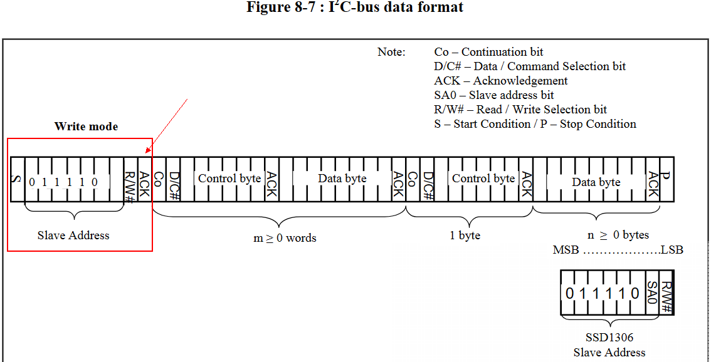

# I2C 驱动程序
## 概述
  + I2C 通讯协议(Inter－Integrated Circuit)是由 Phiilps 公司开发的，由于它引脚少，硬件实现简单，可扩展性强，不需要 USART、CAN 等通讯协议的外部收发设备，被广泛地使用在系统内多个集成电路(IC)间的通讯。

  + I2C总线由数据线SDA和时钟线SCL两条线构成通讯线路，即可发送数据，也可接收数据。在CPU与被控IC之间、IC与IC之间都可以进行双向传递，最高传送速率为400kbps,各种被控器件均并联在总线上，但每个器件都有唯一的地址
    <br>

## I2C总线通讯格式
  + I2C 的协议定义了通讯的起始和停止信号、数据有效性、响应、仲裁、时钟同步和地址广播等环节。
  + I2C 通讯过程的基本结构如下<br>

## 驱动程序的功能
  + I2C 驱动程序管理在 I2C 总线上设备的通信，该驱动程序具备以下功能：
    - 在主机模式下读写字节
    - 支持从机模式
    - 读取并写入寄存器，然后由主机读取/写入 

## 使用驱动程序
 1. 基本步骤：(主机通信为例)
    1. 配置驱动程序 - 设置初始化参数（如主机模式或从机模式，SDA 和 SCL 使用的 GPIO 管脚，时钟速度等）
    2. 安装驱动程序- 激活一个 I2C 控制器的驱动，该控制器可为主机也可为从机
    3. 主机模式下通信 - 发起通信（主机模式）
    4. 删除驱动程序- 在通信结束时释放 I2C 驱动程序所使用的资源  
 2. 配置驱动程序:i2c_param_config()
    ```c
        int i2c_master_port = I2C_NUM_1;
        static i2c_config_t conf;
        conf.mode = I2C_MODE_MASTER;
        conf.sda_io_num = I2C_MASTER_SDA_IO;
        conf.sda_pullup_en = GPIO_PULLUP_ENABLE;
        conf.scl_io_num = I2C_MASTER_SCL_IO;
        conf.scl_pullup_en = GPIO_PULLUP_ENABLE;
        conf.master.clk_speed = I2C_MASTER_FREQ_HZ;
        i2c_param_config(i2c_master_port, &conf);
    ```
 3. 安装驱动程序: `i2c_driver_install(i2c_master_port, conf.mode, 0, 256, 0);`
 4. 主机通信
    1. 读数据步骤<br>
    2. 写数据步骤<br>
    3. 判断i2c设置是否在线<br>
       ```c
            esp_err_t test_i2c(uint8_t slaveAddr)
            {
                i2c_cmd_handle_t cmd = i2c_cmd_link_create();

                i2c_master_start(cmd);
                i2c_master_write_byte(cmd, (slaveAddr << 1) | I2C_MASTER_WRITE, true);
                i2c_master_stop(cmd);

                esp_err_t esp_err = i2c_master_cmd_begin(I2C_MASTER_NUM, cmd, 10 / portTICK_PERIOD_MS);
                if (esp_err == ESP_OK) {
                    INFO("0x%2X online", slaveAddr);
                } else {
                    INFO("0x%2X offline", slaveAddr);
                }
                i2c_cmd_link_delete(cmd);
                return esp_err;
            }
       ```
    4. 写数据 <br>
       ```c
        void ssd1306_writeCmd(uint8_t dat)
        {
            i2c_cmd_handle_t cmd;
            cmd = i2c_cmd_link_create();
            i2c_master_start(cmd);
            i2c_master_write_byte(cmd, (OLED_I2C_ADDRESS << 1) | I2C_MASTER_WRITE, true);

            i2c_master_write_byte(cmd, 0x00, true);  // DC位为0 表示是命令
            i2c_master_write_byte(cmd, dat, true);
            
            i2c_master_stop(cmd);
            i2c_master_cmd_begin(I2C_MASTER_NUM, cmd, 10 / portTICK_PERIOD_MS);
            i2c_cmd_link_delete(cmd);
        }
       ```    