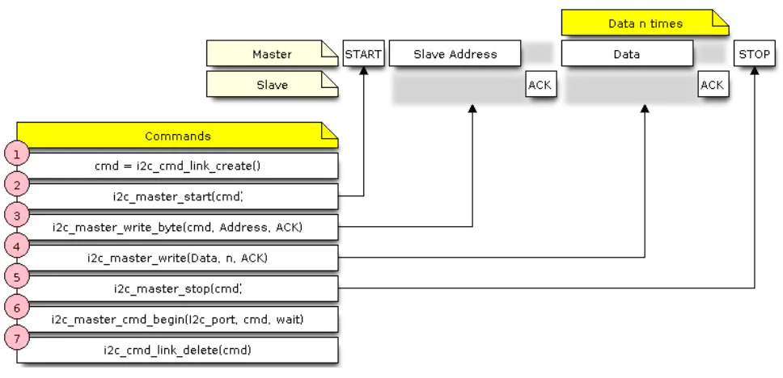
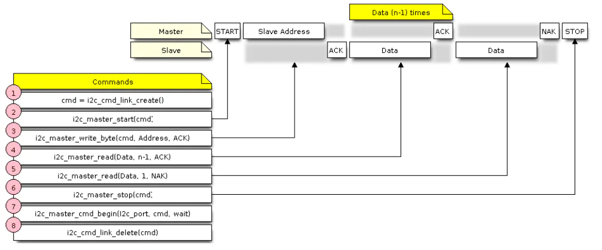

# IIC通讯
1. I2C简介
   1. I2C（Inter-Integrated Circuit ,内部集成电路) 总线是一种由飞利浦 Philip 公司开发的串行总线。是两条串行的总线，它由一根数据线（SDA）和一根 时钟线（SDL）组成。两条线都需要上拉电阻。I2C 总线上可以接多个 I2C 设备，每个器件都有一个唯一的地址识别。同一时间只能有一个主设备，其他为从设备。通常 MCU 作为主设备控制，外设作为从设备
2. esp32 IIC API:
   * 以下 I2C 接口位于 driver/include/driver/i2c.h。
   1. i2c_param_config
   2. i2c_driver_install
   3. i2c_cmd_link_create   创建并初始化I2C命令链接
   4. i2c_master_start
   5. i2c_master_write_byte
   6. i2c_master_write
   7. i2c_master_read_byte
   8. i2c_master_read
   9. i2c_master_stop
   10. i2c_master_cmd_begin
   11. i2c_cmd_link_delete
3. 编程流程
   1.  设置通信参数
       * 要建立I2C通信，请先配置驱动程序。这是通过设置结构的参数来完成的i2c_config_t：
       1. 设置I2C操作模式:从机或主机
       2. 配置通讯引脚:为SDA和SCL信号分配GPIO引脚
       3. 设置是否启用ESP32的内部上拉电路
       4. （仅限主机）设置I2C时钟速度
       5. （仅限从机）配置以下内容
          1. 是否启用10位地址模式
          2. 定义从机地址
       6. 调用函数i2c_param_config()配置以上的参数
       ```c 主机配置示例
        int i2c_master_port = 0;
        i2c_config_t conf = {
            .mode = I2C_MODE_MASTER,
            .sda_io_num = I2C_MASTER_SDA_IO,         // select GPIO specific to your project
            .sda_pullup_en = GPIO_PULLUP_ENABLE,
            .scl_io_num = I2C_MASTER_SCL_IO,         // select GPIO specific to your project
            .scl_pullup_en = GPIO_PULLUP_ENABLE,
            .master.clk_speed = I2C_MASTER_FREQ_HZ,  // select frequency specific to your project
            // .clk_flags = 0,          /*!< Optional, you can use I2C_SCLK_SRC_FLAG_* flags to choose i2c source clock here. */
        };
       ``` 
       ```c 从机配置示例
        int i2c_slave_port = I2C_SLAVE_NUM;
        i2c_config_t conf_slave = {
            .sda_io_num = I2C_SLAVE_SDA_IO,          // select GPIO specific to your project
            .sda_pullup_en = GPIO_PULLUP_ENABLE,
            .scl_io_num = I2C_SLAVE_SCL_IO,          // select GPIO specific to your project
            .scl_pullup_en = GPIO_PULLUP_ENABLE,
            .mode = I2C_MODE_SLAVE,
            .slave.addr_10bit_en = 0,
            .slave.slave_addr = ESP_SLAVE_ADDR,      // address of your project
        };
       ```
   2. 驱动程序安装 
       * 配置I2C驱动程序后，通过i2c_driver_install()使用以下参数调用该函数来安装它：
         1. 端口号，来自的两个端口号之一 i2c_port_t
         2. 主机或从机，选自 i2c_mode_t
         3. （仅限从机）为发送和接收数据分配的缓冲区大小。由于I2C是以主机为中心的总线，因此，只有在主机请求时，数据才能从从机传输到主机。因此，从设备通常将具有一个发送缓冲区，从设备在其中写入应用程序数据。数据保留在发送缓冲区中，由主机自行决定是否由主机读取。
         4. 用于分配中断的标志（请参阅esp_hw_support/include/esp_intr_alloc.h中的ESP_INTR_FLAG_ *值）
   3. 运行I2C通信
        * 安装I2C驱动程序后，ESP32已准备好与其他I2C设备通信。
        * ESP32的I2C控制器作为主设备负责与I2C从设备建立通信，并发送命令以触发从设备采取行动，例如进行测量并将读数发送回主设备。
        * 为了更好地进行流程组织，驱动程序提供了一个称为“命令链接”的容器，该容器应填充一系列命令，然后传递给I2C控制器以执行
        1. 作为主机通信
            * 主机写
                下面的示例显示了如何为I2C主设备构建命令链接，以将n个字节发送给从设备
                <br>
                1. 使用创建一个命令链接i2c_cmd_link_create()。
                    然后，用要发送到从站的一系列数据填充它
                    1. 起始位-i2c_master_start()
                    2. 从机地址- i2c_master_write_byte()。提供单字节地址作为此函数调用的参数。
                    3. 数据-一个或多个字节作为参数i2c_master_write()
                    4. 停止位-i2c_master_stop()
                2. 调用触发I2C控制器执行命令链接i2c_master_cmd_begin()
                3. 传输命令后，通过调用释放命令链接使用的资源i2c_cmd_link_delete()
            * 主机读
                下面的示例显示了如何为I2C主机构建命令链接以从从机读取n个字节。
                <br>
                与写入数据相比，第4步中的命令链接不是使用i2c_master_write...函数而是使用i2c_master_read_byte()或i2c_master_read()。同样，配置步骤5中的最后一次读取，以便主机不提供ACK位。
            * 写或读指示
                发送从机地址后（请参见上图两个步骤中的步骤3），主机会和从机进行写入或读取。
                有关主机实际操作的信息隐藏在从机地址的最低有效位中。
                因此，主机发送的用于将数据写入从机的命令链接包含该地址，如下所示：
                ```c
                i2c_master_write_byte(cmd, (ESP_SLAVE_ADDR << 1) | I2C_MASTER_WRITE, ACK_EN);
                ```
        2. 作为从机通信
           * 安装I2C驱动程序后，ESP32已准备好与其他I2C设备通信。
           * 该API为从机提供以下功能
             1. i2c_slave_read_buffer()
                当主机将数据写入从机时，从机将自动将其存储在接收缓冲区中。这允许从机应用程序i2c_slave_read_buffer()自行决定调用该函数。如果接收缓冲区中没有数据，此函数还具有一个参数，用于指定块时间。这将允许从机应用程序在指定的超时时间内等待数据到达缓冲区。
             2. i2c_slave_write_buffer()
                发送缓冲区用于存储从设备要以FIFO顺序发送给主设备的所有数据。数据将一直保留在那里，直到主设备请求为止。该函数i2c_slave_write_buffer()具有一个参数，用于指定发送缓冲区已满时的阻止时间。这将允许从机应用程序在指定的超时时间内等待发送缓冲区中足够的可用空间。
4. 编程示例
   1. 定义相关参数
      * 主要定义了相关引脚分批，从设备地址，ACK返回数据及iic总线时钟频率、传输位长度等
      ```c
       1 #define DATA_LENGTH          512  /*!<Data buffer length for test buffer*/
       2 #define RW_TEST_LENGTH       5  /*!<Data length for r/w test, any value from 0-DATA_LENGTH*/
       3 
       4 #define I2C_SLAVE_SCL_IO     26    /*!<gpio number for i2c slave clock  */
       5 #define I2C_SLAVE_SDA_IO     25    /*!<gpio number for i2c slave data */
       6 #define I2C_SLAVE_NUM I2C_NUM_0    /*!<I2C port number for slave dev */
       7 #define I2C_SLAVE_TX_BUF_LEN  (2*DATA_LENGTH) /*!<I2C slave tx buffer size */
       8 #define I2C_SLAVE_RX_BUF_LEN  (2*DATA_LENGTH) /*!<I2C slave rx buffer size */
       9 
       10 #define I2C_MASTER_SCL_IO    19    /*!< gpio number for I2C master clock */
       11 #define I2C_MASTER_SDA_IO    18    /*!< gpio number for I2C master data  */
       12 #define I2C_MASTER_NUM I2C_NUM_1   /*!< I2C port number for master dev */
       13 #define I2C_MASTER_TX_BUF_DISABLE   0   /*!< I2C master do not need buffer */
       14 #define I2C_MASTER_RX_BUF_DISABLE   0   /*!< I2C master do not need buffer */
       15 #define I2C_MASTER_FREQ_HZ    100000     /*!< I2C master clock frequency */
       16 
       17 #define ESP_SLAVE_ADDR 0x28         /*!< ESP32 slave address, you can set any 7bit value */
       18 #define WRITE_BIT  I2C_MASTER_WRITE /*!< I2C master write */
       19 #define READ_BIT   I2C_MASTER_READ  /*!< I2C master read */
       20 #define ACK_CHECK_EN   0x1     /*!< I2C master will check ack from slave*/
       21 #define ACK_CHECK_DIS  0x0     /*!< I2C master will not check ack from slave */
       22 #define ACK_VAL    0x0         /*!< I2C ack value */
       23 #define NACK_VAL   0x1         /*!< I2C nack value */

      ```
   2. i2c总线主机初始化
      * 主要是用来对i2c总线的引脚和功能进行配置
        1. conf.mode用来配置接口在i2c总线中的作用(I2C_MODE_SLAVE / I2C_MODE_MASTER)
        2. conf.sda_io_num 、conf.scl_io_num　配置I2C总线的数据引脚
        3. sda_pullup_en、scl_pullup_en　是否启动内部上拉电阻
        4. conf.master.clk_speed 设定时钟频率，标准模式100K
        5. 最后调用i2c_param_config函数对参数进行初始化，到这里，一个I2C的引脚配置就完成了。
        6. 对接口配置完后，需要调用i2c_driver_install对I2C总线的驱动进行安装，主要是对数据发送缓存进行内存分配。
      ```c
       void i2c_master_init()
       {
           int i2c_master_port = I2C_MASTER_NUM;
           i2c_config_t conf;
           conf.mode = I2C_MODE_MASTER;
           conf.sda_io_num = I2C_MASTER_SDA_IO;
           conf.sda_pullup_en = GPIO_PULLUP_ENABLE;
           conf.scl_io_num = I2C_MASTER_SCL_IO;
           conf.scl_pullup_en = GPIO_PULLUP_ENABLE;
           conf.master.clk_speed = I2C_MASTER_FREQ_HZ;
           i2c_param_config(i2c_master_port, &conf);
           i2c_driver_install(i2c_master_port, conf.mode, I2C_MASTER_RX_BUF_DISABLE, I2C_MASTER_TX_BUF_DISABLE, 0);
       }
       ```
   3. i2c总线从机初始化
      ```c
       1 void i2c_slave_init()
       2 {
       3     int i2c_slave_port = I2C_SLAVE_NUM;
       4     i2c_config_t conf_slave;
       5     conf_slave.sda_io_num = I2C_SLAVE_SDA_IO;
       6     conf_slave.sda_pullup_en = GPIO_PULLUP_ENABLE;
       7     conf_slave.scl_io_num = I2C_SLAVE_SCL_IO;
       8     conf_slave.scl_pullup_en = GPIO_PULLUP_ENABLE;
       9     conf_slave.mode = I2C_MODE_SLAVE;
       10     conf_slave.slave.addr_10bit_en = 0;
       11     conf_slave.slave.slave_addr = ESP_SLAVE_ADDR;
       12     i2c_param_config(i2c_slave_port, &conf_slave);
       13     i2c_driver_install(i2c_slave_port, conf_slave.mode, I2C_SLAVE_RX_BUF_LEN, I2C_SLAVE_TX_BUF_LEN, 0);
       14 }
       ```
   4. i2c总线主机向从机写数据函数
      * 主机向从机写地址函数主要是完成I2C协议的写数据操作。
           i2c_cmd_handle_t cmd = i2c_cmd_link_create();
           作用主要是创建和初始化I2C命令链接，这点是需要注意的（在构建I2C命令链接之前，我们需要调用i2c_cmd_link_create（）来创建命令链接。发送命令后，我们需要调用i2c_cmd_link_delete（）来释放并返回资源。）

      ```c
       1 esp_err_t i2c_master_write_slave(i2c_port_t i2c_num, uint8_t* data_wr, size_t size)
       2 {
       3     i2c_cmd_handle_t cmd = i2c_cmd_link_create();
       4     i2c_master_start(cmd);
       5     i2c_master_write_byte(cmd, ( ESP_SLAVE_ADDR << 1 ) | WRITE_BIT, ACK_CHECK_EN);
       6     i2c_master_write(cmd, data_wr, size, ACK_CHECK_EN);
       7     i2c_master_stop(cmd);
       8     esp_err_t ret = i2c_master_cmd_begin(i2c_num, cmd, 1000 / portTICK_RATE_MS);
       9     i2c_cmd_link_delete(cmd);
       10     return ret;
       11 }
      ```
   5. 主机读取从机数据函数
      ```c
       1 esp_err_t i2c_master_read_slave(i2c_port_t i2c_num, uint8_t* data_rd, size_t size)
       2 {
       3     if (size == 0) {
       4         return ESP_OK;
       5     }
       6     i2c_cmd_handle_t cmd = i2c_cmd_link_create();
       7     i2c_master_start(cmd);
       8     i2c_master_write_byte(cmd, ( ESP_SLAVE_ADDR << 1 ) | READ_BIT, ACK_CHECK_EN);
       9     if (size > 1) {
       10         i2c_master_read(cmd, data_rd, size - 1, ACK_VAL);
       11     }
       12     i2c_master_read_byte(cmd, data_rd + size - 1, NACK_VAL);
       13     i2c_master_stop(cmd);
       14     esp_err_t ret = i2c_master_cmd_begin(i2c_num, cmd, 1000 / portTICK_RATE_MS);
       15     i2c_cmd_link_delete(cmd);
       16     return ret;
       17 }
      ```
   6.  main函数
      ```c
       1 void app_main()
       2 {
       3     i2c_slave_init();
       4     i2c_master_init();
       5 
       6     int i = 0;
       7     int ret;
       8         uint8_t* data = (uint8_t*) malloc(DATA_LENGTH);
       9     uint8_t* data_wr = (uint8_t*) malloc(DATA_LENGTH);
       10     uint8_t* data_rd = (uint8_t*) malloc(DATA_LENGTH);
       11         //---------------------------------------------------
       12         for (i = 0; i < DATA_LENGTH; i++) {
       13             data[i] = i;
       14         }
       15         size_t d_size = i2c_slave_write_buffer(I2C_SLAVE_NUM, data, RW_TEST_LENGTH, 1000 / portTICK_RATE_MS);
       16         if (d_size == 0) {
       17             printf("i2c slave tx buffer full\n");
       18             ret = i2c_master_read_slave(I2C_MASTER_NUM, data_rd, DATA_LENGTH);
       19         } else {
       20             ret = i2c_master_read_slave(I2C_MASTER_NUM, data_rd, RW_TEST_LENGTH);
       21         }
       22         printf("*******************\n");
       23         printf("TASK  MASTER READ FROM SLAVE\n");
       24         printf("*******************\n");
       25         printf("====TASK Slave buffer data ====\n");
       26         disp_buf(data, d_size);
       27         if (ret == ESP_OK) {
       28             printf("====TASK Master read ====\n");
       29             disp_buf(data_rd, d_size);
       30         } else {
       31             printf("Master read slave error, IO not connected...\n");
       32         }
       33         vTaskDelay(2000 / portTICK_RATE_MS);
       34         //---------------------------------------------------
       35         int size;
       36         for (i = 0; i < DATA_LENGTH; i++) {
       37             data_wr[i] = i + 10;
       38         }
       39 
       40         ret = i2c_master_write_slave( I2C_MASTER_NUM, data_wr, RW_TEST_LENGTH);
       41         if (ret == ESP_OK) {
       42             size = i2c_slave_read_buffer( I2C_SLAVE_NUM, data, RW_TEST_LENGTH, 1000 / portTICK_RATE_MS);
       43         }
       44         printf("*******************\n");
       45         printf("TASK  MASTER WRITE TO SLAVE\n");
       46         printf("*******************\n");
       47         printf("----TASK Master write ----\n");
       48         disp_buf(data_wr, RW_TEST_LENGTH);
       49         if (ret == ESP_OK) {
       50             printf("----TASK Slave read: [%d] bytes ----\n", size);
       51             disp_buf(data, size);
       52         } else {
       53             printf("TASK Master write slave error, IO not connected....\n");
       54         }
       55         vTaskDelay(2000 / portTICK_RATE_MS);
       56 }

      ```
        实验现象:连接esp32的io18->io25,连接io19->io26
    7. 完整示例
       ```c
        #include <driver/gpio.h>
        #include <esp_system.h>
        #include <freertos/FreeRTOS.h>
        #include <freertos/task.h>
        #include <nvs_flash.h>
        #include <soc/rmt_struct.h>
        #include <stdio.h>
        #include "driver/i2c.h"

        #define DATA_LENGTH 512  /*!<Data buffer length for test buffer*/
        #define RW_TEST_LENGTH 5 /*!<Data length for r/w test, any value from 0-DATA_LENGTH*/

        #define I2C_SLAVE_SCL_IO 26                    /*!<gpio number for i2c slave clock  */
        #define I2C_SLAVE_SDA_IO 25                    /*!<gpio number for i2c slave data */
        #define I2C_SLAVE_NUM I2C_NUM_0                /*!<I2C port number for slave dev */
        #define I2C_SLAVE_TX_BUF_LEN (2 * DATA_LENGTH) /*!<I2C slave tx buffer size */
        #define I2C_SLAVE_RX_BUF_LEN (2 * DATA_LENGTH) /*!<I2C slave rx buffer size */

        #define I2C_MASTER_SCL_IO 19        /*!< gpio number for I2C master clock */
        #define I2C_MASTER_SDA_IO 18        /*!< gpio number for I2C master data  */
        #define I2C_MASTER_NUM I2C_NUM_1    /*!< I2C port number for master dev */
        #define I2C_MASTER_TX_BUF_DISABLE 0 /*!< I2C master do not need buffer */
        #define I2C_MASTER_RX_BUF_DISABLE 0 /*!< I2C master do not need buffer */
        #define I2C_MASTER_FREQ_HZ 100000   /*!< I2C master clock frequency */

        #define ESP_SLAVE_ADDR 0x28        /*!< ESP32 slave address, you can set any 7bit value */
        #define WRITE_BIT I2C_MASTER_WRITE /*!< I2C master write */
        #define READ_BIT I2C_MASTER_READ   /*!< I2C master read */
        #define ACK_CHECK_EN 0x1           /*!< I2C master will check ack from slave*/
        #define ACK_CHECK_DIS 0x0          /*!< I2C master will not check ack from slave */
        #define ACK_VAL 0x0                /*!< I2C ack value */
        #define NACK_VAL 0x1               /*!< I2C nack value */

        void i2c_master_init()
        {
            int i2c_master_port = I2C_MASTER_NUM;
            static i2c_config_t conf;
            conf.mode = I2C_MODE_MASTER;
            conf.sda_io_num = I2C_MASTER_SDA_IO;
            conf.sda_pullup_en = GPIO_PULLUP_ENABLE;
            conf.scl_io_num = I2C_MASTER_SCL_IO;
            conf.scl_pullup_en = GPIO_PULLUP_ENABLE;
            conf.master.clk_speed = I2C_MASTER_FREQ_HZ;
            i2c_param_config(i2c_master_port, &conf);
            i2c_driver_install(i2c_master_port, conf.mode, I2C_MASTER_RX_BUF_DISABLE,
                            I2C_MASTER_TX_BUF_DISABLE, 0);
        }
        void i2c_slave_init()
        {
            int i2c_slave_port = I2C_SLAVE_NUM;
            i2c_config_t conf_slave;
            conf_slave.sda_io_num = I2C_SLAVE_SDA_IO;
            conf_slave.sda_pullup_en = GPIO_PULLUP_ENABLE;
            conf_slave.scl_io_num = I2C_SLAVE_SCL_IO;
            conf_slave.scl_pullup_en = GPIO_PULLUP_ENABLE;
            conf_slave.mode = I2C_MODE_SLAVE;
            conf_slave.slave.addr_10bit_en = 0;
            conf_slave.slave.slave_addr = ESP_SLAVE_ADDR;
            i2c_param_config(i2c_slave_port, &conf_slave);
            i2c_driver_install(i2c_slave_port, conf_slave.mode, I2C_SLAVE_RX_BUF_LEN, I2C_SLAVE_TX_BUF_LEN,0);
        }
        esp_err_t i2c_master_write_slave(i2c_port_t i2c_num, uint8_t* data_wr, size_t size)
        {
            i2c_cmd_handle_t cmd = i2c_cmd_link_create();
            i2c_master_start(cmd);
            i2c_master_write_byte(cmd, (ESP_SLAVE_ADDR << 1) | WRITE_BIT, ACK_CHECK_EN);
            i2c_master_write(cmd, data_wr, size, ACK_CHECK_EN);
            i2c_master_stop(cmd);
            esp_err_t ret = i2c_master_cmd_begin(i2c_num, cmd, 1000 / portTICK_RATE_MS);
            i2c_cmd_link_delete(cmd);
            return ret;
        }
        esp_err_t i2c_master_read_slave(i2c_port_t i2c_num, uint8_t* data_rd, size_t size)
        {
            if (size == 0) {
                return ESP_OK;
            }
            i2c_cmd_handle_t cmd = i2c_cmd_link_create();
            i2c_master_start(cmd);
            i2c_master_write_byte(cmd, (ESP_SLAVE_ADDR << 1) | READ_BIT, ACK_CHECK_EN);
            if (size > 1) {
                i2c_master_read(cmd, data_rd, size - 1, ACK_VAL);
            }
            i2c_master_read_byte(cmd, data_rd + size - 1, NACK_VAL);
            i2c_master_stop(cmd);
            esp_err_t ret = i2c_master_cmd_begin(i2c_num, cmd, 1000 / portTICK_RATE_MS);
            i2c_cmd_link_delete(cmd);
            return ret;
        }
        void disp_buf(uint8_t* buf, int len)
        {
            int i;
            for (i = 0; i < len; i++) {
                printf("%02x ", buf[i]);
                if ((i + 1) % 16 == 0) {
                    printf("\n");
                }
            }
            printf("\n");
        }
        void app_main()
        {
            i2c_slave_init();
            i2c_master_init();

            int i = 0;
            int ret;
            uint8_t* data = (uint8_t*)malloc(DATA_LENGTH);
            uint8_t* data_wr = (uint8_t*)malloc(DATA_LENGTH);
            uint8_t* data_rd = (uint8_t*)malloc(DATA_LENGTH);
            //---------------------------------------------------
            for (i = 0; i < DATA_LENGTH; i++) {
                data[i] = i;
            }
            size_t d_size = i2c_slave_write_buffer(I2C_SLAVE_NUM, data, RW_TEST_LENGTH, 1000 / portTICK_RATE_MS);
            if (d_size == 0) {
                printf("i2c slave tx buffer full\n");
                ret = i2c_master_read_slave(I2C_MASTER_NUM, data_rd, DATA_LENGTH);
            } else {
                ret = i2c_master_read_slave(I2C_MASTER_NUM, data_rd, RW_TEST_LENGTH);
            }
            printf("*******************\n");
            printf("TASK  MASTER READ FROM SLAVE\n");
            printf("*******************\n");
            printf("====TASK Slave buffer data ====\n");
            disp_buf(data, d_size);
            if (ret == ESP_OK) {
                printf("====TASK Master read ====\n");
                disp_buf(data_rd, d_size);
            } else {
                printf("Master read slave error, IO not connected...\n");
            }
            vTaskDelay(2000 / portTICK_RATE_MS);
            //---------------------------------------------------
            int size;
            for (i = 0; i < DATA_LENGTH; i++) {
                data_wr[i] = i + 10;
            }

            ret = i2c_master_write_slave(I2C_MASTER_NUM, data_wr, RW_TEST_LENGTH);
            if (ret == ESP_OK) {
                size = i2c_slave_read_buffer(I2C_SLAVE_NUM, data, RW_TEST_LENGTH, 1000 / portTICK_RATE_MS);
            }
            printf("*******************\n");
            printf("TASK  MASTER WRITE TO SLAVE\n");
            printf("*******************\n");
            printf("----TASK Master write ----\n");
            disp_buf(data_wr, RW_TEST_LENGTH);
            if (ret == ESP_OK) {
                printf("----TASK Slave read: [%d] bytes ----\n", size);
                disp_buf(data, size);
            } else {
                printf("TASK Master write slave error, IO not connected....\n");
            }
            vTaskDelay(2000 / portTICK_RATE_MS);
        }

      ```
5. 作为主机通讯
    1. 定义相关参数及安装驱动
        ```c
        #define SCL_IO GPIO_NUM_8
        #define SDA_IO GPIO_NUM_7
        #define I2C_NUM I2C_NUM_0
        #define I2C_FREQ_HZ 100000
        #define I2C_TX_BUF_DISABLE 0
        #define I2C_RX_BUF_DISABLE 0

        #define WRITE_BIT I2C_MASTER_WRITE              /*!< I2C master write */
        #define READ_BIT I2C_MASTER_READ                /*!< I2C master read */
        #define ACK_CHECK_EN 0x1                        /*!< I2C master will check ack from slave*/
        #define ACK_CHECK_DIS 0x0                       /*!< I2C master will not check ack from slave */
        #define ACK_VAL 0x0                             /*!< I2C ack value */
        #define NACK_VAL 0x1                            /*!< I2C nack value */

        #define SLAVE_ADDR   0xC0 >> 1 // TEA5767
        int I2C_Init(void)
        {
            int i2c_master_port = I2C_NUM;
            i2c_config_t conf = {
                .mode = I2C_MODE_MASTER,
                .sda_io_num = SDA_IO, // select GPIO specific to your project
                .sda_pullup_en = GPIO_PULLUP_ENABLE,
                .scl_io_num = SCL_IO, // select GPIO specific to your project
                .scl_pullup_en = GPIO_PULLUP_ENABLE,
                .master.clk_speed = I2C_FREQ_HZ, // select frequency specific to your project
                // .clk_flags = 0,          /*!< Optional, you can use I2C_SCLK_SRC_FLAG_* flags to choose i2c source clock here. */
            };
            i2c_param_config(i2c_master_port, &conf);
            return i2c_driver_install(i2c_master_port, conf.mode, I2C_RX_BUF_DISABLE, I2C_TX_BUF_DISABLE, 0);
        }
        ```
    2. 包装写入函数
        ```c
        int I2C_Master_Transmit(uint8_t slaveAddr, uint8_t regAddr, uint8_t *pData, uint16_t dataLen)
        {
            int ret;
            i2c_cmd_handle_t cmd = i2c_cmd_link_create();
            i2c_master_start(cmd);
            i2c_master_write_byte(cmd, (slaveAddr << 1) | WRITE_BIT, ACK_CHECK_EN);
            if(NULL != regAddr)
            {
                i2c_master_write_byte(cmd, regAddr, ACK_CHECK_EN);
            }
            i2c_master_write(cmd, pData, dataLen, ACK_CHECK_EN);
            i2c_master_stop(cmd);
            ret = i2c_master_cmd_begin(I2C_NUM, cmd, 1000 / portTICK_RATE_MS);
            i2c_cmd_link_delete(cmd);
            return ret;
        }
        ```
    3. 包装读取函数
        ```c
            int I2C_Master_Receive(uint8_t slaveAddr, uint8_t regAddr, uint8_t *pData, uint16_t dataLen)
            {
                int ret;
                i2c_cmd_handle_t cmd = i2c_cmd_link_create();
                i2c_master_start(cmd);
                i2c_master_write_byte(cmd, (slaveAddr << 1) | READ_BIT, ACK_CHECK_EN);
                if(NULL != regAddr)
                {
                    i2c_master_write_byte(cmd, regAddr, ACK_CHECK_EN);
                }
                i2c_master_read(cmd, pData, dataLen, ACK_VAL);
                i2c_master_stop(cmd);
                ret = i2c_master_cmd_begin(I2C_NUM, cmd, 1000 / portTICK_RATE_MS);
                i2c_cmd_link_delete(cmd);
                return ret;
            }
        ```
    4. 使用
        ```c
            uint8_t data;
            I2C_Init();
            data = 0x01;
            I2C_Master_Transmit(SLAVE_ADDR, NULL, &data, 1);
        ```
    5. 实例:TEA5767驱动
        ```c
        #include <driver/gpio.h>
        #include <esp_system.h>
        #include <freertos/FreeRTOS.h>
        #include <freertos/task.h>
        #include <nvs_flash.h>
        #include <soc/rmt_struct.h>
        #include <stdio.h>
        #include "driver/i2c.h"

        #define SCL_IO GPIO_NUM_8
        #define SDA_IO GPIO_NUM_7
        #define I2C_NUM I2C_NUM_0
        #define I2C_FREQ_HZ 100000
        #define I2C_TX_BUF_DISABLE 0
        #define I2C_RX_BUF_DISABLE 0

        #define WRITE_BIT I2C_MASTER_WRITE              /*!< I2C master write */
        #define READ_BIT I2C_MASTER_READ                /*!< I2C master read */
        #define ACK_CHECK_EN 0x1                        /*!< I2C master will check ack from slave*/
        #define ACK_CHECK_DIS 0x0                       /*!< I2C master will not check ack from slave */
        #define ACK_VAL 0x0                             /*!< I2C ack value */
        #define NACK_VAL 0x1                            /*!< I2C nack value */

        //#define SLAVE_ADDR   0x23 // 从机地址
        #define SLAVE_ADDR   0xC0 >> 1 // TEA5767

        #define TEA5767_MAX_KHZ     108000  // 最高频率 108M
        #define TEA5767_MIN_KHZ     87500   // 最低频率 87.5M

        uint32_t g_frequency = TEA5767_MIN_KHZ ;
        static uint8_t s_radioWriteData[5] = {0x31,0xA0,0x20,0x11,0x00};          // 要写入TEA5767的数据，默认存台的PLL,104.3MHz
        static uint8_t s_radioReadData[5] = {0};                                  // TEA5767读出的状态
        static uint32_t s_pll = 0;


        int I2C_Master_Transmit(uint8_t slaveAddr, uint8_t regAddr, uint8_t *pData, uint16_t dataLen)
        {
            int ret;
            i2c_cmd_handle_t cmd = i2c_cmd_link_create();
            i2c_master_start(cmd);
            i2c_master_write_byte(cmd, (slaveAddr << 1) | WRITE_BIT, ACK_CHECK_EN);
            if(NULL != regAddr)
            {
                i2c_master_write_byte(cmd, regAddr, ACK_CHECK_EN);
            }
            i2c_master_write(cmd, pData, dataLen, ACK_CHECK_EN);
            i2c_master_stop(cmd);
            ret = i2c_master_cmd_begin(I2C_NUM, cmd, 1000 / portTICK_RATE_MS);
            i2c_cmd_link_delete(cmd);
            return ret;
        }

        int I2C_Master_Receive(uint8_t slaveAddr, uint8_t regAddr, uint8_t *pData, uint16_t dataLen)
        {
            int ret;
            i2c_cmd_handle_t cmd = i2c_cmd_link_create();
            i2c_master_start(cmd);
            i2c_master_write_byte(cmd, (slaveAddr << 1) | READ_BIT, ACK_CHECK_EN);
            if(NULL != regAddr)
            {
                i2c_master_write_byte(cmd, regAddr, ACK_CHECK_EN);
            }
            i2c_master_read(cmd, pData, dataLen, ACK_VAL);
            i2c_master_stop(cmd);
            ret = i2c_master_cmd_begin(I2C_NUM, cmd, 1000 / portTICK_RATE_MS);
            i2c_cmd_link_delete(cmd);
            return ret;
        }


        //由频率计算PLL
        void TEA5767_GetPLL(void)
        {
            uint8_t hlsi;
            hlsi = s_radioWriteData[2] & 0x10;                                  // HLSI位
            if(hlsi)
            {
                s_pll = (uint32_t)((float)((g_frequency+225)*4)/(float)32.768);   // 频率单位:k
            }
            else
            {
                s_pll = (uint32_t)((float)((g_frequency-225)*4)/(float)32.768);   // 频率单位:k
            }
        }

        /**
        @brief 读TEA5767状态
        @param 无
        @return 无
        */
        void TEA5767_Read(void)
        {
            uint8_t i;
            uint8_t tempLow;
            uint8_t tempHigh;
            s_pll = 0;
            
            I2C_Master_Receive(SLAVE_ADDR, NULL , &s_radioReadData, 5);
            tempLow = s_radioReadData[1];                                       // 得到s_pll低8位 
            tempHigh = s_radioReadData[0];                                      // 得到s_pll高6位
            tempHigh &= 0x3f;
            s_pll = tempHigh * 256 + tempLow;                                   // PLL值 
        }
        /**
        @brief 手动搜索电台，不用考虑TEA5767用于搜台的相关位:SM,SUD
        @param mode -[in] 搜索方式，mode=1，向上搜索，频率值+0.1MHz；mode=0，向下搜索，频率值-0.1MHz
        @return 无
        */
        void TEA5767_Search(uint8_t mode)
        {
            TEA5767_Read();                                                     // 读取当前频率值 
            if(mode)                                                            // 向上搜索
            {
                g_frequency += 100;
                if(g_frequency > TEA5767_MAX_KHZ)                               // 频率达到最大值
                {
                    g_frequency = TEA5767_MIN_KHZ;
                }
            }
            else
            {
                g_frequency -= 100;
                if(g_frequency < TEA5767_MIN_KHZ)
                {
                    g_frequency = TEA5767_MAX_KHZ;
                }
            }          
            TEA5767_GetPLL();                                                   // 计算PLL值
            s_radioWriteData[0] = s_pll / 256;
            s_radioWriteData[1] = s_pll % 256;
            s_radioWriteData[2] = 0x20;
            s_radioWriteData[3] = 0x11;
            s_radioWriteData[4] = 0x00;
            I2C_Master_Transmit(SLAVE_ADDR, NULL, &s_radioWriteData, 5);
            TEA5767_Read();
            if(s_radioReadData[0] & 0x80)										// 搜台成功，RF=1，可保存其频率值待用
            {
                printf(" frequency=%d\n", (int)g_frequency);
            } else {
                printf("s_radioReadData[0]:%x\n ",s_radioReadData[0]);
            }
        }

        void autoSearch(uint8_t mode)
        {
            TEA5767_Read(); 
            if(mode){
                s_radioWriteData[2] = 0xa0;
            }else{
                s_radioWriteData[2] = 0x20;
            }          
            TEA5767_GetPLL();                                                   // 计算PLL值
            s_radioWriteData[0] = s_pll / 256 + 0x40;
            s_radioWriteData[1] = s_pll % 256;
            //s_radioWriteData[2] = 0x20;
            s_radioWriteData[3] = 0x11;
            s_radioWriteData[4] = 0x00;
            I2C_Master_Transmit(SLAVE_ADDR, NULL, &s_radioWriteData, 5);
            TEA5767_Read();
            if(s_radioReadData[0] & 0x80)										// 搜台成功，RF=1，可保存其频率值待用
            {
                printf(" frequency=%d\n", (int)g_frequency);
            } else {
                printf("s_radioReadData[0]:%x\n ",s_radioReadData[0]);
            }   
        }

        void TEA5767_Mute(uint8_t mode)
        {		
            if(mode == 1)
            {
                s_radioWriteData[0] = s_radioWriteData[0] | 0x80;//静音
            }
            else
            {
                s_radioWriteData[0] = s_radioWriteData[0] & 0x7F;
            }
            
            I2C_Master_Transmit(SLAVE_ADDR, NULL, &s_radioWriteData, 5);
        }


        void TEA5767_SetFrequency(uint32_t frequency) //单位:KHz
        {
            g_frequency = frequency;
            TEA5767_GetPLL();
            s_radioWriteData[0] = s_pll / 256;
            s_radioWriteData[1] = s_pll % 256;
            s_radioWriteData[2] = 0x20;
            s_radioWriteData[3] = 0x11;
            s_radioWriteData[4] = 0x00;
            
            I2C_Master_Transmit(SLAVE_ADDR, NULL, &s_radioWriteData, 5);
        }

        int I2C_Init(void)
        {
            int i2c_master_port = I2C_NUM;
            i2c_config_t conf = {
                .mode = I2C_MODE_MASTER,
                .sda_io_num = SDA_IO, // select GPIO specific to your project
                .sda_pullup_en = GPIO_PULLUP_ENABLE,
                .scl_io_num = SCL_IO, // select GPIO specific to your project
                .scl_pullup_en = GPIO_PULLUP_ENABLE,
                .master.clk_speed = I2C_FREQ_HZ, // select frequency specific to your project
                // .clk_flags = 0,          /*!< Optional, you can use I2C_SCLK_SRC_FLAG_* flags to choose i2c source clock here. */
            };
            i2c_param_config(i2c_master_port, &conf);
            return i2c_driver_install(i2c_master_port, conf.mode, I2C_RX_BUF_DISABLE, I2C_TX_BUF_DISABLE, 0);
        }


        void Init_TEA5767(void)
        {
            uint8_t data;
            I2C_Init();
            TEA5767_SetFrequency(98700);
        
            // data = 0x01;
            // I2C_Master_Transmit(SLAVE_ADDR, NULL, &data, 1);
        }

        void app_main(void)
        {
            Init_TEA5767();
            printf("Init_BH1750\n");
        }
        ```