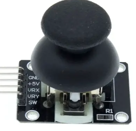

# [游戏摇杆JOYStick](joystick.md)
  1. 
  2. 引脚:五个引脚分别为GND  +5V  x y z（按下）
  3. 原理:
     1. 十字摇杆为一个双向的10k电阻器，随着摇杆方向不同，抽头的阻值随着变化。
     2. 本模块使用5v供电，原始状态下x,y读出电压为2.5v左右，当随箭头方向按下，读电压值随着增加，最大到5v；箭头相反方向按下，读出电压值减少，最小为0v。
     3. 也就是说XY坐标可以通过ADC判断电压来确定位置！z是一个KEY
  4. 编程思路:
     1. 用两个ADC通道读取xy电压  一个I/O口来检测是否按下
     2. ```c
        #include "driver/adc.h"
        #define BTN1 23
        void initKey()
        {
            gpio_config_t cfg = {0};
            cfg.pin_bit_mask = (1ull << BTN1);
            cfg.mode = GPIO_MODE_INPUT;
            cfg.pull_up_en = GPIO_PULLUP_ENABLE;
            cfg.pull_down_en = GPIO_PULLDOWN_DISABLE;
            cfg.intr_type = GPIO_INTR_DISABLE;
            gpio_config(&cfg);
        }
        uint8_t keyUp = 1;
        uint32_t getKey(gpio_num_t btn)
        {
            if (gpio_get_level((gpio_num_t)btn) == 0) {
                vTaskDelay(pdMS_TO_TICKS(20));
                if (gpio_get_level((gpio_num_t)btn) == 0) {
                    if(keyUp == 1){
                        keyUp = 0;
                        return btn;
                    }
                    return 0;
                }
            }
            keyUp = 1;
            return 0;
        }
        void app_main()
        {
            adc1_config_width(ADC_WIDTH_BIT_12);
            adc1_config_channel_atten(ADC_CHANNEL_6, ADC_ATTEN_DB_11);  // GPIO34
            adc1_config_channel_atten(ADC_CHANNEL_7, ADC_ATTEN_DB_11);  // GPIO35
            initKey();
            while (1) {
                int x = adc1_get_raw(ADC_CHANNEL_6);
                int y = adc1_get_raw(ADC_CHANNEL_7);
                // printf("x:%d,y:%d\n", x, y);
                if (getKey(BTN1) == BTN1) {
                    printf("key down\n");
                    printf("x:%d,y:%d\n", x, y);
                }
                vTaskDelay(pdMS_TO_TICKS(10));
            }
        }
        ```
  5. 练习:配合4位数码码,用摇杆设置时间,左右用来选设置的位数,上下用来调时,按下用来确认