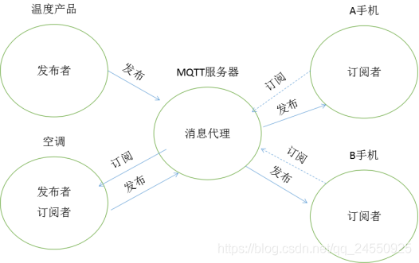
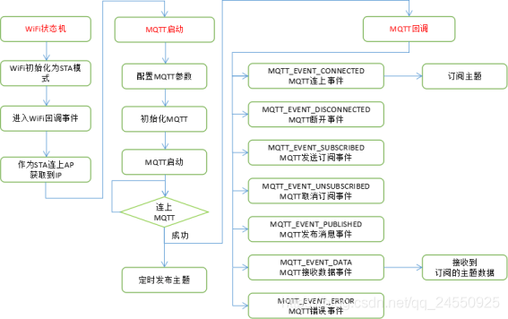

1. 简介
    MQTT(消息队列遥测传输)是ISO 标准(ISO/IEC PRF 20922)下基于发布/订阅范式的消息协议。它工作在 TCP/IP协议族上，是为硬件性能低下的远程设备以及网络状况糟糕的情况下而设计的发布/订阅型消息协议，为此，它需要一个消息中间件 （服务器）。

    通过MQTT协议，目前已经扩展出了数十个MQTT服务器端程序，可以通过PHP，JAVA，Python，C，C#等系统语言来向MQTT发送相关消息。

    此外，国内很多企业都广泛使用MQTT作为Android手机客户端与服务器端推送消息的协议。MQTT由于开放源代码，耗电量小等特点。在物联网领域，传感器与服务器的通信，信息的收集，MQTT都可以作为考虑的方案之一。在未来MQTT会进入到我们生活的各各方面。

    所以，如果物联网设备想要联网，MQTT是不二选择
2. MQTT特点
    MQTT协议是为大量计算能力有限，且工作在低带宽、不可靠的网络的远程传感器和控制设备通讯而设计的协议，它具有以下主要的几项特性：
    1. 使用发布/订阅消息模式，提供一对多的消息发布，解除应用程序耦合；
    2. 对负载内容屏蔽的消息传输；
    3. 使用 TCP/IP 提供网络连接；
    4. 有三种消息发布服务质量：
    1. “至多一次”，消息发布完全依赖底层 TCP/IP 网络。会发生消息丢失或重复。这一级别可用于如下情况，环境传感器数据，丢失一次读记录无所谓，因为不久后还会有第二次发送。
    2. “至少一次”，确保消息到达，但消息重复可能会发生。
    3. “只有一次”，确保消息到达一次。这一级别可用于如下情况，在计费系统中，消息重复或丢失会导致不正确的结果。
    小型传输，开销很小（固定长度的头部是 2 字节），协议交换最小化，以降低网络流量；
    这就是为什么在介绍里说它非常适合物联网领域，要知道嵌入式设备的运算能力和带宽都相对薄弱，使用这种协议来传递消息再适合不过了。
3. 实现方式　　
    实现MQTT协议需要客户端和服务器端通讯完成，在通讯过程中，MQTT协议中有三种身份：发布者（Publish）、代理（Broker）（服务器）、订阅者（Subscribe）。其中，消息的发布者和订阅者都是客户端，消息代理是服务器，消息发布者可以同时是订阅者。

    MQTT传输的消息分为：主题（Topic）和负载（payload）两部分：

    Topic，可以理解为消息的类型，订阅者订阅（Subscribe）后，就会收到该主题的消息内容（payload）；

    payload，可以理解为消息的内容，是指订阅者具体要使用的内容。
    <br>

    * MQTT服务器的主要工作是数据分发，没有数据保存功能。
    * 可以订阅自己发布的主题，服务器就是回发测试。
    * MQTT让逻辑变得更清晰，需要什么订阅什么。
    * 走标准化流程，解放了私有协议制定、实现、调试、测试一整套复杂的流程。
4. 搭建本地MQTT服务器
    前主流的Broker有以下3个：Mosquitto/VerneMQ/EMQTT(https://www.emqx.com/zh),我们使用EMQTT
    1. 下载"EMQX 开源版"(https://www.emqx.com/zh/try?product=broker)
    2. 把下载的压缩包,解压.
    3. 命令行下进入解压路径，启动 emqx `./emqx/bin/emqx start`
    4. 测试MQTT服务器:打开浏览器->输入http://127.0.0.1:18083 -> 用户名:admin-> 密码:public-> 进入管理界面
    5. 测试软件:(https://repo.eclipse.org/content/repositories/paho-releases/org/eclipse/paho/org.eclipse.paho.ui.app/1.1.1/)中的"org.eclipse.paho.ui.app-1.1.1-win32.win32.x86.zip"
5. esp32 MQTT软件设计
    1. es32 MQTT软件流程<br> 
    2. MQTT接口:MQTT是基于TCP的，乐鑫封装好,我们只需要简单的调用即可
        1. MQTT配置信息esp_mqtt_client_config_t
            ```c
            typedef struct {
            mqtt_event_callback_t event_handle; /*回调*/
            const char *host; /*!< MQTT 服务器域名(ipv4 as string)*/
            const char *uri; /*!< MQTT 服务器域名 */
            uint32_t port; /*!< MQTT服务器端口*/
            const char *client_id; /*MQTT Client的名字默认是ESP32_加上MAC后3hex*/
            const char *username; /*MQTT用户名*/
            const char *password; /*MQTT密码*/

            const char *lwt_topic; /*!< LWT主题，默认为空*/
            const char *lwt_msg; /*!< LWT信息，默认为空*/
            int lwt_qos; /*!< LWT消息质量*/
            int lwt_retain; /*!< LWT保留消息标志*/
            int lwt_msg_len; /*!< LWT消息长度*/
            int disable_clean_session; /*!< mqtt clean session,默认为真*/
            int keepalive; /*MQTT心跳，默认120秒 */
            bool disable_auto_reconnect; /*错误，断开后重连，true不连*/
            void *user_context; /*用户信息 */
            int task_prio; /*!< MQTT任务优先级，默认为5,可以在make menuconfig中修改*/
            int task_stack; /*!< MQTT 任务堆栈大小,默认6144 bytes,可以在make menuconfig中修改*/
            int buffer_size; /*!< MQTT收发缓存，默认1024 */
            const char *cert_pem; /*指向用于服务器验证（使用SSL）的PEM格式的证书数据的指针，默认值为空，不需要验证服务器 */
            const char *client_cert_pem; /*指向用于SSL相互身份验证的PEM格式的证书数据的指针，默认值为空，如果不需要相互身份验证，则不需要。如果不为空，还必须提供“客户机密钥”。*/
            const char *client_key_pem; /*指向用于SSL相互身份验证的PEM格式的私钥数据的指针，默认值为空，如果不需要相互身份验证，则不需要。如果不为空，还必须提供“client-cert-pem”。*/
            esp_mqtt_transport_t transport; /*覆盖URI传输*/
            } esp_mqtt_client_config_t;
            ```
        2. MQTT Client初始化：`esp_mqtt_client_init();`
        3. MQTT Client启动：`esp_mqtt_client_start();`
        4. MQTT Client停止：`esp_mqtt_client_stop();`
        5. 订阅主题：`esp_mqtt_client_subscribe();`
        6. 取消订阅：`esp_mqtt_client_unsubscribe();`
        7. 发布主题：`esp_mqtt_client_publish();`
    3. 示例
        1. MQTT初始化
            ```c
            esp_mqtt_client_config_t mqtt_cfg = {
            .host = "192.168.110.239",           // MQTT服务器IP
            .event_handle = mqtt_event_handler,  // MQTT事件
            .port = 1883,                        //端口
            //.username = "admin",                 //用户名
            //.password = "public",                //密码
            // .user_context = (void *)your_context
            };
            esp_mqtt_client_handle_t client = esp_mqtt_client_init(&mqtt_cfg);
            esp_mqtt_client_start(client);

            mqtt_event_group = xEventGroupCreate();
            //等mqtt连上
            xEventGroupWaitBits(mqtt_event_group, CONNECTED_BIT, false, true, portMAX_DELAY);
            ```
        2. MQTT回调
            ```c
            static esp_err_t mqtt_event_handler(esp_mqtt_event_handle_t event)
            {
                esp_mqtt_client_handle_t client = event->client;
                int msg_id;
                // your_context_t *context = event->context;
                switch (event->event_id) {
                case MQTT_EVENT_CONNECTED:  // MQTT连上事件
                    ESP_LOGI(TAG, "MQTT_EVENT_CONNECTED");
                    xEventGroupSetBits(mqtt_event_group, CONNECTED_BIT);
                    //发送订阅
                    msg_id = esp_mqtt_client_subscribe(client, "/topic/qos1", 1);
                    ESP_LOGI(TAG, "sent subscribe successful, msg_id=%d", msg_id);
                    break;
                case MQTT_EVENT_DISCONNECTED:  // MQTT断开连接事件
                    ESP_LOGI(TAG, "MQTT_EVENT_DISCONNECTED");
                    // mqtt连上事件
                    xEventGroupClearBits(mqtt_event_group, CONNECTED_BIT);
                    break;
                case MQTT_EVENT_SUBSCRIBED:  // MQTT发送订阅事件
                    ESP_LOGI(TAG, "MQTT_EVENT_SUBSCRIBED, msg_id=%d", event->msg_id);
                    msg_id = esp_mqtt_client_publish(client, "/topic/qos0", "订阅成功", 0, 0, 0);
                    ESP_LOGI(TAG, "sent publish successful, msg_id=%d", msg_id);
                    break;
                case MQTT_EVENT_UNSUBSCRIBED:  // MQTT取消订阅事件
                    ESP_LOGI(TAG, "MQTT_EVENT_UNSUBSCRIBED, msg_id=%d", event->msg_id);
                    break;
                case MQTT_EVENT_PUBLISHED:  // MQTT发布事件
                    ESP_LOGI(TAG, "MQTT_EVENT_PUBLISHED, msg_id=%d", event->msg_id);
                    break;
                case MQTT_EVENT_DATA:  // MQTT接受数据事件
                    ESP_LOGI(TAG, "MQTT_EVENT_DATA");
                    printf("TOPIC=%.*s\r\n", event->topic_len, event->topic);  //主题
                    printf("DATA=%.*s\r\n", event->data_len, event->data);     //内容
                    break;
                case MQTT_EVENT_ERROR:  // MQTT错误事件
                    ESP_LOGI(TAG, "MQTT_EVENT_ERROR");
                    xEventGroupClearBits(mqtt_event_group, CONNECTED_BIT);
                    break;
                case MQTT_EVENT_BEFORE_CONNECT:
                case MQTT_EVENT_DELETED:
                case MQTT_EVENT_ANY:
                    break;
                }

                return ESP_OK;
            }
            ```
        3. 定时发布主题 
            ```c
            while (1) {
                //发布主题
                // PC订阅了，会收到这条信息
                esp_mqtt_client_publish(client, "/topic/qos0", "public from esp32", 0, 0, 0);
                ESP_LOGI(TAG, "esp_mqtt_client_publish");
                vTaskDelay(1000 / portTICK_PERIOD_MS);
            }
            ```
6. 完整示例
```c
#include <stdio.h>

#include "driver/timer.h"
#include "esp_log.h"
#include "freertos/FreeRTOS.h"
#include "freertos/event_groups.h"
#include "freertos/queue.h"
#include "freertos/task.h"
#include "mqtt_client.h"

#define TAG "mqtt"
EventGroupHandle_t mqtt_event_group;
#define CONNECTED_BIT 0x01

static esp_err_t mqtt_event_handler(esp_mqtt_event_handle_t event)
{
esp_mqtt_client_handle_t client = event->client;
int msg_id;
// your_context_t *context = event->context;
switch (event->event_id) {
case MQTT_EVENT_CONNECTED:  // MQTT连上事件
    ESP_LOGI(TAG, "MQTT_EVENT_CONNECTED");
    xEventGroupSetBits(mqtt_event_group, CONNECTED_BIT);
    //发送订阅
    msg_id = esp_mqtt_client_subscribe(client, "/topic/qos1", 1);
    ESP_LOGI(TAG, "sent subscribe successful, msg_id=%d", msg_id);
    break;
case MQTT_EVENT_DISCONNECTED:  // MQTT断开连接事件
    ESP_LOGI(TAG, "MQTT_EVENT_DISCONNECTED");
    // mqtt连上事件
    xEventGroupClearBits(mqtt_event_group, CONNECTED_BIT);
    break;
case MQTT_EVENT_SUBSCRIBED:  // MQTT发送订阅事件
    ESP_LOGI(TAG, "MQTT_EVENT_SUBSCRIBED, msg_id=%d", event->msg_id);
    msg_id = esp_mqtt_client_publish(client, "/topic/qos0", "订阅成功", 0, 0, 0);
    ESP_LOGI(TAG, "sent publish successful, msg_id=%d", msg_id);
    break;
case MQTT_EVENT_UNSUBSCRIBED:  // MQTT取消订阅事件
    ESP_LOGI(TAG, "MQTT_EVENT_UNSUBSCRIBED, msg_id=%d", event->msg_id);
    break;
case MQTT_EVENT_PUBLISHED:  // MQTT发布事件
    ESP_LOGI(TAG, "MQTT_EVENT_PUBLISHED, msg_id=%d", event->msg_id);
    break;
case MQTT_EVENT_DATA:  // MQTT接受数据事件
    ESP_LOGI(TAG, "MQTT_EVENT_DATA");
    printf("TOPIC=%.*s\r\n", event->topic_len, event->topic);  //主题
    printf("DATA=%.*s\r\n", event->data_len, event->data);     //内容
    break;
case MQTT_EVENT_ERROR:  // MQTT错误事件
    ESP_LOGI(TAG, "MQTT_EVENT_ERROR");
    xEventGroupClearBits(mqtt_event_group, CONNECTED_BIT);
    break;
case MQTT_EVENT_BEFORE_CONNECT:
case MQTT_EVENT_DELETED:
case MQTT_EVENT_ANY:
    break;
}

return ESP_OK;
}
void mqtt_test(void)
{
esp_mqtt_client_config_t mqtt_cfg = {
    .host = "192.168.110.239",           // MQTT服务器IP
    .event_handle = mqtt_event_handler,  // MQTT事件
    .port = 1884,                        //端口
    //.username = "admin",                 //用户名
    //.password = "public",                //密码
    // .user_context = (void *)your_context
};
esp_mqtt_client_handle_t client = esp_mqtt_client_init(&mqtt_cfg);
esp_mqtt_client_start(client);

mqtt_event_group = xEventGroupCreate();
//等mqtt连上
xEventGroupWaitBits(mqtt_event_group, CONNECTED_BIT, false, true, portMAX_DELAY);
while (1) {
    //发布主题
    // PC订阅了，会收到这条信息
    esp_mqtt_client_publish(client, "/topic/qos0", "public from esp32", 0, 0, 0);
    ESP_LOGI(TAG, "esp_mqtt_client_publish");
    vTaskDelay(1000 / portTICK_PERIOD_MS);
}
}
void wifi_init(void);
void app_main(void)
{
wifi_init();
vTaskDelay(1000 / portTICK_PERIOD_MS);
mqtt_test();
}
        ``` 