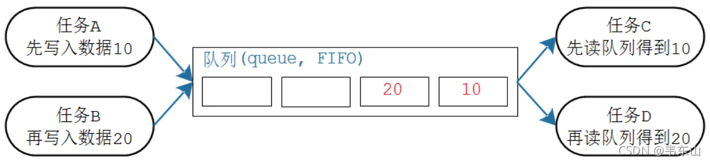
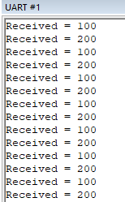

## [队列](https://www.freertos.org/zh-cn-cmn-s/a00018.html)
   1. 队列API
      - xQueueCreate
      - xQueueCreateStatic
      - vQueueDelete
      - xQueueSend
      - xQueueSendFromISR
      - xQueueSendToBack
      - xQueueSendToBackFromISR
      - xQueueSendToFront
      - xQueueSendToFrontFromISR
      - xQueueReceive
      - xQueueReceiveFromISR
      - uxQueueMessagesWaiting
      - uxQueueMessagesWaitingFromISR
      - uxQueueSpacesAvailable
      - xQueueReset
      - xQueuePeek
      - xQueuePeekFromISR
      - vQueueAddToRegistry
      - pcQueueGetName
      - vQueueUnregisterQueue
      - xQueueIsQueueEmptyFromISR
      - xQueueIsQueueFullFromISR
      - xQueueOverwrite
      - xQueueOverwriteFromISR
   1. queue:
      1. 队列
         1. 队列是任务间通信的主要形式。常被用于任务与任务、中断与任务之间的消息传递，通常是FIFO的形式
         2. 队列阻塞及访问
            * 当一个任务读取空队列时，任务将进入阻塞态（不消耗cpu，cpu会去运行其他任务,可以指定超时时间），直到队列不为空或者阻塞时长超过设定的阻塞时间，将进入就绪态。
            * 当一个任务向满队列写时，这个任务会进入阻塞态（不消耗cpu，cpu会去运行其他任务,可以指定超时时间），直到队列不为满或者阻塞时长超过设定的阻塞时间，将进入就绪态。
            * 如果有多个任务因为同一个队列而进入阻塞态，当队列满足条件的时候，优先级最高的任务先解除阻塞态，其他任务继续阻塞。
            * 中断里面只能使用后缀带有“FromISR”的API
            * 只要知道队列的句柄，谁都可以读、写该队列。任务、ISR都可读、写队列。可以多个任务读写队列
            * 
         3. 队列可以包含若干个数据：队列中有若干项，这被称为"长度"(length)
            * <br>
            * 每个数据大小固定
            * 创建队列时就要指定长度、数据大小
            * 数据的操作采用先进先出的方法(FIFO，First In First Out)：写数据时放到尾部，读数据时从头部读
            * 也可以强制写队列头部：覆盖头部数据 
         4. 队列传输数据
            1. 队列传输数据时有两种方法：
               * 拷贝：把数据、把变量的值复制进队列里
               * 引用：把数据、把变量的地址复制进队列里 
            2. FreeRTOS使用拷贝值的方法，这更简单
               * 局部变量的值可以发送到队列中，后续即使函数退出、局部变量被回收，也不会影响队列中的数据
               * 无需分配buffer来保存数据，队列中有buffer
               * 局部变量可以马上再次使用
               * 发送任务、接收任务解耦：接收任务不需要知道这数据是谁的、也不需要发送任务来释放数据
               * 如果数据实在太大，你还是可以使用队列传输它的地址
               * 队列的空间有FreeRTOS内核分配，无需任务操心
               * 对于有内存保护功能的系统，如果队列使用引用方法，也就是使用地址，必须确保双方任务对这个地址都有访问权限。使用拷贝方法时，则无此限制：内核有足够的权限，把数据复制进队列、再把数据复制出队列。
         5. 队列函数:
            1. 使用队列的流程：创建队列、写队列、读队列、删除队列
            2. 创建
                队列的创建有两种方法：动态分配内存、静态分配内存，
                动态分配内存：xQueueCreate，队列的内存在函数内部动态分配
                函数原型:QueueHandle_t xQueueCreate( UBaseType_t uxQueueLength, UBaseType_t uxItemSize );
                静态分配内存：xQueueCreateStatic，队列的内存要事先分配好
                函数原型:QueueHandle_t xQueueCreateStatic(
                           UBaseType_t uxQueueLength,
                           UBaseType_t uxItemSize,
                           uint8_t *pucQueueStorageBuffer,
                           StaticQueue_t *pxQueueBuffer
                       );
            3. 复位
                队列刚被创建时，里面没有数据；使用过程中可以调用xQueueReset()把队列恢复为初始状态
                函数原型为：BaseType_t xQueueReset( QueueHandle_t pxQueue);
            4. 删除
                删除队列的函数为vQueueDelete()，只能删除使用动态方法创建的队列，它会释放内存
                原型：void vQueueDelete( QueueHandle_t xQueue );      
            5. 写队列
               1. 可以把数据写到队列头部，也可以写到尾部，这些函数有两个版本：在任务中使用、在ISR中使用(ISR版本不可阻塞) 
               2. 往队列尾部写入数据:
                  * BaseType_t xQueueSend(
                                QueueHandle_t    xQueue,        //队列句柄
                                const void       *pvItemToQueue,//数据指针,数据会被复制进队列,复制的大小在创建时指定
                                TickType_t       xTicksToWait   //如果队列满,阻塞xTicksToWait时间
                            ); 
                  * BaseType_t xQueueSendToBackFromISR( 
                                      QueueHandle_t xQueue,
                                      const void *pvItemToQueue,
                                      BaseType_t *pxHigherPriorityTaskWoken //一般设置为 NULL
                                  );
              1. 往队列头部写入数据
                 * BaseType_t xQueueSendToFront(
                                QueueHandle_t    xQueue,
                                const void       *pvItemToQueue,
                                TickType_t       xTicksToWait
                            );
                 * BaseType_t xQueueSendToFrontFromISR(
                                      QueueHandle_t xQueue,
                                      const void *pvItemToQueue,
                                      BaseType_t *pxHigherPriorityTaskWoken
                                   ); 
            6. 读队列
               1. 使用xQueueReceive()函数读队列，读到一个数据后，队列中该数据会被移除。这个函数有两个版本：在任务中使用、在ISR中使用
               2. BaseType_t xQueueReceive( QueueHandle_t xQueue,
                          void * const pvBuffer,
                          TickType_t xTicksToWait );
               3. BaseType_t xQueueReceiveFromISR(
                                    QueueHandle_t    xQueue,
                                    void             *pvBuffer,
                                    BaseType_t       *pxTaskWoken
                                );
            7. 查询
               1. 可以查询队列中有多少个数据、有多少空余空间
               2. 返回队列中可用数据的个数:UBaseType_t uxQueueMessagesWaiting( const QueueHandle_t xQueue );
               3. 返回队列中可用空间的个数:UBaseType_t uxQueueSpacesAvailable( const QueueHandle_t xQueue );
            8. 覆盖/偷看
               1. 当队列长度为1时，可以使用xQueueOverwrite()或xQueueOverwriteFromISR()来覆盖数据
               2. 如果想让队列中的数据供多方读取，也就是说读取时不要移除数据，要留给后来人。那么可以使用"窥视"，也就是xQueuePeek()或xQueuePeekFromISR()。这些函数会从队列中复制出数据，但是不移除数据。这也意味着，如果队列中没有数据，那么"偷看"时会导致阻塞；一旦队列中有数据，以后每次"偷看"都会成功。
               3. 原型 
               ```c
               /* 偷看队列
                * xQueue: 偷看哪个队列
                * pvItemToQueue: 数据地址, 用来保存复制出来的数据
                * xTicksToWait: 没有数据的话阻塞一会
                * 返回值: pdTRUE表示成功, pdFALSE表示失败
                */
               BaseType_t xQueuePeek(
                                         QueueHandle_t xQueue,
                                         void * const pvBuffer,
                                         TickType_t xTicksToWait
                                     );

               BaseType_t xQueuePeekFromISR(
                                                QueueHandle_t xQueue,
                                                void *pvBuffer,
                                            );
               ```
            9. 示例
               * 创建一个队列，然后创建2个发送任务、1个接收任务
                 * 发送任务优先级为1，分别往队列中写入100、200
                 * 接收任务优先级为2，读队列、打印数值
                 * main函数中创建的队列、创建了发送任务、接收任务，代码如下
                 ```c
                    /* 队列句柄, 创建队列时会设置这个变量 */
                    QueueHandle_t xQueue;

                    int main( void )
                    {
                        prvSetupHardware();
                        
                        /* 创建队列: 长度为5，数据大小为4字节(存放一个整数) */
                        xQueue = xQueueCreate( 5, sizeof( int32_t ) );

                        if( xQueue != NULL )
                        {
                            /* 创建2个任务用于写队列, 传入的参数分别是100、200
                            * 任务函数会连续执行，向队列发送数值100、200
                            * 优先级为1
                            */
                            xTaskCreate( vSenderTask, "Sender1", 1000, ( void * ) 100, 1, NULL );
                            xTaskCreate( vSenderTask, "Sender2", 1000, ( void * ) 200, 1, NULL );

                            /* 创建1个任务用于读队列
                            * 优先级为2, 高于上面的两个任务
                            * 这意味着队列一有数据就会被读走
                            */
                            xTaskCreate( vReceiverTask, "Receiver", 1000, NULL, 2, NULL );

                            /* 启动调度器 */
                            vTaskStartScheduler();
                        }
                        else
                        {
                            /* 无法创建队列 */
                        }

                        /* 如果程序运行到了这里就表示出错了, 一般是内存不足 */
                        return 0;
                    }

                 ```
                 * 发送任务的函数中，不断往队列中写入数值
                 ```c
                    static void vSenderTask( void *pvParameters )
                    {
                        int32_t lValueToSend;
                        BaseType_t xStatus;

                        /* 我们会使用这个函数创建2个任务
                        * 这些任务的pvParameters不一样
                        */
                        lValueToSend = ( int32_t ) pvParameters;

                        /* 无限循环 */
                        for( ;; )
                        {
                            /* 写队列
                            * xQueue: 写哪个队列
                            * &lValueToSend: 写什么数据? 传入数据的地址, 会从这个地址把数据复制进队列
                            * 0: 不阻塞, 如果队列满的话, 写入失败, 立刻返回
                            */
                            xStatus = xQueueSendToBack( xQueue, &lValueToSend, 0 );

                            if( xStatus != pdPASS )
                            {
                                printf( "Could not send to the queue.\r\n" );
                            }
                        }
                    }
                 ```
                 * 接收任务的函数中，读取队列、判断返回值、打印
                 ```c
                    static void vReceiverTask( void *pvParameters )
                    {
                        /* 读取队列时, 用这个变量来存放数据 */
                        int32_t lReceivedValue;
                        BaseType_t xStatus;
                        const TickType_t xTicksToWait = pdMS_TO_TICKS( 100UL );

                        /* 无限循环 */
                        for( ;; )
                        {
                            /* 读队列
                            * xQueue: 读哪个队列
                            * &lReceivedValue: 读到的数据复制到这个地址
                            * xTicksToWait: 如果队列为空, 阻塞一会
                            */
                            xStatus = xQueueReceive( xQueue, &lReceivedValue, xTicksToWait );

                            if( xStatus == pdPASS )
                            {
                                /* 读到了数据 */
                                printf( "Received = %d\r\n", lReceivedValue );
                            }
                            else
                            {
                                /* 没读到数据 */
                                printf( "Could not receive from the queue.\r\n" );
                            }
                        }
                    }
                 ```
                * 程序运行结果如下 <br>
                * 任务调度情况如下 <br>
           1.  分辨数据源
               * 当有多个发送任务，通过同一个队列发出数据，接收任务如何分辨数据来源？
               * 数据本身需要带有"来源"信息，比如写入队列的数据是一个结构体，结构体中的sensorId用来表示数据来源
                ```c
                typedef struct {
                    int sensorId;
                    int sensorVal;
                }Data_t;
                ```   
              * 不同的发送任务，先构造好结构体，填入自己的eDataID，再写队列；接收任务读出数据后，根据eDataID就可以知道数据来源了
                比如有二个传感器:速度传感器和角度传感器
                * 速度传感器任务发送的数据：sensorId = motorSpeedSensor
                * 角度传感器任务发送的数据：sensorId = angleSensor 
           2.  传输大块数据
               * FreeRTOS的队列使用拷贝传输，也就是要传输uint32_t时，把4字节的数据拷贝进队列；要传输一个8字节的结构体时，把8字节的数据拷贝进队列。
               * 如果要传输1000字节的结构体呢？写队列时拷贝1000字节，读队列时再拷贝1000字节？不建议这么做，影响效率！
               * 这时候，我们要传输的是这个巨大结构体的地址：把它的地址写入队列，对方从队列得到这个地址，使用地址去访问那1000字节的数据。
               * 使用地址来间接传输数据时，这些数据放在RAM里，对于这块RAM，要保证这几点：   
                 * RAM的所有者、操作者，必须清晰明了
                   * 这块内存，就被称为"共享内存"。要确保不能同时修改RAM。比如，在写队列之前只有由发送者修改这块RAM，在读队列之后只能由接收者访问这块RAM。
                 * RAM要保持可用
                   * 这块RAM应该是全局变量，或者是动态分配的内存。对于动然分配的内存，要确保它不能提前释放：要等到接收者用完后再释放。另外，不能是局部变量。
               * 步骤
                 * 创建的队列：长度为1，用来传输"char *"指针
                 * 发送任务优先级为1，在字符数组中写好数据后，把它的地址写入队列
                 ```c
                    char *buf = p;
                    xQueueSend(queue, &buf, 0);
                 ```
                 * 接收任务优先级为2，读队列得到"char *"值，把它打印出来
                 ```c
                    char *buf;
                    xQueueReceive(queue,&buf,portMAX_DELAY);
                    printf("rev:%p,%s\n", buf, buf);
                 ```
                 * 注意:接收任务的优先级更高，在它访问数组的过程中，发送任务无法执行、无法写这个数组
               * demo
                 ```c
                    char p[1024];
                    QueueHandle_t queue;
                    void task_send(void *arg){
                        int param = (int)arg;
                        
                        printf("task:%d\n",param);
                        while (1)
                        {   
                            char *buf = p;
                            sprintf(p,"hello,%d",param);
                            printf("%p,%s\n",p,p);
                            xQueueSend(queue, &buf, 0);
                            vTaskDelay(1000 / portTICK_RATE_MS);
                        }
                        vTaskDelete(NULL);
                    }
                    void task_rev(void *arg)
                    {
                        while (1)
                        {
                            char *buf;
                            xQueueReceive(queue,&buf,portMAX_DELAY);
                            printf("rev:%p,%s\n", buf,buf);
                        }
                    }
                    void app_main(void)
                    {
                        queue = xQueueCreate(1,sizeof(char *));

                        xTaskCreate(task_send,"",1024*2,(void *)100, 2, NULL);
                        xTaskCreate(task_send,"",1024*2,(void *)200, 2, NULL);

                        xTaskCreate(task_rev,"",1024*2,NULL, 1, NULL);

                        vTaskDelete(NULL);
                    }
                 ``` 


    2. 邮箱
       1. FreeRTOS中的队列有一种特殊的用法，叫做邮箱。邮箱不是另一种组件，它还是队列，只是用法比较特殊而已
          * 邮箱是长度为1的队列
          * 写邮箱：新数据覆盖旧数据，在任务中使用xQueueOverwrite()，在中断中使用xQueueOverwriteFromISR()。
                既然是覆盖，那么无论邮箱中是否有数据，这些函数总能成功写入数据。
          * 读邮箱：读数据时，数据不会被移除；在任务中使用xQueuePeek()，在中断中使用xQueuePeekFromISR()。
                这意味着，第一次调用时会因为无数据而阻塞，一旦曾经写入数据，以后读邮箱时总能成功 
       2. 示例
       ```c
        QueueHandle_t queue;
        void task_send(void *arg)
        {
            int val = 0;
            while (1) {
                vTaskDelay(500 / portTICK_RATE_MS);
                xQueueOverwrite(queue, &val);
                printf("send:%d\n", val++);
            }
            vTaskDelete(NULL);
        }
        void task_rev(void *arg)
        {
            while (1) {
                int val;
                BaseType_t ret = xQueuePeek(queue, &val, 0);
                if (ret == pdTRUE) {
                    printf("rev:%d\n", val);
                } else {
                    printf("cannot get data\n");
                }
                vTaskDelay(pdMS_TO_TICKS(1000));
            }
        }
        void app_main(void)
        {
            queue = xQueueCreate(1, sizeof(int));

            xTaskCreate(task_send, "", 1024 * 2, (void *)100, 2, NULL);

            xTaskCreate(task_rev, "", 1024 * 2, NULL, 1, NULL);

            vTaskDelete(NULL);
        }
       ``` 
   