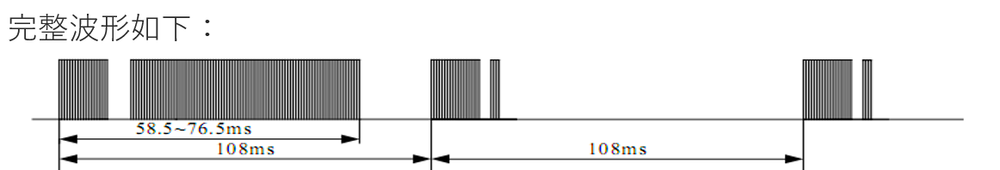
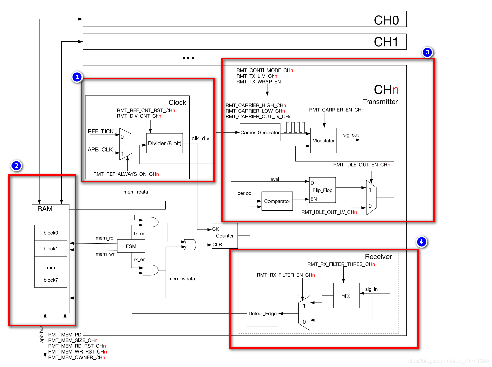
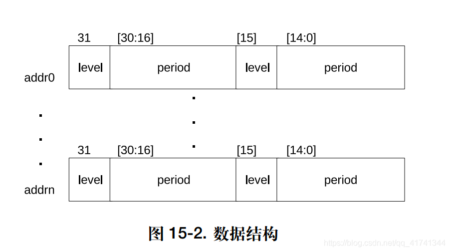
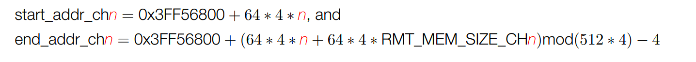
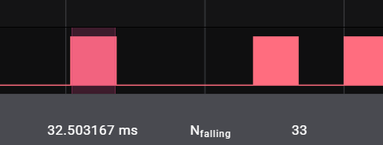
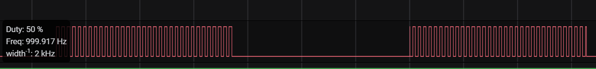
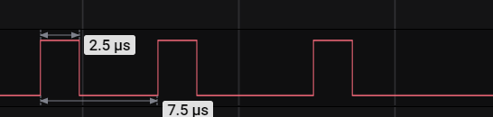

# RMT 
1. RMT简介
   1. 概述
    什么是RMT(https://docs.espressif.com/projects/esp-idf/zh_CN/latest/esp32/api-reference/peripherals/rmt.html)
    RMT（远程控制）模块驱动程序可用于发送和接收红外遥控信号。由于RMT灵活性，驱动程序还可用于生成或接收许多其他类型的信号。由一系列脉冲组成的信号由RMT的发射器根据值列表生成。这些值定义脉冲持续时间和二进制级别。发射器还可以提供载波并用提供的脉冲对其进行调制；总的来说它就是一个中间件，就是通过 RMT模块可以生成解码成包含脉冲持续时间和二进制电平的值的高低电平，从而实现发送和接收我们想要的信号
   2. 红外载波编码
    红外编码发送的时候，并不单单是通过高低电平发送的，是在38khz的载波下进行发送的。就比如如下案例，引导码和数据码高电平区域，是由38khz的脉冲构成的。
    一般不同设备（尤其是空调）的红外编码协议会又所不同，所以进行红外设备控制的时候，需要进行测试。
    <br><br>
2. RMT组件概述
   1. esp32的RMT组件一共由8个通道，每个通道能够独立完成红外发射或者红外接收的工作，但是这两种功能不能同时进行。8个通道共用同一个RAM空间，具有完成载波调制、输入捕获、滤波等功能。
   2. RMT模块功能框图如下，包括四个部分:时钟源/RAM存储空间/发射模块/接收模块
    <br><br>
      1. 时钟:
         RMT模块的时钟源经过分频后可以给红外接收和发送的计数器提供时钟。
         RMT模块的时钟源可以是APB_CLK（默认是80MHZ），也可以是REF_TICK时钟。
         经过分频以后的每个时钟，将会在后面被称为1个tick。
         比如默认时钟是80MHZ，如果进行80分频，用于计数的时钟就是1MHZ，也就是每次数一个数字都是1us，1个tick就是1us。
      2. RAM:
         RMT组件8个通道共用同一段RAM，RAM分为0-7 一共8个block，每个block大小为64x32 bit。默认情况下每个通道分配一个block。主要用于红外接收和发送的时候存储数据
         RMT的空间结构如下图 
         <br><br> 
         RAM的数据结构由32位组成，分为高低两个16位。其中level表示电平的高低，period表示分频时钟持续的周期数。当period为0的时候，发送停止。如果接收超时，也会往period中写入0，表示接收结束。这1个32位，用于表示电平高低和时钟持续周期数的数据结构定义，将在后面被称为item
         RAM可以通过数据总结，直接使用地址进行访问。其起始地址为 0x3FF56800。如果一个通道接收或者发送红外数据的时候一个block大小不够（因为block大小为64x32bit，意味着最多能存储128个数据），可以在配置的时间增加block数量。通道n使用的RMA起始内存和终止内存地址计算公式为
         <br><br> 
      3. 发送器:
         从框图中可以看出，发送模块包括两个部分，包括发射信号输出和调制信号输出两部分。
         发射信号输出部分就是把给定的item数据结构中对电平高低和周期数的描述，转化为实际的电平输出。
         我们定义如下数据
         ```c
         static const rmt_item32_t morse_esp[] = {
             // E : dot
             {{{ 32767, 1, 32767, 0 }}}, // dot 32ms on 32ms off
             {{{ 32767, 0, 32767, 0 }}}, // SPACE
             // S : dot, dot, dot
             {{{ 32767, 1, 32767, 0 }}}, // dot
             {{{ 32767, 1, 32767, 0 }}}, // dot
             {{{ 32767, 1, 32767, 0 }}}, // dot
             {{{ 32767, 0, 32767, 0 }}}, // SPACE
             // P : dot, dash, dash, dot
             {{{ 32767, 1, 32767, 0 }}}, // dot
             {{{ 32767, 1, 32767, 1 }}},
             {{{ 32767, 1, 32767, 0 }}}, // dash
             {{{ 32767, 1, 32767, 1 }}},
             {{{ 32767, 1, 32767, 0 }}}, // dash
             {{{ 32767, 1, 32767, 0 }}}, // dot
             // RMT end marker
             {{{ 0, 1, 0, 0 }}}
         };
         rmt_config_t config = RMT_DEFAULT_CONFIG_TX(CONFIG_EXAMPLE_RMT_TX_GPIO, RMT_TX_CHANNEL);
             // enable the carrier to be able to hear the Morse sound
             // if the RMT_TX_GPIO is connected to a speaker
             config.tx_config.carrier_en = true;
             config.tx_config.carrier_duty_percent = 50;
             // with current implementation of the RMT API
             config.tx_config.carrier_freq_hz = 1000;//611;
             // set the maximum clock divider to be able to output
             // RMT pulses in range of about one hundred milliseconds
             config.clk_div = 80;//80->1M ;
         ```
        会产生这样的电信号输出 
        <br>
        放大后，发现原来的每个高电平，都是由1khz的脉冲构成的
        <br>
      4. 接收器:
          接收器做的事情与发送器相反，是把引脚出的电平转换为item数据结构进行存储。并且每次在电平变化的时候，记录上一个电平的周期数和电平高低。当定时器超过给定的最大超时时间，接收器会在item中写入0，表示接收结束
3. 发送使用步骤:
   1. 主要用到三个函数
      1. RMT配置: rmt_config(&rmtParam);
         1. RMT配置,是通过配置rmt_config_t结构体实现的，rmt_config_t可以分为公共配置部分和特有配置部分，该结构体定义为：
            ```c
            typedef struct {
                    rmt_mode_t rmt_mode;        //  配置RMT模块是发射或接收
                    rmt_channel_t channel;       // 使用第几个通道       
                    uint8_t clk_div;         //  对时钟源进行多少分频，可以配置0-255，其中0表示256分频             
                    gpio_num_t gpio_num;       //使用第几个gpio完成该工作        
                    uint8_t mem_block_num;        // 使用多少个block的RAM进行收发数据
                    union{
                        rmt_tx_config_t tx_config;     // 如果模式是接收，就配置这部分
                        rmt_rx_config_t rx_config;     // 如果模式是发送，就配置这部分
                    };
                } rmt_config_t;
            ```
         2. RMT配置示例
         ```c
          rmt_config_t rmtParam;
          rmtParam.channel = RMT_CHANNEL_0;
          rmtParam.clk_div = 80;//对时钟进行80分频，这样的话，对item的解析中，每个period都代表1us。
          rmtParam.gpio_num = 16;
          rmtParam.mem_block_num = 1;//默认每个通道使用1个block。一共block是64x32bit,能储存128个数据
          rmtParam.rmt_mode = RMT_MODE_TX;
          rmtParam.tx_config.carrier_duty_percent = 50;
          rmtParam.tx_config.carrier_en = true;
          rmtParam.tx_config.carrier_freq_hz = 1000;
          rmtParam.tx_config.idle_level = 0;
          rmtParam.tx_config.idle_output_en = false;
          rmt_config(&rmtParam);
          rmt_driver_install(rmtParam.channel,0,0);
         ```
      2. 安装驱动:rmt_driver_install(rmtParam.channel,0,0);
      3. 写入波形:rmt_write_items(RMT_CHANNEL_0, rmt_item , sizeof(rmt_item) / sizeof(rmt_item[0]) , true);
         1. 定义并写入波形
            ```c
                const rmt_item32_t rmt_item[] = {
                    // E : dot
                    {{{ 32767, 1, 32767, 0 }}}, // dot 32ms on 32ms off
                    {{{ 32767, 0, 32767, 0 }}}, // SPACE
                    // S : dot, dot, dot
                    {{{ 32767, 1, 32767, 0 }}}, // dot
                    {{{ 32767, 1, 32767, 0 }}}, // dot
                    {{{ 32767, 1, 32767, 0 }}}, // dot
                    {{{ 32767, 0, 32767, 0 }}}, // SPACE
                    // P : dot, dash, dash, dot
                    {{{ 32767, 1, 32767, 0 }}}, // dot
                    {{{ 32767, 1, 32767, 1 }}},
                    {{{ 32767, 1, 32767, 0 }}}, // dash
                    {{{ 32767, 1, 32767, 1 }}},
                    {{{ 32767, 1, 32767, 0 }}}, // dash
                    {{{ 32767, 1, 32767, 0 }}}, // dot
                    // RMT end marker
                    {{{ 0, 1, 0, 0 }}}
                };
                rmt_write_items(RMT_CHANNEL_0, rmt_item , sizeof(rmt_item) / sizeof(rmt_item[0]) , true);
            ```
 4.  示例1: 带载波
     <br>
     <br>
     ```c Morse Code
         #include "sdkconfig.h"
         #include "freertos/FreeRTOS.h"
         #include "freertos/task.h"
         #include "esp_log.h"
         #include "driver/rmt.h"

         static const char *TAG = "example";

         #define CONFIG_EXAMPLE_RMT_TX_GPIO  18
         #define RMT_TX_CHANNEL RMT_CHANNEL_0

         static const rmt_item32_t morse_esp[] = {
             // E : dot
             {{{ 32767, 1, 32767, 0 }}}, // dot 32ms on 32ms off
             {{{ 32767, 0, 32767, 0 }}}, // SPACE
             // S : dot, dot, dot
             {{{ 32767, 1, 32767, 0 }}}, // dot
             {{{ 32767, 1, 32767, 0 }}}, // dot
             {{{ 32767, 1, 32767, 0 }}}, // dot
             {{{ 32767, 0, 32767, 0 }}}, // SPACE
             // P : dot, dash, dash, dot
             {{{ 32767, 1, 32767, 0 }}}, // dot
             {{{ 32767, 1, 32767, 1 }}},
             {{{ 32767, 1, 32767, 0 }}}, // dash
             {{{ 32767, 1, 32767, 1 }}},
             {{{ 32767, 1, 32767, 0 }}}, // dash
             {{{ 32767, 1, 32767, 0 }}}, // dot
             // RMT end marker
             {{{ 0, 1, 0, 0 }}}
         };

         /*
         * Initialize the RMT Tx channel
         */
         static void rmt_tx_init(void)
         {
             rmt_config_t config = RMT_DEFAULT_CONFIG_TX(CONFIG_EXAMPLE_RMT_TX_GPIO, RMT_TX_CHANNEL);
             // enable the carrier to be able to hear the Morse sound
             // if the RMT_TX_GPIO is connected to a speaker
             config.tx_config.carrier_en = true;
             config.tx_config.carrier_duty_percent = 50;
             // with current implementation of the RMT API
             config.tx_config.carrier_freq_hz = 1000;//611;
             // set the maximum clock divider to be able to output
             // RMT pulses in range of about one hundred milliseconds
             config.clk_div = 80;//80->1M ;

             ESP_ERROR_CHECK(rmt_config(&config));
             ESP_ERROR_CHECK(rmt_driver_install(config.channel, 0, 0));
         }

         void app_main(void)
         {
             ESP_LOGI(TAG, "Configuring transmitter");
             rmt_tx_init();

             while (1) {
                 ESP_ERROR_CHECK(rmt_write_items(RMT_TX_CHANNEL, morse_esp, sizeof(morse_esp) / sizeof(morse_esp[0]), true));
                 ESP_LOGI(TAG, "Transmission complete");
                 vTaskDelay(1000 / portTICK_PERIOD_MS);
             }
         }
     ```  
 5.  示例2: 不带载波
        <br>
        ```c
            #include "driver/rmt.h"
            #include "esp_log.h"
            #include "freertos/FreeRTOS.h"
            #include "freertos/task.h"

            #define CONFIG_EXAMPLE_RMT_TX_GPIO 18
            #define RMT_TX_CHANNEL RMT_CHANNEL_0

            void app_main(void)
            {
                static const rmt_item32_t wave[] = {
                    {{{100, 1, 200, 0}}},  // 2.5us1 5us0
                    {{{100, 1, 300, 0}}},
                    {{{100, 1, 400, 0}}},
                    {{{0, 1, 0, 0}}}  // // RMT end marker
                };
                rmt_config_t config;
                config.rmt_mode = RMT_MODE_TX;		//发送
                config.channel = RMT_TX_CHANNEL;	//通道
                config.gpio_num = CONFIG_EXAMPLE_RMT_TX_GPIO;			//管脚
                config.mem_block_num = 1;				
                config.tx_config.loop_en = false;
                config.tx_config.carrier_en = false;
                config.tx_config.idle_output_en = true;
                config.tx_config.idle_level = 0;
                // set counter clock to 40MHz
                config.clk_div = 2;

                ESP_ERROR_CHECK(rmt_config(&config));
                ESP_ERROR_CHECK(rmt_driver_install(RMT_TX_CHANNEL, 0, 0));
                while (1) {
                    vTaskDelay(1000 / portTICK_PERIOD_MS);
                    rmt_write_items(RMT_TX_CHANNEL, wave, sizeof(wave) / sizeof(wave[0]), true);
                    printf("Transmission complete\n");
                }
            }
        ```

6. 练习:产生如下的脉冲
   // 1ms off 300us on 500us off 200us on 100us off 200us on