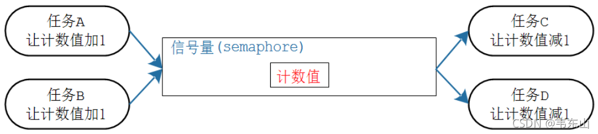

# [信号量/互斥锁](https://www.freertos.org/zh-cn-cmn-s/a00113.html)
## 信号量/互斥锁 API汇总
  - 在许多情况下， “任务通知”可以提供信号量的轻量级替代方案 
  - xSemaphoreCreateBinary
  - xSemaphoreCreateBinaryStatic
  - vSemaphoreCreateBinary [使用 xSemaphoreCreateBinary() 进行新设计]
  - xSemaphoreCreateCounting
  - xSemaphoreCreateCountingStatic
  - xSemaphoreCreateMutex
  - xSemaphoreCreateMutexStatic
  - xSemaphoreCreateRecursiveMutex
  - xSemaphoreCreateRecursiveMutexStatic
  - vSemaphoreDelete
  - xSemaphoreGetMutexHolder
  - xSemaphoreTake
  - xSemaphoreTakeFromISR
  - xSemaphoreTakeRecursive
  - xSemaphoreGive
  - xSemaphoreGiveRecursive
  - xSemaphoreGiveFromISR
  - uxSemaphoreGetCount
## 概述
 + 前面介绍的队列(queue)可以用于传输数据：在任务之间、任务和中断之间。
 + 有时候我们只需要传递状态，并不需要传递具体的信息，比如：
   - 我的事做完了，通知一下你
   - 这个停车位我占了，你们只能等着
   - 在这种情况下我们可以使用信号量(semaphore)，它更节省内存。
 + 本节涉及如下内容：
   - 怎么创建、删除信号量
   - 怎么发送、获得信号量
   - 什么是计数型信号量?什么是二进制信号量?
## 信号量的特性
### 信号量的常规操作
 + 什么是信号量
   + 信号：起通知作用
   + 量：还可以用来表示资源的数量
     - 当"量"没有限制时，它就是"计数型信号量"(Counting Semaphores)
     - 当"量"只有0、1两个取值时，它就是"二进制信号量"(Binary Semaphores)
   + 支持的动作："give"给出资源，计数值加1；"take"获得资源，计数值减1
 + 计数型信号量的典型场景是：
   - 计数：事件产生时"give"信号量，让计数值加1；处理事件时要先"take"信号量，就是获得信号量，让计数值减1。
   - 资源管理：要想访问资源需要先"take"信号量，让计数值减1；用完资源后"give"信号量，让计数值加1。
 - 信号量的"give"、"take"双方并不需要相同，可以用于生产者-消费者场合：
   - 生产者为任务A、B，消费者为任务C、D
   - 一开始信号量的计数值为0，如果任务C、D想获得信号量，会有两种结果：
     - 阻塞：买不到东西咱就等等吧，可以定个闹钟(超时时间)
     - 即刻返回失败：不等
   - 任务A、B可以生产资源，就是让信号量的计数值增加1，并且把等待这个资源的顾客唤醒
   - 唤醒谁？谁优先级高就唤醒谁，如果大家优先级一样就唤醒等待时间最长的人
 - 二进制信号量跟计数型的唯一差别，就是计数值的最大值被限定为1。<br>
### 信号量跟队列的对比
  |队列	|信号量 |
  | --- | --- |
  |可以容纳多个数据<br>创建队列时有2部分内存: 队列结构体、存储数据的空间<br>|只有计数值，无法容纳其他数据<br>创建信号量时，只需要分配信号量结构体|
  |生产者：没有空间存入数据时可以阻塞|生产者：用于不阻塞，计数值已经达到最大时返回失败|
  |消费者：没有数据时可以阻塞	|消费者：没有资源时可以阻塞|
### 两种信号量的对比
 + 信号量的计数值都有限制：限定了最大值。如果最大值被限定为1，那么它就是二进制信号量；如果最大值不是1，它就是计数型信号量。
 + |二进制信号量|技术型信号量|
   |---|---|
   |被创建时初始值为0|被创建时初始值可以设定|
   |其他操作是一样的|其他操作是一样的|
## 信号量API
 + 使用信号量时，先创建、然后去添加资源、获得资源。使用句柄来表示一个信号量
 + 对于二进制信号量、计数型信号量，它们的创建函数不一样
    | |二进制信号量|计数型信号量 |
    |---|---|---|
    |动态创建|xSemaphoreCreateBinary<br>计数值初始值为0|xSemaphoreCreateCounting|
    ||vSemaphoreCreateBinary(过时)<br>计数值初始值为1||
    |静态创建|xSemaphoreCreateBinaryStatic|xSemaphoreCreateCountingStatic|
### 创建
 + 创建二进制信号量的函数原型
   ```c
    /*创建一个二进制信号量，返回它的句柄。
    * 此函数内部会分配信号量结构体 
    * 返回值: 返回句柄，非NULL表示成功
    */
    SemaphoreHandle_t xSemaphoreCreateBinary( void );

    /* 创建一个二进制信号量，返回它的句柄。
    * 此函数无需动态分配内存，所以需要先有一个StaticSemaphore_t结构体，并传入它的指针
    * 返回值: 返回句柄，非NULL表示成功
    */
    SemaphoreHandle_t xSemaphoreCreateBinaryStatic( StaticSemaphore_t *pxSemaphoreBuffer );
   ```
 + 创建计数型信号量的函数原型
   ```c
    /* 创建一个计数型信号量，返回它的句柄。
    * 此函数内部会分配信号量结构体 
    * uxMaxCount: 最大计数值
    * uxInitialCount: 初始计数值
    * 返回值: 返回句柄，非NULL表示成功
    */
    SemaphoreHandle_t xSemaphoreCreateCounting(UBaseType_t uxMaxCount, UBaseType_t uxInitialCount);

    /* 创建一个计数型信号量，返回它的句柄。
    * 此函数无需动态分配内存，所以需要先有一个StaticSemaphore_t结构体，并传入它的指针
    * uxMaxCount: 最大计数值
    * uxInitialCount: 初始计数值
    * pxSemaphoreBuffer: StaticSemaphore_t结构体指针
    * 返回值: 返回句柄，非NULL表示成功
    */
    SemaphoreHandle_t xSemaphoreCreateCountingStatic( UBaseType_t uxMaxCount, 
                                                    UBaseType_t uxInitialCount, 
                                                    StaticSemaphore_t *pxSemaphoreBuffer );
   ```
### 删除
 + 对于动态创建的信号量，不再需要它们时，可以删除它们以回收内存
   - vSemaphoreDelete可以用来删除二进制信号量、计数型信号量，函数原型如下  
   ```c
    /*
    * xSemaphore: 信号量句柄，你要删除哪个信号量
    */
    void vSemaphoreDelete( SemaphoreHandle_t xSemaphore );
   ```
### give/take
 + 二进制信号量、计数型信号量的give、take操作函数是一样的。这些函数也分为2个版本：给任务使用，给ISR使用。列表如下
 + |    | 在任务中使用  |     在ISR中使用      |
   |----|--------------|---------------------|
   |give|xSemaphoreGive|xSemaphoreGiveFromISR|
   |take|xSemaphoreTake|xSemaphoreTakeFromISR|
 + Give原型 `BaseType_t xSemaphoreGive( SemaphoreHandle_t xSemaphore )`
   - 返回值	pdTRUE表示成功,
   - 如果二进制信号量的计数值已经是1，再次调用此函数则返回失败；
   - 如果计数型信号量的计数值已经是最大值，再次调用此函数则返回失败
 + ISR版本原型 `BaseType_t xSemaphoreGiveFromISR(SemaphoreHandle_t xSemaphore,BaseType_t *pxHigherPriorityTaskWoken);`
   - 参数:pxHigherPriorityTaskWoken:如果释放信号量导致更高优先级的任务变为了就绪态,则*pxHigherPriorityTaskWoken = pdTRUE
 + Take原型 `BaseType_t xSemaphoreTake(SemaphoreHandle_t xSemaphore,TickType_t xTicksToWait);`
   - 参数:xTicksToWait:0：不阻塞，马上返回 ,: 一直阻塞直到成功
 + ISR版本原型 `BaseType_t xSemaphoreTakeFromISR(SemaphoreHandle_t xSemaphore,BaseType_t *pxHigherPriorityTaskWoken);`
## 示例12: 使用二进制信号量来同步
 + main函数中创建了一个二进制信号量，然后创建2个任务：一个用于释放信号量(优先级更高)，另一个用于获取信号量   
 + task_send
   ```c
    void task1(void *arg)
    {
        printf("task send run\n");
        while (1) {
            for (int i = 0; i < 3; i++) {
                BaseType_t ret = xSemaphoreGive(semaphore);
                if (ret == pdTRUE) {
                    printf("Give sem ok\n");
                } else
                    printf("Give sem fail\n");
            }
            vTaskDelay(pdMS_TO_TICKS(1000 * 5));
        }
    }
   ```
 + task_recv
   ```c
    void task2(void *arg)
    {
        printf("task recv run\n");
        while (1)
        {
            xSemaphoreTake(semaphore, portMAX_DELAY);
            printf("Task a sem\n");
        }
        
    }
   ```
 + 执行流程   
   - A：发送任务连续3次释放二进制信号量，只有第1次成功
   - B：发送任务调用vTaskDelay进入阻塞态
   - C：接收任务得以执行，得到信号量，打印OK；再次去获得信号量时，进入阻塞状态
   - 在发送任务的vTaskDelay退出之前，运行的是空闲任务：现在发送任务、接收任务都阻塞了
   - D：发送任务再次运行，连续3次释放二进制信号量，只有第1,2次成功
   - E：发送任务进入阻塞态
   - F：接收任务被唤醒，得到信号量，打印OK；再次去获得信号量时，进入阻塞状态
## 示例13: 模拟串口接收
 + 有一个全局变量rxBuf用于串口数据的缓冲区,创建2个任务：一个向buf里面写,模拟串口接收数据,另一个从buf中读取
 + uart_task
   ```c
    char rxBuf[10];
    void uartTask(void *arg)
    {
        printf("uart task run\n");
        uint ptr = 0;
        while (1) {
            rxBuf[ptr] = ptr;
            BaseType_t ret = xSemaphoreGive(semaphore);
            if (ret == pdTRUE) {
                if(ptr++ >= 10) ptr = 0;
            }else{
                vTaskDelay(pdMS_TO_TICKS(1000 * 1));
            }
        }
    }
   ```
 + recv_task
   ```c
    void task2(void *arg)
    {
        printf("task recv run\n");
        uint ptr = 0;
        while (1) {
            xSemaphoreTake(semaphore, portMAX_DELAY);
            printf("%d\n",rxBuf[ptr++]);
        }
    }
   ```
## 示例14: 使用计数型信号量
 + 使用计数型信号量时，可以多次释放信号量；当信号量的技术值达到最大时，再次释放信号量就会出错。
 + 如果信号量计数值为n，就可以连续n次获取信号量，第(n+1)次获取信号量就会阻塞或失败。
 + main函数中创建了一个计数型信号量，最大计数值为3，初始值计数值为0；然后创建2个任务：一个用于释放信号量，另一个用于获取信号量
 + 发送任务
    ```c
    void task1(void *arg)
    {
        printf("uart task run\n");
        uint ptr = 0;
        while (1) {
            BaseType_t ret = xSemaphoreGive(semaphore);
            if (ret == pdTRUE) {
                printf("give ok\n");
            }else{
                printf("give fail\n");
                vTaskDelay(pdMS_TO_TICKS(1000 * 1));
            }
        }
    }
    ```
 + 接收任务
    ```c
    void task2(void *arg)
    {
        printf("task recv run\n");
        uint ptr = 0;
        while (1) {
            xSemaphoreTake(semaphore, portMAX_DELAY);
            printf("take ok\n");
        }
    }
    ```
