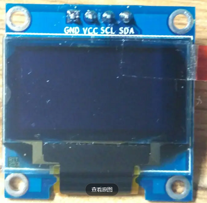
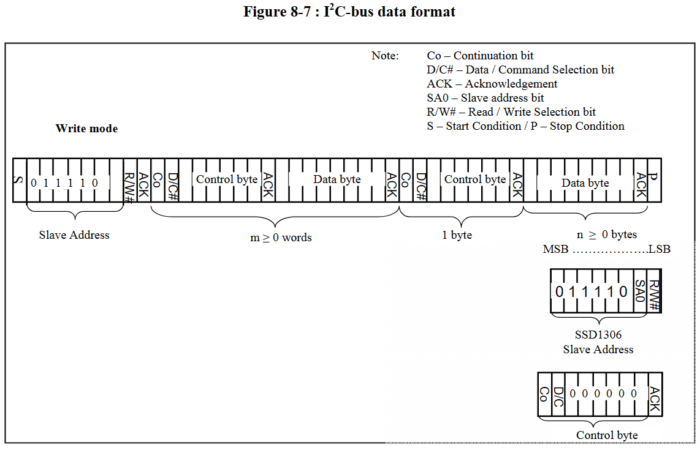
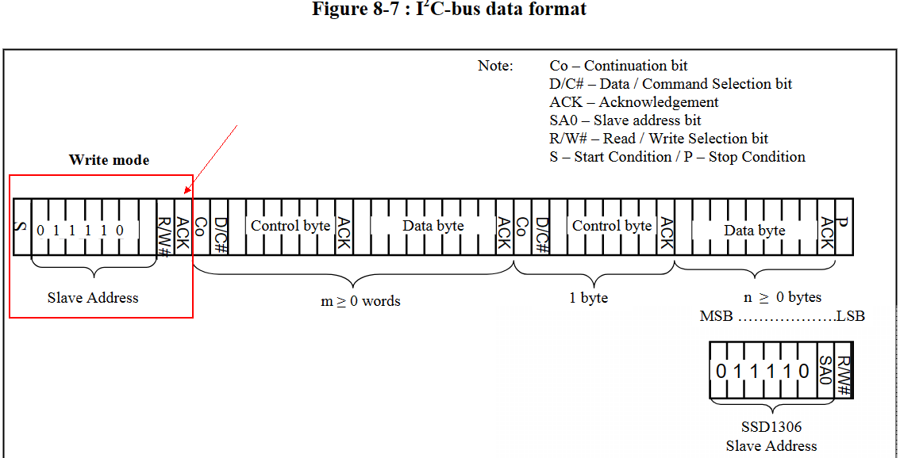

# ssd1306
 + SSD1306是一款单片CMOS OLED/PLED驱动器，具有有机/聚合物发光控制器二极管点阵图形显示系统。它由128个段和64个公共部分组成。这个IC是为普通阴极型OLED面板设计。
 + SSD1306内置对比度控制、显示RAM和振荡器，减少了外部组件和功耗。它有256级亮度控制。数据/命令是从通用单片机通过硬件可选的6800/8000系列兼容并行接口发送，I2C接口或串行外围接口。它适用于许多紧凑型便携式应用程序，例如手机副显示屏、MP3播放器、计算器等
# OLED驱动
 + OLED实物图<br>   
 + 硬件结构
   + 这款屏幕模块尺寸约为0.96英寸，主要由裸屏和底板PCB组成，裸屏由SSD1306驱动，这也是一种较为广泛使用的led驱动芯片。
     - 驱动电压:3.3~5V
     - 分辨率:	128x64
     - 驱动接口:	I2C
     - I2C地址:	0x3c(默认)\0x3d可选
 + i2c驱动
   + 数据格式<br>
   + 判断OLED的i2c地址<br>
       ```c
        esp_err_t test_i2c(uint8_t slaveAddr)
        {
            i2c_cmd_handle_t cmd = i2c_cmd_link_create();

            i2c_master_start(cmd);
            i2c_master_write_byte(cmd, (slaveAddr << 1) | I2C_MASTER_WRITE, true);
            i2c_master_stop(cmd);

            esp_err_t esp_err = i2c_master_cmd_begin(I2C_MASTER_NUM, cmd, 10 / portTICK_PERIOD_MS);
            if (esp_err == ESP_OK) {
                INFO("0x%2X online", slaveAddr);
            } else {
                INFO("0x%2X offline", slaveAddr);
            }
            i2c_cmd_link_delete(cmd);
            return esp_err;
        }
       ```
   + 初始化OLED:主要是设置电源泵启用(set charge pump enable)
       ```c
       void ssd1306_init()
        {
            esp_err_t esp_err;
            i2c_cmd_handle_t cmd = i2c_cmd_link_create();

            i2c_master_start(cmd);
            i2c_master_write_byte(cmd, (OLED_I2C_ADDRESS << 1) | I2C_MASTER_WRITE, true);

            i2c_master_write_byte(cmd, 0x00, true);
            i2c_master_write_byte(cmd, 0x8d, true);  // 设置电源泵启用 set charge pump enable
            i2c_master_write_byte(cmd, 0x14, true);

            i2c_master_stop(cmd);

            esp_err = i2c_master_cmd_begin(I2C_MASTER_NUM, cmd, 10 / portTICK_PERIOD_MS);
            if (esp_err == ESP_OK) {
                INFO("configured successfully");
            } else {
                INFO(" configuration failed. code: 0x%.2X", esp_err);
            }
            i2c_cmd_link_delete(cmd);
        }
       ```
   + 开启显示
      ```c
      void ssd1306_on()
      {
          ssd1306_writeCmd(0xAF);  // ON
      }
      ```
   + 写显示数据
      ```c
      void ssd1306_writedat(uint8_t dat)
      {
          i2c_cmd_handle_t cmd;
          cmd = i2c_cmd_link_create();
          i2c_master_start(cmd);
          i2c_master_write_byte(cmd, (OLED_I2C_ADDRESS << 1) | I2C_MASTER_WRITE, true);

          i2c_master_write_byte(cmd, 0x80 | 0x40, true);  // DC位为1 表示是data
          i2c_master_write_byte(cmd, dat++, true);

          i2c_master_stop(cmd);
          esp_err_t err = i2c_master_cmd_begin(I2C_MASTER_NUM, cmd, 100 / portTICK_PERIOD_MS);
          if(err == ESP_FAIL){
              INFO("ssd1306_writedat fail");
          }
          i2c_cmd_link_delete(cmd);
      }
      ```
   + [显示定位](oled.md)
   + 清屏
      ```c
      void ssd1306_clr()
      {
          int x = 0, y = 0;
          uint8_t dat[128];
          memset((void *)dat, 0, sizeof(dat));
          for(y = 0; y < 8; y++){
              ssd1306_set_pos(x, y);
              ssd1306_writedat(dat, sizeof(dat));
          }
      }
      ```
   + 完整实例
     ```c
      #include <driver/gpio.h>
      #include <esp_log.h>
      #include <esp_system.h>
      #include <freertos/FreeRTOS.h>
      #include <freertos/task.h>
      #include <nvs_flash.h>
      #include <soc/rmt_struct.h>
      #include <stdio.h>
      #include <string.h>

      #include "driver/i2c.h"

      #define INFO(format, ...) ESP_LOGI("INFO", format, ##__VA_ARGS__)

      #define BTN1 16
      void initKey()
      {
          gpio_config_t cfg = {0};
          cfg.pin_bit_mask = (1ull << BTN1);
          cfg.mode = GPIO_MODE_INPUT;
          cfg.pull_up_en = GPIO_PULLUP_ENABLE;
          cfg.pull_down_en = GPIO_PULLDOWN_DISABLE;
          cfg.intr_type = GPIO_INTR_DISABLE;
          gpio_config(&cfg);
      }
      uint32_t getKey(gpio_num_t btn)
      {
          if (gpio_get_level((gpio_num_t)btn) == 0) {
              vTaskDelay(pdMS_TO_TICKS(20));
              if (gpio_get_level((gpio_num_t)btn) == 0) {
                  while (1) {
                      if (gpio_get_level((gpio_num_t)btn))
                          break;
                  }
                  // INFO("key down");
                  return btn;
              }
          }
          return 0;
      }

      #define OLED_I2C_ADDRESS 0x3C

      #define I2C_MASTER_SCL_IO 19     /*!< gpio number for I2C master clock */
      #define I2C_MASTER_SDA_IO 18     /*!< gpio number for I2C master data  */
      #define I2C_MASTER_NUM I2C_NUM_1 /*!< I2C port number for master dev */

      #define I2C_MASTER_TX_BUF_DISABLE 0 /*!< I2C master do not need buffer */
      #define I2C_MASTER_RX_BUF_DISABLE 0 /*!< I2C master do not need buffer */
      #define I2C_MASTER_FREQ_HZ 100000   /*!< I2C master clock frequency */

      #define WRITE_BIT I2C_MASTER_WRITE /*!< I2C master write */
      #define READ_BIT I2C_MASTER_READ   /*!< I2C master read */
      #define ACK_CHECK_EN 0x1           /*!< I2C master will check ack from slave*/
      #define ACK_CHECK_DIS 0x0          /*!< I2C master will not check ack from slave */
      #define ACK_VAL 0x0                /*!< I2C ack value */
      #define NACK_VAL 0x1               /*!< I2C nack value */

      void i2c_master_init()
      {
          int i2c_master_port = I2C_MASTER_NUM;
          static i2c_config_t conf;
          conf.mode = I2C_MODE_MASTER;
          conf.sda_io_num = I2C_MASTER_SDA_IO;
          conf.sda_pullup_en = GPIO_PULLUP_ENABLE;
          conf.scl_io_num = I2C_MASTER_SCL_IO;
          conf.scl_pullup_en = GPIO_PULLUP_ENABLE;
          conf.master.clk_speed = I2C_MASTER_FREQ_HZ;
          i2c_param_config(i2c_master_port, &conf);
          i2c_driver_install(i2c_master_port, conf.mode, I2C_MASTER_RX_BUF_DISABLE, 256, 0);
      }
      /**
      * @brief 判断某个IIC器件是否在线
      *
      * @param slaveAddr
      * @return esp_err_t
      */
      esp_err_t test_i2c(uint8_t slaveAddr)
      {
          i2c_cmd_handle_t cmd = i2c_cmd_link_create();

          i2c_master_start(cmd);
          i2c_master_write_byte(cmd, (slaveAddr << 1) | I2C_MASTER_WRITE, true);
          i2c_master_stop(cmd);

          esp_err_t esp_err = i2c_master_cmd_begin(I2C_MASTER_NUM, cmd, 10 / portTICK_PERIOD_MS);
          if (esp_err == ESP_OK) {
              INFO("0x%2X online", slaveAddr);
          } else {
              INFO("0x%2X offline", slaveAddr);
          }
          i2c_cmd_link_delete(cmd);
          return esp_err;
      }
      void ssd1306_init()
      {
          esp_err_t esp_err;
          i2c_cmd_handle_t cmd = i2c_cmd_link_create();

          i2c_master_start(cmd);
          i2c_master_write_byte(cmd, (OLED_I2C_ADDRESS << 1) | I2C_MASTER_WRITE, true);

          i2c_master_write_byte(cmd, 0x00, true);
          i2c_master_write_byte(cmd, 0x8d, true);  // 设置电源泵启用 set charge pump enable
          i2c_master_write_byte(cmd, 0x14, true);

          // i2c_master_write_byte(cmd, 0xa1, true);  // reverse left-right mapping
          // i2c_master_write_byte(cmd, 0xc8, true);  // reverse up-bottom mapping

          // i2c_master_write_byte(cmd, 0xd3, true);  // 设置显示偏移 set display offset

          i2c_master_write_byte(cmd, 0x81, true);
          i2c_master_write_byte(cmd, 0xff, true); //对比度,数值越大对比度越高

          i2c_master_write_byte(cmd, 0xae, true);  // off

          i2c_master_stop(cmd);

          esp_err = i2c_master_cmd_begin(I2C_MASTER_NUM, cmd, 10 / portTICK_PERIOD_MS);
          if (esp_err == ESP_OK) {
              INFO("configured successfully");
          } else {
              INFO(" configuration failed. code: 0x%.2X", esp_err);
          }
          i2c_cmd_link_delete(cmd);
      }
      void ssd1306_writeCmd(uint8_t dat)
      {
          i2c_cmd_handle_t cmd;
          cmd = i2c_cmd_link_create();
          i2c_master_start(cmd);
          i2c_master_write_byte(cmd, (OLED_I2C_ADDRESS << 1) | I2C_MASTER_WRITE, true);

          // for(int i=0;i<len;i++)
          {
              i2c_master_write_byte(cmd, 0x00, true);  // DC位为0 表示是命令
              i2c_master_write_byte(cmd, dat, true);
          }

          i2c_master_stop(cmd);
          i2c_master_cmd_begin(I2C_MASTER_NUM, cmd, 10 / portTICK_PERIOD_MS);
          i2c_cmd_link_delete(cmd);
      }
      void ssd1306_writedat(uint8_t *dat, uint32_t len)
      {
          i2c_cmd_handle_t cmd;
          cmd = i2c_cmd_link_create();
          i2c_master_start(cmd);
          i2c_master_write_byte(cmd, (OLED_I2C_ADDRESS << 1) | I2C_MASTER_WRITE, true);

          for (int i = 0; i < len; i++) {
              i2c_master_write_byte(cmd, 0x80 | 0x40, true);  // DC位为1 表示是data
              i2c_master_write_byte(cmd, *dat++, true);
          }

          i2c_master_stop(cmd);
          esp_err_t err = i2c_master_cmd_begin(I2C_MASTER_NUM, cmd, 100 / portTICK_PERIOD_MS);
          if(err == ESP_FAIL){
              INFO("ssd1306_writedat fail");
          }
          i2c_cmd_link_delete(cmd);
      }
      void ssd1306_set_pos(unsigned char x, unsigned char y)
      {
          ssd1306_writeCmd(0xb0 + y);
          ssd1306_writeCmd(((x & 0xf0) >> 4) | 0x10);
          ssd1306_writeCmd((x & 0x0f));
      }
      void ssd1306_on()
      {
          ssd1306_writeCmd(0xAF);  // ON
      }
      void ssd1306_clr()
      {
          int x = 0, y = 0;
          uint8_t dat[128];
          memset((void *)dat, 0, sizeof(dat));
          for(y = 0; y < 8; y++){
              ssd1306_set_pos(x, y);
              ssd1306_writedat(dat, sizeof(dat));
          }
      }
      void app_main()
      {
          i2c_master_init();

          test_i2c(OLED_I2C_ADDRESS);

          ssd1306_init();
          ssd1306_on();

          ssd1306_clr();
          initKey();
          int x = 0, y = 0;
          uint8_t dat[8];
          memset((void *)dat, 0xFF, sizeof(dat));

          ssd1306_set_pos(x, y++);
          ssd1306_writedat(dat, sizeof(dat));
          while (1) {
              if (BTN1 == getKey(BTN1)) {
                  INFO("set_pos:%d,%d", x, y);
                  ssd1306_set_pos(x, y++);
                  if (y > 7) {
                      x += 8;
                      y = 0;
                  }
                  uint8_t dat[8];
                  memset((void *)dat, 0xFF, sizeof(dat));
                  ssd1306_writedat(dat, sizeof(dat));
              }
              vTaskDelay(10 / portTICK_RATE_MS);
          }
      }
     ```  
 