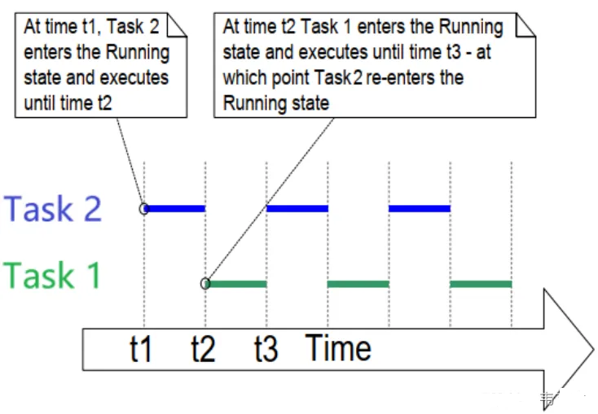
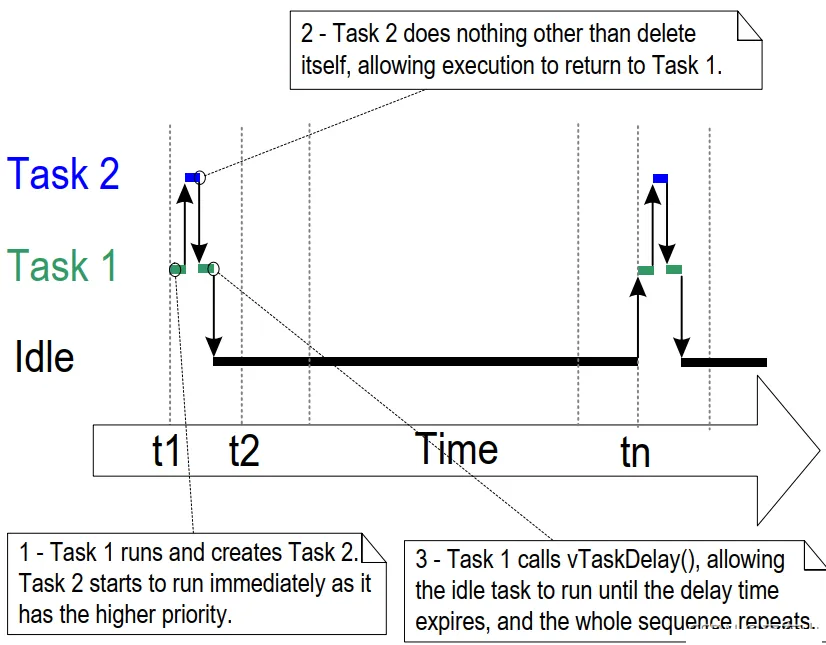
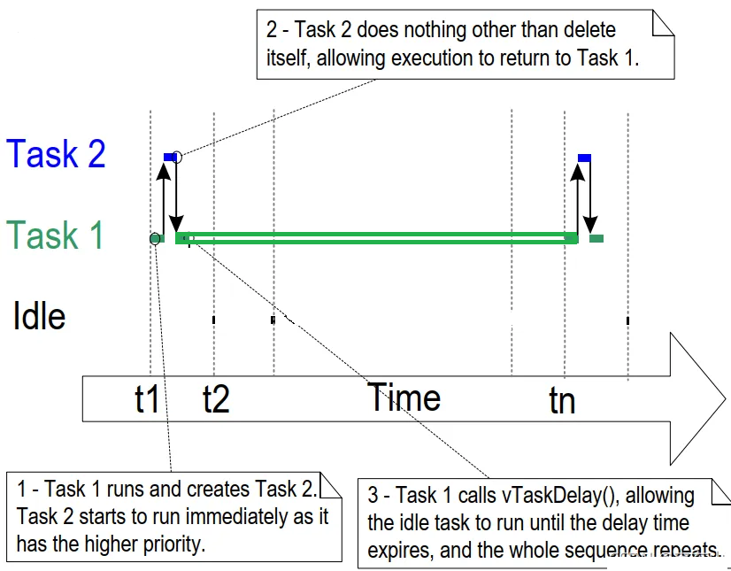
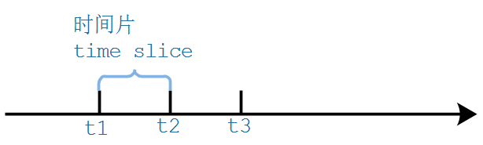
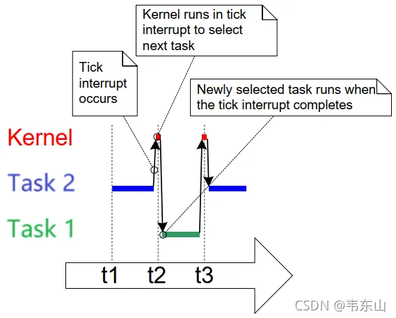
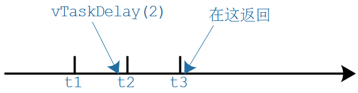
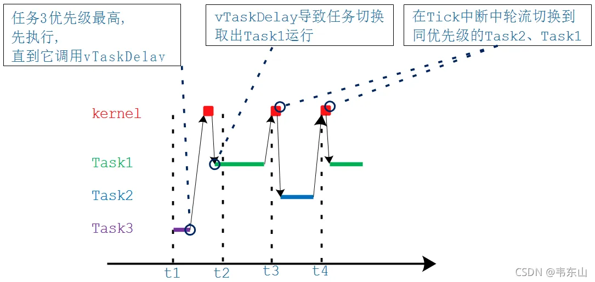
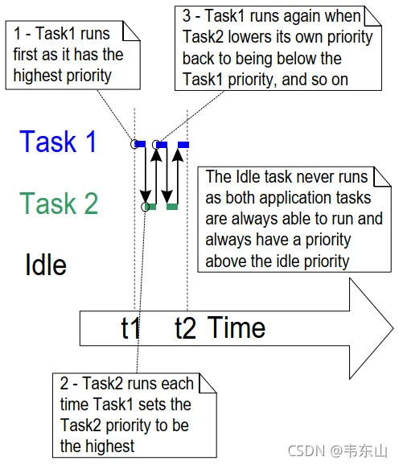
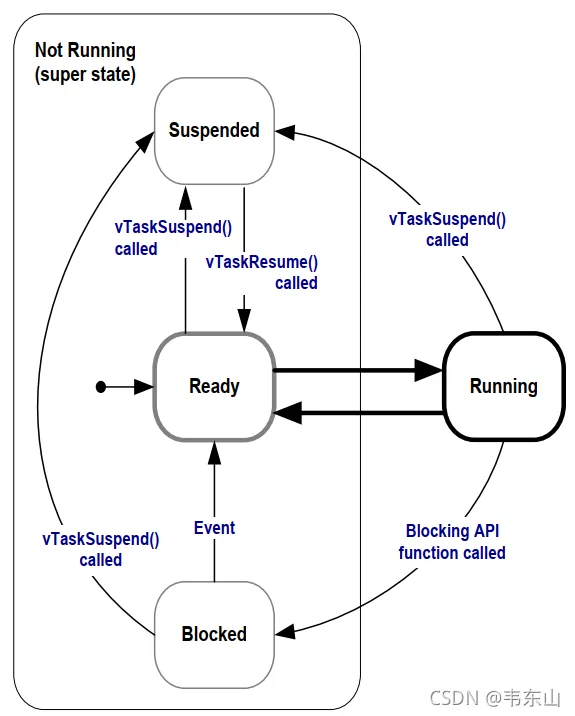
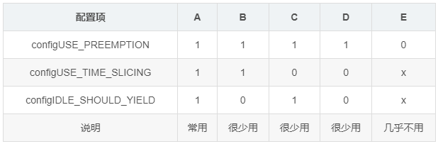

## [任务](https://www.freertos.org/zh-cn-cmn-s/a00019.html)
 0. 任务API汇总
    + 任务创建 
      - xTaskCreate
      - xTaskCreateStatic
      - xTaskCreateRestrictedStatic
      - vTaskDelete
    + 任务控制
      - vTaskDelay
      - vTaskDelayUntil
      - xTaskDelayUntil
      - uxTaskPriorityGet
      - vTaskPrioritySet
      - vTaskSuspend
      - vTaskResume
      - xTaskResumeFromISR
      - xTaskAbortDelay
    + 任务实用程序    
      - uxTaskGetSystemState
      - vTaskGetInfo
      - xTaskGetCurrentTaskHandle
      - xTaskGetIdleTaskHandle
      - uxTaskGetStackHighWaterMark
      - eTaskGetState
      - pcTaskGetName
      - xTaskGetHandle
      - xTaskGetTickCount
      - xTaskGetTickCountFromISR
      - xTaskGetSchedulerState
      - uxTaskGetNumberOfTasks
      - vTaskList
      - vTaskStartTrace
      - ulTaskEndTrace
      - vTaskGetRunTimeStats
      - vTaskGetIdleRunTimeCounter
      - vTaskSetApplicationTaskTag
      - xTaskGetApplicationTaskTag
      - xTaskCallApplicationTaskHook
      - pvTaskGetThreadLocalStoragePointer
      - vTaskSetThreadLocalStoragePointer
      - vTaskSetTimeOutState
      - xTaskCheckForTimeOut 
 1. 基本概念
    * 对于整个单片机程序，我们称之为application，应用程序。
        使用FreeRTOS时，我们可以在application中创建多个任务(task)，有些文档把任务也称为线程(thread)
    * 以日常生活为例，比如这位母亲要同时做两件事：<br>  
      * 喂饭：这是一个任务
      * 回信息：这是另一个任务
    * 这可以引入很多概念：
      * 任务状态(State)：
        * 当前正在喂饭，它是running状态；另一个"回信息"的任务就是"not running"状态
        * "not running"状态还可以细分：
          * ready：就绪，随时可以运行
          * blocked：阻塞，卡住了，母亲在等待同事回信息
          * suspended：挂起，同事废话太多，不管他了
      * 优先级(Priority)
        * 工作生活兼顾：喂饭、回信息优先级一样，轮流做
        * 忙里偷闲：还有空闲任务，休息一下
        * 厨房着火了，什么都别说了，先灭火：优先级更高
      * 栈(Stack)
        * 喂小孩时，我要记得上一口喂了米饭，这口要喂青菜了
        * 回信息时，我要记得刚才聊的是啥
        * 做不同的任务，这些细节不一样
        * 对于人来说，当然是记在脑子里
        * 对于程序，是记在栈里
        * 每个任务有自己的栈
      * 事件驱动
        * 孩子吃饭太慢：先休息一会，等他咽下去了、等他提醒我了，再喂下一口
      * 协助式调度(Co-operative Scheduling)
        * 你在给同事回信息
          * 同事说：好了，你先去给小孩喂一口饭吧，你才能离开
          * 同事不放你走，即使孩子哭了你也不能走
        * 你好不容易可以给孩子喂饭了
          * 孩子说：好了，妈妈你去处理一下工作吧，你才能离开
          * 孩子不放你走，即使同事连发信息你也不能走
 2. 任务创建与删除
    1. 什么是任务
       1. 在FreeRTOS中，任务就是一个函数，原型如下：
          * void ATaskFunction( void *pvParameters );
          * 要注意的是：
            * 这个函数不能返回
            * 同一个函数，可以用来创建多个任务；换句话说，多个任务可以运行同一个函数
            * 函数内部，尽量使用局部变量：
              * 每个任务都有自己的栈
              * 每个任务运行这个函数时
                * 任务A的局部变量放在任务A的栈里、任务B的局部变量放在任务B的栈里
                * 不同任务的局部变量，有自己的副本
            * 函数使用全局变量、静态变量的话
              * 只有一个副本：多个任务使用的是同一个副本
              * 要防止冲突
            * 一个示例
                ```c
                void ATaskFunction( void *pvParameters )
                {
                    /* 对于不同的任务，局部变量放在任务的栈里，有各自的副本 */
                    int32_t lVariableExample = 0;
                    
                    /* 任务函数通常实现为一个无限循环 */
                    for( ;; )
                    {
                        /* 任务的代码 */
                    }

                    /* 如果程序从循环中退出，一定要使用vTaskDelete删除自己
                    * NULL表示删除的是自己
                    */
                    vTaskDelete( NULL );
                    /* 程序不会执行到这里, 如果执行到这里就出错了 */
                }
                ```
    2. 任务特点
       * 每个任务在自己的上下文中执行，不依赖于系统内的其他任务或 RTOS 调度器本身。在任何时间点，应用程序中只能执行一个任务，实时 RTOS 调度器负责决定所要执行的任务。因此， RTOS 调度器可以在应用程序执行时重复启停每个任务（将任务调入或调出）。由于任务不了解 RTOS 调度器活动，因此实时 RTOS 调度器负责确保任务调入时的处理器上下文（寄存器值、堆栈内容等）与任务调出时的处理器上下文完全相同。为实现这一点，每个任务都分配有自己的堆栈。当任务调出时，执行上下文被保存到该任务的堆栈中，以便以后再调入相同的任务时可以准确地恢复其执行上下文
    3. 创建任务
       * 创建任务时使用的函数如下：
       * xTaskCreated原型
         ```c 
            BaseType_t xTaskCreate( TaskFunction_t pxTaskCode, // 函数指针, 任务函数
                        const char * const pcName, // 任务的名字
                        const configSTACK_DEPTH_TYPE usStackDepth, // 栈大小,单位为word,10表示40字节
                        void * const pvParameters, // 调用任务函数时传入的参数
                        UBaseType_t uxPriority,    // 优先级
                        TaskHandle_t * const pxCreatedTask ); // 任务句
         ```
       * 参数说明
        ```
        （1）pxTaskCode:  函数指针,可以简单的认为是一个C函数
        （2）pcName  :任务名字
        （3）usStackDepth: 实际上是uint16_t   是无符号的2字节数值,表示栈的深度大小，实际由malloc函数分配大小
        （4）pvParameters  ：是要传入的参数
        （5）uxPriority: 是一个无符号的整形数，表示优先级的大小，数值越大优先级越大
        （6）pxCreatedTask ：这里面有一个TCB结构体指针,传出去的参数,可以设为NULL
        ```
    4. 示例1: 创建任务
       1. 使用2个函数分别创建2个任务
       2. ```c
            void vTask1( void *pvParameters )
            {
                const char *pcTaskName = "T1 run\r\n";
                volatile uint32_t ul; /* volatile用来避免被优化掉 */
                
                /* 任务函数的主体一般都是无限循环 */
                for( ;; )
                {
                    /* 打印任务1的信息 */
                    printf( pcTaskName );
                    
                    /* 延迟一会(比较简单粗暴) */
                    for( ul = 0; ul < mainDELAY_LOOP_COUNT; ul++ )
                    {
                    }
                }
            }
            void vTask2( void *pvParameters )
            {
                const char *pcTaskName = "T2 run\r\n";
                volatile uint32_t ul; /* volatile用来避免被优化掉 */
                
                /* 任务函数的主体一般都是无限循环 */
                for( ;; )
                {
                    /* 打印任务1的信息 */
                    printf( pcTaskName );
                    
                    /* 延迟一会(比较简单粗暴) */
                    for( ul = 0; ul < mainDELAY_LOOP_COUNT; ul++ )
                    {
                    }
                }
            }
            int main( void )
            {
                xTaskCreate(vTask1, "Task 1", 1000, NULL, 1, NULL);
                xTaskCreate(vTask2, "Task 2", 1000, NULL, 1, NULL);
                return 0;
            }
          ```
       3. 现象:T1和T2在交替的运行
       4. 任务运行图：<br>
         * 在t1：Task2进入运行态，一直运行直到t2
         * 在t2：Task1进入运行态，一直运行直到t3；在t3，Task2重新进入运行态  
    5. 示例2: 使用任务参数
       1. 前面提过,多个任务可以使用同一个函数，怎么体现它们的差别？
         * 栈不同
         * 创建任务时可以传入不同的参数
       2. 我们创建2个任务，使用同一个函数，代码如下：
            ```c
            void vTask(void *arg)
            {
                char *p = (char *)arg;
                
                while(1){
                        printf("%s\n",p);
                } 
            }
            ```
       3. 上述代码中的p来自参数arg，arg来自哪里？创建任务时传入的。
            ```c
            int app_main(void)
            {
                const char *taskArg1 = "task 1";
                const char *taskArg2 = "task 2";
                xTaskCreate(vTask, "task 1", 1024 * 2, (void *)taskArg1, 2, NULL);
                xTaskCreate(vTask, "task 2", 1024 * 2, (void *)taskArg2, 2, NULL);
                return 0;
            }
            ```
    6. 任务的删除
       * 删除任务时使用的函数如下：
         * void vTaskDelete( TaskHandle_t xTaskToDelete );
       * 删除任务
         * 自杀：vTaskDelete(NULL)
         * 被杀：别的任务执行vTaskDelete(pvTaskCode)，pvTaskCode是自己的句柄
         * 杀人：执行vTaskDelete(pvTaskCode)，pvTaskCode是别的任务的句柄
    7. 示例3: 删除任务
       * 创建任务1：任务1的大循环里，创建任务2，然后休眠一段时间
       * 任务2：打印一句话，然后就删除自己 
       * 任务1的代码
        ```c
            void vTask1(void *arg)
            {
                int count = 0;
                while (1) {
                    xTaskCreate(vTask2, "task 2", 1024 * 2, (void *)&count, 2, NULL);
                    count++;
                    // 如果不休眠的话, Idle任务无法得到执行
                    // Idel任务会清理任务2使用的内存
                    // 如果不休眠则Idle任务无法执行, 最后内存耗尽
                    vTaskDelay(pdMS_TO_TICKS(1000));
                }
            }
        ```
       * 任务2的代码
         ```c
            void vTask2(void *arg)
            {
                int *param = (int *)arg;
                printf("task2 running:%d\n", *param);
                vTaskDelete(NULL);
            }
         ```
       * 任务运行图：<br>
         * main函数中创建任务1，优先级为1。任务1运行时，它创建任务2，任务2的优先级是2。
         * 任务2的优先级最高，它马上执行。
         * 任务2打印一句话后，就删除了自己。
         * 任务2被删除后，任务1的优先级最高，轮到任务1继续运行，它调用vTaskDelay()进入Block状态
         * 任务1 Block期间，轮到Idle任务执行：它释放任务2的内存(TCB、栈)
         * 时间到后，任务1变为最高优先级的任务继续执行。
         * 如此循环。  
       * 在任务1的函数中，如果不调用vTaskDelay，则Idle任务用于没有机会执行，它就无法释放创建任务2是分配的内存。
         * 而任务1在不断地创建任务，不断地消耗内存，最终内存耗尽再也无法创建新的任务。
         * <br>
 3. 任务优先级和Tick
    1. 任务优先级
       * 在上个示例中我们体验过优先级的使用：高优先级的任务先运行。
       * 优先级的取值范围是：0~(configMAX_PRIORITIES – 1)，数值越大优先级越高
       * FreeRTOS调度方法
         * 会确保最高优先级的、可运行的任务，马上就能执行
         * 对于相同优先级的、可运行的任务，轮流执行
    2. Tick
       * 对于同优先级的任务，它们“轮流”执行。怎么轮流？你执行一会，我执行一会。
         * "一会"怎么定义？
       * 人有心跳，心跳间隔基本恒定。
         * FreeRTOS中也有心跳，它使用定时器产生固定间隔的中断。这叫Tick、滴答，比如每10ms发生一次时钟中断
       * tick<br>
         * 假设t1、t2、t3发生时钟中断
         * 两次中断之间的时间被称为时间片(time slice、tick period)
         * 时间片的长度由configTICK_RATE_HZ 决定，假设configTICK_RATE_HZ为100，那么时间片长度就是10ms
       * 相同优先级的任务怎么切换呢
         * <br>
         * 任务2从t1执行到t2
         * 在t2发生tick中断，进入tick中断处理函数：
           * 选择下一个要运行的任务
           * 执行完中断处理函数后，切换到新的任务：任务1
         * 任务1从t2执行到t3
         * 从图中可以看出，任务运行的时间并不是严格从t1,t2,t3哪里开始
       * 有了Tick的概念后，我们就可以使用Tick来衡量时间了，比如：
         * vTaskDelay(2);  // 等待2个Tick，假设configTICK_RATE_HZ=100, Tick周期时10ms, 等待20ms
         * // 还可以使用pdMS_TO_TICKS宏把ms转换为tick
         * vTaskDelay(pdMS_TO_TICKS(100));	 // 等待100ms
       * 注意，基于Tick实现的延时并不精确，比如vTaskDelay(2)的本意是延迟2个Tick周期，有可能经过1个Tick多一点就返回了。
       * 如下图<br>
       * 使用vTaskDelay函数时，建议以ms为单位，使用pdMS_TO_TICKS把时间转换为Tick。
       * 这样的代码就与configTICK_RATE_HZ无关，即使配置项configTICK_RATE_HZ改变了，我们也不用去修改代码。
    3. 示例4: 优先级实验
       * 本程序会创建3个任务：
         * 任务1、任务2：优先级相同，都是2
         * 任务3：优先级最高，是3
         * ```c
            void vTask1(void *arg)
            {
                while (1) {
                    printf("task1\n");
                }
            }
            void vTask2(void *arg)
            {
                while (1) {
                    printf("task2\n");
                }
            }
            void vTask3(void *arg)
            {
                while (1) {
                    printf("task3\n");
                    // 如果不休眠的话, 其他任务无法得到执行
                    vTaskDelay(pdMS_TO_TICKS(10));
                }
            }
            int app_main(void)
            {
                xTaskCreate(vTask3, "task 3", 1024 * 2, NULL, 4, NULL);
                xTaskCreate(vTask1, "task 1", 1024 * 2, NULL, 3, NULL);
                xTaskCreate(vTask2, "task 2", 1024 * 2, NULL, 3, NULL);
                return 0;
            }
            ```
       * 运行情况如下图所示：
         * 任务3优先执行，直到它调用vTaskDelay主动放弃运行
         * 任务1、任务2：轮流执行
         * <br>
    4. 示例5: 修改优先级
       * 使用uxTaskPriorityGet来获得任务的优先级：
          * UBaseType_t uxTaskPriorityGet( const TaskHandle_t xTask );
          * 使用参数xTask来指定任务，设置为NULL表示获取自己的优先级。
       * 使用vTaskPrioritySet 来设置任务的优先级：
         * void vTaskPrioritySet( TaskHandle_t xTask, UBaseType_t uxNewPriority );
         * 使用参数xTask来指定任务，设置为NULL表示设置自己的优先级；
         * 参数uxNewPriority表示新的优先级，取值范围是0~(configMAX_PRIORITIES – 1)。
       * 示例代码
         * ```c
            TaskHandle_t task2Handle;
            void vTask1(void *arg)
            {
                int count = 0;
                while (1) {
                    printf("task1\n");
                    if(count++ == 10){
                        int pri = uxTaskPriorityGet(task2Handle);
                        vTaskPrioritySet(task2Handle, pri + 2);
                        vTaskDelete(NULL);
                    }
                }
            }
            void vTask2(void *arg)
            {
                while (1) {
                    printf("task2\n");
                    vTaskDelete(NULL);
                }
            }

            int app_main(void)
            {
                xTaskCreate(vTask1, "task 1", 1024 * 2, NULL, 3, NULL);
                xTaskCreate(vTask2, "task 2", 1024 * 2, NULL, 2, &task2Handle);
                return 0;
            }
           ```
       * 调度情况如下图所示：
         * <br>
         * 1：一开始Task1优先级最高，它先执行。它提升了Task2的优先级。
         * 2：Task2的优先级最高，它执行。它把自己的优先级降低了。
         * 3：Task1的优先级最高，再次执行。它提升了Task2的优先级。
         * 如此循环。
         * 注意：Task1的优先级一直是2，Task2的优先级是3或1，都大于0。所以Idel任务没有机会执行。
 4. 任务状态
    1. 前面很简单地把任务的状态分为2中：运行(Runing)、非运行(Not Running)。
    2. 对于非运行的状态，还可以继续细分
       1. 阻塞状态(Blocked)   
          * 在日常生活的例子中，母亲在电脑前跟同事沟通时，如果同事一直没回复，那么母亲的工作就被卡住了、被堵住了、处于阻塞状态(Blocked)。
          * 重点在于：母亲在等待  
          * 在实际产品中，我们不会让一个任务一直运行，而是使用"事件驱动"的方法让它运行
            * 任务要等待某个事件，事件发生后它才能运行
            * 在等待事件过程中，它不消耗CPU资源
            * 在等待事件的过程中，这个任务就处于阻塞状态(Blocked)
          * 在阻塞状态的任务，它可以等待两种类型的事件
            * 时间相关的事件
              * 可以等待一段时间：我等2分钟
              * 也可以一直等待，直到某个绝对时间：我等到下午3点
            * 同步事件：这事件由别的任务，或者是中断程序产生
              * 例子1：任务A等待任务B给它发送数据
              * 例子2：任务A等待用户按下按键
              * 同步事件的来源有很多(这些概念在后面会细讲)：
                * 队列(queue)
                * 二进制信号量(binary semaphores)
                * 计数信号量(counting semaphores)
                * 互斥量(mutexes)
                * 递归互斥量、递归锁(recursive mutexes)
                * 事件组(event groups)
                * 任务通知(task notifications)
            * 在等待一个同步事件时，可以加上超时时间。比如等待队里数据，超时时间设为10ms：
              * 10ms之内有数据到来：成功返回
              * 10ms到了，还是没有数据：超时返回
       2. 暂停状态(Suspended)
          * 在日常生活的例子中，母亲正在电脑前跟同事沟通，母亲可以暂停：
            * 好烦啊，我暂停一会
            * 领导说：你暂停一下 
          * FreeRTOS中的任务也可以进入暂停状态，唯一的方法是通过vTaskSuspend函数。函数原型如下：
            * void vTaskSuspend( TaskHandle_t xTaskToSuspend );
            * 参数xTaskToSuspend表示要暂停的任务，如果为NULL，表示暂停自己。
            * 要退出暂停状态，只能由别人来操作
              * 别的任务调用：vTaskResume
              * 中断程序调用：xTaskResumeFromISR
          * 实际开发中，暂停状态用得不多
       3. 就绪状态(Ready)
          * 这个任务完全准备好了，随时可以运行：只是还轮不到它。这时，它就处于就绪态(Ready) 
    3. 完整的状态转换图
       * <br>
 5. Delay函数
    1. 两个Delay函数
       * 有两个Delay函数：
         * vTaskDelay：至少等待指定个数的Tick Interrupt才能变为就绪状态
         * vTaskDelayUntil：等待到指定的绝对时刻，才能变为就绪态
    2. 示例6: Delay
 6. 空闲任务及其钩子函数
    1. 介绍
       * 在FreeRTOS_03_delete_task的实验里，我们体验过空闲任务(Idle任务)的作用：释放被删除的任务的内存。
       * 除了上述目的之外，为什么必须要有空闲任务？一个良好的程序，它的任务都是事件驱动的：平时大部分时间处于阻塞状态。
       * 有可能我们自己创建的所有任务都无法执行，但是调度器必须能找到一个可以运行的任务：所以，我们要提供空闲任务。
       * 在使用vTaskStartScheduler()函数来创建、启动调度器时，这个函数内部会创建空闲任务：
         * 空闲任务优先级为0：它不能阻碍用户任务运行
         * 空闲任务要么处于就绪态，要么处于运行态，永远不会阻塞
       * 空闲任务的优先级为0，这意味着一旦某个用户的任务变为就绪态，那么空闲任务马上被切换出去，让这个用户任务运行。
       * 在这种情况下，我们说用户任务"抢占"(pre-empt)了空闲任务，这是由调度器实现的。
       * 要注意的是：如果使用vTaskDelete()来删除任务，那么你就要确保空闲任务有机会执行，否则就无法释放被删除任务的内存
    2. 钩子函数
       * 我们可以添加一个空闲任务的钩子函数(Idle Task Hook Functions)，空闲任务的循环每执行一次，就会调用一次钩子函数。
       * 钩子函数的作用有这些 
         * 执行一些低优先级的、后台的、需要连续执行的函数
         * 测量系统的空闲时间：空闲任务能被执行就意味着所有的高优先级任务都停止了，所以测量空闲任务占据的时间，就可以算出处理器占用率。
         * 让系统进入省电模式：空闲任务能被执行就意味着没有重要的事情要做，当然可以进入省电模式了
       * 空闲任务的钩子函数的限制
         * 不能导致空闲任务进入阻塞状态、暂停状态
         * 如果你会使用vTaskDelete()来删除任务，那么钩子函数要非常高效地执行。
         * 如果空闲任务移植卡在钩子函数里的话，它就无法释放内存。
    3. 使用钩子函数的前提
       * 在FreeRTOS\Source\tasks.c中，可以看到如下代码，所以前提就是：
         * 把这个宏定义为1：configUSE_IDLE_HOOK
         * 实现vApplicationIdleHook函数
         * 对于esp32来说,钩子函数是esp_vApplicationIdleHook,并且已经实现.
 7. 调度算法
    1. 重要概念
       * 正在运行的任务，被称为"正在使用处理器"，它处于运行状态。在单处理系统中，任何时间里只能有一个任务处于运行状态。
       * 非运行状态的任务，它处于这3中状态之一：阻塞(Blocked)、暂停(Suspended)、就绪(Ready)。就绪态的任务，
       * 可以被调度器挑选出来切换为运行状态，调度器永远都是挑选最高优先级的就绪态任务并让它进入运行状态。
       * 阻塞状态的任务，它在等待"事件"，当事件发生时任务就会进入就绪状态。
       * 事件分为两类：时间相关的事件、同步事件。
       * 所谓时间相关的事件，就是设置超时时间：在指定时间内阻塞，时间到了就进入就绪状态。
       * 使用时间相关的事件，可以实现周期性的功能、可以实现超时功能。
       * 同步事件就是：某个任务在等待某些信息，别的任务或者中断服务程序会给它发送信息。
       * 怎么"发送信息"？方法很多，有：任务通知(task notification)、队列(queue)、事件组(event group)、信号量(semaphoe)、互斥量(mutex)等。
       * 这些方法用来发送同步信息，比如表示某个外设得到了数据。
    2. 配置调度算法
       * 所谓调度算法，就是怎么确定哪个就绪态的任务可以切换为运行状态。
       * 通过配置文件FreeRTOSConfig.h的两个配置项来配置调度算法：configUSE_PREEMPTION、configUSE_TIME_SLICING。
       * 还有第三个配置项：configUSE_TICKLESS_IDLE，它是一个高级选项，用于关闭Tick中断来实现省电
       * 从3个角度统一理解多种调度算法
         * 可否抢占？高优先级的任务能否优先执行(配置项: configUSE_PREEMPTION)
           * 可以：被称作"可抢占调度"(Pre-emptive)，高优先级的就绪任务马上执行
           * 不可以：不能抢就只能协商了，被称作"合作调度模式"(Co-operative Scheduling)
             * 当前任务执行时，更高优先级的任务就绪了也不能马上运行，只能等待当前任务主动让出CPU资源。
             * 其他同优先级的任务也只能等待：更高优先级的任务都不能抢占，平级的更应该老实点
         * 可抢占的前提下，同优先级的任务是否轮流执行(配置项：configUSE_TIME_SLICING)
           * 轮流执行：被称为"时间片轮转"(Time Slicing)，同优先级的任务轮流执行，你执行一个时间片、我再执行一个时间片
           * 不轮流执行：英文为"without Time Slicing"，当前任务会一直执行，直到主动放弃、或者被高优先级任务抢占
         * 在"可抢占"+"时间片轮转"的前提下，进一步细化：空闲任务是否让步于用户任务(配置项：configIDLE_SHOULD_YIELD)
           * 空闲任务低人一等，每执行一次循环，就看看是否主动让位给用户任务
           * 空闲任务跟用户任务一样，大家轮流执行，没有谁更特殊
       * 列表如下 <br>
         * A：可抢占+时间片轮转+空闲任务让步
         * B：可抢占+时间片轮转+空闲任务不让步
         * C：可抢占+非时间片轮转+空闲任务让步
         * D：可抢占+非时间片轮转+空闲任务不让步
         * E：合作调度
