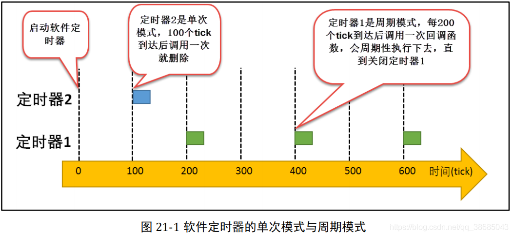

# 软件定时器(https://www.freertos.org/zh-cn-cmn-s/FreeRTOS-Software-Timer-API-Functions.html)
## API汇总
   - xTimerCreate
   - xTimerCreateStatic
   - xTimerIsTimerActive
   - pvTimerGetTimerID
   - pcTimerGetName
   - vTimerSetReloadMode
   - xTimerStart
   - xTimerStop
   - xTimerChangePeriod
   - xTimerDelete
   - xTimerReset
   - xTimerStartFromISR
   - xTimerStopFromISR
   - xTimerChangePeriodFromISR
   - xTimerResetFromISR
   - pvTimerGetTimerID
   - vTimerSetTimerID
   - xTimerGetTimerDaemonTaskHandle
   - xTimerPendFunctionCall
   - xTimerPendFunctionCallFromISR
   - pcTimerGetName
   - xTimerGetPeriod
   - xTimerGetExpiryTime
   - xTimerGetReloadMode
## 软件定时器的基本概念
    定时器：是指从指定的时刻开始，经过一个指定时间，然后触发一个超时事件，用户可以自定义定时器的周期与频率。类似生活中的闹钟，我们可以设置闹钟每天什么时候响，还能设置响的次数，是响一次还是每天都响。

    硬件定时器：芯片本身提供的定时器，外部晶振输入提供时钟，通常精度高、中断触发方式

    软件定时器：是由操作系统提供的一类系统接口，构建在硬件定时器的基础上，使系统能够提供不受硬件定时器的资源限制的定时器服务，实现的功能与硬件定时器类似。

    软硬定时器使用区别：使用硬件定时器时，定时时间到达后会触发中断，用户在中断中处理信息；使用软件定时器时，需要在创建定时器时指定时间到达后要调用的函数（也称作超时函数/回调函数），在回调函数中处理信息。

    软件定时器在被创建之后，当经过设定的时钟计数值后会触发用户定义的回调函数。 
    定时精度与系统时钟的周期有关。一般系统利用 SysTick 作为软件定时器的基础时钟，软件定时器的回调函数类似硬件的中断服务函数，所以，回调函数也要快进快出，而且回调函数中不能有任何阻塞任务运行的情况（软件定时器回调函数的上下文环境是任务），比如 vTaskDelay() 以及其它能阻塞任务运行的函数，两次触发回调函数的时间间隔 xTimerPeriodInTicks 叫定时器的定时周期
## 单次模式和周期模式
  - 单次模式：启动后，定时时间到后，只执行一次回调函数，之后该定时器删除，不再执行
  - 周期模式：启动后，根据定时时间周期性的执行回调函数，直到用户将定时器删除<br>
## 应用场景
    硬件定时器资源不足，对定时精度要求不高的任务。比如可以定时闪烁LED灯作为工作状态指示灯。
## 软件定时器的精度
  - 在操作系统中，通常软件定时器以系统节拍周期为计时单位。系统节拍是系统的心跳节拍，表示系统时钟的频率，类似人的心跳，1秒能跳动多少下。
  - 系统节拍配置为configTICK_RATE_HZ，该宏在 FreeRTOSConfig.h 中有定义，默认是 1000。表示1秒钟跳动1000下，每跳动一下即为1ms。
  - 软件定时器的所定时数值必须是节拍周期的整数倍，由于节拍定义了系统中定时器能够分辨的精确度，系统可以根据实际系统 CPU 的处理能力和实时性需求设置合适的数值，系统节拍周期值越小，精度越高，但是系统开销也越大。
## 要点
  - 软件定时器的回调函数中应快进快出，绝对不允许使用任何可能引软件定时器起任务挂起或者阻塞的 API 接口，在回调函数中也绝对不允许出现死循环。
  - 软件定时器使用了系统的一个队列和一个任务资源，软件定时器任务的优先级默认为 configTIMER_TASK_PRIORITY，为了更好响应，该优先级应设置为所有任务中最高的优先级。
  - 创建单次软件定时器，该定时器超时执行完回调函数后，系统会自动删除该软件定时器，并回收资源。
  - 定时器任务的堆栈大小默认为 configTIMER_TASK_STACK_DEPTH 个字节
## 常用API:xTimerCreate/xTimerStart/xTimerStop/xTimerDelete
  1. #include "freertos/timers.h"
  2. xTimerCreate()
     ```c
        TimerHandle_t xTimerCreate  //返回值:创建成功,返回定时器的句柄,失败(比如内存不足)则返回 NULL
                 ( const char * const pcTimerName,//定时器的名称。纯粹是为了协助调试。内核本身只通过句柄引用定时器
                   const TickType_t xTimerPeriod, //定时器的周期。 以 tick 为单位指定此周期
                   const UBaseType_t uxAutoReload,//pdFALSE，定时器为一次性定时器,.pdTRUE,为周期性
                   void * const pvTimerID,        //定时器的标识符。用于定时器回调函数分配给了多个定时器时区分
                                                  // vTimerSetTimerID() 和 pvTimerGetTimerID() 可以访问该值   
                   TimerCallbackFunction_t pxCallbackFunction );//回调函数void vCallbackFunction( TimerHandle_t xTimer );
     ``` 
  3. xTimerStart() / xTimerStartFromISR() 
     + xTimerStart() 启动指定的定时器.如果定时器已经启动且已处于活动状态,那么相当于xTimerReset()  
     + ```c
        BaseType_t xTimerStart( TimerHandle_t xTimer,//要启动的定时器的句柄
                            TickType_t xBlockTime ); //队列满的情况下,以等待命令成功发送到定时器命令队列的阻塞的时间(tick为单位)

        BaseType_t xTimerStartFromISR ( TimerHandle_t xTimer, 
                            BaseType_t *pxHigherPriorityTaskWoken);   
        //pxHigherPriorityTaskWoken  定时器服务进程任务大部分时间处于阻塞状态调用xTimerStartFromISR()会将消息写入定时器命令队列,从而让定时器服务进程有可能脱离阻塞状态。如果调用导致服务进程脱离阻塞状态,且定时器服务进程的优先级等于或大于当前执行的任务,那 *pxHigherPriorityTaskWoken 将在 xTimerStartFromISR() 函数内部被设置为 pdTRUE。会在中断退出前执行上下文切换。                 
      ```
  4. xTimerReset() / xTimerResetFromISR() 
     + xTimerReset() 重新启动指定的定时器.计时值重新计算
     + ```c
        BaseType_t xTimerReset( TimerHandle_t xTimer, TickType_t xBlockTime )
        BaseType_t xTimerResetFromISR(TimerHandle_t xTimer,BaseType_t *pxHigherPriorityTaskWoken);
       ```
  5. xTimerChangePeriod() / TimerChangePeriodFromISR()
     + 改变先前使用 xTimerCreate() 函数创建的定时器的周期。更改休眠定时器的周期也会启动 定时器。 
     + ```c
        BaseType_t xTimerChangePeriod( TimerHandle_t xTimer,
                                       TickType_t xNewPeriod,
                                       TickType_t xBlockTime );
        BaseType_t xTimerChangePeriodFromISR(TimerHandle_t xTimer,
                                             TickType_t xNewPeriod,
                                             BaseType_t *pxHigherPriorityTaskWoken);
       ```
  6. pvTimerGetTimerID() / vTimerSetTimerID()
     + 返回分配给软件计时器的 ID。
     + ```c
        void *pvTimerGetTimerID( TimerHandle_t xTimer ); //返回分配给被查询的定时器的ID,ID可以是任意类型
        void vTimerSetTimerID( TimerHandle_t xTimer, void *pvNewID );
       ``` 
     + 用法示例
       ```c
        void cbTimerFun(TimerHandle_t pExpiredTimer){
            uint32_t id = (uint32_t)pvTimerGetTimerID(pExpiredTimer);
            vTimerSetTimerID(pExpiredTimer, (void *)id);
        }
        void app_main(void){
            timer1 = xTimerCreate("timer1", pdMS_TO_TICKS(1000), pdTRUE, (void*)100, cbTimerFun);
        }
       ```  
 ## 示例
  1. 定时器创建及启动:xTimerCreate/xTimerStart
     ```c
        void cbTimerFun(TimerHandle_t pExpiredTimer){
            INFO("time over");
        }
        void app_main(void)
        {
            timer1 = xTimerCreate("timer1", pdMS_TO_TICKS(1000), pdTRUE, NULL, cbTimerFun);
            xTimerStart(timer1, 10);
        }
     ```
  2. 定时器ID的使用:pvTimerGetTimerID() / vTimerSetTimerID()
     当多个定时器共用同一个回调函数时.需要区分定时器
     ```c
        void cbTimerFun(TimerHandle_t pExpiredTimer){
            uint32_t id = (uint32_t)pvTimerGetTimerID(pExpiredTimer);
            INFO("time %d over",id);
        }
        void app_main(void)
        {
            timer1 = xTimerCreate("timer1", pdMS_TO_TICKS(1000), pdTRUE, (void *)100, cbTimerFun);
            timer2 = xTimerCreate("timer1", pdMS_TO_TICKS(1000), pdTRUE, (void *)200, cbTimerFun);
            xTimerStart(timer1, 10);
            xTimerStart(timer2, 10);
        }
     ```     
  3. 练习: 背光的控制:当按键按下，打开液晶背光,5s时间到，关掉液晶背光
    + 思路:
        - 设置一个软件定时器 xBacklightTimer,定时周期为 5s,单次执行
        - 当按键按下，打开液晶背光，启动软件定时器，5s 时间到，关掉液晶背光
     ```c
        #define BTN1 16
        #define BTN2 17

        TimerHandle_t timer1, timer2;

        void initKey()
        {
            gpio_config_t cfg = {0};
            cfg.pin_bit_mask = (1ull << BTN1 | 1ull << BTN2);
            cfg.mode = GPIO_MODE_INPUT;
            cfg.pull_up_en = GPIO_PULLUP_ENABLE;
            cfg.pull_down_en = GPIO_PULLDOWN_DISABLE;
            cfg.intr_type = GPIO_INTR_DISABLE;
            gpio_config(&cfg);
        }

        uint32_t getKey(gpio_num_t btn)
        {
            if (gpio_get_level((gpio_num_t)btn) == 0) {
                vTaskDelay(pdMS_TO_TICKS(20));
                if (gpio_get_level((gpio_num_t)btn) == 0) {
                    while (1) {
                        if (gpio_get_level((gpio_num_t)btn))
                            break;
                    }
                    INFO("key down");
                    return btn;
                }
            }
            return 0;
        }

        void cbTimerFun(TimerHandle_t pExpiredTimer)
        {
            INFO("backLight off");
        }
        void app_main(void)
        {
            initKey();
            timer1 = xTimerCreate("timer1", pdMS_TO_TICKS(1000 * 5), pdFAIL, NULL, cbTimerFun);
            while(1){
                if(BTN1 == getKey(BTN1)){
                    INFO("backLight on");
                    if(pdTRUE == xTimerStart(timer1,0)){
                        INFO("start Timer");
                    }else{
                        INFO("start Timer fail");
                    }
                }
                vTaskDelay(20);
            }
        }
      ```   