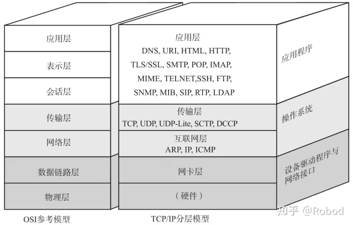
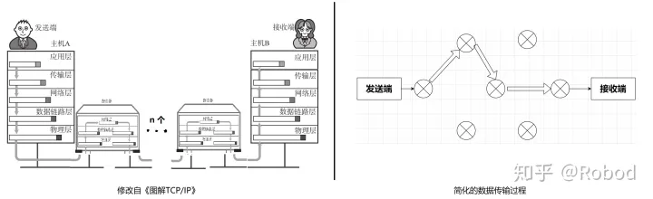
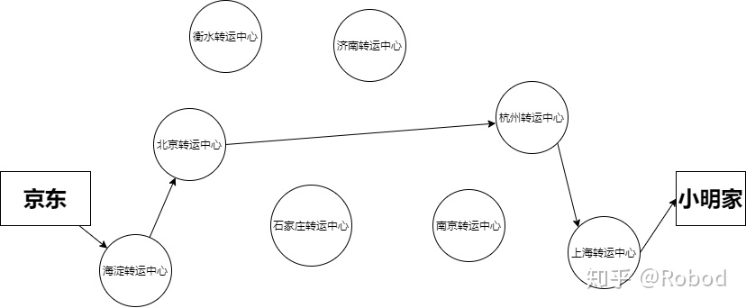
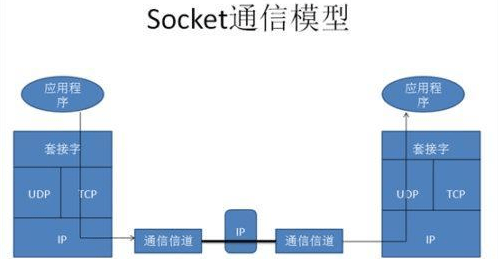
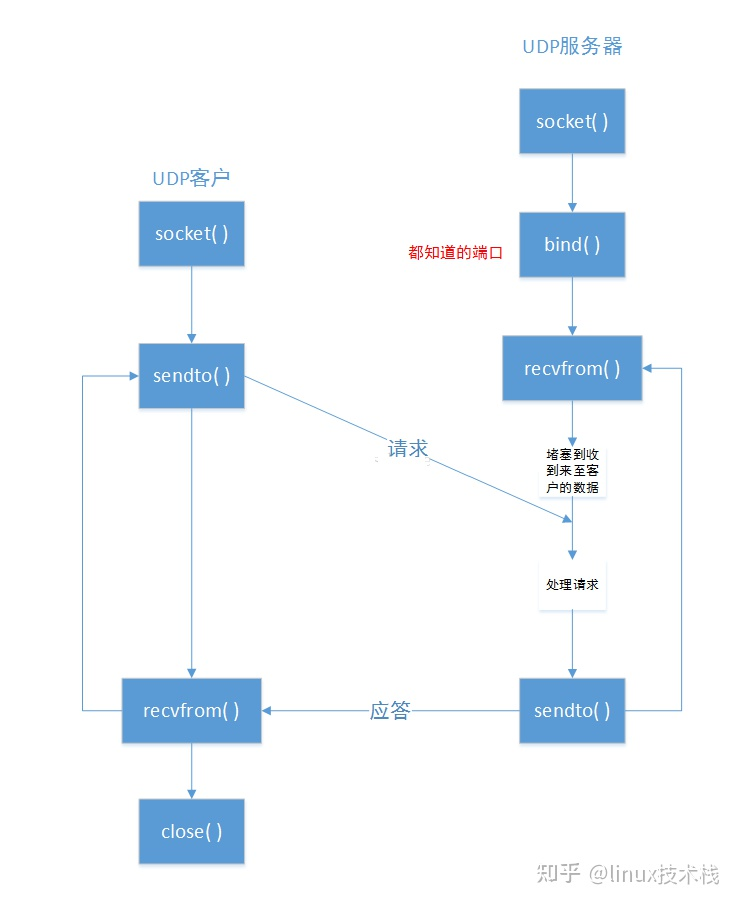
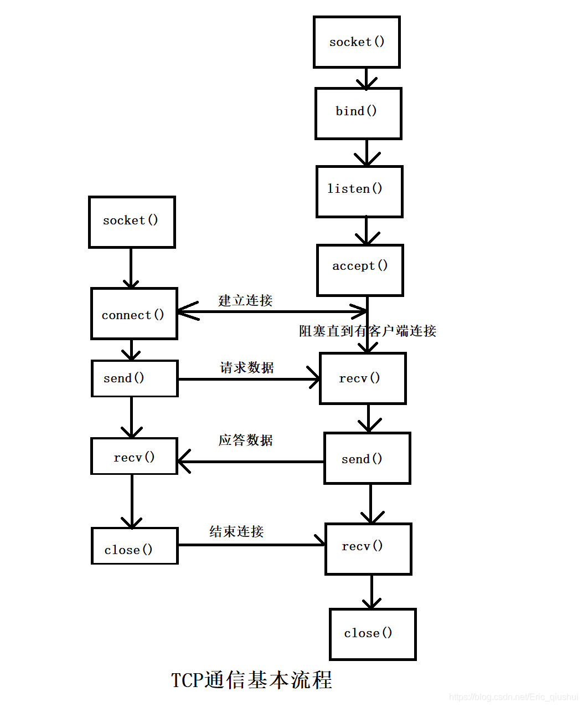

# udp&tcp
1. udp概念
   1. 什么是udp
      + UDP（UserDatagramProtocol）是一个简单的面向消息的传输层协议，尽管UDP提供标头和有效负载的完整性验证（通过校验和），但它不保证向上层协议提供消息传递，并且UDP层在发送后不会保留UDP 消息的状态。因此，UDP有时被称为不可靠的数据报协议。如果需要传输可靠性，则必须在用户应用程序中实现。
      + UDP使用具有最小协议机制的简单无连接通信模型。UDP提供数据完整性的校验和，以及用于在数据报的源和目标寻址不同函数的端口号。它没有握手对话，因此将用户的程序暴露在底层网络的任何不可靠的方面。如果在网络接口级别需要纠错功能，应用程序可以使用为此目的设计的传输控制协议(TCP)
      + 特点:
        - UDP是基于IP的简单协议，不可靠的协议。
        - UDP的优点：简单，轻量化。
        - UDP的缺点：没有流控制，没有应答确认机制，不能解决丢包、重发、错序问题。
        - 使用UDP 协议最大的特点就是速度快。
   2. 端口号
      + 端口号是16位的非负整数,范围是0~65535,这个范围会分为三种不同的端口号段，由端口号是由互联网分配号码管理局（IANA）进行分配
        - 周知/标准端口号，它的范围是 0 - 1023。在Unix的操作系统上，使用这些端口之一需要超级用户操作权限
        - 注册端口号，范围是 1024 - 49151。是用于IANA 注册服务的注册端口。
        - 私有端口号，范围是 49152 - 6553。未正式指定用于任何特定服务，可用于任何目的。这些端口也可以用作临时端口，在主机上运行的软件可以使用这些端口根据需要动态创建通信终结点。
      + 端口的作用，简单说就是为了区分不同应用程序的，当电脑接收到一个数据报，将根据不同的端口将数据送给不同的应用程序。所以上面说到互联网分配号码管理局（IANA）分配。
        - 具体分配的细则，大家可以看这个[网站](https://www.iana.org/assignments/service-names-port-numbers/service-names-port-numbers.xhtml)  
        - 以80端口为例，80端口是为HTTP（HyperTextTransport Protocol)即超文本传输协议开放的，此为上网冲浪使用次数最多的协议，主要用于WWW（WorldWide Web）即万维网传输信息的协议
        - 当然端口并不是唯一用来区分不同应用程序的因素，假如来到达服务器的两个80端口的数据报，但实际上，这两个数据报需要送给不同的应用程序。所以仅凭端口号来确定某一条报文显然是不够的。互联网上一般使用 源IP 地址、目标IP地址、源端口号、目标端口号来进行区分。如果其中的某一项不同，就被认为是不同的报文段。这些也是多路分解和多路复用的基础
   3. UDP和ARP之间的交互
      + 一个细节，这是针对一些系统地实现来说的。当ARP(Address Resolution Protocol)缓存还是空的时候。UDP在被发送之前一定要发送一个ARP请求来获得目的主机的MAC地址   
      + `arp -a`可以查看局域网所有IP信息
   4. UDP适用场景及优点
      + UDP协议一般作为流媒体应用、语音交流、视频会议所使用的传输层协议，还有许多基于互联网的电话服务使用的VOIP（基于IP的语音）也是基于UDP运行的，实时视频和音频流协议旨在处理偶尔丢失的数据包，因此，如果重新传输丢失的数据包，则只会发生质量略有下降，而不是出现较大的延迟 
      + 速度快，采用 UDP 协议时，只要应用进程将数据传给 UDP，UDP 就会将此数据打包进 UDP 报文段并立刻传递给网络层，然而TCP有拥塞控制的功能，它会在发送前判断互联网的拥堵情况，如果互联网极度阻塞，那么就会抑制 TCP 的发送方。使用 UDP 的目的就是希望实时性。
      + 无须建立连接，TCP 在数据传输之前需要经过三次握手的操作，而 UDP 则无须任何准备即可进行数据传输。因此 UDP 没有建立连接的时延。
      + 无连接状态，TCP 需要在端系统中维护连接状态，连接状态包括接收和发送缓存、拥塞控制参数以及序号和确认号的参数，在 UDP 中没有这些参数，也没有发送缓存和接受缓存。因此，某些专门用于某种特定应用的服务器当应用程序运行在 UDP 上，一般能支持更多的活跃用户
      + 分组首部开销小，每个 TCP 报文段都有 20 字节的首部开销，而 UDP 仅仅只有 8 字节的开销。 
   5. TCP/IP体系结构 
      + 简单了解一下OSI参考模型，OSI将网络分为七层，自下而上分别是物理层、数据链路层、网络层、传输层、会话层、表示层、应用层，而TCP/IP体系结构则将网络分为四层，自下而上分别是网络接口层、网络层、传输层、应用层。为了将每一层讲明白，我们讲网络接口层拆分为物理层和数据链路层，以下是在《图解TCP/IP》上面找了一张OSI参考模型和TCP/IP体系结构的对照图
      + 
      + 介绍了了TCP/IP有哪几层后，再来说一说每一层的大概功能。计算机的世界很奇妙，它里面有很多东西和现实世界都是一一对应的，这也可能是计算机设计者们有意而为之的吧。我先来说一下一个数据包在网络中的传输过程，再来用物流的例子对照着解释一遍，你就应该能够明白每一层的作用了
      + 
      + 看上面的图，发送端想要发送数据到接收端。首先应用层准备好要发送的数据，然后给了传输层，传输层的主要作用就是为发送端和接收端提供可靠的连接服务，传输层将数据处理完后就给了网络层。网络层的功能就是管理网络，其中一个核心的功能就是路径的选择(路由)，从发送端到接收端有很多条路，网络层就负责管理下一步数据应该到哪个路由器。选择好了路径之后，数据就来到了数据链路层，这一层就是负责将数据从一个路由器送到另一个路由器。然后就是物理层了，可以简单的理解，物理层就是网线一类的最基础的设备
      + 可能有很多同学看到我上面的一段话后还是一知半解，没关系，我再用物流的例子解释一遍你就明白了
      + 
   6. socket通讯模型
      + 什么是socket
        - socket 的原意是“插座”，在计算机通信领域，socket 被翻译为“套接字”，它是计算机之间进行通信的一种约定或一种方式。
        - 通过 socket 这种约定，一台计算机可以接收其他计算机的数据，也可以向其他计算机发送数据。
        - socket 的典型应用就是 Web 服务器和浏览器：浏览器获取用户输入的 URL，向服务器发起请求，服务器分析接收到的 URL，将对应的网页内容返回给浏览器，浏览器再经过解析和渲染，就将文字、图片、视频等元素呈现给用户。
        - 例如我们每天浏览网页、QQ 聊天、收发 email 等等
        - 
      + socket 套接字的分类
        - 通过 socket() 函数创建连接时，必须告诉它使用哪种数据传输方式
        - 1. 流格式套接字（SOCK_STREAM） 
          - 流格式套接字（Stream Sockets）也叫“面向连接的套接字”，在代码中使用 SOCK_STREAM 表示。
          - SOCK_STREAM 是一种可靠的、双向的通信数据流，数据可以准确无误地到达另一台计算机，如果损坏或丢失，可以重新发送。
          - SOCK_STREAM 有以下几个特征：
            - 数据在传输过程中不会消失；
            - 数据是按照顺序传输的；
            - 数据的发送和接收不是同步的（有的说法也称“不存在数据边界”）。
          - 可以将 SOCK_STREAM 想象成一条传输带，只要传输带本身没有问题（不会断网），就能保证数据不丢失；同时，较晚传送的数据不会先到达，较早传送的数据不会晚到达，这就保证了数据是按照顺序传递的。
        - 2. 数据报格式套接字（SOCK_DGRAM）
          - 数据报格式套接字（Datagram Sockets）也叫“无连接的套接字”，在代码中使用 SOCK_DGRAM 表示。
          - 计算机只管传输数据，不作数据校验，如果数据在传输中损坏，或者没有到达另一台计算机，是没有办法补救的。也就是说，数据错了就错了，无法重传。
          - 因为数据报套接字所做的校验工作少，所以在传输效率方面比流格式套接字要高。
          - 可以将 SOCK_DGRAM 比喻成高速移动的摩托车快递，它有以下特征：
            - 强调快速传输而非传输顺序；
            - 传输的数据可能丢失也可能损毁；
            - 限制每次传输的数据大小；
            - 数据的发送和接收是同步的（也称为“存在数据边界”）。
          - 总之，数据报套接字是一种不可靠的、不按顺序传递的、以追求速度为目的的套接字。
          - 视频聊天和语音聊天通常使用SOCK_DGRAM 来传输数据，因为首先要保证通信的效率，尽量减小延迟，而数据的正确性是次要的，即使丢失很小的一部分数据，视频和音频也可以正常解析，最多出现噪点或杂音，不会对通信质量有实质的影响 
   7. udp编程模型
      1. udp编程模型<br>
      2. socket:创建一个套接字
         + https://www.man7.org/linux/man-pages/man7/socket.7@@man-pages.html
         + int sockfd = socket(int domain, int socket_type, int protocol);
           - domain:用于设置网络通信的域，函数根据这个参数选择通信协议的族。通信协议族在文件sys/socket.h中
             - 定义可以选择 AF_INET（用于 Internet 进程间通信） 或者 AF_UNIX（用于同一台机器进程间通信）,实际编程中常用AF_INET 
           - socket_type：套接字类型用于设置套接字通信的类型，主要有SOCKET_STREAM（流式套接字）、SOCK_DGRAM(数据包套接字)
           - protocol:用于某个协议的特定类型，即type类型中的某个类型。通常某协议中只有一种特定类型，这样protocol参数仅能设置为0；但是有些协 议有多种特定的类型，就需要设置这个参数来选择特定的类型。
         + 创建一个udp `sockfd = socket(AF_INET, SOCKET_DGRAM, 0)` 
      3. sendto:发送数据
         + sendto 函数用于在套接字上写入传出数据
         + https://www.man7.org/linux/man-pages/man2/sendto.2.html
         + ssize_t sendto(int sockfd, const void *buf, size_t len, int flags,
                          const struct sockaddr *dest_addr, socklen_t addrlen);
           - sockfd:用socket创建的套接字 
           - buf:指向包含要传输数据的缓冲区的指针。
           - len:buf 参数指向的数据长度（以字节为单位）
           - flags:一组标志，用于指定调用的方式。通常设为0
           - dest_addr:指向包含目标套接字地址的 sockaddr 结构的指针
             - 通常不会直接使用`struct sockaddr`,而是用`struct sockaddr_in`类型,具体见[5. ip地址结构]()
           - addrlen:参数指向的地址的大小（以字节为单位）,实际上就是dest_addr的大小
           - 返回值:未发生错误,sendto 将返回发送的字节总数，这可能小于len指示的数字.否则，将返回SOCKET_ERROR值
      4. recvfrom:接收数据
         + recvfrom 函数读取已连接套接字和未连接套接字上的传入数据，并捕获从中发送数据的地址。 此函数通常用于无连接套接字。 套接字的本地地址必须已知。 对于服务器应用程序，通常通过 绑定显式完成此操作。 客户端应用程序不建议显式绑定
         + https://www.man7.org/linux/man-pages/man2/recvfrom.2.html
         + ssize_t recvfrom(int sockfd, void *restrict buf, size_t len, int flags,
                        struct sockaddr *restrict src_addr,
                        socklen_t *restrict addrlen);
           - sockfd:用socket创建的套接字 
           - buf:传入数据的缓冲区。
           - len:buf 参数指向的缓冲区的长度（以字节为单位）
           - flags:一组标志，用于指定调用的方式。通常设为0
           - src_addr:指向 sockaddr 结构中缓冲区的可选指针，该缓冲区将在返回时保存源地址
           - addrlen:指向参数指向的缓冲区大小（以字节为单位 ）,实际上就是dest_addr的大小
           - 返回值:如果未发生错误,recvfrom 将返回收到的字节数.连接已正常关闭，则返回零.否则,将返回SOCKET_ERROR值
      5. bind:将本地地址与套接字相关联
         + 在未连接的套接字上需要绑定函数，然后才能对侦听函数进行后续调用
         + https://www.man7.org/linux/man-pages/man2/bind.2.html
         + int bind(int sockfd, const struct sockaddr *addr, socklen_t addrlen); 
           - sockfd:用socket创建的套接字 
           - addr:指向要分配给绑定套接字 的本地地址 的 sockaddr 结构的指针。
             - 注册绑定的IP地址必须是"0.0.0.0"
           - namelen:addr 指向的值的长度（以字节为单位）
           - 返回值:On success, zero is returned.  On error, -1 is returned, and errno is set to indicate the error.
      6. ip地址结构 
         + `struct sockaddr`和`struct sockaddr_in`这两个结构体用来处理网络通信的地址
         + sockaddr:
           - sockaddr在头文件#include <sys/socket.h>中定义，sockaddr的缺陷是：sa_data把目标地址和端口信息混在一起了，如下
           - ```c
                struct sockaddr {  
                sa_family_t sin_family;//地址族
            　　  char sa_data[14]; //14字节，包含套接字中的目标地址和端口信息               
            　　 }; 
             ```
        + sockaddr_in
          - sockaddr_in在头文件#include<netinet/in.h>或#include <arpa/inet.h>中定义，该结构体解决了sockaddr的缺陷，把port和addr 分开储存在两个变量中，如下：
            ```c
                struct sockaddr_in {
                    u8_t            sin_len;
                    sa_family_t     sin_family; //地址簇
                    in_port_t       sin_port;   //16位端口号
                    struct in_addr  sin_addr;   //32位IP地址的结构体,实际上就是一个u32_t
                    char            sin_zero[8]; //不使用
                };
                
                struct in_addr {
                    u32_t s_addr;
                };
            ``` 
          - sin_port和sin_addr都必须是网络字节序（NBO），一般可视化的数字都是主机字节序（HBO）
        + 总结:
          - 二者长度一样，都是16个字节，即占用的内存大小是一致的，因此可以互相转化。二者是并列结构，指向sockaddr_in结构的指针也可以指向sockaddr。
          - sockaddr常用于bind、connect、recvfrom、sendto等函数的参数，指明地址信息，是一种通用的套接字地址。
          - sockaddr_in 是internet环境下套接字的地址形式。所以在网络编程中我们会对sockaddr_in结构体进行操作，使用sockaddr_in来建立所需的信息，最后使用类型转化就可以了。一般先把sockaddr_in变量赋值后，强制类型转换后传入用sockaddr做参数的函数：sockaddr_in用于socket定义和赋值；sockaddr用于函数参数
   8. API汇总
      * 以下 BSD Socket 接口位于 lwip/lwip/src/include/lwip/sockets.h。
      * socket()
      * bind()
      * accept()
      * shutdown()
      * getpeername()
      * getsockopt()＆setsockopt()（请参阅套接字选项）
      * close()（通过虚拟文件系统组件）
      * read()，readv()，write()，writev()（经由虚拟文件系统部件）
      * recv()，recvmsg()，recvfrom()
      * send()，sendmsg()，sendto()
      * select()（通过虚拟文件系统组件）
      * poll()（注意：在ESP-IDF上，poll()是通过内部调用select来实现的，因此，select()如果有可用的方法选择，建议直接使用。）
      * fcntl()（请参阅fcntl）
      * ioctl()（请参阅ioctls）
   9. 常用的转换宏
      1. 字节序转换宏:
        - htons(x) 
        - ntohs(x) 
        - htonl(x) 
        - ntohl(x) 
      2. IP地址转换函数:  
         1. `in_addr_t inet_addr(const char *cp);` //点分十进制地址的地址转成网络字节序
            `dest_addr.sin_addr.s_addr = inet_addr("127.0.0.1");`
         2. int inet_aton(const char *cp, struct in_addr *inp);
            + 参数  cp：传入的ip地址；inp   指向转换后存储到struct in_addr结构体的s_addr；
            ```c
                int ip_addr;
                struct in_addr inet_ip_addr;
                ip_addr = inet_aton("192.168.2.125", &inet_ip_addr);
                printf("%d\n",inet_ip_addr.s_addr);   
            ```
         3. `char *inet_ntoa(struct in_addr in);` //网络字节序转给点分十进制
            ```c
                struct in_addr network;
                network.s_addr=2097326272;    //为s_addr赋值--网络字节序
                printf("IP : %s\n", inet_ntoa(network));
            ``` 
2. udp客户端步骤
    1. 新建socket
      ```c
         int sockfd = socket(AF_INET, SOCK_DGRAM, 0);
         if(sockfd < 0) 
         {
             ESP_LOGE(TAG, "Unable to create socket: errno %d", errno);
         }
                 
      ```
    2. 配置将要连接的服务器信息（端口和IP）
      ```c
         #define HOST_IP_ADDR    "192.168.110.239"    // 要连接UDP服务器地址
         #define UDP_PORT        9000                 // 要连接UDP服务器端口号

         struct sockaddr_in dest_addr;
         dest_addr.sin_family = AF_INET;
         dest_addr.sin_addr.s_addr = inet_addr(HOST_IP_ADDR);
         dest_addr.sin_port = htons(UDP_PORT);
      ```
    3. 发送数据
      ```c
         char *msg = "Message from ESP32";
         //以下语句有个小bug
         int err = sendto(sockfd, msg, sizeof(msg), 0, (struct sockaddr *) &dest_addr, sizeof(dest_addr));
         if (err < 0) {
             ESP_LOGE(TAG, "Error occurred during sending: errno %d", errno);
             close(sockfd);
         }
      ```
    4. 接收数据
      ```c
         while (1){
             char buf[100];
             struct sockaddr from;
             uint32_t fromlen = sizeof(from);
             int len = recvfrom(sockfd, (void *)buf, sizeof(buf), 0, &from, &fromlen);
             if(len > 0){
                 printf("receive:%d\n",len);
                 printf("%s\n",buf);

                 struct sockaddr_in *src_addr = (struct sockaddr_in *)&from;
                 printf("from:%s\n",inet_ntoa(src_addr->sin_addr.s_addr));
             }
         }
      ```
    5. udp客户端实例:
    ```c
     #include <stdio.h>

     #include "esp_wifi.h"
     #include "freertos/FreeRTOS.h"
     #include "freertos/task.h"
     #include "nvs_flash.h"
     #include "string.h"
     #include "esp_log.h"
     #include "esp_smartconfig.h"
     #include "freertos/event_groups.h"
     #include "lwip/sockets.h"
     #define TAG "main"

     void udp(void){
         printf("udp start\n");
         int sockfd = socket(AF_INET, SOCK_DGRAM, 0);
         if(sockfd < 0){
             ESP_LOGE("", "Unable to create socket: errno %d", errno);
         }

         struct sockaddr_in dest_addr;
         dest_addr.sin_family = AF_INET;
         dest_addr.sin_addr.s_addr = inet_addr("192.168.110.239");
         dest_addr.sin_port = htons(9000);

         char *msg = "Message from ESP32";
         int err = sendto(sockfd, msg, sizeof(msg), 0, (struct sockaddr *) &dest_addr, sizeof(dest_addr));
         if (err < 0) {
             ESP_LOGE(TAG, "Error occurred during sending: errno %d", errno);
             close(sockfd);
         }
         while (1){
             char buf[100];
             struct sockaddr from;
             uint32_t fromlen = sizeof(from);
             int len = recvfrom(sockfd, (void *)buf, sizeof(buf), 0, &from, &fromlen);
             if(len > 0){
                 printf("receive:%d\n",len);
                 printf("%s\n",buf);

                 struct sockaddr_in *src_addr = (struct sockaddr_in *)&from;
                 printf("from:%s\n",inet_ntoa(src_addr->sin_addr.s_addr));
             }
         }
     }

     static void event_handler(void* arg, esp_event_base_t event_base, int32_t event_id,void* event_data)
     {
         ESP_LOGI("", "event_base:%s， event_id：%d\r\n", event_base, event_id);
         if (event_base == WIFI_EVENT) {
             switch (event_id) {
             case WIFI_EVENT_STA_START:  // STA模式启动
                 esp_wifi_connect();
                 break;
             case WIFI_EVENT_STA_DISCONNECTED:
                 
                 break;
             }
         }
         if (event_base == IP_EVENT && event_id == IP_EVENT_STA_GOT_IP){
             ip_event_got_ip_t* event = (ip_event_got_ip_t*) event_data;
             ESP_LOGI("", "got ip:" IPSTR, IP2STR(&event->ip_info.ip));
             xTaskCreate(udp,"",1028 * 4,NULL,5,NULL);
         }
         
     }

     void app_main(void)
     {
         nvs_flash_init();
         esp_netif_init();
         
         esp_event_loop_create_default();  // 创建一个默认的事件循环
         
         esp_netif_create_default_wifi_sta();//必须放在esp_event_loop_create_default()后面,否则收不到IP_EVENT_STA_GOT_IP

         wifi_init_config_t cfg = WIFI_INIT_CONFIG_DEFAULT();
         ESP_ERROR_CHECK(esp_wifi_init(&cfg));
         esp_wifi_set_mode(WIFI_MODE_STA);

         esp_event_handler_instance_register(WIFI_EVENT, ESP_EVENT_ANY_ID, &event_handler, NULL, NULL);
         esp_event_handler_instance_register(IP_EVENT, IP_EVENT_STA_GOT_IP,&event_handler, NULL, NULL);

         wifi_config_t conf={.sta.ssid="xxxx",
                             .sta.password="abcd12345",
                             .sta.threshold.authmode= WIFI_AUTH_WPA2_PSK,};
         esp_wifi_set_config(WIFI_IF_STA, &conf);
         esp_wifi_start();
         
     }

    ```  
    6. 练习:实现upd实现一个聊天程序,实现和PC通信  
3. udp服务器步骤
       1. 新建socket
            ```c
                int sockfd = socket(AF_INET, SOCK_DGRAM, 0);
                if(sockfd < 0) 
                {
                    ESP_LOGE(TAG, "Unable to create socket: errno %d", errno);
                }         
            ```
       2. 绑定端口号:
            ```c
                struct sockaddr_in sockaddr={//.sin_addr.s_addr = inet_addr("0.0.0.0"),
                                 .sin_addr.s_addr = htonl(INADDR_ANY)
                                 .sin_port = htons(9000),
                                 .sin_family = AF_INET};
                if(bind(sockfd, (struct sockaddr*)&sockaddr, sizeof(sockaddr)) < 0){
                    ESP_LOGE("", "Unable to bind socket: errno %d", errno);
                }
            ```
       3. 接收数据
            ```c
                while (1){
                    char buf[100];
                    struct sockaddr from;
                    uint32_t fromlen = sizeof(from);
                    int len = recvfrom(sockfd, (void *)buf, sizeof(buf), 0, &from, &fromlen);
                    if(len > 0){
                        printf("receive:%d\n",len);
                        printf("%s\n",buf);

                        struct sockaddr_in *src_addr = (struct sockaddr_in *)&from;
                        printf("from:%s\n",inet_ntoa(src_addr->sin_addr.s_addr));
                    }
                }
                close(sockfd);
            ```
       4. udp服务器示例
          ```c
            #include <stdio.h>

            #include "esp_wifi.h"
            #include "freertos/FreeRTOS.h"
            #include "freertos/task.h"
            #include "nvs_flash.h"
            #include "string.h"
            #include "esp_log.h"
            #include "esp_smartconfig.h"
            #include "freertos/event_groups.h"
            #include "lwip/sockets.h"

            #define TAG "main"

            void udpTask(void){
                printf("udp start\n");
                int sockfd = socket(AF_INET, SOCK_DGRAM, 0);
                if(sockfd < 0){
                    ESP_LOGE("", "Unable to create socket: errno %d", errno);
                }
                
                struct sockaddr_in sockaddr={//.sin_addr.s_addr = inet_addr("0.0.0.0"),
                                            .sin_addr.s_addr = htonl(INADDR_ANY)
                                            .sin_port = htons(9000),
                                            .sin_family = AF_INET};
                if(bind(sockfd, (struct sockaddr*)&sockaddr, sizeof(sockaddr)) < 0){
                    ESP_LOGE("", "Unable to bind socket: errno %d", errno);
                }
                while (1){
                    char buf[100];
                    struct sockaddr from;
                    uint32_t fromlen = sizeof(from);
                    int len = recvfrom(sockfd, (void *)buf, sizeof(buf), 0, &from, &fromlen);
                    if(len > 0){
                        printf("receive:%d\n",len);
                        printf("%s\n",buf);

                        struct sockaddr_in *src_addr = (struct sockaddr_in *)&from;
                        printf("from:%s\n",inet_ntoa(src_addr->sin_addr.s_addr));
                    }
                }
                close(sockfd);
            }

            static void event_handler(void* arg, esp_event_base_t event_base, int32_t event_id,void* event_data)
            {
                ESP_LOGI("", "event_base:%s， event_id：%d\r\n", event_base, event_id);
                if (event_base == WIFI_EVENT) {
                    switch (event_id) {
                    case WIFI_EVENT_STA_START:  // STA模式启动
                        esp_wifi_connect();
                        break;
                    case WIFI_EVENT_STA_DISCONNECTED:
                        
                        break;
                    }
                }
                if (event_base == IP_EVENT && event_id == IP_EVENT_STA_GOT_IP){
                    ip_event_got_ip_t* event = (ip_event_got_ip_t*) event_data;
                    ESP_LOGI("", "got ip:" IPSTR, IP2STR(&event->ip_info.ip));
                    xTaskCreate(udpTask,"",1028 * 4,NULL,5,NULL);
                }
                
            }

            void app_main(void)
            {
                nvs_flash_init();
                esp_netif_init();
                
                esp_event_loop_create_default();  // 创建一个默认的事件循环
                
                esp_netif_create_default_wifi_sta();//必须放在esp_event_loop_create_default()后面,否则收不到IP_EVENT_STA_GOT_IP

                wifi_init_config_t cfg = WIFI_INIT_CONFIG_DEFAULT();
                ESP_ERROR_CHECK(esp_wifi_init(&cfg));
                esp_wifi_set_mode(WIFI_MODE_STA);

                esp_event_handler_instance_register(WIFI_EVENT, ESP_EVENT_ANY_ID, &event_handler, NULL, NULL);
                esp_event_handler_instance_register(IP_EVENT, IP_EVENT_STA_GOT_IP,&event_handler, NULL, NULL);

                wifi_config_t conf={.sta.ssid="xxxx",
                                    .sta.password="abcd12345",
                                    .sta.threshold.authmode= WIFI_AUTH_WPA2_PSK,};
                esp_wifi_set_config(WIFI_IF_STA, &conf);
                esp_wifi_start();
                
            }

          ```     
4. tcp概念
   1. TCP和UDP的对比
      1. TCP面向连接（如打电话要先拨号建立连接,需要三次握手）;UDP是无连接的，即发送数据之前不需要建立连接。
      2. TCP提供可靠的服务。也就是说，通过TCP连接传送的数据，无差错，不丢失，不重复，且按序到达
      3. UDP尽最大努力交付，即不保证可靠交付。
      4. TCP通过校验和，重传控制，序号标识，滑动窗口、确认应答实现可靠传输。如丢包时的重发控制，还可以对次序乱掉的分包进行顺序控制
      5. UDP具有较好的实时性，工作效率比TCP高，适用于对高速传输和实时性有较高的通信或广播通信。
      6. 每一条TCP连接只能是点到点的;UDP支持一对一，一对多，多对一和多对多的交互通信。
      7. TCP对系统资源要求较多，UDP对系统资源要求较少
   2. TCP的三次握手和4次挥手(https://zhuanlan.zhihu.com/p/108504297)
   3. TCP 最主要的特点
      1. TCP 是面向连接的运输层协议。应用程序在使用 TCP 协议之前，必须先建立 TCP 连接。在传送数据完毕后，必须释放已经建立的 TCP 连接
      2. 每一条 TCP 连接只能有两个端点，每一条 TCP 连接只能是点对点的(一对一)
      3. TCP 提供可靠交付的服务。通过 TCP 连接传送的数据，无差错、不丢失、不重复，并且按序到达
      4. TCP 提供全双工通信。TCP 允许通信双方的应用进程在任何时候都能发送数据。TCP 连接的两端都设有发送缓存和接受缓存，用来临时存放双向通信的数据
      5. 面向字节流。TCP 中的“流”指的是流入到进程或从进程流出的字节序列
   4. 面向字节流
      1. “面向字节流”的含义是：虽然应用程序和 TCP 的交互式一次一个数据块(大小不等)，但 TCP 把应用程序交下来的数据仅仅看成是一连串的无结构的字节流。TCP 并不知道所传送的字节流的含义
      2. TCP 不保证接收方应用程序所收到的数据块和发送方应用程序所发出的数据块具有对应大小的关系
      3. 例如，发送方应用程序交给发送方的 TCP 共10个数据块，但接收方的 TCP 可能只用了4个数据块就把收到的字节流交付上层的应用程序
      4. TCP 和 UDP 在发送报文时采用的方式完全不同。TCP 并不关心应用进程一次把多长的报文发送到 TCP 的缓存中，而是根据对方给出的窗口值和当前网络拥塞的程度来决定一个报文段应包含多少个字节(UDP 发送的报文长度是应用进程给出的)。如果应用进程传送到 TCP 缓存的数据块太长，TCP 就可以把它划分短一些再传送。如果应用进程一次只发来一个字节，TCP 也可以等待积累有足够多的字节后再构成报文段发送出去
5. tcp client
   1. 主要流程<br>
   2. 新建socket
        ```c
            int sockfd = socket(AF_INET, SOCK_STREAM, 0);
            if(sockfd < 0){
                ESP_LOGE("", "Unable to create socket: errno %d", errno);
                close(sockfd);
            }
        ```
   3. 配置将要连接的服务器信息（端口和IP）
        ```c
         struct sockaddr_in dest_addr={.sin_family = AF_INET,
                                  .sin_addr.s_addr = inet_addr("192.168.110.239"),
                                  .sin_port = htons(9000)};
        ```
   4. 连接服务器
        ```c
            if(connect(sockfd, &sockaddr, strlen(struct  sockaddr)) < 0)
            {
                ESP_LOGE("", "Unable to connect : errno %d", errno);
            }
        ```
   5. 发送数据:send
         + send 函数用于在套接字上写入传出数据.
         + https://www.man7.org/linux/man-pages/man2/send.2.html
         + ssize_t send(int sockfd, const void *buf, size_t len, int flags); 
           - sockfd:用socket创建的套接字 
           - buf:指向包含要传输数据的缓冲区的指针。
           - len:buf 参数指向的数据长度（以字节为单位）
           - flags:一组指定调用方式的标志。 此参数是使用以下任一值的按位 OR 运算符构造的,通常可以设为`0`
             - MSG_DONTROUTE：send函数使用，告诉IP协议，目的主机在本地网络上，不需要查找路由表。
             - MSG_OOB：可以接收和发送带外数据，没记错的话TCP的数据包中六个标记位中就有这样一个标记位，即URG。
             - MSG_PEEK：表示只是从缓冲区读取内容而不清除缓冲区，也就是说下次读取还是相同的内容，多进程需要读取相同数据的时候可以使用。
             - MSG_WAITALL:表示收到了所有数据的时候才从阻塞中返回，如果没有收到的足够数据，就会一直阻塞
           - 返回值:成功,则返回发送的总字节数，该字节数可能小于 在 len 参数中请求发送的数量。 否则，将返回值 SOCKET_ERROR
        ```c
            char *p = "hello tcp";
            send(sockfd, p, strlen(p), 0);
        ```   
   6. 接收数据:recv
         + recv从连接的套接字或绑定的无连接套接字接收数据
         + https://www.man7.org/linux/man-pages/man2/recv.2.html
         + ssize_t recv(int sockfd, void *buf, size_t len, int flags);
           - sockfd:用socket创建的套接字 
           - buf:指向包含要传输数据的缓冲区的指针。
           - len:buf 参数指向的数据长度（以字节为单位）
           - flags:一组影响此函数行为的标志,同send函数
           - 返回值: recv 将返回收到的字节数， buf 参数指向的缓冲区将包含接收的此数据。 如果连接已正常关闭，则返回值为零
        ```c
            while (1){
                char buf[100];
                
                int len = recv(sockfd, (void *)buf, sizeof(buf), 0);
                if(len > 0){
                    printf("receive:%d\n",len);
                    printf("%s\n",buf);
                }
            }
            close(sockfd);
        ```
   7. tcp client示例
        ```c
            #include <stdio.h>

            #include "esp_wifi.h"
            #include "freertos/FreeRTOS.h"
            #include "freertos/task.h"
            #include "nvs_flash.h"
            #include "string.h"
            #include "esp_log.h"
            #include "esp_smartconfig.h"
            #include "freertos/event_groups.h"
            #include "lwip/sockets.h"

            #define TAG "main"

            void tcpTask(void){
                printf("tcp start\n");
                int sockfd = socket(AF_INET, SOCK_STREAM, 0);
                if(sockfd < 0){
                    ESP_LOGE("", "Unable to create socket: errno %d", errno);
                    close(sockfd);
                }
                
                struct sockaddr_in dest_addr={.sin_family = AF_INET,
                                            .sin_addr.s_addr = inet_addr("192.168.110.239"),
                                            .sin_port = htons(9000)};
                if(connect(sockfd, (struct sockaddr *)&dest_addr, sizeof(struct sockaddr_in )) < 0)
                {
                    ESP_LOGE("", "Unable to connect : errno %d", errno);
                }

                char *p = "hello tcp";
                send(sockfd, p, strlen(p), 0);
                
                while (1){
                    char buf[100];
                    
                    int len = recv(sockfd, (void *)buf, sizeof(buf), 0);
                    if(len > 0){
                        printf("receive:%d\n",len);
                        printf("%s\n",buf);
                    }
                }
                close(sockfd);
            }

            static void event_handler(void* arg, esp_event_base_t event_base, int32_t event_id,void* event_data)
            {
                ESP_LOGI("", "event_base:%s， event_id：%d\r\n", event_base, event_id);
                if (event_base == WIFI_EVENT) {
                    switch (event_id) {
                    case WIFI_EVENT_STA_START:  // STA模式启动
                        esp_wifi_connect();
                        break;
                    case WIFI_EVENT_STA_DISCONNECTED:
                        
                        break;
                    }
                }
                if (event_base == IP_EVENT && event_id == IP_EVENT_STA_GOT_IP){
                    ip_event_got_ip_t* event = (ip_event_got_ip_t*) event_data;
                    ESP_LOGI("", "got ip:" IPSTR, IP2STR(&event->ip_info.ip));
                    xTaskCreate(tcpTask,"",1028 * 4,NULL,5,NULL);
                }
                
            }

            void app_main(void)
            {
                nvs_flash_init();
                esp_netif_init();
                
                esp_event_loop_create_default();  // 创建一个默认的事件循环
                
                esp_netif_create_default_wifi_sta();//必须放在esp_event_loop_create_default()后面,否则收不到IP_EVENT_STA_GOT_IP

                wifi_init_config_t cfg = WIFI_INIT_CONFIG_DEFAULT();
                ESP_ERROR_CHECK(esp_wifi_init(&cfg));
                esp_wifi_set_mode(WIFI_MODE_STA);

                esp_event_handler_instance_register(WIFI_EVENT, ESP_EVENT_ANY_ID, &event_handler, NULL, NULL);
                esp_event_handler_instance_register(IP_EVENT, IP_EVENT_STA_GOT_IP,&event_handler, NULL, NULL);

                wifi_config_t conf={.sta.ssid="xxxx",
                                    .sta.password="abcd12345",
                                    .sta.threshold.authmode= WIFI_AUTH_WPA2_PSK,};
                esp_wifi_set_config(WIFI_IF_STA, &conf);
                esp_wifi_start();
                
            }

        ```
   8. 思考题:udp是不是也可以使用send和recv函数?请用代码验证 
6. tcp server
   1. 主要流程<br>
   2. 新建socket
    ```c
        int sockfd = socket(AF_INET, SOCK_STREAM, 0);
        if(sockfd < 0){
            ESP_LOGE("", "Unable to create socket: errno %d", errno);
            close(sockfd);
        }
    ```
   3. 配置服务器信息
    ```c
        struct sockaddr_in sockaddr = {.sin_family = AF_INET,
                                .sin_addr.s_addr = htonl(IPADDR_ANY),
                                .sin_port = htons(9000)};
    ```
   4. 绑定地址
    ```c
        if(bind(sockfd, (struct sockaddr *)&sockaddr, sizeof(struct sockaddr)) < 0){
            ESP_LOGE("", "Unable to bind socket: errno %d", errno);
            close(sockfd); 
        }
    ```
   5. 开始监听:listen()
      + 侦听函数将套接字置于侦听传入连接的状态
      + https://www.man7.org/linux/man-pages/man2/listen.2.html
      + int listen(int sockfd, int backlog);
       - sockfd:用socket创建的套接字 
       - backlog:挂起连接队列的最大长度,实际上就是可以连接的最大客户端,但有些并没有实现
       - 返回值: 如果未发生错误， 侦听 将返回零。 否则，返回 SOCKET_ERROR 值
    ```c
        if(listen(sockfd, 2) != 0){
            printf("listen err: errno %d\n", errno);
        }
    ```
   6.  等待客户端连接:accept()
       + 在套接字上尝试传入连接
       + https://www.man7.org/linux/man-pages/man2/accept.2.html
       + int accept(int sockfd, struct sockaddr *restrict addr, socklen_t *restrict addrlen);
         - sockfd:用socket创建的套接字 
         - addr:指向接收连接实体地址（称为通信层）的缓冲区的可选指针
         - addrlen:指向包含 addr 参数指向的结构长度的整数的可选指针[注意:这是一个输入输出的参数]
         - 返回值: 成功,将返回一个类型为 SOCKET 的值，该值是新套接字的描述符。 此返回的值是实际连接的套接字的句柄
    ```c
        struct sockaddr_in clientaddr = {0};
        socklen_t addrLen = sizeof(struct sockaddr);
        int clientFd = accept(sockfd,(struct sockaddr *)&clientaddr,&addrLen);
        if(clientFd < 0){
            printf("accept err: errno %d\n", errno);
        }
        printf("clientfd:%d,accept:%s,%d\n",clientFd,inet_ntoa(clientaddr.sin_addr.s_addr),ntohs(clientaddr.sin_port));
    ```
   7.  接收数据,注意使用的是:clientFd
    ```c
        while (1){
            char buf[100];
            
            int len = recv(clientFd, (void *)buf, sizeof(buf), 0);
            if(len > 0){
                buf[len] = 0;
                printf("receive:fd:%d,%d,%s\n",clientFd, len, buf);
            }
        }
        close(clientFd);
    ```
   8.  发送数据
        ```c
            char *p = "hello tcp";
            send(clientFd, p, strlen(p), 0);
        ```
   9. 示例
      ```c
        #include <stdio.h>

        #include "esp_wifi.h"
        #include "freertos/FreeRTOS.h"
        #include "freertos/task.h"
        #include "nvs_flash.h"
        #include "string.h"
        #include "esp_log.h"
        #include "esp_smartconfig.h"
        #include "freertos/event_groups.h"
        #include "lwip/sockets.h"

        #define TAG "main"


        void tcpTask(void *arg){
            printf("tcp server start\n");
            int sockfd = socket(AF_INET, SOCK_STREAM, 0);
            if(sockfd < 0){
                ESP_LOGE("", "Unable to create socket: errno %d", errno);
                close(sockfd);
            }
            struct sockaddr_in sockaddr = {.sin_family = AF_INET,
                                        .sin_addr.s_addr = htonl(IPADDR_ANY),
                                        .sin_port = htons(9000)};
            if(bind(sockfd, (struct sockaddr *)&sockaddr, sizeof(struct sockaddr)) < 0){
                ESP_LOGE("", "Unable to bind socket: errno %d", errno);
                close(sockfd); 
            }
            if(listen(sockfd, 2) != 0){
                printf("listen err: errno %d\n", errno);
            }

            while(1){
                struct sockaddr_in clientaddr = {0};
                socklen_t addrLen = sizeof(struct sockaddr);
                int clientFd = accept(sockfd,(struct sockaddr *)&clientaddr,&addrLen);
                if(clientFd < 0){
                    printf("accept err: errno %d\n", errno);
                }
                printf("clientfd:%d,accept:%s,%d\n",clientFd,inet_ntoa(clientaddr.sin_addr.s_addr),ntohs(clientaddr.sin_port));
                
                char *p = "hello tcp";
                send(clientFd, p, strlen(p), 0);
                
                while (1){
                    char buf[100];
                    
                    int len = recv(clientFd, (void *)buf, sizeof(buf), 0);
                    if(len > 0){
                        buf[len] = 0;
                        printf("receive:fd:%d,%d,%s\n",clientFd, len, buf);
                    }
                }
                close(clientFd);
            }
        }

        static void event_handler(void* arg, esp_event_base_t event_base, int32_t event_id,void* event_data)
        {
            ESP_LOGI("", "event_base:%s， event_id：%d\r\n", event_base, event_id);
            if (event_base == WIFI_EVENT) {
                switch (event_id) {
                case WIFI_EVENT_STA_START:  // STA模式启动
                    esp_wifi_connect();
                    break;
                case WIFI_EVENT_STA_DISCONNECTED:
                    
                    break;
                }
            }
            if (event_base == IP_EVENT && event_id == IP_EVENT_STA_GOT_IP){
                ip_event_got_ip_t* event = (ip_event_got_ip_t*) event_data;
                ESP_LOGI("", "got ip:" IPSTR, IP2STR(&event->ip_info.ip));
                xTaskCreate(tcpTask,"",1028 * 4,NULL,5,NULL);
            }
            
        }

        void app_main(void)
        {
            nvs_flash_init();
            esp_netif_init();
            
            esp_event_loop_create_default();  // 创建一个默认的事件循环
            
            esp_netif_create_default_wifi_sta();//必须放在esp_event_loop_create_default()后面,否则收不到IP_EVENT_STA_GOT_IP

            wifi_init_config_t cfg = WIFI_INIT_CONFIG_DEFAULT();
            ESP_ERROR_CHECK(esp_wifi_init(&cfg));
            esp_wifi_set_mode(WIFI_MODE_STA);

            esp_event_handler_instance_register(WIFI_EVENT, ESP_EVENT_ANY_ID, &event_handler, NULL, NULL);
            esp_event_handler_instance_register(IP_EVENT, IP_EVENT_STA_GOT_IP,&event_handler, NULL, NULL);

            wifi_config_t conf={.sta.ssid="YQ2103",
                                .sta.password="abcd12345",
                                .sta.threshold.authmode= WIFI_AUTH_WPA2_PSK,};
            esp_wifi_set_config(WIFI_IF_STA, &conf);
            esp_wifi_start();
            
        }

      ```
   10. 思考:改造以上示例,改成可以接受多个客户端接入
        ```c 多个客户端接入
        #include <stdio.h>

        #include "esp_wifi.h"
        #include "freertos/FreeRTOS.h"
        #include "freertos/task.h"
        #include "nvs_flash.h"
        #include "string.h"
        #include "esp_log.h"
        #include "esp_smartconfig.h"
        #include "freertos/event_groups.h"
        #include "lwip/sockets.h"

        #define TAG "main"

        void tcpClientTask(void *arg)
        {
            int sockfd = *((int *)arg);
            printf("client socketfd:%d\n",sockfd);
            
            char *p = "hello tcp";
            send(sockfd, p, strlen(p), 0);
            
            while (1){
                char buf[100];
                
                int len = recv(sockfd, (void *)buf, sizeof(buf), 0);
                if(len > 0){
                    buf[len] = 0;
                    printf("receive:fd:%d,%d,%s\n",sockfd, len, buf);
                }
            }
            close(sockfd);

        }

        void tcpTask(void *arg){
            printf("tcp server start\n");
            int sockfd = socket(AF_INET, SOCK_STREAM, 0);
            if(sockfd < 0){
                ESP_LOGE("", "Unable to create socket: errno %d", errno);
                close(sockfd);
            }
            struct sockaddr_in sockaddr = {.sin_family = AF_INET,
                                        .sin_addr.s_addr = htonl(IPADDR_ANY),
                                        .sin_port = htons(9000)};
            if(bind(sockfd, (struct sockaddr *)&sockaddr, sizeof(struct sockaddr)) < 0){
                ESP_LOGE("", "Unable to bind socket: errno %d", errno);
                close(sockfd); 
            }
            if(listen(sockfd, 2) != 0){
                printf("listen err: errno %d\n", errno);
            }

            while(1){
                struct sockaddr_in clientaddr = {0};
                socklen_t addrLen = sizeof(struct sockaddr);
                int clientFd = accept(sockfd,(struct sockaddr *)&clientaddr,&addrLen);
                if(clientFd < 0){
                    printf("accept err: errno %d\n", errno);
                }
                printf("clientfd:%d,accept:%s,%d\n",clientFd,inet_ntoa(clientaddr.sin_addr.s_addr),ntohs(clientaddr.sin_port));
                
                xTaskCreate(tcpClientTask,"",1024 * 4, (void *)&clientFd, 5, NULL);
            }
        }

        static void event_handler(void* arg, esp_event_base_t event_base, int32_t event_id,void* event_data)
        {
            ESP_LOGI("", "event_base:%s， event_id：%d\r\n", event_base, event_id);
            if (event_base == WIFI_EVENT) {
                switch (event_id) {
                case WIFI_EVENT_STA_START:  // STA模式启动
                    esp_wifi_connect();
                    break;
                case WIFI_EVENT_STA_DISCONNECTED:
                    
                    break;
                }
            }
            if (event_base == IP_EVENT && event_id == IP_EVENT_STA_GOT_IP){
                ip_event_got_ip_t* event = (ip_event_got_ip_t*) event_data;
                ESP_LOGI("", "got ip:" IPSTR, IP2STR(&event->ip_info.ip));
                xTaskCreate(tcpTask,"",1028 * 4,NULL,5,NULL);
            }
            
        }

        void app_main(void)
        {
            nvs_flash_init();
            esp_netif_init();
            
            esp_event_loop_create_default();  // 创建一个默认的事件循环
            
            esp_netif_create_default_wifi_sta();//必须放在esp_event_loop_create_default()后面,否则收不到IP_EVENT_STA_GOT_IP

            wifi_init_config_t cfg = WIFI_INIT_CONFIG_DEFAULT();
            ESP_ERROR_CHECK(esp_wifi_init(&cfg));
            esp_wifi_set_mode(WIFI_MODE_STA);

            esp_event_handler_instance_register(WIFI_EVENT, ESP_EVENT_ANY_ID, &event_handler, NULL, NULL);
            esp_event_handler_instance_register(IP_EVENT, IP_EVENT_STA_GOT_IP,&event_handler, NULL, NULL);

            wifi_config_t conf={.sta.ssid="xxx",
                                .sta.password="abcd12345",
                                .sta.threshold.authmode= WIFI_AUTH_WPA2_PSK,};
            esp_wifi_set_config(WIFI_IF_STA, &conf);
            esp_wifi_start();
            
        }
        ```   

## 综合练习
实现一个程序:实现串口转udp的功能
1.esp32从串口接收数据通过udp转发到pc
2.同时把pc通过udp发送给esp32的数据通过串口发送出去
```c
#include <stdio.h>

#include "driver/uart.h"
#include "esp_log.h"
#include "esp_smartconfig.h"
#include "esp_wifi.h"
#include "freertos/FreeRTOS.h"
#include "freertos/event_groups.h"
#include "freertos/task.h"
#include "lwip/sockets.h"
#include "nvs_flash.h"
#include "string.h"

#define TAG "main"
#define BUF_SIZE 1024

int sockfd = 0;
QueueHandle_t uart_queue;
void udpSend(uint8_t *msg)
{
    struct sockaddr_in dest_addr;
    dest_addr.sin_family = AF_INET;
    dest_addr.sin_addr.s_addr = inet_addr("192.168.110.239");
    dest_addr.sin_port = htons(9000);
    if (sockfd != 0) {
        int err = sendto(sockfd, msg, sizeof(msg), 0, (struct sockaddr *)&dest_addr, sizeof(dest_addr));
        if (err < 0) {
            ESP_LOGE(TAG, "Error occurred during sending: errno %d", errno);
            close(sockfd);
        }
    }
}
void uartTask(void *arg) 
{
    uint8_t *data = (uint8_t *) malloc(BUF_SIZE);
    uart_event_t event;
    while (1) {
        if (xQueueReceive(uart_queue, &event, portMAX_DELAY)) {
            switch (event.type) {
            case UART_DATA:
                {
                int len = uart_read_bytes(UART_NUM_2, data, BUF_SIZE, 20 / portTICK_RATE_MS);
                data[len] = 0;
                printf("rx:%d,%s\n", len, data);
                udpSend(data);
                }
                break;

            default:
                break;
            }
        }
    }
}
void uartInit()
{
    uart_config_t uartConfig = {
        .baud_rate = 1000000,
        .data_bits = UART_DATA_8_BITS,
        .flow_ctrl = UART_HW_FLOWCTRL_DISABLE,
        .parity = UART_PARITY_DISABLE,
        .stop_bits = UART_STOP_BITS_1,
        .source_clk = UART_SCLK_APB,
    };
    uart_param_config(UART_NUM_2, &uartConfig);

    ESP_ERROR_CHECK(uart_set_pin(UART_NUM_2, 16, 17, -1, -1));

    const int uart_buffer_size = (1024 * 2);
    ESP_ERROR_CHECK(
        uart_driver_install(UART_NUM_2, uart_buffer_size, uart_buffer_size, 10, &uart_queue, 0));
    uart_write_bytes(UART_NUM_2, (const char *) "hello", 5);
    xTaskCreate(uartTask, "", 1024 * 4, NULL, 5, NULL);
}
void udp(void *arg)
{
    printf("udp start\n");
    sockfd = socket(AF_INET, SOCK_DGRAM, 0);
    if (sockfd < 0) {
        ESP_LOGE("", "Unable to create socket: errno %d", errno);
    }

    struct sockaddr_in dest_addr;
    dest_addr.sin_family = AF_INET;
    dest_addr.sin_addr.s_addr = inet_addr("192.168.110.239");
    dest_addr.sin_port = htons(9000);

    char *msg = "Message from ESP32";
    int err = sendto(sockfd, msg, sizeof(msg), 0, (struct sockaddr *)&dest_addr, sizeof(dest_addr));
    if (err < 0) {
        ESP_LOGE(TAG, "Error occurred during sending: errno %d", errno);
        close(sockfd);
    }
    while (1) {
        char buf[100];
        struct sockaddr from;
        uint32_t fromlen = sizeof(from);
        int len = recvfrom(sockfd, (void *)buf, sizeof(buf), 0, &from, &fromlen);
        if (len > 0) {
            printf("receive:%d\n", len);
            printf("%s\n", buf);

            struct sockaddr_in *src_addr = (struct sockaddr_in *)&from;
            printf("from:%s\n", inet_ntoa(src_addr->sin_addr.s_addr));

            uart_write_bytes(UART_NUM_2, (const char *) buf, len);
        }
    }
}

static void event_handler(void *arg, esp_event_base_t event_base, int32_t event_id,
                          void *event_data)
{
    ESP_LOGI("", "event_base:%s， event_id：%d\r\n", event_base, event_id);
    if (event_base == WIFI_EVENT) {
        switch (event_id) {
        case WIFI_EVENT_STA_START:  // STA模式启动
            esp_wifi_connect();
            break;
        case WIFI_EVENT_STA_DISCONNECTED:

            break;
        }
    }
    if (event_base == IP_EVENT && event_id == IP_EVENT_STA_GOT_IP) {
        ip_event_got_ip_t *event = (ip_event_got_ip_t *)event_data;
        ESP_LOGI("", "got ip:" IPSTR, IP2STR(&event->ip_info.ip));
        xTaskCreate(udp, "", 1028 * 4, NULL, 5, NULL);
    }
}

void app_main(void)
{
    nvs_flash_init();
    esp_netif_init();

    esp_event_loop_create_default();  // 创建一个默认的事件循环

    esp_netif_create_default_wifi_sta();  // 必须放在esp_event_loop_create_default()后面,否则收不到IP_EVENT_STA_GOT_IP

    wifi_init_config_t cfg = WIFI_INIT_CONFIG_DEFAULT();
    ESP_ERROR_CHECK(esp_wifi_init(&cfg));
    esp_wifi_set_mode(WIFI_MODE_STA);

    esp_event_handler_instance_register(WIFI_EVENT, ESP_EVENT_ANY_ID, &event_handler, NULL, NULL);
    esp_event_handler_instance_register(IP_EVENT, IP_EVENT_STA_GOT_IP, &event_handler, NULL, NULL);

    wifi_config_t conf = {
        .sta.ssid = "YQ2103",
        .sta.password = "abcd12345",
        .sta.threshold.authmode = WIFI_AUTH_WPA2_PSK,
    };
    esp_wifi_set_config(WIFI_IF_STA, &conf);
    esp_wifi_start();
    uartInit();
}

```