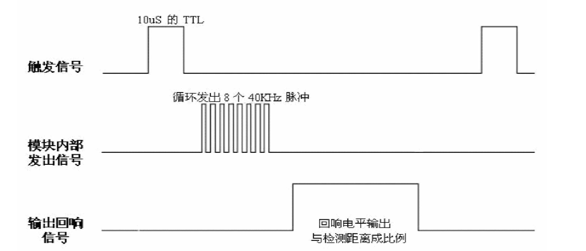

# ultraSonic
## 简介
HC-SR04超声波模块常用于机器人避障、物体测距、液位检测、公共安防、停车场检测等场所。HC-SR04超声波模块主要是由两个通用的压电陶瓷超声传感器，并加外围信号处理电路构成的
两个压电陶瓷超声传感器，一个用于发出超声波信号，一个用于接收反射回来的超声波信号
<br>

## 模块引脚
超声波模块有4个引脚，分别为Vcc(5V)、 Trig（控制端）、 Echo（接收端）、 GND；其中VCC、GND接上5V电源， Trig（控制端）控制发出的超声波信号，Echo（接收端）接收反射回来的超声波信号

## 工作流程
1. 单片机引脚触发Trig测距，给至少 10us 的高电平信号;
2. 模块自动发送 8 个 40khz 的方波，自动检测是否有信号返回；
3. 有信号返回，通过 IO 输出一高电平，用单片机定时器计算高电平持续的时间;
4. 超声波从发射到返回的时间．
5. 计算公式：测试距离=(高电平时间*声速(340M/S))/2;
6. <br>

## 示例代码
1. 硬件定时器的使用
  ```c
    #include "driver/timer.h"
    timer_config_t config = {
            .divider = TIMER_DIVIDER,   //f = Fclk / divider
            .counter_dir = TIMER_COUNT_UP,
            .counter_en = TIMER_PAUSE,
            .alarm_en = TIMER_ALARM_DIS,     //定时器中断
            .auto_reload = TIMER_AUTORELOAD_DIS,
    };
    timer_init(0,0,&config);
    timer_set_counter_value(0,0, 0x00);//装载定时器初值为0
    timer_start(0,0);
    timer_get_counter_value(0,0,&tick);
    timer_deinit(0,0);
  ```
2. 示例代码
```c
#include "driver/timer.h"

#define ECHO_PIN GPIO_NUM_17
#define TRIGGER_PIN GPIO_NUM_16

#define TIMER_DIVIDER 16 //定时器分频
#define TIMER_FREQ      (TIMER_BASE_CLK / TIMER_DIVIDER) //定时器频率
// 时间(s) = (double) val / TIMER_FREQ  //定时器的时间

float ultraSonic(void)
{
    float dist;
    
    gpio_set_direction(ECHO_PIN, GPIO_MODE_INPUT);
    gpio_set_direction(TRIGGER_PIN, GPIO_MODE_OUTPUT);

    timer_config_t config = {
        .divider = TIMER_DIVIDER,   //f = Fclk / divider
        .counter_dir = TIMER_COUNT_UP,
        .counter_en = TIMER_PAUSE,
        .alarm_en = TIMER_ALARM_DIS,     //定时器中断
        .auto_reload = TIMER_AUTORELOAD_DIS,
    };
    timer_init(0,0,&config);
    timer_set_counter_value(0,0, 0x00);//装载定时器初值为0
    //timer_start(0,0);


    gpio_set_level(TRIGGER_PIN, 0);
    vTaskDelay(1 / portTICK_RATE_MS);
    
    gpio_set_level(TRIGGER_PIN, 1);
    vTaskDelay(1 / portTICK_RATE_MS);
    gpio_set_level(TRIGGER_PIN, 0);

 
    while(gpio_get_level(ECHO_PIN) == 0);
    timer_start(0,0);
    while(gpio_get_level(ECHO_PIN) == 1);
    uint64_t tick;
    timer_get_counter_value(0,0,&tick);
    timer_deinit(0,0);
    tick = 1000 * 1000 * tick / TIMER_FREQ; //us
    tick -= 15; //误差
    
    printf("tick(us):%lld\n",tick);
    dist = tick * 0.017; //距离(m)  = 时间 * 340 / 2 

    return dist;
}

void app_main()
{
    printf("HC-SR04\n");
    
    while(1)
    {
        printf("Distance: %.2f cm\n", ultraSonic());
        vTaskDelay(500 / portTICK_PERIOD_MS);
    }
    
}

```