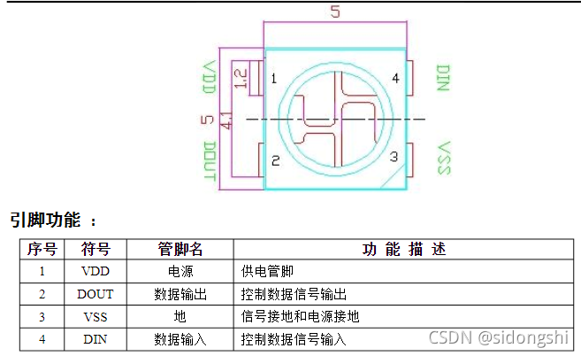
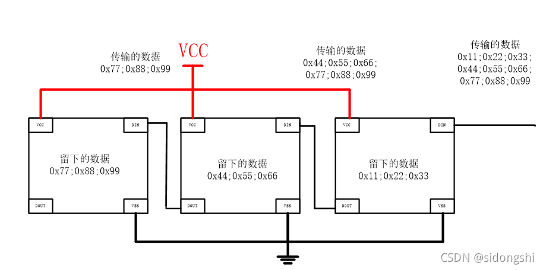
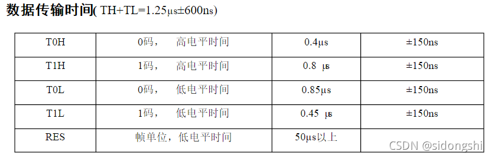
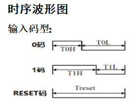
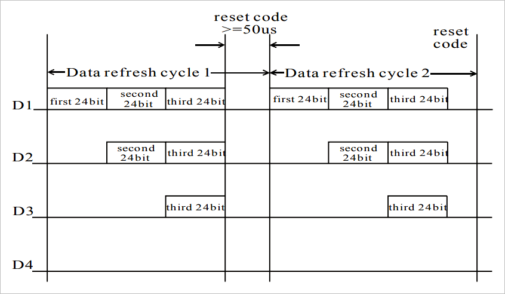
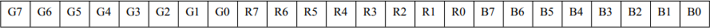

 11. WS2812全彩色RGB LED灯带
     1.  WS2812特点与优势
        * 在5050封装内集成有控制电路和RGB芯片，形成完整像素点控制；
        * 内置扫执行好整形电路，传递到级联下一节点时，不会产生信号失真累积效应；
        * 内置复位电路与掉电复位电路；
        * 每个RGB灯都有256亮度级别，可以形成中颜色，刷新频率不低于400Hz；
        * 通过信号线完成端口级联；
        * 传输距离在5米之内，无需增加额外电路；
        * 在刷新频率30帧/秒中，低速模式下可以控制不少于512颗灯，高速模式下则超过1024颗灯；
        * 数据传输速率为800kbps；
        * 颜色一致性强，价格低；
     2.  WS2812介绍
        * ws2812b是一种能显示RGB三原色组合成的颜色显示灯，封装为5050，有四个引脚，分别是VCC、VSS、DIN、DOUT。引脚如图
        <br><br>
        * 电源供电范围规格书上描述为3.5-5.3V，但是实测3.3V也能驱动，逻辑电平为-0.5V-VDD-0.5V；这里DIN是通信接口的输入，RGB的数据就是从这里输入，而WS2812b具有级联功能，主要是通过DOUT实现，DIN输入的数据会被第一级WS2812截取24位，后面的数据会通过DOUT传输给下一个WS2812B，从而实现级联。如图
        <br><br>
     3. WS2812软件驱动
        * 上面是WS2812b的硬件接口，相对比较简单，只有一个数据口，逻辑也相对简单易懂，但是在时序方面则是相对比较严格。WS2812传输因为只有一跟数据线，所以只能传输0或1，因此在时序控制方面需要区分开1和0的时序。根据规格书，时序要求为图
        <br><br>
        <br><br>
        * 因此软件上可以通过IO口，输出高低电平来模拟时序。按照标准控制时序，传输一个位时间为1.25us，一个WS2812需要24位，即30us，假设100个WS2812组成矩阵，则一帧的时间为3ms，即可以实现333HZ的刷新率，对于30HZ刷新率最大可以控制1000个WS2812，即33*33
        * 下面是三个WS2812级联发送过程对应的波形。可以看到通过发送三组24bit的编码，可以控制三个级联的WS2812灯的颜色。数据D1是直接由MCU数据端口控制，D2,D3,D4则是WS8212内部整形放大后再进行传输。
        * 使用RESET编码，也就是超过50us的低电平形成WS2812输出锁定
        <br><br>
        * 每组24bit对应的的GRB编码如下所示。发送颜色顺序为GRB，字节的高位在前
        * <br><br>
        * 驱动二个WS8212:
        * ```c
            #define LED_PIN 2
            void delay400ns(){ //417~500ns
                volatile int j=0;
            }
            void delay800ns(){ //792~815ns
                volatile int j=0;
                for(int i=0;i<4;i++)j++;
            }
            void ws2812_0(){
                gpio_set_level(LED_PIN, 1);
                delay400ns();
                gpio_set_level(LED_PIN, 0);
                delay800ns();
            }
            void ws2812_1(){
                gpio_set_level(LED_PIN, 1);
                delay800ns();
                gpio_set_level(LED_PIN, 0);
                delay400ns();
            }
            void ws2812_reset(){
                gpio_set_level(LED_PIN, 1);
                gpio_set_level(LED_PIN, 0);
                for(int i=0;i<500;i++)
                delay400ns();
            }

            void ws2812_word(int grb)
            {
                for(int i=0;i<24;i++){
                    if(grb & 0x800000)
                    ws2812_1(); 
                    else
                    ws2812_0(); 
                    grb <<= 1;
                }
            }
            void app_main()
            {
                gpio_reset_pin(LED_PIN);
                gpio_set_direction(LED_PIN, GPIO_MODE_OUTPUT);  
                gpio_set_level(LED_PIN, 1);    
                while(1){
                    ws2812_word(0xAA0055);
                    ws2812_word(0xAA0055);
                    ws2812_reset();
                    vTaskDelay(10 / portTICK_RATE_MS);
                }                
            }
        ```
     4. RMT驱动WS2812
       1. rmt是什么
          * RMT（远程控制）模块驱动程序可用于发送和接收红外遥控信号。由于RMT灵活性，驱动程序还可用于生成或接收许多其他类型的信号。由一系列脉冲组成的信号由RMT的发射器根据值列表生成。这些值定义脉冲持续时间和二进制级别。发射器还可以提供载波并用提供的脉冲对其进行调制；总的来说它就是一个中间件，就是通过 RMT模块可以生成解码成包含脉冲持续时间和二进制电平的值的高低电平，从而实现发送和接收我们想要的信号
          * 官方说明:(https://docs.espressif.com/projects/esp-idf/en/latest/esp32/api-reference/peripherals/rmt.html)
       2. 驱动：ws2812.rar